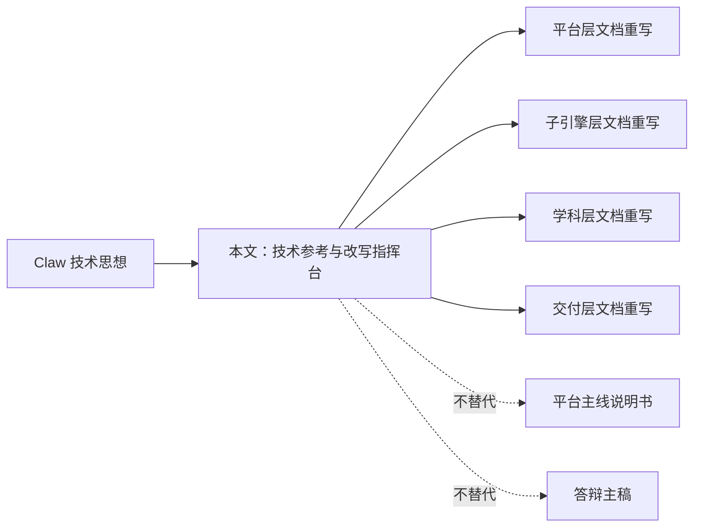
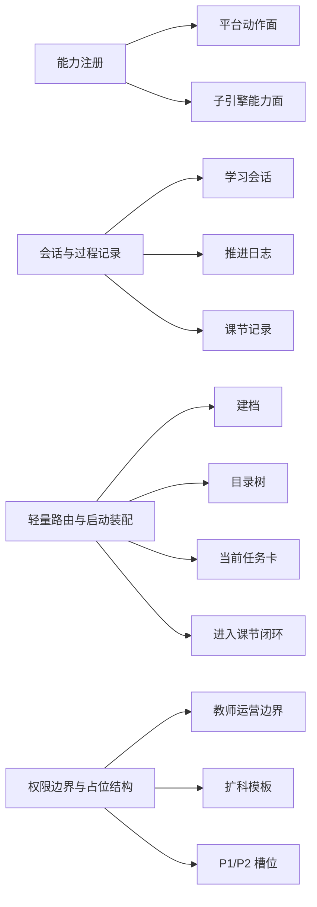
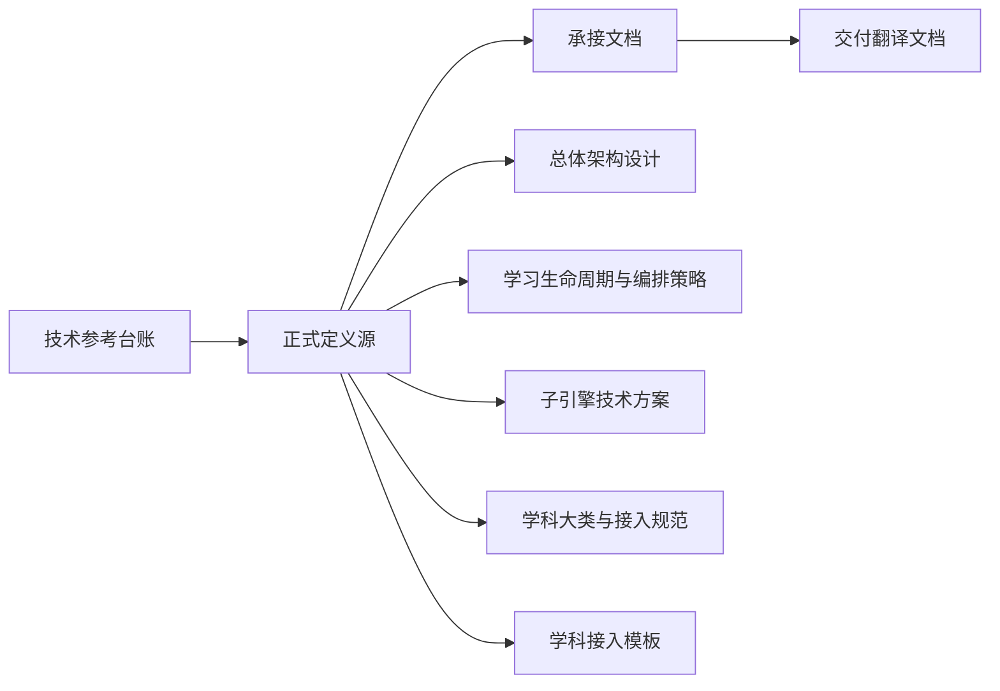
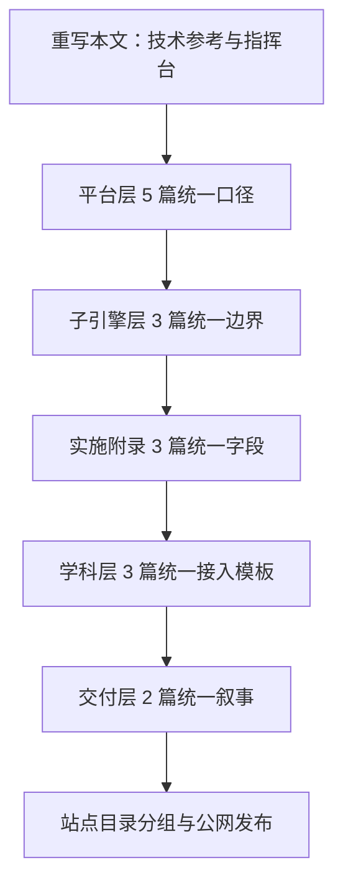

# Claw 技术思想对 AI 教学平台文档体系的落实说明

> 文档层级：技术参考  
> 文档目的：把 Claw 的系统组织方法翻译成你当前 AI 教学平台的文档改写动作与架构落位动作  
> 核心结论：Claw 最值得借的是“系统骨架组织方法”，这套方法应优先落实到平台层、子引擎层和实施附录文档，而不是把整个平台改造成另一个 Claw  
> 目标读者：平台方案设计者、技术负责人、文档重构执行者  
> 上游文档：`E:/敏感文件/claw-code-main/claw-code-main/docs/01-overview-zh.md`、`E:/敏感文件/claw-code-main/claw-code-main/docs/02-architecture-zh.md`、`E:/敏感文件/claw-code-main/claw-code-main/docs/03-extension-principles-zh.md`  
> 下游文档：`doc/智能体文档/00-文档总索引.md`、平台层 `5` 篇、子引擎层 `3` 篇、实施附录 `3` 篇、学科层 `3` 篇、交付层 `2` 篇  
> 适用范围：平台文档重构、架构口径对齐、字段中文化、图表补强  

## 与其他文档的边界

本文不是平台主线说明书，也不是公开答辩稿。  
它只负责一件事：把 Claw 的技术思想翻译成你当前 AI 教学平台应该怎样安排正式定义源、承接文档、交付翻译文档。  
此文为技术思想参考，不是平台主线说明书。  

如果你要理解“平台是什么”，先读平台层文档。  
如果你要理解“这一套文档接下来怎么系统性重写”，再读本文。

## 一句话先记住

> Claw 对你最有帮助的，不是模型训练能力，而是它把命令、工具、会话、权限、启动流程和扩展槽位组织清楚的方式。现在要做的，是把这套组织方式落实到你平台的文档体系里。

## 1. 先把定位重新对齐

### 1.1 本文现在是什么

本文现在被重新定义为：

> `技术思想参考 + 文档改写指挥台`

也就是说，它要回答的不是“Claw 是不是很厉害”，而是下面 4 个更有用的问题：

1. Claw 到底给了平台哪些可借鉴的系统组织方法？
2. 这些方法现在分别由哪篇主文档正式定义？
3. 哪些文档只负责承接，哪些文档只负责人话翻译？
4. 还有哪些措辞和分工需要继续微调？

### 1.2 本文不是什么

- 不是平台主线入口文档
- 不是对评委讲的平台总纲
- 不是单独一份新的 PRD
- 不是让你把平台整体重写成另一个 Claw

### 图 1：本文在整套文档里的角色

## 2. Claw 真正能借给平台什么

### 2.1 一句人话

> Claw 真正厉害的地方，不是“帮你训练一个智能体”，而是“把复杂智能体系统变成一套可组织、可解释、可扩展的骨架”。

### 2.2 这 4 条骨架思想最值得借

| Claw 的骨架思想 | 放到平台里怎么理解 | 应该优先落到哪里 |
| --- | --- | --- |
| 能力注册 | 把平台动作面和子引擎能力面分开整理 | 平台总纲、总体架构、子引擎技术方案 |
| 会话与过程记录 | 把学习会话、推进日志、课节记录、阶段总结沉淀下来 | 生命周期文档、实施附录、接入示范 |
| 轻量路由与启动装配 | 把建档、目录树、当前任务卡、进入课节闭环组织成一条稳定链路 | 生命周期文档、总体架构、P0 实施附录 |
| 权限边界与占位结构 | 把教师运营入口、扩科模板、后续增强能力的边界先定住 | 平台需求、学科接入规范、P1/P2 实施附录 |

### 2.3 对平台最重要的 4 个统一对象

这些对象并不是 Claw 原样搬来的代码对象，而是你平台现在最应该统一下来的一组“平台骨架对象”。

| 中文名称 | 英文键名 | 作用 |
| --- | --- | --- |
| 学习会话 | `LearningSession` | 记录学生当前这一轮学习上下文 |
| 当前任务卡 | `TaskCard` | 把本轮学习目标、完成标准和回补条件具体化 |
| 子引擎回流结果 | `EngineTurnResult` | 让平台知道子引擎这一轮执行后该推进、回补还是提醒教师 |
| 学科接入模板 | `SubjectIntegrationSpec` | 让不同学科按统一契约接入平台 |

### 图 2：Claw 思想到平台骨架的翻译

## 3. 现有平台文档里现在已经落实到哪里了

### 3.1 已经出现的骨架

从你当前的现行主文档来看，平台已经做对了几件事：

- 已经把“平台”和“AI 教师子引擎”拆成两层，而不是混在一份 AI 教师 PRD 里。
- 已经把“高等数学只是第一门示范学科”讲清楚，没有再把学科示范误写成整个平台。
- 已经有 `P0 / P1 / P2` 实施附录，说明平台不是静态文档，而是在向实施落地走。
- 已经在平台层文档中明确了目录树、任务卡、双层笔记、阶段复习这些平台侧能力。

### 3.2 现在的正式定义源与承接分工

这次收口后，5 个骨架词不再只是“到处都出现”，而是形成了明确分工：

- `平台动作面 / 子引擎能力面`
  - 正式定义源：`总体架构设计`
  - 承接文档：`产品总纲`、`子引擎 PRD`、`子引擎技术方案`、`教学策略设计`、`高等数学接入示范`
  - 交付翻译文档：`比赛对齐说明`、`答辩口径与演示脚本`
- `学习会话 / 当前任务卡 / 推进日志 / 会话与过程记录 / 轻量路由与启动装配`
  - 正式定义源：`学习生命周期与编排策略`
  - 承接文档：`总体架构设计`、`子引擎技术方案`、`P0`、`高等数学接入示范`、`高等数学-ADP配置手册`
  - 交付翻译文档：`比赛对齐说明`、`答辩口径与演示脚本`
- `子引擎回流结果`
  - 正式定义源：`AI教师子引擎-技术方案`
  - 承接文档：`AI教师子引擎-PRD`、`教学策略设计`、`P0`、`高等数学-ADP配置手册`
- `权限边界与占位结构`
  - 正式定义源：`学科大类与接入规范`
  - 承接文档：`平台需求与验收`、`P1`、`P2`、`学科接入模板`
- `学科接入模板`
  - 正式定义源：`学科接入模板`
  - 承接文档：`学科大类与接入规范`、`高等数学接入示范`

### 图 3：正式定义源、承接文档与交付翻译的分层

## 4. 架构层优先落地

### 4.1 为什么先抓架构层

因为如果架构层文档没先对齐，后面的学科示范、配置手册、答辩口径都会跟着乱。  
平台现在最需要的不是再多写几份材料，而是先把“哪一层负责什么、哪几个对象贯穿全文档”钉死。

### 4.2 架构层优先顺序

1. 平台层 `产品总纲`
2. 平台层 `学习生命周期与编排策略`
3. 平台层 `总体架构设计`
4. 平台层 `学科大类与接入规范`
5. 平台层 `平台需求与验收`
6. 子引擎层 `AI教师子引擎-PRD`
7. 子引擎层 `AI教师子引擎-技术方案`
8. 子引擎层 `AI教师子引擎-教学策略设计`
9. 实施附录 `P0 / P1 / P2`

### 4.3 架构层每篇现在承接了什么

| 文档 | 这次已经承接的重点 |
| --- | --- |
| 产品总纲 | 已明确平台动作面，强化“不是普通聊天页”的主口径 |
| 学习生命周期与编排策略 | 已把 `学习会话`、`当前任务卡`、推进日志和装配链路统一下来 |
| 总体架构设计 | 已把 4 个统一对象写进平台关键对象与数据流 |
| 学科大类与接入规范 | 已把 `学科接入模板`、扩科槽位和边界结构讲清楚 |
| 平台需求与验收 | 已把对象级验收、边界级验收、扩科级验收写成平台口径 |
| 子引擎 PRD | 已明确子引擎是执行层，不替代平台编排层 |
| 子引擎技术方案 | 已把 `子引擎回流结果` 和平台协作接口讲清楚 |
| 子引擎教学策略设计 | 已把教学输出和平台沉淀字段对齐 |

## 5. 逐篇落实清单

下面这张表是本文最关键的部分。它现在不再只是“改写建议清单”，而是“已经落地的映射台账”，用来记录每一篇现行主文档承接了哪条骨架思想。

| 文档名称 | 文档角色 | 正式定义哪些对象/术语 | 主要承接什么 | 交付或实例作用 |
| --- | --- | --- | --- | --- |
| `00-文档总索引` | 导航入口 | 不承担正式定义 | 帮读者找到定义源和主阅读路径 | 站内导航 |
| `平台层/产品总纲` | 产品价值解释 | 不承担正式定义 | 承接平台动作面的产品价值 | 对内对外总定位 |
| `平台层/学习生命周期与编排策略` | 正式定义源 | 学习会话、当前任务卡、推进日志、会话与过程记录、轻量路由与启动装配 | 约束平台、子引擎、学科层的过程链路 | 平台编排主线 |
| `平台层/总体架构设计` | 正式定义源 | 平台动作面、子引擎能力面 | 约束平台层与子引擎层分工 | 架构总口径 |
| `平台层/学科大类与接入规范` | 正式定义源 | 权限边界与占位结构 | 约束扩科边界和槽位管理 | 扩科总口径 |
| `平台层/平台需求与验收` | 验收翻译 | 不承担正式定义 | 把上游定义转成验收口径 | 平台验收 |
| `子引擎层/AI教师子引擎-PRD` | 需求承接 | 不承担正式定义 | 承接子引擎能力面和结构化回流要求 | 子引擎需求 |
| `子引擎层/AI教师子引擎-技术方案` | 正式定义源 | 子引擎回流结果 | 承接子引擎能力面和会话记录接口 | 技术接口定义 |
| `子引擎层/AI教师子引擎-教学策略设计` | 策略承接 | 不承担正式定义 | 承接子引擎能力面和过程记录回流 | 教学策略落位 |
| `实施附录/01-P0` | 实施实例 | 不承担正式定义 | 实例化装配链路和过程记录 | 第一阶段落地 |
| `实施附录/02-P1` | 实施实例 | 不承担正式定义 | 实例化教师运营边界 | 第二阶段落地 |
| `实施附录/03-P2` | 实施实例 | 不承担正式定义 | 实例化外部接入边界 | 第三阶段落地 |
| `学科层/学科接入模板` | 正式定义源 | 学科接入模板 | 承接扩科边界并固定对象字段 | 学科对象定义 |
| `学科层/高等数学-平台接入示范` | 学科实例 | 不承担正式定义 | 实例化平台动作面、子引擎能力面和会话记录 | 第一门示范学科 |
| `学科层/高等数学-ADP配置手册` | 配置实例 | 不承担正式定义 | 承接上游对象如何进入 ADP | 配置落地 |
| `交付层/比赛对齐说明` | 交付翻译 | 不承担正式定义 | 把上游术语翻成评委听得懂的话 | 比赛叙事 |
| `交付层/答辩口径与演示脚本` | 交付翻译 | 不承担正式定义 | 把上游术语翻成上台口径 | 答辩表达 |

## 6. 这次重构必须统一的中文字段

### 6.1 平台对象统一中文名

| 英文键名 | 全文统一中文名 |
| --- | --- |
| `LearningSession` | 学习会话 |
| `TaskCard` | 当前任务卡 |
| `EngineTurnResult` | 子引擎回流结果 |
| `SubjectIntegrationSpec` | 学科接入模板 |

### 6.2 正文里尽量不用英文直接当表头

以后正文和表格优先使用这些中文字段：

- `学习会话编号`
- `当前任务卡编号`
- `当前目标`
- `完成标准`
- `回补条件`
- `子引擎回流结果`
- `下一步动作`
- `教师运营摘要`
- `学科接入模板`

英文键名只保留在代码块和字段对照表里。

## 7. 后续维护顺序

### 图 4：从技术参考到主文档维护的顺序

### 7.1 维护顺序

1. 先维护本文，更新“正式定义源 / 承接文档 / 交付翻译文档”的映射状态。
2. 再维护平台层，优先检查 `平台动作面`、`学习会话`、`当前任务卡`、`学科接入模板` 是否仍保持统一。
3. 再维护子引擎层，检查 `子引擎能力面` 和 `子引擎回流结果` 的字段解释是否和平台层对齐。
4. 再维护实施附录，让 `P0/P1/P2` 的字段口径和主文档一致。
5. 再维护学科层和交付层，让接入示范和答辩叙事继续跟主文档统一。
6. 最后检查站点目录分组，确保本文继续放在“技术参考/方法参考”分组，弱化展示但保持可访问。

## 读完后你应该带走什么

- 本文不是平台总纲，而是技术参考和改写指挥台。
- Claw 最值得借的是系统骨架方法，不是整套代码。
- 这次最关键的改写，不是零散润色，而是把 `学习会话`、`当前任务卡`、`子引擎回流结果`、`学科接入模板` 这 4 个对象写进整套主文档。
- 真正优先级最高的是架构层文档，其次才是学科示范和答辩表达。

## 下一篇建议阅读

1. [AI主导学习平台-产品总纲](/f:/笔记/OneDrive/桌面/比赛/doc/智能体文档/平台层/AI主导学习平台-产品总纲.md)
2. [AI主导学习平台-学习生命周期与编排策略](/f:/笔记/OneDrive/桌面/比赛/doc/智能体文档/平台层/AI主导学习平台-学习生命周期与编排策略.md)
3. [AI主导学习平台-总体架构设计](/f:/笔记/OneDrive/桌面/比赛/doc/智能体文档/平台层/AI主导学习平台-总体架构设计.md)
