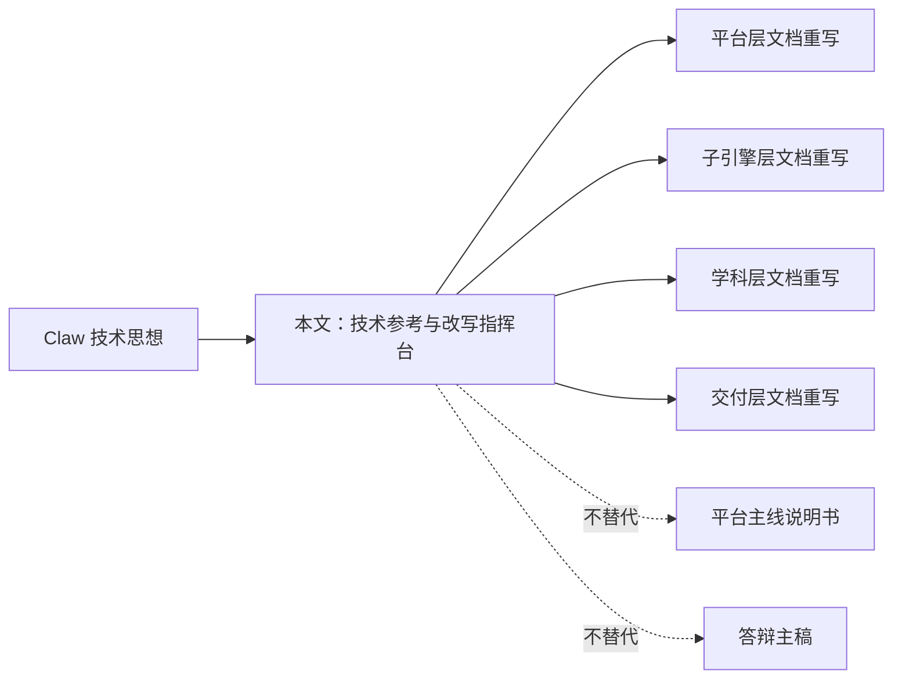
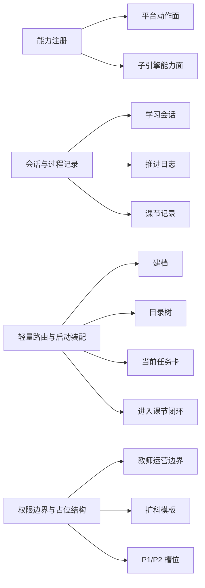
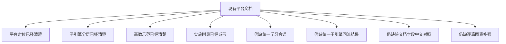
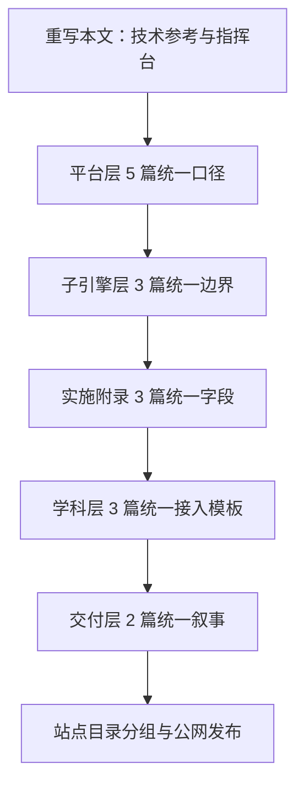

# Claw 技术思想对 AI 教学平台文档体系的落实说明

> 文档层级：技术参考  
> 文档目的：把 Claw 的系统组织方法翻译成你当前 AI 教学平台的文档改写动作与架构落位动作  
> 核心结论：Claw 最值得借的是“系统骨架组织方法”，这套方法应优先落实到平台层、子引擎层和实施附录文档，而不是把整个平台改造成另一个 Claw  
> 目标读者：平台方案设计者、技术负责人、文档重构执行者  
> 上游文档：`E:/敏感文件/claw-code-main/claw-code-main/docs/01-overview-zh.md`、`E:/敏感文件/claw-code-main/claw-code-main/docs/02-architecture-zh.md`、`E:/敏感文件/claw-code-main/claw-code-main/docs/03-extension-principles-zh.md`  
> 下游文档：`doc/智能体文档/00-文档总索引.md`、平台层 `5` 篇、子引擎层 `3` 篇、实施附录 `3` 篇、学科层 `3` 篇、交付层 `2` 篇  
> 适用范围：平台文档重构、架构口径对齐、字段中文化、图表补强  

## 与其他文档的边界

本文不是平台主线说明书，也不是公开答辩稿。  
它只负责一件事：把 Claw 的技术思想翻译成你当前 AI 教学平台应该怎样改文档、怎样补骨架、怎样统一字段和图表。  
此文为技术思想参考，不是平台主线说明书。  

如果你要理解“平台是什么”，先读平台层文档。  
如果你要理解“这一套文档接下来怎么系统性重写”，再读本文。

## 一句话先记住

> Claw 对你最有帮助的，不是模型训练能力，而是它把命令、工具、会话、权限、启动流程和扩展槽位组织清楚的方式。现在要做的，是把这套组织方式落实到你平台的文档体系里。

## 1. 先把定位重新对齐

### 1.1 本文现在是什么

本文现在被重新定义为：

> `技术思想参考 + 文档改写指挥台`

也就是说，它要回答的不是“Claw 是不是很厉害”，而是下面 4 个更有用的问题：

1. Claw 到底给了平台哪些可借鉴的系统组织方法？
2. 这些方法在你当前平台文档里已经出现在哪里？
3. 还缺哪些骨架性对象和统一口径？
4. 每一篇现行主文档下一步该怎么补？

### 1.2 本文不是什么

- 不是平台主线入口文档
- 不是对评委讲的平台总纲
- 不是单独一份新的 PRD
- 不是让你把平台整体重写成另一个 Claw

### 图 1：本文在整套文档里的角色

## 2. Claw 真正能借给平台什么

### 2.1 一句人话

> Claw 真正厉害的地方，不是“帮你训练一个智能体”，而是“把复杂智能体系统变成一套可组织、可解释、可扩展的骨架”。

### 2.2 这 4 条骨架思想最值得借

| Claw 的骨架思想 | 放到平台里怎么理解 | 应该优先落到哪里 |
| --- | --- | --- |
| 能力注册 | 把平台动作面和子引擎能力面分开整理 | 平台总纲、总体架构、子引擎技术方案 |
| 会话与过程记录 | 把学习会话、推进日志、课节记录、阶段总结沉淀下来 | 生命周期文档、实施附录、接入示范 |
| 轻量路由与启动装配 | 把建档、目录树、当前任务卡、进入课节闭环组织成一条稳定链路 | 生命周期文档、总体架构、P0 实施附录 |
| 权限边界与占位结构 | 把教师运营入口、扩科模板、后续增强能力的边界先定住 | 平台需求、学科接入规范、P1/P2 实施附录 |

### 2.3 对平台最重要的 4 个统一对象

这些对象并不是 Claw 原样搬来的代码对象，而是你平台现在最应该统一下来的一组“平台骨架对象”。

| 中文名称 | 英文键名 | 作用 |
| --- | --- | --- |
| 学习会话 | `LearningSession` | 记录学生当前这一轮学习上下文 |
| 当前任务卡 | `TaskCard` | 把本轮学习目标、完成标准和回补条件具体化 |
| 子引擎回流结果 | `EngineTurnResult` | 让平台知道子引擎这一轮执行后该推进、回补还是提醒教师 |
| 学科接入模板 | `SubjectIntegrationSpec` | 让不同学科按统一契约接入平台 |

### 图 2：Claw 思想到平台骨架的翻译

## 3. 现有平台文档里已经有什么，还缺什么

### 3.1 已经出现的骨架

从你当前的现行主文档来看，平台已经做对了几件事：

- 已经把“平台”和“AI 教师子引擎”拆成两层，而不是混在一份 AI 教师 PRD 里。
- 已经把“高等数学只是第一门示范学科”讲清楚，没有再把学科示范误写成整个平台。
- 已经有 `P0 / P1 / P2` 实施附录，说明平台不是静态文档，而是在向实施落地走。
- 已经在平台层文档中明确了目录树、任务卡、双层笔记、阶段复习这些平台侧能力。

### 3.2 还缺的骨架性统一

但现在还有几个明显缺口，正是本文要推动落实的地方：

1. `学习会话` 还没有作为统一对象被正式写进平台架构主线。
2. `当前任务卡` 虽然已经出现，但在不同文档中的字段解释还不够统一。
3. `子引擎回流结果` 还没有形成跨文档一致的中文字段说明。
4. `学科接入模板` 已有雏形，但和平台层接口、子引擎层输出之间的连接还不够清晰。
5. 部分主文档还缺“图表化表达”和“中文字段对照”，读起来更像资料，不够像平台说明书。

### 图 3：平台当前文档的骨架缺口

## 4. 架构层优先落地

### 4.1 为什么先抓架构层

因为如果架构层文档没先对齐，后面的学科示范、配置手册、答辩口径都会跟着乱。  
平台现在最需要的不是再多写几份材料，而是先把“哪一层负责什么、哪几个对象贯穿全文档”钉死。

### 4.2 架构层优先顺序

1. 平台层 `产品总纲`
2. 平台层 `学习生命周期与编排策略`
3. 平台层 `总体架构设计`
4. 平台层 `学科大类与接入规范`
5. 平台层 `平台需求与验收`
6. 子引擎层 `AI教师子引擎-PRD`
7. 子引擎层 `AI教师子引擎-技术方案`
8. 子引擎层 `AI教师子引擎-教学策略设计`
9. 实施附录 `P0 / P1 / P2`

### 4.3 架构层每篇该补什么

| 文档 | 这次必须补强的重点 |
| --- | --- |
| 产品总纲 | 明确平台动作面，强化“不是普通聊天页”的主口径 |
| 学习生命周期与编排策略 | 把 `学习会话` 和 `当前任务卡` 的中文字段统一下来 |
| 总体架构设计 | 把 4 个统一对象写进平台关键对象与数据流 |
| 学科大类与接入规范 | 把 `学科接入模板` 和扩科槽位讲清楚 |
| 平台需求与验收 | 把对象级验收、边界级验收、扩科级验收讲清楚 |
| 子引擎 PRD | 明确子引擎是执行层，不替代平台编排层 |
| 子引擎技术方案 | 把 `子引擎回流结果` 和平台协作接口讲清楚 |
| 子引擎教学策略设计 | 把教学输出和平台沉淀字段对齐 |

## 5. 逐篇落实清单

下面这张表是本文最关键的部分。它不是背景分析，而是具体到每一篇现行主文档的改写动作。

| 文档名称 | 当前作用 | 本次保留内容 | 本次补强内容 | 新增图表类型 | 需要统一的中文字段 | 对应的 Claw 思想 |
| --- | --- | --- | --- | --- | --- | --- |
| `00-文档总索引` | 主入口与阅读路径 | 层级划分、推荐阅读路径 | 补“平台主线图”“技术参考入口”，明确技术参考弱化展示 | 阅读路径图、文档分层图 | 主文档、技术参考、实施附录 | 启动装配 |
| `平台层/产品总纲` | 项目总定位 | 平台定位、边界、主场景 | 补平台动作面、统一对象口径、收尾阅读指引 | 平台主旅程图、平台对象图 | 当前任务卡、学习档案、课节笔记 | 能力注册 |
| `平台层/学习生命周期与编排策略` | 学习编排规则 | 统一结构、任务卡、双层笔记 | 补 `学习会话` 字段、推进日志口径 | 生命周期闭环图、字段映射图 | 学习会话、推进日志、回补条件 | 会话与过程记录 |
| `平台层/总体架构设计` | 平台分层与数据流 | 五层架构、核心数据流 | 把 4 个统一对象写进关键对象与连接点 | 分层图、对象流转图 | 学习会话、子引擎回流结果 | 轻量路由与启动装配 |
| `平台层/学科大类与接入规范` | 扩科规范 | 学科大类、接入流程 | 补 `学科接入模板` 契约、扩科边界 | 学科接入流程图、接入契约图 | 学科接入模板、专属策略 | 占位结构 |
| `平台层/平台需求与验收` | 平台 FR/NFR/AC | 平台能力与验收项 | 增加对象级验收、边界级验收、平台可解释性口径 | 验收链路图、平台验收图 | 当前任务卡、教师运营入口 | 权限边界 |
| `子引擎层/AI教师子引擎-PRD` | 子引擎职责与能力边界 | FR-01~FR-12、输入输出 | 强化“平台提供什么、子引擎负责什么” | 职责边界图、输入输出图 | 子引擎回流结果、讲解结果 | 能力注册 |
| `子引擎层/AI教师子引擎-技术方案` | 技术主线与 Agent 结构 | Agent 结构、主工作流 | 补平台协作字段、回流结果对象 | 主工作流图、平台协同图 | 子引擎回流结果、历史记忆摘要 | 会话与过程记录 |
| `子引擎层/AI教师子引擎-教学策略设计` | 教学执行逻辑 | 分层讲解、单轮闭环、教师运营回流 | 补结构化输出字段中文说明 | 单轮闭环图、输出字段图 | 讲解结果、错因归因、复盘结果 | 能力注册 |
| `实施附录/01-P0` | 主闭环实施设计 | Agent 编排、变量、记忆、流程 | 保持高图表密度，补中文字段统一口径 | 现有图表保留并中文化收尾 | 学习会话编号、任务卡编号 | 启动装配 |
| `实施附录/02-P1` | 教师运营与可视化增强 | 风险边界、教师看板 | 保持高图表密度，补教师运营边界统一口径 | 现有图表保留并中文化收尾 | 教师运营摘要、风险学生 | 权限边界 |
| `实施附录/03-P2` | 外部接入与后端增强 | 接口约定、发布链路 | 强化字段对照的中文主语与产品后端边界 | 现有图表保留并中文化收尾 | 会话编号、接入参数、发布环境 | 权限边界 |
| `学科层/学科接入模板` | 新学科接入模板 | 模板字段、笔记模板 | 补接入总图、把模板对象正式命名为 `学科接入模板` | 接入模板图、模板填写流程图 | 学科接入模板、专属策略 | 占位结构 |
| `学科层/高等数学-平台接入示范` | 第一门示范学科 | 目录树、任务卡、双层笔记 | 强化与平台对象的字段对齐 | 目录树图、任务卡流转图 | 当前任务卡、课节笔记、总复习本 | 会话与过程记录 |
| `学科层/高等数学-ADP配置手册` | 配置落地手册 | 应用配置、Agent 绑定、知识库 | 补“平台字段如何传到 ADP”的中文解释 | 配置链路图、变量传递图 | visitor 标识、平台任务上下文 | 轻量路由与启动装配 |
| `交付层/比赛对齐说明` | 比赛叙事对齐 | 定义作品、避免误说法 | 补“平台价值链图”，让比赛叙事更稳定 | 比赛叙事图 | 平台价值、示范学科 | 启动装配 |
| `交付层/答辩口径与演示脚本` | 答辩与演示顺序 | 开场口径、标准回答 | 补“演示链路图”“技术参考引用位” | 演示流程图 | 当前任务卡、双层笔记、教师运营入口 | 轻量路由与启动装配 |

## 6. 这次重构必须统一的中文字段

### 6.1 平台对象统一中文名

| 英文键名 | 全文统一中文名 |
| --- | --- |
| `LearningSession` | 学习会话 |
| `TaskCard` | 当前任务卡 |
| `EngineTurnResult` | 子引擎回流结果 |
| `SubjectIntegrationSpec` | 学科接入模板 |

### 6.2 正文里尽量不用英文直接当表头

以后正文和表格优先使用这些中文字段：

- `学习会话编号`
- `当前任务卡编号`
- `当前目标`
- `完成标准`
- `回补条件`
- `子引擎回流结果`
- `下一步动作`
- `教师运营摘要`
- `学科接入模板`

英文键名只保留在代码块和字段对照表里。

## 7. 本次改写的实施顺序

### 图 4：从技术参考到文档落地的实施顺序

### 7.1 执行顺序

1. 先改本文，把每篇文档该补什么钉死。
2. 再改平台层，先把平台动作面、学习会话、当前任务卡、学科接入模板统一下来。
3. 再改子引擎层，把子引擎回流结果和平台协作字段统一下来。
4. 再改实施附录，让 `P0/P1/P2` 的字段口径和主文档一致。
5. 再改学科层和交付层，让接入示范和答辩叙事跟主文档统一。
6. 最后改站点目录，把本文放到“技术参考/方法参考”分组，弱化展示但保持可访问。

## 读完后你应该带走什么

- 本文不是平台总纲，而是技术参考和改写指挥台。
- Claw 最值得借的是系统骨架方法，不是整套代码。
- 这次最关键的改写，不是零散润色，而是把 `学习会话`、`当前任务卡`、`子引擎回流结果`、`学科接入模板` 这 4 个对象写进整套主文档。
- 真正优先级最高的是架构层文档，其次才是学科示范和答辩表达。

## 下一篇建议阅读

1. [AI主导学习平台-产品总纲](/f:/笔记/OneDrive/桌面/比赛/doc/智能体文档/平台层/AI主导学习平台-产品总纲.md)
2. [AI主导学习平台-学习生命周期与编排策略](/f:/笔记/OneDrive/桌面/比赛/doc/智能体文档/平台层/AI主导学习平台-学习生命周期与编排策略.md)
3. [AI主导学习平台-总体架构设计](/f:/笔记/OneDrive/桌面/比赛/doc/智能体文档/平台层/AI主导学习平台-总体架构设计.md)
