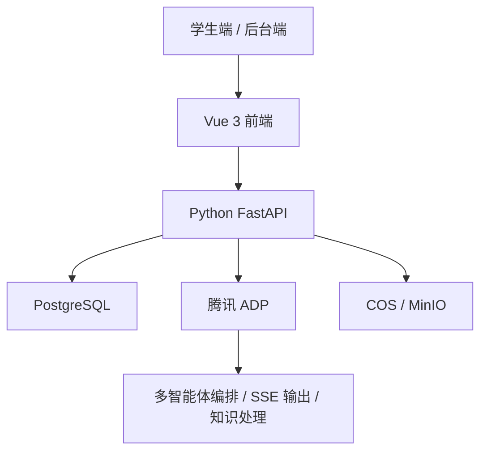

# AI主导学习生命周期的自进化自学智能体平台：作品总览与阅读地图

> 文档定位：比赛作品主入口  
> 适合谁先看：评委、答辩主讲人、新接手开发者、测试同学  
> 当前状态：作品文档、页面方案、架构基线、测试口径和答辩材料已经成型；`2026-04-12` 已完成 ADP 首次真实接口验证（人工登录、测试应用发布可见、最小 HTTP SSE V2 请求 `HTTP 200` 且流式完成），但知识库接入、SaveDoc、比赛级主场景验收、后端/BFF 仍在后续落地
> 先看什么：先读第 1 节和第 2 节，再按第 4 节选你的阅读入口

## 1. 一句话看懂作品

这是一套面向自学场景的教育智能体平台。

学生不是先提问，而是先选科、开始学习；系统会自动生成学习地图、做短诊断、安排闯关、识别卡点、补桥回主线、更新画像、生成笔记，并在新资料进入后继续更新知识库和教学策略。

## 2. 主演示链路

## 3. 当前做到哪一步

| 模块 | 当前状态 | 说明 |
| --- | --- | --- |
| 作品主文档 | 已完成第一轮深化 | `00-11` 已经能支撑评委阅读、开发接手和答辩准备 |
| 展示站 | 可直接访问 | 当前仓库是 React + Vite 的文档展示站，能稳定构建和发布 |
| 页面方案 | 已明确 | 学生端 4 页、后台 2 页的职责和状态已经写清楚 |
| 技术路线 | 已定 | 目标产品采用 `Vue 3 + Python FastAPI + PostgreSQL + 腾讯 ADP` |
| 算法与知识库规则 | 已成基线 | 强调学习规划、补桥、画像、知识入库和演化规则 |
| 最小测试口径 | 已成基线 | 有主链路验收、演示降级和评测说明 |
| 真正业务后端 | 待实现 | 还没有把 FastAPI、数据库迁移和真实接口代码补齐 |
| ADP 正式联调 | 首次真实接口验证已完成 | `2026-04-12` 已完成人工登录 + 发布状态核查 + 最小 HTTP SSE V2 真请求（`HTTP 200`、完整流式事件、完成信号）；不等于知识库/SaveDoc/主场景已通 |

## 4. 不同角色先看哪里

### 4.1 评委 / 老师

| 想解决的问题 | 先看 | 再看 |
| --- | --- | --- |
| 这作品值不值得看 | [01-PRD与需求分析.md](./01-PRD与需求分析.md) | [10-访问与评测手册.md](./10-访问与评测手册.md) |
| 它和普通 AI 问答有什么区别 | [02-场景与用户流程.md](./02-场景与用户流程.md) | [05-算法与知识库设计.md](./05-算法与知识库设计.md) |
| 技术是否站得住 | [04-总体架构与技术选型.md](./04-总体架构与技术选型.md) | [07-测试验证与预期效果.md](./07-测试验证与预期效果.md) |

### 4.2 答辩主讲人

| 想解决的问题 | 先看 | 再看 |
| --- | --- | --- |
| 怎么把故事讲顺 | [08-答辩PPT大纲.md](./08-答辩PPT大纲.md) | [09-演示视频脚本.md](./09-演示视频脚本.md) |
| 怎么解释为什么这不是聊天机器人 | [01-PRD与需求分析.md](./01-PRD与需求分析.md) | [05-算法与知识库设计.md](./05-算法与知识库设计.md) |
| 怎么解释技术路线 | [04-总体架构与技术选型.md](./04-总体架构与技术选型.md) | [11-开发技术文档.md](./11-开发技术文档.md) |

### 4.3 新接手开发者

| 想解决的问题 | 先看 | 再看 |
| --- | --- | --- |
| 先把当前仓库跑起来 | [11-开发技术文档.md](./11-开发技术文档.md) | `package.json` |
| 看产品边界和页面范围 | [01-PRD与需求分析.md](./01-PRD与需求分析.md) | [03-页面与交互设计.md](./03-页面与交互设计.md) |
| 看后续后端和接口怎么落 | [04-总体架构与技术选型.md](./04-总体架构与技术选型.md) | [06-接口与API说明.md](./06-接口与API说明.md) |

### 4.4 测试 / 演示辅助

| 想解决的问题 | 先看 | 再看 |
| --- | --- | --- |
| 最小演示链路怎么走 | [07-测试验证与预期效果.md](./07-测试验证与预期效果.md) | [10-访问与评测手册.md](./10-访问与评测手册.md) |
| 3 分钟视频怎么拍 | [09-演示视频脚本.md](./09-演示视频脚本.md) | [03-页面与交互设计.md](./03-页面与交互设计.md) |
| 现场异常怎么降级 | [10-访问与评测手册.md](./10-访问与评测手册.md) | [11-开发技术文档.md](./11-开发技术文档.md) |

## 5. 六个核心页面一眼看懂

| 页面 | 主要角色 | 这页是干什么的 | 进一步阅读 |
| --- | --- | --- | --- |
| 选科与开学页 | 学生 | 选学科，正式进入 AI 接管学习 | `01` `02` `03` |
| AI 学习地图页 | 学生 | 看主线、支线、当前关卡和下一步建议 | `02` `03` `05` |
| AI 闯关学习页 | 学生 | 进入讲解、作答、反馈和推进 | `02` `03` `06` |
| 笔记复习与成长页 | 学生 | 看笔记、导图、错题和成长变化 | `03` `05` `06` |
| 资料注入与知识库演化后台 | 平台管理者 | 看资料上传、候选知识、发布与回滚 | `03` `05` `06` |
| 系统自治与策略分析后台 | 平台管理者 | 看 Agent 状态、策略版本和异常记录 | `03` `04` `06` |

## 6. 技术主线一眼看懂

目标产品采用：

`Vue 3 前端 + Python FastAPI 单体服务 + PostgreSQL + 腾讯 ADP + COS / MinIO`

## 7. 现在还没做完的部分

| 待补项 | 当前结论 |
| --- | --- |
| 真实后端代码 | 还没开始正式实现，现阶段以文档和展示站为主 |
| 数据库迁移 | 需要后续按 FastAPI + PostgreSQL 方案补齐 |
| ADP 正式应用配置 | 已完成发布状态核查与首个真实接口验证；下一步是知识库接入、SaveDoc 打通与主场景联调（旧密钥应旋转后继续联调） |
| 演示账号和固定数据 | 需要比赛前统一准备，不能临场拼 |

## 8. 事实来源

- [01-PRD与需求分析.md](./01-PRD与需求分析.md)
- [03-页面与交互设计.md](./03-页面与交互设计.md)
- [04-总体架构与技术选型.md](./04-总体架构与技术选型.md)
- [05-算法与知识库设计.md](./05-算法与知识库设计.md)
- [06-接口与API说明.md](./06-接口与API说明.md)
- [11-开发技术文档.md](./11-开发技术文档.md)
