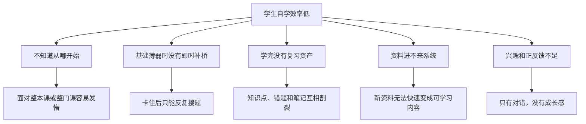

# AI主导学习生命周期的自进化自学智能体平台 PRD 与需求分析

> 文档层级：作品主文档  
> 文档目的：定义产品定位、目标用户、能力边界、功能需求与成功标准  
> 核心结论：平台不是“学生发问，AI 回答”的问答页，而是由 AI 主动定义学习目录、持续推进任务、实时调整地图、沉淀复习资产的自学系统  
> 对齐真源：[AI主导学习平台-平台需求与验收.md](../智能体文档/平台层/AI主导学习平台-平台需求与验收.md)、[AI教师智能体群引擎-PRD.md](../智能体文档/子引擎层/AI教师智能体群引擎-PRD.md)

## 1. 产品定义

`AI主导学习生命周期的自进化自学智能体平台` 面向自学场景，重点解决“学生不知道从哪开始学、学到一半卡住、学完没有沉淀、资料无法快速进入系统、兴趣很容易掉”的问题。

平台默认由 AI 接管下面这些动作：

- 生成初始学习地图
- 发起短诊断并校准路径
- 安排当前关卡和下一步任务
- 在学习中实时插入补桥、复习、挑战和奖励节点
- 更新学习画像
- 生成思维导图和结构化笔记
- 接收新资料并推动知识库与策略继续进化

## 2. 目标用户

| 角色 | 核心目标 | 直接使用页面 |
| --- | --- | --- |
| 学生 | 选科后被快速带入有效学习，并在学习中持续获得反馈与推进 | 选科与开学页、AI学习地图页、AI闯关学习页、笔记复习与成长页 |
| 平台管理者 | 注入资料、查看知识库演化、观察自治策略和异常状态 | 资料注入与知识库演化后台、系统自治与策略分析后台 |
| 平台系统 / AI教师智能体群引擎 | 持续编排学习生命周期、管理地图重规划和知识演化 | 不作为独立前台角色展示 |

## 3. 核心问题

## 4. 产品目标

| 目标编号 | 目标内容 | 验收口径 |
| --- | --- | --- |
| `G-01` | 学生能在 1 次点击后进入 AI 接管学习 | 选科后点击“开始学习”，平台立即生成初始地图和当前任务 |
| `G-02` | 学习地图能实时演化 | 学习中暴露基础缺口时，系统能自动插入补桥节点并回接主线 |
| `G-03` | 学生能持续获得正反馈和成长感 | 每次关卡完成都能看到通关反馈、能力成长和地图推进 |
| `G-04` | 学习画像持续更新 | 学习过程中和每次结束后都能看到画像变化 |
| `G-05` | 笔记与复习资产自动沉淀 | 单关、一轮、阶段结束后都能生成思维导图和结构化笔记 |
| `G-06` | 新资料能自动进入知识库并影响学习路径 | 资料入库后能看到知识演化记录和地图变化 |

## 5. 六条核心场景链路

1. `选科开学`  
   学生选择一门或多门科目，默认高数已选，点击“开始学习”后进入 AI 接管流程。
2. `地图生成与短诊断校准`  
   平台先给出初始学习地图，再通过短诊断重排第一版主线。
3. `实时闯关学习`  
   学生进入当前关卡，AI 讲解、提问、判题、反馈并推动下一步。
4. `补桥与回主线`  
   当系统发现基础缺口、遗忘回落或持续卡住时，实时插入补桥支线，并在达标后接回主线。
5. `笔记复习沉淀`  
   Agent 群自动输出思维导图、结构化笔记、错题回顾和复习计划。
6. `资料注入与知识进化`  
   学生或平台管理者上传资料，AI 自动识别、切分、入库、打标签，并反向影响后续学习地图。

## 6. 功能需求

| 编号 | 能力 | 说明 | 优先级 |
| --- | --- | --- | --- |
| `FR-01` | 选科与开学 | 支持单科或多科选择，并建立学习启动会话 | P0 |
| `FR-02` | 初始学习地图生成 | 基于学科结构、知识资产和已有画像生成第一版地图 | P0 |
| `FR-03` | 短诊断校准 | 通过轻量诊断修正学生起点和地图顺序 | P0 |
| `FR-04` | 实时地图重规划 | 在学习中实时插入补桥、复习、挑战和奖励节点 | P0 |
| `FR-05` | AI闯关学习会话 | 支持讲解、追问、作答、评分、流式反馈和下一步推进 | P0 |
| `FR-06` | 学习画像持续更新 | 支持掌握度、薄弱点、错误模式和节奏偏好持续更新 | P0 |
| `FR-07` | 笔记与思维导图生成 | 在单关、一轮和阶段结束后生成复习资产 | P0 |
| `FR-08` | 多科并行调度 | 支持多门课并行，生成全局学习排程 | P1 |
| `FR-09` | 资料注入与自动入库 | 支持上传资料后自动识别、结构化、入库和演化记录 | P0 |
| `FR-10` | 后台自治分析 | 展示 Agent 协同、策略版本、异常告警和回滚审计 | P1 |
| `FR-11` | REST + SSE 接口开放 | 支持前后端、Agent 编排与流式交付 | P1 |

## 7. 非功能需求

| 编号 | 类别 | 要求 |
| --- | --- | --- |
| `NFR-01` | 可演示性 | 第一屏必须直接进入学生主线，不做营销首页 |
| `NFR-02` | 一致性 | 作品名、页面名、对象名、引擎名和技术栈保持一致 |
| `NFR-03` | 单机高可用 | 支持守护进程、健康检查、优雅重启和备份恢复 |
| `NFR-04` | AI 友好维护 | 前后端职责清晰，结构稳定，便于 AI 连续开发 |
| `NFR-05` | 可扩学科 | 高数之外可按同一对象契约扩科 |
| `NFR-06` | 安全接入 | 模型密钥和调用能力后端托管，前端不暴露敏感凭证 |

## 8. 页面范围

本作品固定包含 6 个核心页面：

1. `选科与开学页`
2. `AI学习地图页`
3. `AI闯关学习页`
4. `笔记复习与成长页`
5. `资料注入与知识库演化后台`
6. `系统自治与策略分析后台`

## 9. 边界与非范围

| 项目 | 当前边界 |
| --- | --- |
| 第一示范学科 | 高等数学 |
| 科目策略 | 正式支持多科并行计划 |
| 游戏化强度 | 中强度闯关化，不做重度游戏化皮肤 |
| 模型能力 | 强调知识库自更新和策略自优化，不写成自动训练底层模型 |
| 部署形态 | 单机服务，不拆微服务 |
| 排行机制 | 不把积分榜和排行榜作为核心叙事 |

## 10. 成功标准

| 指标 | 目标 |
| --- | --- |
| 启动链路完整性 | 能跑通“选科 -> 开始学习 -> 初始地图 -> 短诊断 -> 第一关” |
| 地图实时重规划 | 学习中出现基础缺口时，能自动插入补桥节点并回主线 |
| 即时正反馈 | 每次关卡完成都能给出成长反馈和地图推进 |
| 画像更新可见性 | 学习过程和学习结束后都能看到画像变化 |
| 复习资产完整性 | 能生成思维导图、结构化笔记和复习计划 |
| 资料进化能力 | 新资料入库后可看到演化记录和地图受影响 |

