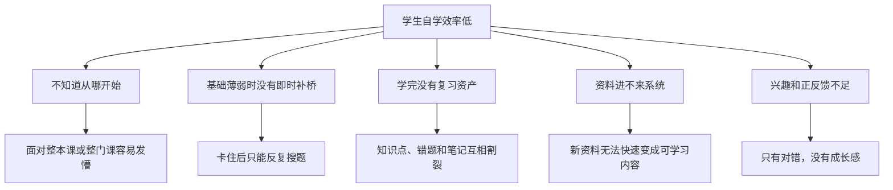
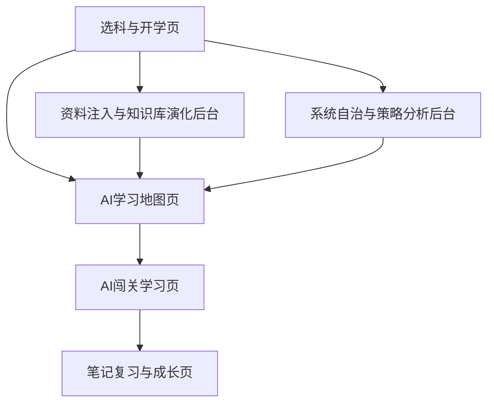

# AI主导学习生命周期的自进化自学智能体平台 PRD 与需求分析

> 文档层级：作品主文档  
> 文档目的：定义比赛版产品定位、目标用户、页面范围、能力边界、功能需求与成功标准，并作为后续页面设计、架构拆分与实现验收的唯一产品主线  
> 核心结论：平台不是“学生发问，AI 回答”的问答页，而是由 AI 主动定义学习目录、持续推进任务、实时调整地图、沉淀复习资产的自学系统  
> 对齐真源：[AI主导学习平台-平台需求与验收.md](../智能体文档/平台层/AI主导学习平台-平台需求与验收.md)、[AI教师智能体群引擎-PRD.md](../智能体文档/子引擎层/AI教师智能体群引擎-PRD.md)

## 1. 产品定义

`AI主导学习生命周期的自进化自学智能体平台` 面向自学场景，重点解决“学生不知道从哪开始学、学到一半卡住、学完没有沉淀、资料无法快速进入系统、兴趣很容易掉”的问题。

比赛版不把平台讲成“会答题的聊天机器人”，而是讲成：

- 会先生成学习地图
- 会发起短诊断并校准起点
- 会安排当前关卡和下一步任务
- 会在学习中实时插入补桥、复习、挑战和奖励节点
- 会更新学习画像
- 会生成思维导图和结构化笔记
- 会接收新资料并推动知识库与策略继续进化

## 2. 比赛版需求收口

### 2.1 一句话定义

这是一套由 AI 主动接管学生学习生命周期、并能在新资料进入后继续进化的自学智能体平台。

### 2.2 比赛版唯一主闭环

比赛演示和后续实现都优先围绕这一条主闭环，不再继续发散：

`选科 -> 开始学习 -> 初始学习地图 -> 短诊断 -> 当前关卡闯关 -> 卡点触发补桥 -> 通关反馈 -> 画像更新 -> 思维导图/结构化笔记 -> 新资料入库后地图变化`

### 2.3 比赛版 MVP

| 类型 | 当前必须做成什么 |
| --- | --- |
| `MVP-01` | 学生能从“选科与开学页”一键进入 AI 接管学习 |
| `MVP-02` | 平台能生成初始学习地图，并在短诊断后重排第一版主线 |
| `MVP-03` | 学生能进入当前关卡，完成一轮讲解、作答、评分与推进 |
| `MVP-04` | 系统能在卡点时插入补桥支线，并说明为什么调整路线 |
| `MVP-05` | 学生能看到画像变化、成长反馈和至少一种复习资产 |
| `MVP-06` | 平台管理者能上传新资料，并看到知识演化记录与地图影响 |

### 2.4 加分项

| 类型 | 能加分但不是第一优先级 |
| --- | --- |
| `BONUS-01` | 多科并行排程与跨科节奏管理 |
| `BONUS-02` | 更细的游戏化反馈，如奖励节点、挑战链、阶段 Boss 强化展示 |
| `BONUS-03` | 更完整的策略分析后台和异常审计面板 |
| `BONUS-04` | 更强的知识演化可视化与影响域对比 |

### 2.5 非范围

比赛版当前明确不做下面这些内容：

- 不做营销型首页
- 不做重皮肤化、重卡通化的教育游戏前端
- 不把排行榜、积分榜作为核心叙事
- 不把“自动训练底层模型”写成产品核心能力
- 不在比赛阶段追求多学科全部做满
- 不把完整业务真源、复杂微服务和大规模运维体系当成当前首要目标

## 3. 目标用户与角色职责

| 角色 | 核心目标 | 直接使用页面 | 重点关心什么 |
| --- | --- | --- | --- |
| 学生 | 选科后被快速带入有效学习，并在学习中持续获得反馈与推进 | 选科与开学页、AI学习地图页、AI闯关学习页、笔记复习与成长页 | 下一步学什么、为什么这样学、自己有没有变强 |
| 平台管理者 | 注入资料、查看知识库演化、观察自治策略和异常状态 | 资料注入与知识库演化后台、系统自治与策略分析后台 | 新资料怎么影响平台、系统有没有异常、策略是否可信 |
| AI教师智能体群引擎 | 持续编排学习生命周期、管理地图重规划和知识演化 | 不作为独立前台角色展示 | 如何稳态编排学习、如何更新画像、如何影响后续路径 |
| 评委 / 观察者 | 在最短时间内看懂作品价值和技术亮点 | 主要看学生主线，再补看后台两页 | 它和普通问答产品有什么不同、它是不是“真的会组织学习” |

## 4. 核心问题

## 5. 产品目标

| 目标编号 | 目标内容 | 验收口径 |
| --- | --- | --- |
| `G-01` | 学生能在 1 次点击后进入 AI 接管学习 | 选科后点击“开始学习”，平台立即生成初始地图和当前任务 |
| `G-02` | 学习地图能实时演化 | 学习中暴露基础缺口时，系统能自动插入补桥节点并回接主线 |
| `G-03` | 学生能持续获得正反馈和成长感 | 每次关卡完成都能看到通关反馈、能力成长和地图推进 |
| `G-04` | 学习画像持续更新 | 学习过程中和每次结束后都能看到画像变化 |
| `G-05` | 笔记与复习资产自动沉淀 | 单关、一轮、阶段结束后都能生成思维导图和结构化笔记 |
| `G-06` | 新资料能自动进入知识库并影响学习路径 | 资料入库后能看到知识演化记录和地图变化 |
| `G-07` | 评委能在 5 到 8 分钟内看懂作品主价值 | 按推荐演示链路走一遍即可理解“AI 主导学习生命周期”的差异点 |

## 6. 比赛版页面总览

本作品固定包含 6 个核心页面，其中前 4 页是主演示链路，后 2 页是后台亮点支撑页。

| 页面 | 主要角色 | 页面优先级 | 页面定位 |
| --- | --- | --- | --- |
| 选科与开学页 | 学生 | `P0` | 主链起点，负责把学生送进 AI 接管流程 |
| AI学习地图页 | 学生 | `P0` | 主视觉中心，负责证明学习路线会实时演化 |
| AI闯关学习页 | 学生 | `P0` | 真正讲、练、改、推的学习页 |
| 笔记复习与成长页 | 学生 | `P0` | 负责证明平台会沉淀复习资产与成长结果 |
| 资料注入与知识库演化后台 | 平台管理者 | `P1` | 负责证明平台会因为新资料继续变强 |
| 系统自治与策略分析后台 | 平台管理者 | `P1` | 负责证明平台可观测、可审计、可解释 |

### 6.1 页面关系图

## 7. 六条核心场景链路

1. `选科开学`  
   学生选择一门或多门科目，默认高数已选，点击“开始学习”后进入 AI 接管流程。
2. `地图生成与短诊断校准`  
   平台先给出初始学习地图，再通过短诊断重排第一版主线。
3. `实时闯关学习`  
   学生进入当前关卡，AI 讲解、提问、判题、反馈并推动下一步。
4. `补桥与回主线`  
   当系统发现基础缺口、遗忘回落或持续卡住时，实时插入补桥支线，并在达标后接回主线。
5. `笔记复习沉淀`  
   Agent 群自动输出思维导图、结构化笔记、错题回顾和复习计划。
6. `资料注入与知识进化`  
   学生或平台管理者上传资料，AI 自动识别、切分、入库、打标签，并反向影响后续学习地图。

## 8. 页面分析

### 8.1 选科与开学页

| 项目 | 页面定义 |
| --- | --- |
| 页面目标 | 让学生不需要先会提问，而是直接进入被 AI 接管的学习流程 |
| 使用角色 | 学生 |
| 页面入口 | 系统首页默认首屏、上次学习续接入口 |
| 首屏重点 | 科目选择、推荐起点、开始学习按钮、最近学习入口 |
| 核心模块 | 科目卡片、多科勾选区、推荐起点卡、开始学习按钮、最近学习记录 |
| 用户动作 | 选一门或多门课、查看推荐起点、点击开始学习、恢复上次进度 |
| AI 动作 | 根据学科与历史画像准备初始学习起点和启动会话 |
| 关键状态 | 未选科、已选单科、已选多科、可直接续学 |
| 常见失败 | 无可用科目、历史画像读取失败、启动会话失败 |
| 页面完成后去向 | 进入 AI学习地图页 |
| 验收点 | 学生 1 次点击后进入学习主链，不需要先输入长问题 |

### 8.2 AI学习地图页

| 项目 | 页面定义 |
| --- | --- |
| 页面目标 | 让学生看见 AI 自动生成且会持续演化的学习地图 |
| 使用角色 | 学生 |
| 页面入口 | 开学页启动后自动进入；闯关完成后回到此页看推进结果 |
| 首屏重点 | 当前阶段、当前主线节点、推荐下一步、补桥或重规划提示 |
| 核心模块 | 科目切换、阶段分区、节点状态、主线轨迹、补桥支线、阶段 Boss、推荐下一步、重规划说明 |
| 用户动作 | 查看当前主线、进入推荐节点、展开补桥原因、回看已解锁阶段 |
| AI 动作 | 生成地图、诊断后重排、学习中实时插入补桥/复习/挑战节点 |
| 关键状态 | 初始地图、短诊断后重排、学习中实时调整、阶段解锁 |
| 常见失败 | 地图为空、节点状态不同步、重规划失败 |
| 页面完成后去向 | 进入 AI闯关学习页 |
| 验收点 | 评委能一眼看懂“当前在哪里、下一步去哪、为什么这样安排” |

### 8.3 AI闯关学习页

| 项目 | 页面定义 |
| --- | --- |
| 页面目标 | 完成当前关卡的讲解、练习、判题、反馈和推进 |
| 使用角色 | 学生 |
| 页面入口 | 从学习地图页点击当前推荐节点进入 |
| 首屏重点 | 当前关卡目标、通过条件、AI 流式讲解区、作答区 |
| 核心模块 | 当前关卡卡、流式讲解区、作答区、即时反馈卡、能力成长提示、下一步动作区 |
| 用户动作 | 提问、作答、请求示例、查看讲解、继续下一步 |
| AI 动作 | 讲解、追问、判题、反馈、输出地图推进建议、触发补桥或挑战 |
| 关键状态 | 讲解中、等待作答、评分完成、通过、补桥、挑战成功 |
| 常见失败 | 流式中断、题目识别失败、评分失败、上下文续接失败 |
| 页面完成后去向 | 通过时回地图页继续推进；补桥时跳到补桥节点；阶段结束时可去笔记复习与成长页 |
| 验收点 | 至少能演示一轮“讲解 -> 作答 -> 反馈 -> 地图推进/补桥”的完整闭环 |

### 8.4 笔记复习与成长页

| 项目 | 页面定义 |
| --- | --- |
| 页面目标 | 证明平台不是只会讲题，还会沉淀复习资产和成长结果 |
| 使用角色 | 学生 |
| 页面入口 | 单关、一轮或阶段学习结束后进入；也可从地图页查看成长结果 |
| 首屏重点 | 思维导图、结构化笔记、今日复习任务、成长变化 |
| 核心模块 | 思维导图区、结构化笔记区、错题回顾、复习计划、学习画像、成长曲线 |
| 用户动作 | 查看笔记、展开错题、查看复习任务、回看画像变化 |
| AI 动作 | 生成关卡摘要、结构化笔记、思维导图、阶段总结和复习计划 |
| 关键状态 | 单关总结、一轮总结、阶段总结、待复习提醒 |
| 常见失败 | 笔记未生成、导图渲染失败、画像未刷新 |
| 页面完成后去向 | 返回地图页继续学习，或进入下一轮复习任务 |
| 验收点 | 至少可见一份思维导图或结构化笔记，以及一次画像更新 |

### 8.5 资料注入与知识库演化后台

| 项目 | 页面定义 |
| --- | --- |
| 页面目标 | 证明平台会因为新资料进入而继续变强，而不是只吃旧知识 |
| 使用角色 | 平台管理者、需要上传资料的学生 |
| 页面入口 | 后台导航入口 |
| 首屏重点 | 上传面板、识别状态、知识资产包、演化版本和影响范围 |
| 核心模块 | 上传区、识别状态流、知识资产包预览、演化记录、影响范围、回滚入口 |
| 用户动作 | 上传资料、查看识别状态、查看知识资产包、确认影响范围、回看演化记录 |
| AI 动作 | 识别、切分、标注、结构化、形成知识资产包、输出演化记录 |
| 关键状态 | 待上传、识别中、候选中、入库完成、影响已生效 |
| 常见失败 | OCR/ASR 失败、入库失败、演化冲突 |
| 页面完成后去向 | 返回后台继续查看影响，或切回学习地图页确认地图变化 |
| 验收点 | 新资料进入后，评委能看到知识演化记录和地图影响 |

### 8.6 系统自治与策略分析后台

| 项目 | 页面定义 |
| --- | --- |
| 页面目标 | 证明平台不是死板规则，而是会观察、会记录、会自我修正 |
| 使用角色 | 平台管理者 |
| 页面入口 | 后台导航入口 |
| 首屏重点 | Agent 状态、策略快照、重规划日志、异常状态 |
| 核心模块 | Agent 状态区、策略快照、重规划日志、画像更新日志、异常告警、审计与回滚 |
| 用户动作 | 查看 Agent 状态、查看策略变化、回看异常、审计回滚 |
| AI 动作 | 记录重规划事件、生成策略快照、输出画像变化与异常说明 |
| 关键状态 | 正常运行、策略更新、告警待处理、回滚完成 |
| 常见失败 | Agent 失联、策略冲突、日志写入失败 |
| 页面完成后去向 | 继续回看后台数据，或回到学习地图页验证前台影响 |
| 验收点 | 评委能看到“平台自治”不是口号，而是有日志、有策略、有异常记录 |

## 9. 功能需求

| 编号 | 能力 | 说明 | 优先级 |
| --- | --- | --- | --- |
| `FR-01` | 选科与开学 | 支持单科或多科选择，并建立学习启动会话 | P0 |
| `FR-02` | 初始学习地图生成 | 基于学科结构、知识资产和已有画像生成第一版地图 | P0 |
| `FR-03` | 短诊断校准 | 通过轻量诊断修正学生起点和地图顺序 | P0 |
| `FR-04` | 实时地图重规划 | 在学习中实时插入补桥、复习、挑战和奖励节点 | P0 |
| `FR-05` | AI闯关学习会话 | 支持讲解、追问、作答、评分、流式反馈和下一步推进 | P0 |
| `FR-06` | 学习画像持续更新 | 支持掌握度、薄弱点、错误模式和节奏偏好持续更新 | P0 |
| `FR-07` | 笔记与思维导图生成 | 在单关、一轮和阶段结束后生成复习资产 | P0 |
| `FR-08` | 多科并行调度 | 支持多门课并行，生成全局学习排程 | P1 |
| `FR-09` | 资料注入与自动入库 | 支持上传资料后自动识别、结构化、入库和演化记录 | P0 |
| `FR-10` | 后台自治分析 | 展示 Agent 协同、策略版本、异常告警和回滚审计 | P1 |
| `FR-11` | REST + SSE 接口开放 | 支持前后端、Agent 编排与流式交付 | P1 |
| `FR-12` | 评委演示模式 | 支持准备固定演示链路、演示账号、演示数据和备用回退方案 | P0 |

## 10. 非功能需求与协作前置

| 编号 | 类别 | 要求 |
| --- | --- | --- |
| `NFR-01` | 可演示性 | 第一屏必须直接进入学生主线，不做营销首页 |
| `NFR-02` | 一致性 | 作品名、页面名、对象名、引擎名和技术栈保持一致 |
| `NFR-03` | 单机高可用 | 支持守护进程、健康检查、优雅重启和备份恢复 |
| `NFR-04` | AI 友好维护 | 前后端职责清晰，结构稳定，便于 AI 连续开发 |
| `NFR-05` | 可扩学科 | 高数之外可按同一对象契约扩科 |
| `NFR-06` | 安全接入 | 模型密钥和调用能力后端托管，前端不暴露敏感凭证 |
| `NFR-07` | 页面可解释性 | 每个核心页面都必须让人看懂“现在在哪、下一步去哪、为什么这样安排” |
| `NFR-08` | 比赛演示可靠性 | 主演示链路需要有固定账号、固定数据和失败降级方案 |

### 10.1 ADP 平台协作前置

凡是涉及腾讯 ADP 控制台、工作流配置、浏览器调试、发布检查的需求，统一遵守下面这条协作约束：

- 由你先登录腾讯 ADP 控制台并保持会话有效
- 我再接手浏览器做配置、联调、核查与取证
- 会话失效、验证码、二次确认出现时，任务暂停等待人工恢复登录
- 平台账号口令不写入仓库、不写入文档正文、不写入脚本

## 11. 边界与非范围

| 项目 | 当前边界 |
| --- | --- |
| 第一示范学科 | 高等数学 |
| 科目策略 | 正式支持多科并行计划，但比赛演示优先高数主线 |
| 游戏化强度 | 中强度闯关化，不做重度游戏化皮肤 |
| 模型能力 | 强调知识库自更新和策略自优化，不写成自动训练底层模型 |
| 部署形态 | 单机服务，不拆微服务 |
| 排行机制 | 不把积分榜和排行榜作为核心叙事 |
| 平台控制台协作 | 登录前置由人工完成，AI 不接管账号登录动作 |

## 12. 成功标准

| 指标 | 目标 |
| --- | --- |
| 启动链路完整性 | 能跑通“选科 -> 开始学习 -> 初始地图 -> 短诊断 -> 第一关” |
| 地图实时重规划 | 学习中出现基础缺口时，能自动插入补桥节点并回主线 |
| 即时正反馈 | 每次关卡完成都能给出成长反馈和地图推进 |
| 画像更新可见性 | 学习过程和学习结束后都能看到画像变化 |
| 复习资产完整性 | 能生成思维导图、结构化笔记和复习计划 |
| 资料进化能力 | 新资料入库后可看到演化记录和地图受影响 |
| 页面可演示性 | 6 个核心页面都有明确目标、入口、状态和验收点 |
| 评委理解成本 | 评委 5 到 8 分钟内能看懂平台价值和差异点 |

## 13. 推荐演示顺序

优先演示这条链：

`选高数 -> 开始学习 -> 初始地图 -> 短诊断 -> 当前关卡 -> 卡点触发补桥 -> 通关反馈 -> 画像更新 -> 生成思维导图 -> 新资料入库后地图变化`

这条演示链的价值在于：

- 同时覆盖学生主线、地图实时演化、画像更新和后台自进化
- 比“只展示聊天和知识库”更能体现系统性
- 更容易让评委理解这不是问答工具，而是一套会组织学习的智能体平台
