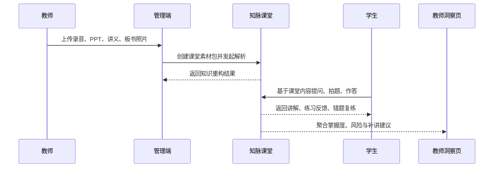

# 知脉课堂场景与用户流程

> 文档层级：作品设计文档  
> 文档目的：把核心场景链路、用户动作和系统响应串成可演示、可实现的流程  
> 核心结论：所有比赛演示都围绕“课堂素材进入系统后，如何被重构、被使用、被复练、被洞察”这一条主链展开

## 1. 标准演示链路

## 2. 场景一：课堂资料上传

### 场景目标

把课堂录音、PPT、讲义、板书照片、课堂作业样本汇总成统一的 `课堂素材包`。

### 用户动作

1. 进入管理与接入配置页或课堂资料上传与重构页
2. 选择课程、章节、班级
3. 上传音频、文档、图片
4. 确认解析任务

### 系统输出

- 上传任务编号
- 文件解析状态
- OCR / ASR / 文档拆分摘要
- 可追踪的素材清单

## 3. 场景二：课堂知识重构

### 场景目标

把分散素材转成统一的 `知识重构结果`，用于学生伴学与教师复盘。

### 系统动作

1. 提取课堂主题、重点、难点
2. 抽取概念关系与先修依赖
3. 生成结构化大纲、课堂摘要、典型例题
4. 输出复盘建议与推荐练习入口

### 关键结果

- 本节重点
- 本节难点
- 概念关系图
- 课堂摘要
- 推荐复练入口

## 4. 场景三：学生伴学会话

### 场景目标

让学生围绕“刚刚上过的课”获得上下文连续的伴学，而不是脱离课堂背景的泛化问答。

### 流程

1. 学生打开课堂工作台首页，看到当前课程与推荐入口
2. 进入学生伴学会话页，系统自动载入当前课堂上下文
3. 学生输入文本、截图或语音问题
4. 系统流式返回讲解、示例、提示问题
5. 学生作答，系统生成掌握度快照与下一步动作

### 判定结果

- 达标：进入下一知识点或下一轮练习
- 未达标：回到前置概念，补桥或再讲
- 高风险：同步进入教师洞察摘要

## 5. 场景四：错题复练

### 场景目标

把“只收藏截图”升级为“可归因、可复练、可追踪”的错题资产。

### 流程

1. 学生提交错误答案或被判错
2. 系统识别错因与知识点标签
3. 写入 `错题画像`
4. 自动生成 1 到 3 道同类变式题
5. 根据掌握度触发间隔复习调度

### 关键输出

- 错因标签
- 变式题
- 再练建议
- 复习触发时间

## 6. 场景五：教师学情洞察

### 场景目标

让教师在几分钟内看见“谁卡住了、卡在哪、该怎么补讲”。

### 视图内容

- 班级掌握度趋势
- 高频错因排行
- 风险学生列表
- 章节薄弱点热区
- 可执行补讲建议

## 7. 角色流程总表

| 角色 | 起点 | 核心动作 | 最终得到什么 |
| --- | --- | --- | --- |
| 学生 | 课堂工作台首页 | 提问、作答、复练、复习 | 讲解、掌握度、错题画像、复习计划 |
| 教师 | 教师洞察页 | 查看趋势、识别风险、调整补讲 | 风险摘要、补讲建议 |
| 管理者 | 管理与接入配置页 | 上传资料、配置课程、管理账号 | 课堂素材包、访问凭证、接入配置 |

## 8. 异常与降级

| 异常 | 降级策略 |
| --- | --- |
| OCR / ASR 质量波动 | 允许人工补录摘要后再次重构 |
| ADP 流式接口异常 | 回退到已生成的知识重构结果与缓存讲解 |
| 数据库写入异常 | 保留本次会话结果并提示稍后同步 |
| 教师聚合延迟 | 不阻塞学生伴学主链路 |

## 9. 评委重点演示建议

优先演示这条链：

`上传课堂资料 -> 知识重构结果页 -> 学生拍题伴学 -> 错题变式复练 -> 教师洞察页`

原因：

- 覆盖比赛要求中的多模态、知识库、工作流、API 与教育场景
- 同时展示学生价值和教师价值
- 最容易体现“系统闭环”而不是单点功能

## 下一篇建议阅读

1. [03-页面与交互设计.md](./03-页面与交互设计.md)
2. [05-算法与知识库设计.md](./05-算法与知识库设计.md)
3. [10-访问与评测手册.md](./10-访问与评测手册.md)
