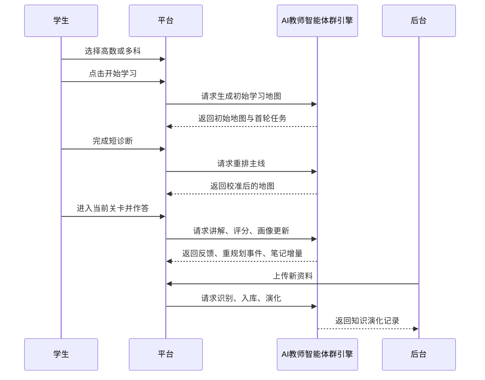

# AI主导学习生命周期的自进化自学智能体平台场景与用户流程

> 文档层级：作品设计文档  
> 文档目的：把学生主线、后台主线和系统响应串成可演示、可实现的流程  
> 核心结论：比赛演示不再围绕旧式课堂协同工作台，而是围绕“学生如何被 AI 组织进一张会实时演化的学习地图”展开

## 1. 标准演示链路

## 2. 场景一：选科开学

### 场景目标

让学生不需要先会提问，而是直接进入被 AI 接管的学习流程。

### 用户动作

1. 打开选科与开学页
2. 选择一门或多门科目
3. 查看平台推荐的学习起点
4. 点击“开始学习”

### 系统输出

- `科目选择记录`
- `学习启动会话`
- `初始学习地图`
- `当前推荐关卡`

## 3. 场景二：地图生成与短诊断校准

### 场景目标

先给学生一个可见的学习地图，再用轻量诊断把起点和顺序校准到更适合的位置。

### 系统动作

1. 根据学科目录、知识资产和历史画像生成初始地图
2. 以 3 到 5 个问题完成短诊断
3. 判断学生是否需要补桥、跳过或提前复习
4. 输出第一版校准后的主线和支线

### 关键结果

- 当前阶段
- 当前主线节点
- 可选支线节点
- 第一阶段 Boss
- 推荐下一步

## 4. 场景三：实时闯关学习

### 场景目标

让学习过程更像推进关卡，而不是掉进无限对话。

### 流程

1. 学生进入当前关卡
2. AI 先讲本关目标和通过条件
3. 学生提问、作答或请求示例
4. 系统流式给出讲解、提示、判题和反馈
5. 达标则推进地图；未达标则触发补桥或降难度

### 判定结果

- `通过`：解锁下一节点、提升能力值、出现下一目标
- `补桥`：插入前置支线并解释为什么要回补
- `复习`：提前触发复习节点
- `挑战`：跳转更高难节点或阶段 Boss

## 5. 场景四：补桥与回主线

### 场景目标

当学生学着学着发现基础不够时，系统要像游戏开支线一样立即接住，而不是把学生扔回整本教材。

### 触发条件

- 连续错误
- 明显基础缺口
- 长时间卡住
- 重复追问同类问题
- 遗忘回落
- 兴趣下降信号

### 系统动作

1. 记录 `重规划事件`
2. 插入补桥关卡、复习关卡或降难任务
3. 默认给轻提示：“AI 已为你调整路线”
4. 展开后展示完整原因、补桥目标和返回主线条件
5. 达标后把地图接回原主线

## 6. 场景五：笔记复习沉淀

### 场景目标

把每次学习都变成可复习、可回看、可继续用的资产。

### 流程

1. 单关结束后生成关卡摘要
2. 一轮学习结束后生成结构化笔记
3. 阶段结束后生成思维导图和复习计划
4. 将错题、误区、易混点回写到笔记区
5. 将复习任务挂回学习地图

### 关键输出

- 思维导图
- 结构化笔记
- 错题回顾
- 阶段总结
- 复习计划

## 7. 场景六：资料注入与知识进化

### 场景目标

让平台不是只会使用旧资料，而是能把新资料变成新能力。

### 流程

1. 学生或平台管理者上传文档、图片、录音、题单或批注资料
2. 系统自动执行识别、切分、标注和结构化
3. 形成 `知识资产包`
4. 自动写入知识库并记录演化版本
5. 影响后续学习地图、笔记生成和策略判断

## 8. 角色流程总表

| 角色 | 起点 | 核心动作 | 最终得到什么 |
| --- | --- | --- | --- |
| 学生 | 选科与开学页 | 选科、闯关、作答、复习 | 地图推进、正反馈、画像更新、笔记资产 |
| 平台管理者 | 资料注入后台 | 上传资料、查看演化、回看审计 | 知识资产包、演化记录、回滚入口 |
| AI教师智能体群引擎 | 平台任务编排 | 诊断、重规划、讲解、评分、笔记生成 | 学习结果、画像快照、策略快照 |

## 9. 异常与降级

| 异常 | 降级策略 |
| --- | --- |
| 地图生成失败 | 回退到学科默认起始地图，并提示稍后重新校准 |
| 流式讲解中断 | 回退到缓存讲解和静态反馈，不阻塞当前关卡 |
| 画像更新异常 | 保留当前作答结果，异步补写画像 |
| 新资料识别失败 | 记录失败原因并允许重新上传或改走手动摘要 |
| 演化记录冲突 | 先冻结新版本，不影响当前学习主线 |

## 10. 评委重点演示建议

优先演示这条链：

`选高数 -> 开始学习 -> 初始地图 -> 短诊断 -> 当前关卡 -> 卡点触发补桥 -> 通关反馈 -> 画像更新 -> 生成思维导图 -> 新资料入库后地图变化`

原因：

- 同时覆盖学生主线、地图实时演化、画像更新和后台自进化
- 比“只展示聊天和知识库”更能体现系统性
- 更容易让评委理解这是一个会组织学习的智能体平台
