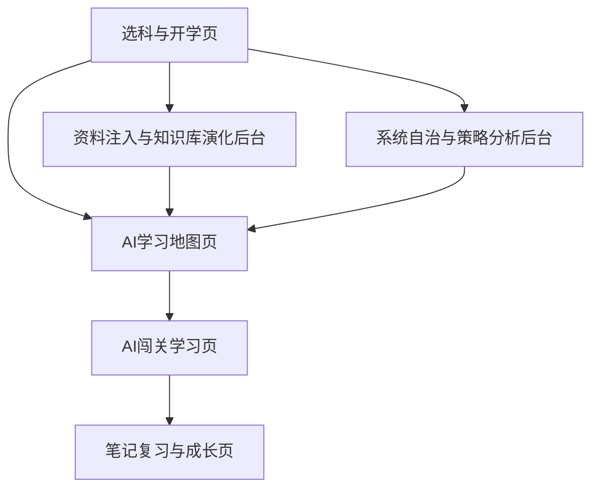

# AI主导学习生命周期的自进化自学智能体平台页面与交互设计

> 文档层级：作品主文档  
> 文档目的：定义比赛版页面信息架构、页面优先级、首屏结构、核心模块与关键交互状态，作为后续前端实现、答辩演示和联调验收的页面设计主线  
> 核心结论：前端第一屏必须让评委一眼明白“学生怎么被 AI 带进学习地图”，后台则负责证明平台会自己长，而不是把大量技术能力直接堆在首页

## 1. 页面设计总原则

### 1.1 教育视角原则

- 页面首先服务学习，不先服务炫技
- 每一页都要回答“学生现在在哪、为什么在这、下一步去哪”
- AI 的作用是组织学习和给出反馈，不是替学生把学习过程一把做完
- 页面不能只展示“内容很多”，要展示“路径清楚、节奏被接住、结果能沉淀”

### 1.2 比赛展示原则

- 不做营销首页，首屏直接进入学生主线
- 评委必须在 30 秒内看懂这不是普通问答页
- 主演示只围绕学生主线展开，后台两页只做亮点支撑
- 页面切换顺序必须服务答辩链路，不让评委自己猜产品主线

### 1.3 实现原则

- 先让人看懂页面目标，再展示复杂能力
- 地图、关卡、补桥、成长反馈必须成为主视觉
- 每页都要明确：加载、空状态、错误状态、权限状态
- 不做重卡通化皮肤，不走“幼态教育 App”路线

## 2. 页面优先级与阅读顺序

| 页面 | 角色 | 页面级别 | 在比赛里的作用 |
| --- | --- | --- | --- |
| 选科与开学页 | 学生 | `P0` | 把学生送进主闭环 |
| AI学习地图页 | 学生 | `P0` | 证明平台会组织学习 |
| AI闯关学习页 | 学生 | `P0` | 证明平台真的会教、会判、会推下一步 |
| 笔记复习与成长页 | 学生 | `P0` | 证明平台会沉淀复习资产和成长结果 |
| 资料注入与知识库演化后台 | 平台管理者 | `P1` | 证明平台会因为新资料继续变强 |
| 系统自治与策略分析后台 | 平台管理者 | `P1` | 证明平台可观测、可解释、可回看 |

### 2.1 比赛推荐演示顺序

### 2.2 角色入口表

| 角色 | 默认先看哪页 | 最常停留在哪几页 |
| --- | --- | --- |
| 学生 | 选科与开学页 | AI学习地图页、AI闯关学习页、笔记复习与成长页 |
| 平台管理者 | 资料注入与知识库演化后台 | 资料注入与知识库演化后台、系统自治与策略分析后台 |
| 评委 | 选科与开学页 | 前 4 页为主，后 2 页作为亮点补充 |

## 3. 六页先用一句话看懂

| 页面 | 一句话用途 |
| --- | --- |
| 选科与开学页 | 选一门或多门课，点击“开始学习”，把学生送进 AI 主导流程 |
| AI学习地图页 | 看主线、补桥支线、阶段 Boss、当前进度和下一步 |
| AI闯关学习页 | 真正讲、练、改、推的地方 |
| 笔记复习与成长页 | 看思维导图、结构化笔记、错题回顾和成长结果 |
| 资料注入与知识库演化后台 | 看新资料怎么被识别、入库并影响学习地图 |
| 系统自治与策略分析后台 | 看 Agent 协同、策略变化、画像日志和异常审计 |

## 4. 页面总地图

## 5. 六个核心页面设计

### 5.1 选科与开学页

| 项目 | 页面定义 |
| --- | --- |
| 页面目标 | 让学生不需要先会提问，而是直接进入被 AI 接管的学习流程 |
| 页面定位 | 主链起点页 |
| 使用角色 | 学生 |
| 页面入口 | 系统首页默认首屏、上次学习续接入口 |
| 教育价值 | 解决“学生不知道从哪开始”的第一道门槛 |
| 首屏必须先看到 | 科目选择、推荐起点、开始学习按钮、最近学习入口 |
| 页面模块顺序 | 顶部一句话定义 -> 科目卡片区 -> 推荐起点卡 -> 最近学习入口 -> 开始学习按钮 |
| 用户动作 | 选一门或多门课、查看推荐起点、点击开始学习、恢复上次进度 |
| AI 动作 | 根据学科与历史画像准备初始学习起点和启动会话 |
| 成功状态 | 已创建学习启动会话，已生成初始地图与当前推荐关卡 |
| 空状态 | 首次使用，无历史记录，只显示默认高数推荐起点 |
| 错误状态 | 无可用科目、历史画像读取失败、启动会话失败 |
| 常见误设计 | 不要把这页做成宣传页，不要让学生先写长输入，不要把学习入口藏太深 |
| 页面完成后去向 | 进入 AI学习地图页 |
| 验收点 | 学生 1 次点击后进入学习主链，不需要先输入长问题 |

#### 选科与开学页桌面布局草图

### 5.2 AI学习地图页

| 项目 | 页面定义 |
| --- | --- |
| 页面目标 | 让学生看见 AI 自动生成且会持续演化的学习地图 |
| 页面定位 | 全产品主视觉中心 |
| 使用角色 | 学生 |
| 页面入口 | 开学页启动后自动进入；闯关完成后回到此页看推进结果 |
| 教育价值 | 把“学什么、为什么学、先后顺序是什么”可视化 |
| 首屏必须先看到 | 当前阶段、当前主线节点、推荐下一步、补桥或重规划提示 |
| 页面模块顺序 | 顶部阶段卡 -> 中间地图主视觉 -> 右侧当前任务卡 -> 右侧重规划说明 -> 底部阶段总结 |
| 用户动作 | 查看当前主线、进入推荐节点、展开补桥原因、回看已解锁阶段 |
| AI 动作 | 生成地图、诊断后重排、学习中实时插入补桥/复习/挑战节点 |
| 成功状态 | 地图已生成、当前节点清楚、下一步明确、支线解释清楚 |
| 空状态 | 初始地图还未生成时显示“正在生成第一版学习路线” |
| 错误状态 | 地图为空、节点状态不同步、重规划失败 |
| 常见误设计 | 不要先给整张大图淹没人；不要只有地图没有当前任务；不要只画节点不解释原因 |
| 页面完成后去向 | 进入 AI闯关学习页 |
| 验收点 | 评委能一眼看懂“当前在哪里、下一步去哪、为什么这样安排” |

#### 地图页的教育解释要求

- 主线代表当前最优推进路径
- 补桥支线代表基础回补，不是“失败惩罚”
- 复习节点代表遗忘风险被提前接住
- Boss 节点代表阶段性综合验证
- 奖励节点代表正反馈，而不是无意义装饰

#### 地图页桌面布局草图

### 5.3 AI闯关学习页

| 项目 | 页面定义 |
| --- | --- |
| 页面目标 | 完成当前关卡的讲解、练习、判题、反馈和推进 |
| 页面定位 | 学习动作最密集的一页 |
| 使用角色 | 学生 |
| 页面入口 | 从学习地图页点击当前推荐节点进入 |
| 教育价值 | 证明平台不只是会聊天，而是真的在组织学习任务 |
| 首屏必须先看到 | 当前关卡目标、通过条件、AI 流式讲解区、作答区 |
| 页面模块顺序 | 顶部关卡目标卡 -> 主区流式讲解与作答 -> 右侧即时反馈 -> 底部下一步动作 |
| 用户动作 | 提问、作答、请求示例、查看讲解、继续下一步 |
| AI 动作 | 讲解、追问、判题、反馈、输出地图推进建议、触发补桥或挑战 |
| 成功状态 | 已完成一轮讲解、作答、评分与推进 |
| 空状态 | 进入关卡但还未开始对话，显示本关目标和通过条件 |
| 错误状态 | 流式中断、题目识别失败、评分失败、上下文续接失败 |
| 常见误设计 | 不要把它做成无限聊天页；不要没有通过条件；不要只有答案没有成长反馈 |
| 页面完成后去向 | 通过时回地图页继续推进；补桥时跳到补桥节点；阶段结束时可去笔记复习与成长页 |
| 验收点 | 至少能演示一轮“讲解 -> 作答 -> 反馈 -> 地图推进/补桥”的完整闭环 |

#### 闯关页关键反馈卡

每轮至少给出：

- 本轮是否通过
- 错在哪
- 为什么错
- 下一步是继续、补桥还是复习
- 地图是否解锁了新节点
- 学习画像是否发生了变化

### 5.4 笔记复习与成长页

| 项目 | 页面定义 |
| --- | --- |
| 页面目标 | 证明平台不是只会讲题，还会沉淀复习资产和成长结果 |
| 页面定位 | 学习结果沉淀页 |
| 使用角色 | 学生 |
| 页面入口 | 单关、一轮或阶段学习结束后进入；也可从地图页查看成长结果 |
| 教育价值 | 让学习结果变成可回看、可复习、可继续用的资产 |
| 首屏必须先看到 | 思维导图、结构化笔记、今日复习任务、成长变化 |
| 页面模块顺序 | 左侧思维导图 -> 中间结构化笔记 -> 右侧画像与成长曲线 -> 底部复习计划 |
| 用户动作 | 查看笔记、展开错题、查看复习任务、回看画像变化 |
| AI 动作 | 生成关卡摘要、结构化笔记、思维导图、阶段总结和复习计划 |
| 成功状态 | 至少产出一份思维导图或结构化笔记，并能看到一次成长变化 |
| 空状态 | 当轮笔记尚未生成时，展示上一轮资产和“正在整理本轮结果” |
| 错误状态 | 笔记未生成、导图渲染失败、画像未刷新 |
| 常见误设计 | 不要只有静态文档下载；不要把笔记埋很深；不要把成长变化做成看不懂的技术指标 |
| 页面完成后去向 | 返回地图页继续学习，或进入下一轮复习任务 |
| 验收点 | 至少可见一份思维导图或结构化笔记，以及一次画像更新 |

### 5.5 资料注入与知识库演化后台

| 项目 | 页面定义 |
| --- | --- |
| 页面目标 | 证明平台会因为新资料进入而继续变强，而不是只吃旧知识 |
| 页面定位 | 后台第一亮点页 |
| 使用角色 | 平台管理者、需要上传资料的学生 |
| 页面入口 | 后台导航入口 |
| 教育价值 | 让平台“会长知识”这件事可被看见、可被追踪 |
| 首屏必须先看到 | 上传面板、识别状态、知识资产包、演化版本和影响范围 |
| 页面模块顺序 | 左侧上传区 -> 中间识别状态流 -> 右侧资产预览 -> 底部演化记录和影响范围 |
| 用户动作 | 上传资料、查看识别状态、查看知识资产包、确认影响范围、回看演化记录 |
| AI 动作 | 识别、切分、标注、结构化、形成知识资产包、输出演化记录 |
| 成功状态 | 新资料已被识别，已产生知识资产包和演化记录 |
| 空状态 | 尚未上传资料时，显示样例说明和推荐资料格式 |
| 错误状态 | OCR/ASR 失败、入库失败、演化冲突 |
| 常见误设计 | 不要只展示“上传成功”；必须让人看到“新资料如何影响地图” |
| 页面完成后去向 | 返回后台继续查看影响，或切回学习地图页确认地图变化 |
| 验收点 | 新资料进入后，评委能看到知识演化记录和地图影响 |

### 5.6 系统自治与策略分析后台

| 项目 | 页面定义 |
| --- | --- |
| 页面目标 | 证明平台不是死板规则，而是会观察、会记录、会自我修正 |
| 页面定位 | 后台第二亮点页 |
| 使用角色 | 平台管理者 |
| 页面入口 | 后台导航入口 |
| 教育价值 | 让“AI 组织学习”不只是口号，而是有日志、有策略、有异常可追踪 |
| 首屏必须先看到 | Agent 状态、策略快照、重规划日志、异常状态 |
| 页面模块顺序 | 顶部系统 KPI -> 中部策略快照与日志双栏 -> 底部异常与审计 |
| 用户动作 | 查看 Agent 状态、查看策略变化、回看异常、审计回滚 |
| AI 动作 | 记录重规划事件、生成策略快照、输出画像变化与异常说明 |
| 成功状态 | 能看见策略变化、Agent 协同和异常处理痕迹 |
| 空状态 | 当前没有异常时，展示最近一轮稳定运行摘要 |
| 错误状态 | Agent 失联、策略冲突、日志写入失败 |
| 常见误设计 | 不要把这页做成纯日志垃圾堆；要先给人看结论，再展开底层细节 |
| 页面完成后去向 | 继续回看后台数据，或回到学习地图页验证前台影响 |
| 验收点 | 评委能看到“平台自治”不是口号，而是有日志、有策略、有异常记录 |

## 6. 地图交互特殊要求

### 6.1 地图节点类型

- 主线关卡
- 补桥关卡
- 复习关卡
- 挑战关卡
- 阶段 Boss
- 奖励节点

### 6.2 实时重规划显示方式

- 默认轻提示：`AI 已为你调整路线`
- 展开详情：展示触发原因、补桥目标、回主线条件
- 地图上需要清晰标出“当前支线”和“原主线回接点”
- 重规划提示要先讲“为什么调”，再讲“怎么调”

### 6.3 即时正反馈显示方式

每次关卡完成后至少展示：

- 本关通过
- 能力值提升
- 掌握度变化
- 地图推进
- 新节点解锁

## 7. 全局状态与异常设计

| 状态类型 | 全局要求 |
| --- | --- |
| 加载状态 | 不能只放骨架屏，要告诉用户系统正在做什么 |
| 空状态 | 不能只是“暂无数据”，要给下一步建议 |
| 错误状态 | 要说明当前失败会不会影响学习主线 |
| 权限状态 | 学生与平台管理者的页面入口必须清楚隔离 |
| 降级状态 | 平台或流式异常时，要给可演示的最小结果，不让页面直接死掉 |

## 8. 教育评委最容易盯的页面问题

| 质疑点 | 页面上必须给出的回答 |
| --- | --- |
| 这是不是普通聊天机器人 | 地图、关卡、补桥和成长反馈必须同步出现 |
| 它到底怎么组织学习 | 当前阶段、当前任务、下一步建议要始终可见 |
| 学生学完留下了什么 | 笔记、导图、复习计划和画像变化要能直接展示 |
| 新资料进来有什么意义 | 后台必须展示知识演化记录和地图影响 |
| AI 会不会乱来 | 后台必须展示策略快照、日志和异常审计 |

## 9. 前端实现口径

- 产品前端目标技术路线：`Vue 3 + TypeScript + Vite`
- 状态管理：`Pinia`
- 路由：`Vue Router`
- UI：`Naive UI + Tailwind CSS`
- 动效：`VueUse Motion`
- 图表：`ECharts`

## 10. 页面设计完成标准

只要后续 skills 接手页面实现或联调，这份页面稿至少要能回答下面这些问题：

- 这页给谁用
- 这页解决什么问题
- 首屏先看什么
- 核心模块顺序是什么
- 用户在这页做什么
- AI 在这页做什么
- 哪些状态必须出现
- 常见失败怎么处理
- 页面完成后跳去哪
- 评委最该从这页看懂什么
