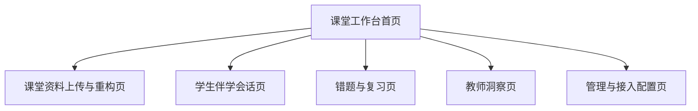

# 知脉课堂页面与交互设计

> 文档层级：前端设计主文档  
> 文档目的：定义作品前端信息架构、六个核心工作台页面与关键交互状态  
> 核心结论：前端第一屏必须是可操作工作台，六个页面共同承担学生、教师、管理三类角色的展示与评审任务

## 1. 设计总原则

- 不做营销首页，首屏直接进入工作台
- 中文优先，信息层级清晰，方便答辩现场快速定位
- 同一工作台承接学生、教师、管理三类入口，避免站点割裂
- 桌面端优先展示全链路，移动端保持核心操作可完成
- 所有核心页都必须带“当前课程 / 当前章节 / 当前任务 / 当前状态”

## 2. 页面地图

## 3. 六个核心页面

### 3.1 课堂工作台首页

| 项目 | 设计要求 |
| --- | --- |
| 目标用户 | 全角色 |
| 核心任务 | 快速进入当前课程、当前课堂、当前任务与最近结果 |
| 主要模块 | 当前课程卡、课堂重构入口、学生伴学入口、教师洞察入口、最近异常提醒 |
| 关键状态 | 正常、有待处理任务、课堂刚结束、无数据首启 |
| 异常状态 | 当前课程未配置、访问凭证失效、接口不可用 |
| 评委演示点 | 第一屏即看到“上传资料、学生伴学、教师洞察”三个核心入口 |
| 桌面端主布局 | 顶部全局导航 + 中部三列工作卡 + 底部最近活动流 |
| 移动端降级策略 | 改为上下堆叠卡片，保留三个主入口大按钮 |

### 3.2 课堂资料上传与重构页

| 项目 | 设计要求 |
| --- | --- |
| 目标用户 | 教师、助教、管理者 |
| 核心任务 | 上传课堂素材并查看知识重构结果 |
| 主要模块 | 上传面板、解析进度、素材列表、知识重构结果、概念关系图、推荐复练 |
| 关键状态 | 待上传、上传中、解析中、重构完成 |
| 异常状态 | 文件格式不支持、解析失败、结果为空、重构超时 |
| 评委演示点 | 同时展示音频、PPT、板书图片进入同一结果页 |
| 桌面端主布局 | 左侧上传与任务状态，右侧知识重构结果与关系图 |
| 移动端降级策略 | 先看任务状态卡，再看结构化结果，关系图改为摘要列表 |

### 3.3 学生伴学会话页

| 项目 | 设计要求 |
| --- | --- |
| 目标用户 | 学生 |
| 核心任务 | 基于当前课堂上下文提问、作答、接收讲解与练习 |
| 主要模块 | 会话流、当前任务卡、上下文摘要、题目输入区、作答反馈区、下一步建议 |
| 关键状态 | 流式回复中、等待输入、作答提交后、达标推进、回补重讲 |
| 异常状态 | 流式中断、题图识别失败、上下文丢失 |
| 评委演示点 | “拍题 -> 讲解 -> 再答 -> 掌握度快照” 的实时变化 |
| 桌面端主布局 | 左侧会话主区，右侧任务卡与课堂摘要 |
| 移动端降级策略 | 会话主区全屏，任务卡折叠到底部抽屉 |

### 3.4 错题与复习页

| 项目 | 设计要求 |
| --- | --- |
| 目标用户 | 学生 |
| 核心任务 | 查看错题画像、完成变式练习、执行间隔复习 |
| 主要模块 | 错题列表、错因标签、掌握度趋势、变式练习区、复习日程 |
| 关键状态 | 新增错题、待复练、已掌握、待复习提醒 |
| 异常状态 | 错题未入库、变式生成失败、复习计划未刷新 |
| 评委演示点 | 错因标签和变式练习的联动 |
| 桌面端主布局 | 左侧错题列表，右侧画像详情与变式练习 |
| 移动端降级策略 | 默认展示错题列表，详情页抽屉化 |

### 3.5 教师洞察页

| 项目 | 设计要求 |
| --- | --- |
| 目标用户 | 教师、教研负责人 |
| 核心任务 | 查看班级掌握度、风险学生与补讲建议 |
| 主要模块 | 班级概览、掌握度图表、风险学生列表、高频错因排行、补讲建议卡 |
| 关键状态 | 日常观察、课堂结束后复盘、周度汇总 |
| 异常状态 | 数据延迟、班级无样本、聚合任务失败 |
| 评委演示点 | 图表、风险列表、补讲建议同时出现，体现教师侧价值 |
| 桌面端主布局 | 上方 KPI 卡，中部图表，下方风险列表与建议双栏 |
| 移动端降级策略 | KPI 卡横滑，图表折叠，建议卡优先展示 |

### 3.6 管理与接入配置页

| 项目 | 设计要求 |
| --- | --- |
| 目标用户 | 管理者、实施者 |
| 核心任务 | 配置课程、角色、访问凭证、接入参数与演示账号 |
| 主要模块 | 课程配置、角色权限、访问凭证、API 接入参数、演示账号说明 |
| 关键状态 | 已配置、待补全、校验通过、待发布 |
| 异常状态 | 参数缺失、凭证失效、角色越权 |
| 评委演示点 | 说明作品不是孤立页面，而是可接入、可管理的系统 |
| 桌面端主布局 | 左侧配置导航，右侧表单与校验结果 |
| 移动端降级策略 | 改为分段表单，优先展示访问与账号信息 |

## 4. 全局导航与状态

### 顶部导航固定包含

- 作品总览
- 六个工作台页面入口
- 当前课程 / 当前章节
- 当前角色
- 访问状态

### 全局状态提示

- 正常运行
- 流式处理中
- 解析中
- 风险提醒
- 访问受限

## 5. 评审视角下的页面分工

| 页面 | 对应评审关注点 |
| --- | --- |
| 课堂工作台首页 | 作品完整度、入口清晰度 |
| 课堂资料上传与重构页 | 多模态、知识重构、知识库能力 |
| 学生伴学会话页 | 智能体交互、个性化讲解 |
| 错题与复习页 | 闭环学习、算法优化 |
| 教师洞察页 | 教育场景价值、群体洞察 |
| 管理与接入配置页 | 可交付性、可接入性、维护性 |

## 6. 前端实现口径

- 框架：`Vue 3 + TypeScript + Vite`
- 状态：`Pinia`
- 路由：`Vue Router`
- UI：`Naive UI + Tailwind CSS`
- 动效：`VueUse Motion`
- 图表：`ECharts`

## 下一篇建议阅读

1. [04-总体架构与技术选型.md](./04-总体架构与技术选型.md)
2. [06-接口与API说明.md](./06-接口与API说明.md)
3. [08-答辩PPT大纲.md](./08-答辩PPT大纲.md)
