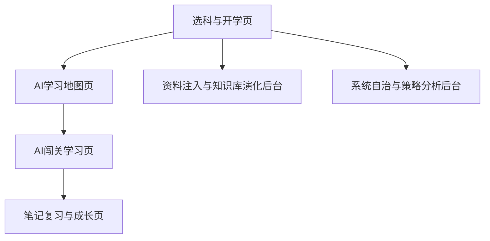

# AI主导学习生命周期的自进化自学智能体平台页面与交互设计

> 文档层级：前端设计主文档  
> 文档目的：定义前端信息架构、核心页面和关键交互状态  
> 核心结论：前端第一屏必须让评委一眼明白“学生怎么被 AI 带进学习地图”，后台则负责证明平台会自己长

## 1. 设计总原则

- 不做营销首页，首屏直接进入学生主线
- 先让人看懂页面在干嘛，再展示复杂能力
- 地图、关卡、解锁和成长反馈必须是前端主视觉
- 中强度闯关化，不做卡通重游戏皮肤
- 所有核心页都要能解释“学生现在在哪、下一步去哪、为什么这样安排”

## 2. 六页先用一句话看懂

| 页面 | 一句话用途 |
| --- | --- |
| 选科与开学页 | 选一门或多门课，点击“开始学习”，把学生送进 AI 主导流程 |
| AI学习地图页 | 看主线、补桥支线、阶段 Boss、当前进度和下一步 |
| AI闯关学习页 | 真正讲、练、改、推的地方 |
| 笔记复习与成长页 | 看思维导图、结构化笔记、错题回顾和成长结果 |
| 资料注入与知识库演化后台 | 看新资料怎么被识别、入库并影响学习地图 |
| 系统自治与策略分析后台 | 看 Agent 协同、策略变化、画像日志和异常审计 |

## 3. 页面地图

## 4. 六个核心页面

### 4.1 选科与开学页

| 项目 | 设计要求 |
| --- | --- |
| 目标用户 | 学生 |
| 核心任务 | 选择单科或多科，建立学习启动会话 |
| 主要模块 | 科目卡片、多科勾选区、推荐起点、开始学习按钮、最近学习入口 |
| 关键状态 | 未选科、已选单科、已选多科、可直接续学 |
| 异常状态 | 无可用科目、历史画像读取失败、启动会话失败 |
| 评委演示点 | 学生不需要先提问，点一次就进入 AI 接管流程 |
| 桌面端主布局 | 左侧科目选择，右侧作品一句话和最近学习入口 |
| 移动端降级策略 | 科目卡纵向堆叠，开始学习按钮固定底部 |

### 4.2 AI学习地图页

| 项目 | 设计要求 |
| --- | --- |
| 目标用户 | 学生 |
| 核心任务 | 查看 AI 自动生成且会持续演化的学习地图 |
| 主要模块 | 科目切换、阶段分区、节点状态、主线轨迹、补桥支线、阶段 Boss、推荐下一步、重规划提示 |
| 关键状态 | 初始地图、短诊断后重排、学习中实时调整、阶段解锁 |
| 异常状态 | 地图为空、重规划失败、节点状态不同步 |
| 评委演示点 | 卡点时地图立刻开支线，达标后回主线 |
| 桌面端主布局 | 左侧地图主视觉，右侧当前阶段卡、下一步建议和重规划说明 |
| 移动端降级策略 | 地图按阶段折叠，默认只展开当前阶段 |

### 4.3 AI闯关学习页

| 项目 | 设计要求 |
| --- | --- |
| 目标用户 | 学生 |
| 核心任务 | 完成当前关卡的讲解、练习、判题和推进 |
| 主要模块 | 当前关卡目标、AI 流式讲解、作答区、即时反馈卡、能力成长提示、下一步动作 |
| 关键状态 | 讲解中、等待作答、评分完成、通过、补桥、挑战成功 |
| 异常状态 | 流式中断、题目识别失败、评分失败、上下文续接失败 |
| 评委演示点 | 从“讲题”到“地图推进”和“能力成长”完整可见 |
| 桌面端主布局 | 左侧对话与作答主区，右侧关卡条件、反馈卡和推荐动作 |
| 移动端降级策略 | 作答主区全屏，关卡条件收进底部抽屉 |

### 4.4 笔记复习与成长页

| 项目 | 设计要求 |
| --- | --- |
| 目标用户 | 学生 |
| 核心任务 | 复习已经学过的内容，并理解自己是怎么变强的 |
| 主要模块 | 思维导图区、结构化笔记区、错题回顾、复习计划、学习画像、成长曲线 |
| 关键状态 | 单关总结、一轮总结、阶段总结、待复习提醒 |
| 异常状态 | 笔记未生成、思维导图渲染失败、画像未刷新 |
| 评委演示点 | 平台不是只会讲题，还会自动帮学生整理复习资产 |
| 桌面端主布局 | 左侧思维导图和笔记，右侧画像卡和成长曲线 |
| 移动端降级策略 | 默认优先展示思维导图和今日复习任务，其他内容分段折叠 |

### 4.5 资料注入与知识库演化后台

| 项目 | 设计要求 |
| --- | --- |
| 目标用户 | 平台管理者、需要上传资料的学生 |
| 核心任务 | 查看资料如何被识别、结构化、入库和影响地图 |
| 主要模块 | 上传面板、识别状态、知识资产包、演化版本、影响范围、回滚入口 |
| 关键状态 | 待上传、识别中、入库完成、影响已生效 |
| 异常状态 | OCR/ASR 失败、入库失败、演化冲突 |
| 评委演示点 | 新资料进入后，学习地图真的会发生变化 |
| 桌面端主布局 | 左侧上传与任务流，右侧资产预览和演化记录 |
| 移动端降级策略 | 先展示任务状态卡，再看资产与版本详情 |

### 4.6 系统自治与策略分析后台

| 项目 | 设计要求 |
| --- | --- |
| 目标用户 | 平台管理者 |
| 核心任务 | 观察 Agent 协同、策略变化、画像更新和异常状态 |
| 主要模块 | Agent 状态、策略快照、重规划日志、画像更新日志、异常告警、审计回滚 |
| 关键状态 | 正常运行、策略更新、告警待处理、回滚完成 |
| 异常状态 | Agent 失联、策略冲突、日志写入失败 |
| 评委演示点 | 证明平台不是死板规则，而是会自我观察和自我修正 |
| 桌面端主布局 | 顶部系统 KPI，中部日志和策略双栏，下部异常与审计 |
| 移动端降级策略 | KPI 卡横滑，日志流改成分组列表 |

## 5. 地图交互的特殊要求

### 5.1 地图节点类型

- 主线关卡
- 补桥关卡
- 复习关卡
- 挑战关卡
- 阶段 Boss
- 奖励节点

### 5.2 实时重规划显示方式

- 默认轻提示：`AI 已为你调整路线`
- 展开详情：展示触发原因、补桥目标、回主线条件
- 地图上需要清晰标出“当前支线”和“原主线回接点”

### 5.3 即时正反馈显示方式

每次关卡完成后至少展示：

- 本关通过
- 能力值提升
- 掌握度变化
- 地图推进
- 新节点解锁

## 6. 前端实现口径

- 框架：`Vue 3 + TypeScript + Vite`
- 状态：`Pinia`
- 路由：`Vue Router`
- UI：`Naive UI + Tailwind CSS`
- 动效：`VueUse Motion`
- 图表：`ECharts`

