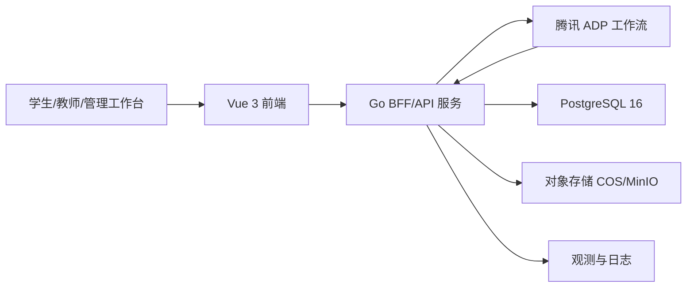
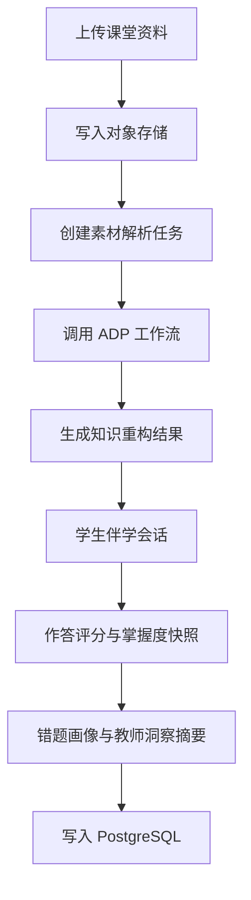

# 知脉课堂总体架构与技术选型

> 文档层级：作品技术主文档  
> 文档目的：定义作品整体分层、技术栈、部署方式与单机高可用策略  
> 核心结论：比赛版本采用 `Vue 3 + TypeScript` 前端与 `Go + Gin` 单体后端，接入腾讯 ADP 与 `HTTP SSE V2`，强调实用、清晰、可维护的单机可落地架构

## 1. 架构总览

## 2. 分层说明

| 分层 | 技术实现 | 职责 |
| --- | --- | --- |
| 展示层 | Vue 3 工作台 | 承接学生、教师、管理三类页面 |
| 接入层 | Go Gin BFF | REST API、SSE 代理、鉴权、参数透传 |
| 智能体层 | 腾讯 ADP | 多智能体编排、知识检索、流式回复 |
| 数据层 | PostgreSQL 16 | 课程、会话、错题、洞察、访问配置沉淀 |
| 资源层 | 腾讯 COS / MinIO | 存储音频、文档、图片和重构产物 |
| 运维层 | Caddy/Nginx + systemd | 反向代理、健康检查、优雅重启 |

## 3. 技术选型表

| 模块 | 选型 | 选择原因 |
| --- | --- | --- |
| 前端框架 | `Vue 3 + TypeScript + Vite` | 组件组织清晰，适合比赛期间高效迭代工作台 |
| 前端状态 | `Pinia` | 简单直接，适合课程、会话、角色多状态协同 |
| UI 组件 | `Naive UI` | 组件完整，风格克制，适合后台与工作台场景 |
| CSS | `Tailwind CSS` | 便于快速统一间距、状态、布局和响应式规则 |
| 动效 | `VueUse Motion` | 轻量，可控，不会把项目拖进重动画工程 |
| 图表 | `ECharts` | 教师洞察页和掌握度分析展示成熟 |
| 后端框架 | `Go 1.24 + Gin` | 单体服务性能稳定，结构简单，适合 AI 连续开发 |
| SQL 访问 | `pgx + sqlc` | SQL 明确、类型安全、便于维护 |
| 数据库 | `PostgreSQL 16` | 结构化数据、检索和统计能力均衡 |
| 智能体平台 | `腾讯 ADP` | 直接承接 Multi-Agent、知识库、长期记忆与工作流 |
| 流式协议 | `HTTP SSE V2` | 适合课堂伴学与前端实时展示 |

## 4. 为什么不采用其他路线

| 方案 | 当前不选原因 |
| --- | --- |
| 微服务 | 比赛期会拉高联调和运维复杂度，不适合 v1 |
| `Redis / MQ` 前置 | 当前链路并不依赖它们，先把闭环做实更重要 |
| 纯前端直连 ADP | `AppKey` 安全性不足，无法稳定透传业务上下文 |
| 重后台 BI 方案 | 教师洞察页需要的是可演示、可解释，而不是复杂数据平台 |

## 5. 单机高可用策略

| 能力 | 实现方式 |
| --- | --- |
| 反向代理 | `Caddy` 或 `Nginx` |
| 进程守护 | `systemd` |
| 健康检查 | `/healthz`、数据库连通性、ADP 依赖检查 |
| 优雅重启 | Go 服务捕获退出信号并处理在途请求 |
| 数据备份 | PostgreSQL 定时备份，静态资源对象存储版本化 |
| 故障降级 | ADP 异常时回退到已生成的知识重构结果与缓存摘要 |

## 6. 标准数据流

## 7. 环境划分

| 环境 | 用途 |
| --- | --- |
| 本地开发 | Vue 本地运行 + Go 本地运行 + MinIO |
| 演示环境 | Go 单体服务 + PostgreSQL + COS + ADP |
| 文档展示 | 当前仓库 React 文档站，仅承接作品说明与技术文档展示 |

## 8. 对内技术真源说明

比赛主文档的工程实现与正式对象契约，仍需回链：

- [AI主导学习平台-总体架构设计.md](../智能体文档/平台层/AI主导学习平台-总体架构设计.md)
- [AI教师子引擎-技术方案.md](../智能体文档/子引擎层/AI教师子引擎-技术方案.md)
- [AI主导学习平台-统一对象与接口契约.md](../智能体文档/平台层/AI主导学习平台-统一对象与接口契约.md)

## 下一篇建议阅读

1. [05-算法与知识库设计.md](./05-算法与知识库设计.md)
2. [06-接口与API说明.md](./06-接口与API说明.md)
3. [11-开发技术文档.md](./11-开发技术文档.md)
