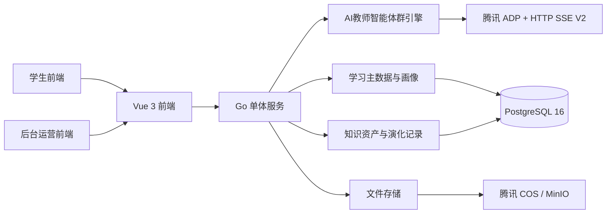
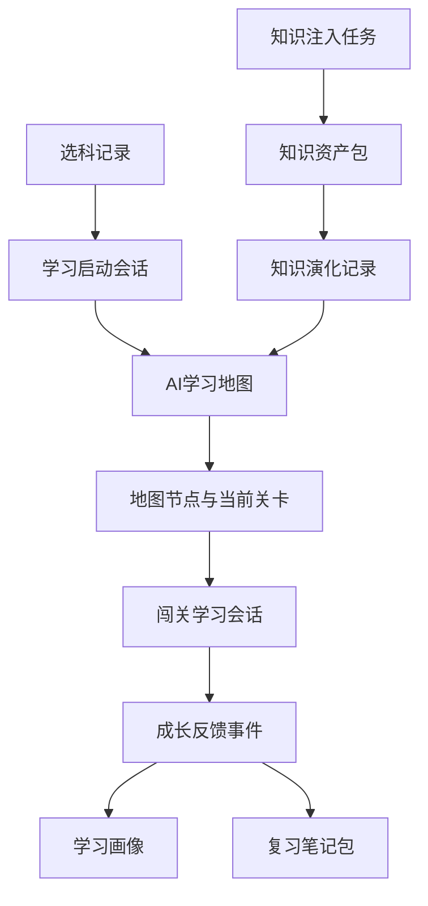

# AI主导学习生命周期的自进化自学智能体平台总体架构与技术选型

> 文档层级：作品主文档  
> 文档目的：定义比赛版整体架构、技术选型和单机部署方式  
> 核心结论：比赛版架构必须同时承接学生主线、后台演化、智能体群协同和知识库自进化，但仍保持单机可落地和易维护

## 1. 总体架构图

## 2. 分层说明

| 层级 | 组成 | 负责什么 |
| --- | --- | --- |
| 展示层 | 学生页 + 后台页 | 承接选科、地图、闯关、笔记、资料注入和自治分析 |
| 应用层 | Go 单体服务 | 管理会话、地图、画像、入库、演化和接口 |
| 智能体层 | AI教师智能体群引擎 | 诊断、重规划、讲解、评分、笔记生成、策略优化 |
| 数据层 | PostgreSQL 16 | 学习地图、节点状态、画像、日志、演化记录 |
| 资源层 | COS / MinIO | 文档、音频、图片、思维导图资源 |
| 接入层 | 腾讯 ADP + SSE | 承接多 Agent 工作流和流式教学输出 |

## 3. 前端技术选型

| 类别 | 选型 | 选择原因 |
| --- | --- | --- |
| 前端框架 | `Vue 3 + TypeScript + Vite` | 适合快速搭建强交互页面，便于 AI 协作维护 |
| 路由 | `Vue Router` | 承接学生页与后台页的清晰导航 |
| 状态管理 | `Pinia` | 适合地图状态、画像状态、会话状态和后台日志状态管理 |
| UI 组件 | `Naive UI` | 组件成熟，后台和数据展示能力稳定 |
| 样式 | `Tailwind CSS` | 能快速控制地图、卡片和状态样式 |
| 动效 | `VueUse Motion` | 用于地图推进、节点解锁和反馈过渡 |
| 图表 | `ECharts` | 适合成长曲线、画像变化、策略分析展示 |

## 4. 后端技术选型

| 类别 | 选型 | 选择原因 |
| --- | --- | --- |
| 语言 | `Go 1.24` | 单体服务性能稳定，适合流式输出和后台任务 |
| Web 框架 | `Gin` | 轻量清晰，便于 API 与 SSE 组织 |
| 数据访问 | `pgx + sqlc` | 查询稳定、类型清晰、便于 AI 维护 |
| 数据库 | `PostgreSQL 16` | 同时承接主数据、画像、演化记录和审计日志 |
| 文件存储 | `腾讯 COS` | 适合比赛版部署；本地可兼容 `MinIO` |

## 5. 智能体群职责承接

比赛版固定至少包含这些 Agent 能力：

| Agent | 职责 |
| --- | --- |
| `StarterAgent` | 根据选科和已有历史生成初始学习地图 |
| `DiagnosisAgent` | 执行短诊断并校准起点 |
| `MapPlannerAgent` | 在学习中持续重规划地图 |
| `TutorAgent` | 承接流式讲解、追问和示例生成 |
| `EvaluatorAgent` | 评分、判题、输出成长反馈 |
| `ProfileAgent` | 更新学习画像和风险信号 |
| `NoteSynthAgent` | 生成思维导图和结构化笔记 |
| `IngestionAgent` | 处理资料识别、结构化和入库 |
| `StrategyAgent` | 汇总日志并优化策略快照 |

## 6. 单机高可用口径

| 能力 | 方案 |
| --- | --- |
| 反向代理 | `Caddy / Nginx` |
| 进程守护 | `systemd` |
| 健康检查 | `/healthz` + 关键依赖自检 |
| 优雅重启 | Go HTTP 服务优雅关闭与重启 |
| 数据恢复 | PostgreSQL 定时备份与恢复脚本 |
| 降级输出 | ADP 或流式异常时回退到缓存结果或静态反馈 |

## 7. 为什么不这么做

| 方案 | 当前不选原因 |
| --- | --- |
| 微服务拆分 | 比赛版成本高、维护重，不利于 AI 快速迭代 |
| Redis / MQ 前置 | 当前单机版还不需要把复杂性提前 |
| 自动训练底层模型 | 叙事风险高，且不是比赛版核心成立条件 |
| 重游戏引擎方案 | 容易偏离教育产品质感和可解释性 |

## 8. 系统主数据流

