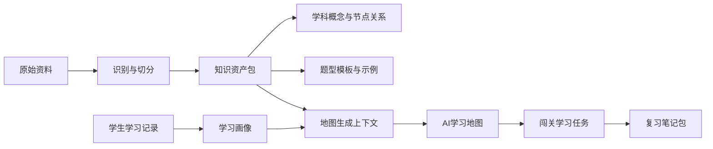

# AI主导学习生命周期的自进化自学智能体平台算法与知识库设计

> 文档层级：作品主文档  
> 文档目的：定义平台核心算法模块、知识资产结构和生成链路  
> 核心结论：算法服务于“生成地图、持续纠偏、保持兴趣、沉淀笔记、推动自进化”，而不是孤立地做题或做检索

## 1. 设计目标

- 让学生一开始就有地图，而不是面对空白聊天框
- 让地图在学习中持续演化，而不是只在开局排一次课
- 让系统在卡点出现时马上补桥，而不是把学生扔回全书
- 让每轮学习都沉淀为可复习资产
- 让新资料进入后真的能影响后续学习策略

## 2. 核心算法模块

| 模块 | 输入 | 输出 | 作用 |
| --- | --- | --- | --- |
| AI学习地图生成 | 学科目录、知识资产、历史画像 | `AI学习地图` | 生成初始主线和阶段结构 |
| 短诊断校准 | 初始地图、诊断题、学生回答 | `重规划事件` | 校准学生起点和第一版顺序 |
| 地图重规划策略 | 画像、作答、卡点信号、遗忘信号 | 新节点与回接条件 | 学习中持续调整地图 |
| 兴趣保持与正反馈策略 | 通关结果、停滞时长、情绪/节奏信号 | `成长反馈事件` | 保持学生兴趣和推进感 |
| 学习画像更新 | 作答记录、地图推进、复习结果 | `学习画像` | 持续描述当前状态和风险 |
| 笔记汇总策略 | 讲解结果、错题、关键点 | `复习笔记包`、思维导图 | 形成复习资产 |
| 资料识别与入库 | 文档、图片、音频、题单 | `知识资产包` | 让新资料进入知识库 |
| 跨科调度策略 | 多科地图、全局画像、复习任务 | 今日学习队列 | 让多科并行不混乱 |

## 3. 知识库来源

| 来源 | 用途 |
| --- | --- |
| 教材与课程目录 | 构建学科主线和阶段结构 |
| 讲义 / PPT / 录音 / 图像资料 | 进入知识注入与自动入库流程 |
| 题库与典型题 | 生成关卡题、挑战题和阶段 Boss |
| 学生错题与复习结果 | 更新画像、驱动补桥和复习 |
| AI 生成笔记与思维导图 | 作为个人长期复习资产回流 |

## 4. 知识资产结构

## 5. 主对象

| 对象 | 说明 |
| --- | --- |
| `AI学习地图` | 某门课在当前学生视角下的动态学习地图 |
| `地图节点` | 主线、补桥、复习、挑战、Boss、奖励等节点 |
| `重规划事件` | 记录地图被调整的原因、动作和回主线条件 |
| `闯关学习任务` | 当前关卡的目标、通过条件和反馈槽位 |
| `学习画像` | 当前掌握度、薄弱基础、错误模式、节奏偏好、风险信号 |
| `成长反馈事件` | 本次通关、能力变化、地图推进、新解锁区域 |
| `复习笔记包` | 思维导图、结构化笔记、错题回顾和复习计划 |
| `知识资产包` | 资料入库后的结构化知识资产 |

## 6. 关键算法说明

### 6.1 AI学习地图生成

- 先按学科目录给出默认主线
- 再根据已有知识资产补充节点内容和关联关系
- 若存在历史画像，则调整起点、节奏和优先级
- 输出学生第一次能看懂、能进入的地图

### 6.2 短诊断校准

- 用少量题目快速识别基础层级
- 判断是否需要补桥或可直接跳过入门节点
- 重排第一版主线顺序
- 固定输出“为什么这样调整”

### 6.3 地图重规划策略

触发条件固定包括：

- 连续错误
- 明显基础缺口
- 长时间卡住
- 重复追问同类问题
- 遗忘回落
- 兴趣下降信号

可执行动作固定包括：

- 插入补桥节点
- 打开支线小关卡
- 降低当前任务难度
- 提前触发复习节点
- 跳过已掌握节点
- 解锁新区域
- 接回主线

### 6.4 兴趣保持与正反馈策略

平台的反馈重点不是积分，而是成长感。

每次节点完成至少返回：

- 是否通关
- 哪项能力提升了
- 地图推进到了哪
- 解锁了什么
- 下一目标是什么

### 6.5 学习画像更新

学习画像固定在两个时机更新：

1. 学习过程中，每次关键作答后增量更新
2. 一轮学习结束后做阶段性归并更新

画像至少覆盖：

- 当前掌握度
- 薄弱基础
- 常见错误模式
- 学习节奏偏好
- 专注 / 挫败风险
- 已通关区域
- 待复习区域

### 6.6 笔记汇总策略

生成时机固定为：

- 单关结束
- 一轮学习结束
- 阶段结束

产物固定为：

- 思维导图
- 结构化笔记
- 错题回顾
- 复习计划

### 6.7 跨科调度策略

- 每门科目维护各自地图和画像
- 平台维护全局优先级和今日学习队列
- 高风险复习优先于低风险新内容
- 同一时段只推进一个当前主关卡，避免分心

