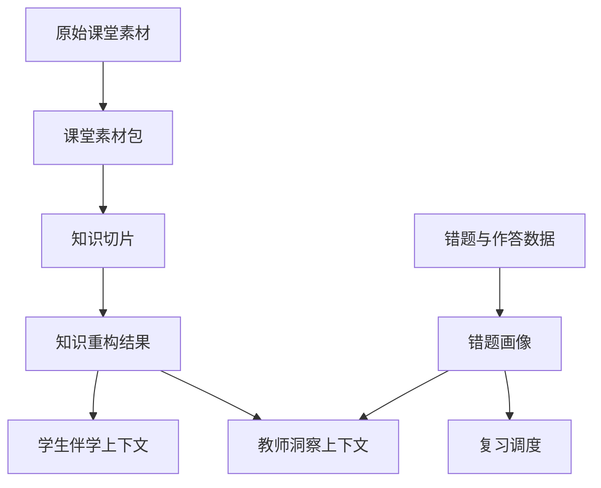

# 知脉课堂算法与知识库设计

> 文档层级：作品技术设计文档  
> 文档目的：定义作品核心算法模块、知识库来源、对象设计与生成链路  
> 核心结论：算法设计服务于“课堂重构 + 伴学 + 复练 + 洞察”四类结果输出，不为炫技而复杂化

## 1. 设计目标

- 让课堂素材能快速转成结构化知识
- 让学生提问始终有课堂上下文
- 让错题能够形成长期追踪资产
- 让教师看到群体级别的风险模式

## 2. 六个核心算法模块

| 模块 | 输入 | 输出 | 作用 |
| --- | --- | --- | --- |
| 多模态课堂知识重构 | 录音、PPT、讲义、板书图片 | `知识重构结果` | 把碎片素材转成结构化课堂内容 |
| 知识点先修图谱与任务路径规划 | 课程目录、知识点关系、学生当前状态 | `任务卡` | 决定先讲什么、回补什么 |
| 掌握度/风险评分模型 | 作答结果、停留时长、追问情况 | `掌握度快照` | 决定推进、回补或风险预警 |
| 错题归因与变式生成 | 错题内容、错因标签、课堂知识点 | `错题画像`、变式题 | 形成二次训练 |
| 间隔复习调度 | 掌握度历史、复练结果、时间窗 | 复习计划 | 控制复习节奏 |
| 教师侧群体风险聚合 | 多学生掌握度与错题数据 | `教师洞察摘要` | 形成班级趋势与补讲建议 |

## 3. 知识库来源

| 数据源 | 用途 |
| --- | --- |
| 课程教材 | 提供权威概念表述与章节结构 |
| 课堂讲义 / PPT | 提供课堂重构的直接内容来源 |
| 课堂录音 | 用于抽取老师讲解重点和例题说明 |
| 板书照片 | 补足推导过程、公式变形和关键图示 |
| 题库与作业 | 用于变式训练与掌握度评估 |
| 错题记录 | 用于错因归因与教师洞察 |

## 4. 知识库结构

## 5. 统一公共对象

| 对象 | 说明 |
| --- | --- |
| `课堂素材包` | 一次课堂对应的音频、文档、图片和元数据集合 |
| `知识重构结果` | 课堂重点、难点、关系图、示例与复盘建议 |
| `学习会话` | 学生一次连续伴学交互的上下文容器 |
| `任务卡` | 当前学习目标、达标标准与回补条件 |
| `掌握度快照` | 某次作答后的掌握判断与风险等级 |
| `错题画像` | 错因标签、相关知识点、再练建议、复习状态 |
| `教师洞察摘要` | 班级趋势、风险学生、高频错因、补讲建议 |
| `访问凭证` | 演示账号、角色、访问来源与接口接入信息 |

## 6. 模块细化说明

### 6.1 多模态课堂知识重构

- 音频做语音转写与段落摘要
- PPT / 讲义做版面解析与知识点抽取
- 板书图像做 OCR 与公式区域识别
- 统一生成“重点、难点、关系、例题、复习建议”

### 6.2 知识点先修图谱与任务路径规划

- 以章节结构为主骨架
- 以高频依赖关系为补充边
- 根据学生掌握度决定推进或回补
- 输出任务优先级而不是静态学习清单

### 6.3 掌握度/风险评分模型

推荐采用分层评分：

- 正确率
- 步骤完整度
- 解释能力
- 重复错误频率
- 复习后回退程度

最终输出：

- `掌握度等级`
- `风险等级`
- `推荐动作`

### 6.4 错题归因与变式生成

错因标签至少覆盖：

- 概念混淆
- 公式误用
- 推导跳步
- 图像理解偏差
- 计算粗错

### 6.5 间隔复习调度

默认策略：

- 低掌握度：当天或次日复练
- 中掌握度：2 到 3 天后复练
- 高掌握度：1 周后抽测

### 6.6 教师侧群体风险聚合

聚合维度：

- 章节
- 班级
- 错因标签
- 风险等级
- 时间趋势

## 7. 与智能体工作流的关系

- 算法模块不单独暴露给评委，而是嵌入“知识重构、伴学、复练、洞察”结果中
- 工作流层负责调用顺序，算法层负责输出质量
- 教师洞察属于旁路增强，不阻塞学生主链

## 8. 第一门示范学科

高等数学作为第一门完整示范学科，优先承接：

- 函数与极限
- 导数与微分
- 导数应用
- 积分相关模块

这些模块既有明显的先修关系，也适合展示图像理解、步骤推导和错题变式。

## 下一篇建议阅读

1. [06-接口与API说明.md](./06-接口与API说明.md)
2. [07-测试验证与预期效果.md](./07-测试验证与预期效果.md)
3. [11-开发技术文档.md](./11-开发技术文档.md)
