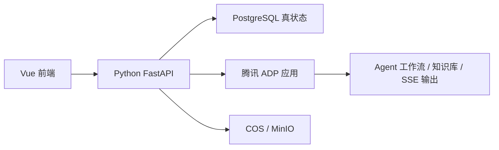

# AI主导学习生命周期的自进化自学智能体平台接口与 API 说明

> 文档层级：作品主文档  
> 文档目的：定义前端、Python 后端、腾讯 ADP 智能体群、PostgreSQL 真状态和后台页面之间的接口契约  
> 当前状态：本文件是比赛版接口设计基线，不代表当前展示站已经实现全部 API；后续 FastAPI 服务应按这里的对象、路径、状态和错误口径落地  
> 核心结论：接口围绕“选科开学、地图生成、短诊断、闯关推进、画像更新、笔记沉淀、知识治理、系统自治”组织，不把资料入库写成黑盒动作，也不让前端直接持有 ADP 密钥  
> 谁该看这页：前端开发、后端开发、ADP 配置同学、测试同学、答辩主讲人  
> 建议阅读顺序：先看“接口分层”，再看“核心对象”，最后看“主链路接口”和“ADP 接入字段”

## 1. 接口分层



| 层 | 接口职责 | 不做什么 |
| --- | --- | --- |
| 前端 -> Python | 页面数据、用户动作、状态查询、流式展示 | 不直接调用 ADP 密钥 |
| Python -> PostgreSQL | 保存学习地图、画像、笔记、知识版本、审计 | 不把模型上下文当数据库 |
| Python -> ADP | 调用 Agent 工作流、知识检索、流式讲解 | 不让 ADP 保存最终业务真状态 |
| Python -> 文件存储 | 上传资料、导图、导出文件 | 不把大文件塞进数据库正文 |

## 2. 接口原则

- 前端只消费结构化对象，不直接拼装复杂业务状态。
- 流式讲解统一由后端代理，前端不暴露 ADP `AppKey`。
- 地图重规划必须有显式事件对象，不允许只返回一段文字解释。
- 知识治理必须能看到补丁、校验、发布、回滚四类状态。
- 学生主线与后台主线共用一套主数据，但读取视角不同。
- 所有影响学生学习路线的动作都要能审计。

## 3. 基础约定

| 项目 | 约定 |
| --- | --- |
| 基础协议 | `HTTPS + JSON` |
| 流式协议 | 后端对前端使用 `SSE`，后端对 ADP 使用 `HTTP SSE V2` |
| 鉴权方式 | 后端会话 / 后台 Token / 评委访问凭证 |
| 时间格式 | `ISO-8601` |
| 分页参数 | `page`、`pageSize` |
| 排序参数 | `sortBy`、`sortOrder` |
| 幂等键 | `Idempotency-Key` 请求头 |
| 跟踪编号 | `X-Trace-Id` 请求头 |
| 知识通道 | `publishChannel=main/candidate` |

## 4. 通用响应格式

### 4.1 成功响应

```json
{
  "success": true,
  "traceId": "trace_20260411_001",
  "data": {},
  "message": "ok"
}
```

### 4.2 失败响应

```json
{
  "success": false,
  "traceId": "trace_20260411_001",
  "error": {
    "code": "MAP_REROUTE_FAILED",
    "message": "地图重规划失败，已回退到上一版稳定地图",
    "recoverable": true,
    "suggestion": "请稍后重试，或使用当前推荐节点继续学习"
  }
}
```

### 4.3 错误码分组

| 错误码前缀 | 含义 | 示例 |
| --- | --- | --- |
| `AUTH_` | 登录、权限、凭证问题 | `AUTH_SESSION_EXPIRED` |
| `STARTUP_` | 选科与启动会话问题 | `STARTUP_SUBJECT_NOT_FOUND` |
| `MAP_` | 地图生成与重规划问题 | `MAP_REROUTE_FAILED` |
| `LEARNING_` | 闯关学习问题 | `LEARNING_STREAM_TIMEOUT` |
| `PROFILE_` | 画像更新问题 | `PROFILE_UPDATE_FAILED` |
| `NOTE_` | 笔记与导图问题 | `NOTE_GENERATION_PENDING` |
| `KNOWLEDGE_` | 知识治理问题 | `KNOWLEDGE_CONFLICT_BLOCKED` |
| `ADP_` | 腾讯 ADP 接入问题 | `ADP_SESSION_UNAVAILABLE` |
| `OPS_` | 后台自治与审计问题 | `OPS_AUDIT_LOG_UNAVAILABLE` |

## 5. 核心对象

| 对象 | 核心字段 | 说明 |
| --- | --- | --- |
| `SubjectSelection` | `selectionId`、`studentId`、`subjects[]`、`priorityMode` | 科目选择记录 |
| `LearningSession` | `sessionId`、`studentId`、`selectedSubjects[]`、`activeSubjectId`、`status` | 学习启动会话 |
| `LearningMap` | `mapId`、`subjectId`、`stages[]`、`currentNodeId`、`recommendedNextNodeId` | AI 学习地图 |
| `MapNode` | `nodeId`、`nodeType`、`title`、`status`、`returnToNodeId` | 地图节点 |
| `DiagnosticResult` | `diagnosticId`、`subjectId`、`score`、`weakFoundations[]`、`decision` | 短诊断结果 |
| `RerouteEvent` | `eventId`、`triggerType`、`triggerEvidence`、`actions[]`、`returnCondition` | 重规划事件 |
| `LearningTask` | `taskId`、`nodeId`、`goal`、`passCriteria`、`difficulty` | 闯关学习任务 |
| `CheckpointAttempt` | `attemptId`、`taskId`、`answer`、`score`、`passed`、`errorPattern` | 作答记录 |
| `LearnerProfileSnapshot` | `profileId`、`mastery`、`weakFoundations[]`、`errorPatterns[]`、`frustrationRisk` | 学习画像 |
| `FeedbackEvent` | `feedbackId`、`passed`、`masteryDelta`、`abilityDelta[]`、`unlocks[]` | 成长反馈 |
| `NoteBundle` | `notePackId`、`mindMapUrl`、`structuredNotes[]`、`reviewPlan[]` | 复习笔记包 |
| `IngestionTask` | `taskId`、`sourceId`、`status`、`progress`、`error` | 资料入库任务 |
| `KnowledgePatch` | `patchId`、`sourceGrade`、`claims[]`、`affectedScopes[]` | 知识补丁 |
| `ValidationReport` | `reportId`、`confidenceScore`、`checks[]`、`decision` | 校验报告 |
| `KnowledgeRelease` | `releaseId`、`commitId`、`affectedScopes[]`、`releasedAt` | 知识发布 |
| `StrategySnapshot` | `snapshotId`、`summary`、`activePolicies[]`、`riskSignals[]` | 策略快照 |

## 6. 状态枚举

### 6.1 地图节点状态

| 状态 | 中文含义 |
| --- | --- |
| `locked` | 未解锁 |
| `available` | 可学习 |
| `current` | 当前推荐 |
| `in_progress` | 学习中 |
| `passed` | 已通过 |
| `bridge_required` | 需要补桥 |
| `review_due` | 待复习 |
| `skipped` | 已跳过 |

### 6.2 节点类型

| 类型 | 中文含义 |
| --- | --- |
| `main` | 主线关卡 |
| `bridge` | 补桥关卡 |
| `review` | 复习节点 |
| `challenge` | 挑战节点 |
| `boss` | 阶段 Boss |
| `reward` | 奖励节点 |

### 6.3 知识入库状态

| 状态 | 中文含义 |
| --- | --- |
| `uploaded` | 已上传 |
| `parsing` | 解析中 |
| `extracted` | 已抽取知识声明 |
| `validating` | 校验中 |
| `candidate` | 进入候选区 |
| `released` | 已发布到主教学区 |
| `archived` | 已归档 |
| `failed` | 失败 |

## 7. 主链路接口

### 7.1 查询可选科目

| 项目 | 内容 |
| --- | --- |
| 路径 | `/api/startup/subjects` |
| 方法 | `GET` |
| 用途 | 查询学生可选科目 |

响应示例：

```json
{
  "success": true,
  "data": {
    "subjects": [
      {
        "subjectId": "math",
        "name": "高等数学",
        "recommended": true,
        "reason": "比赛版默认演示主科目"
      }
    ]
  }
}
```

### 7.2 创建学习启动会话

| 项目 | 内容 |
| --- | --- |
| 路径 | `/api/startup/session` |
| 方法 | `POST` |
| 用途 | 选科后创建正式学习链路 |

请求示例：

```json
{
  "studentId": "demo_student_001",
  "selectedSubjects": ["math"],
  "priorityMode": "single_subject"
}
```

响应示例：

```json
{
  "success": true,
  "data": {
    "sessionId": "learn_sess_001",
    "activeSubjectId": "math",
    "status": "started",
    "nextAction": "generate_initial_map"
  }
}
```

### 7.3 生成初始学习地图

| 项目 | 内容 |
| --- | --- |
| 路径 | `/api/maps/{subjectId}/initial` |
| 方法 | `POST` |
| 用途 | 根据学科结构和画像生成第一版地图 |

请求示例：

```json
{
  "sessionId": "learn_sess_001",
  "studentId": "demo_student_001"
}
```

响应示例：

```json
{
  "success": true,
  "data": {
    "mapId": "map_math_001",
    "subjectId": "math",
    "currentNodeId": "node_pre_bridge_001",
    "recommendedNextNodeId": "node_diagnostic_001",
    "explain": "先从函数直觉和图像感开始，便于后续理解极限。",
    "stages": [
      {
        "stageId": "stage_00",
        "title": "预备补桥",
        "nodes": [
          {
            "nodeId": "node_pre_bridge_001",
            "nodeType": "main",
            "title": "函数直觉入门",
            "status": "current"
          }
        ]
      }
    ]
  }
}
```

### 7.4 提交短诊断并触发重排

| 项目 | 内容 |
| --- | --- |
| 路径 | `/api/diagnostics/{subjectId}/submit` |
| 方法 | `POST` |
| 用途 | 提交诊断答案，生成校准结果和地图重规划事件 |

请求示例：

```json
{
  "sessionId": "learn_sess_001",
  "answers": [
    {
      "questionId": "diag_limit_001",
      "answer": "函数值和极限值总是一样"
    }
  ]
}
```

响应示例：

```json
{
  "success": true,
  "data": {
    "diagnosticId": "diag_result_001",
    "decision": "insert_bridge",
    "weakFoundations": ["极限与函数值关系"],
    "rerouteEventId": "reroute_001",
    "studentMessage": "你对极限和函数值的区别还不稳，系统先插入一个补桥节点。"
  }
}
```

### 7.5 查询当前地图

| 项目 | 内容 |
| --- | --- |
| 路径 | `/api/maps/{subjectId}` |
| 方法 | `GET` |
| 用途 | 查询当前学生视角下的学习地图 |

查询参数：

| 参数 | 说明 |
| --- | --- |
| `studentId` | 学生编号 |
| `sessionId` | 学习会话 |

## 8. 闯关学习接口

### 8.1 查询当前关卡任务

| 项目 | 内容 |
| --- | --- |
| 路径 | `/api/learning/tasks/{taskId}` |
| 方法 | `GET` |
| 用途 | 获取当前关卡目标和通过条件 |

### 8.2 创建闯关学习会话

| 项目 | 内容 |
| --- | --- |
| 路径 | `/api/learning/sessions` |
| 方法 | `POST` |
| 用途 | 从地图节点进入一次 AI 闯关学习 |

请求示例：

```json
{
  "studentId": "demo_student_001",
  "mapId": "map_math_001",
  "nodeId": "node_limit_intro"
}
```

### 8.3 流式讲解

| 项目 | 内容 |
| --- | --- |
| 路径 | `/api/learning/sessions/{sessionId}/stream` |
| 方法 | `POST` |
| 用途 | 由后端代理 ADP，向前端输出 SSE |

SSE 事件示例：

```text
event: tutor_delta
data: {"text":"我们先看极限和函数值为什么不是一回事。"}

event: checkpoint_prompt
data: {"questionId":"q_001","prompt":"如果 x 趋近 0，函数值一定等于极限吗？"}

event: done
data: {"nextAction":"submit_answer"}
```

### 8.4 提交作答

| 项目 | 内容 |
| --- | --- |
| 路径 | `/api/learning/sessions/{sessionId}/answers` |
| 方法 | `POST` |
| 用途 | 提交学生答案，触发评分、反馈、画像更新和可能的重规划 |

请求示例：

```json
{
  "taskId": "task_limit_intro",
  "answer": "函数在这一点没有定义，但极限仍然可能存在。"
}
```

响应示例：

```json
{
  "success": true,
  "data": {
    "attemptId": "attempt_001",
    "score": 86,
    "passed": true,
    "feedbackId": "feedback_001",
    "profileChanged": true,
    "rerouteEventId": null,
    "nextAction": "return_to_map"
  }
}
```

## 9. 画像、反馈与笔记接口

| 路径 | 方法 | 说明 |
| --- | --- | --- |
| `/api/learning/sessions/{sessionId}/feedback` | `GET` | 查询本次成长反馈事件 |
| `/api/profiles/{studentId}` | `GET` | 查询当前学习画像 |
| `/api/profiles/{studentId}/history` | `GET` | 查询画像变化历史 |
| `/api/notes/{studentId}` | `GET` | 查询复习笔记包列表 |
| `/api/notes/{studentId}/{notePackId}` | `GET` | 查询某次笔记详情 |
| `/api/mindmaps/{studentId}/{notePackId}` | `GET` | 查询思维导图资源 |
| `/api/reviews/{studentId}/schedule` | `GET` | 查询复习计划 |

画像响应示例：

```json
{
  "success": true,
  "data": {
    "profileId": "profile_001",
    "studentId": "demo_student_001",
    "mastery": {
      "limit_basic": 0.72,
      "function_graph": 0.81
    },
    "weakFoundations": ["极限与函数值关系"],
    "errorPatterns": ["把函数值当成极限"],
    "frustrationRisk": "low",
    "updatedAt": "2026-04-11T10:00:00+08:00"
  }
}
```

## 10. 资料上传与知识治理接口

### 10.1 创建资料入库任务

| 项目 | 内容 |
| --- | --- |
| 路径 | `/api/ingestion/upload` |
| 方法 | `POST` |
| 类型 | `multipart/form-data` |
| 用途 | 上传资料并创建入库任务 |

表单字段：

| 字段 | 中文含义 |
| --- | --- |
| `file` | 原始资料文件 |
| `subjectId` | 所属学科 |
| `sourceType` | 来源类型 |
| `sourceGrade` | 来源等级 |

### 10.2 查询入库任务

| 路径 | 方法 | 说明 |
| --- | --- | --- |
| `/api/ingestion/tasks/{taskId}` | `GET` | 查询解析进度、OCR 状态和切分状态 |
| `/api/ingestion/tasks/{taskId}/evidence` | `GET` | 查询证据包与来源摘要 |

响应示例：

```json
{
  "success": true,
  "data": {
    "taskId": "ingest_001",
    "status": "candidate",
    "progress": 85,
    "patchId": "patch_001",
    "validationReportId": "valid_001"
  }
}
```

### 10.3 知识补丁、校验、发布与回滚

| 路径 | 方法 | 说明 |
| --- | --- | --- |
| `/api/knowledge/patches/{patchId}` | `GET` | 查询知识补丁详情 |
| `/api/knowledge/candidates` | `GET` | 查询候选知识列表 |
| `/api/knowledge/conflicts/{conflictId}` | `GET` | 查询冲突记录 |
| `/api/knowledge/validation/{reportId}` | `GET` | 查询校验报告 |
| `/api/knowledge/releases` | `POST` | 发布候选提交到主教学区 |
| `/api/knowledge/releases/{releaseId}` | `GET` | 查询发布结果与影响域 |
| `/api/knowledge/rollbacks` | `POST` | 回滚某次知识发布 |
| `/api/knowledge/impact/{commitId}` | `GET` | 查询受影响章节、节点和学员范围 |

发布请求示例：

```json
{
  "candidateId": "candidate_001",
  "operatorId": "admin_demo",
  "reason": "高数极限章节讲义补充材料通过校验"
}
```

## 11. 系统自治与后台接口

| 路径 | 方法 | 说明 |
| --- | --- | --- |
| `/api/ops/agents/status` | `GET` | 查询 Agent 协同状态 |
| `/api/ops/strategies/latest` | `GET` | 查询最新策略快照 |
| `/api/ops/reroutes/logs` | `GET` | 查询重规划日志 |
| `/api/ops/audit-events` | `GET` | 查询审计事件 |
| `/api/ops/healthz` | `GET` | 查询系统健康状态 |

健康检查响应示例：

```json
{
  "success": true,
  "data": {
    "api": "ok",
    "database": "ok",
    "adp": "degraded",
    "storage": "ok",
    "message": "ADP 当前响应较慢，已启用缓存讲解降级"
  }
}
```

## 12. 腾讯 ADP 接入字段口径

| 中文字段 | 腾讯字段 | 用途 | 后端处理 |
| --- | --- | --- | --- |
| 学生标识 | `VisitorId` | 锁定长期画像摘要与用户隔离 | 由后端映射，不直接暴露真实学生隐私 |
| 学习会话 | `ConversationId` | 锁定本轮学习流 | 与 `LearningSession` 建立映射 |
| 应用密钥 | `AppKey` | 调用已发布应用 | 只存在后端环境变量 |
| 上下文载荷 | `Contents` | 传入任务、提问和局部上下文 | 后端裁剪后传入 |
| 长期摘要记忆 | `SYS.Memory` | 承载偏好、薄弱点、错误模式 | 不承载地图真状态 |
| 动态业务变量 | `custom_variables` | 传入课程、节点、风险、知识范围 | 只传当前任务必要字段 |

### 12.1 传给 ADP 的最小上下文

| 字段 | 说明 |
| --- | --- |
| `currentTask` | 当前关卡目标和通过条件 |
| `currentNode` | 当前地图节点 |
| `profileSummary` | 学习画像摘要 |
| `retrievedKnowledge` | 当前命中的知识片段 |
| `recentTurns` | 最近必要交互 |
| `safetyInstruction` | 不泄露答案、不跳过教学过程等约束 |

不传：

- 全量学习地图
- 全量错题本
- 全量历史对话
- 数据库连接信息
- ADP 密钥和平台 Token

## 13. 前端页面到接口映射

| 页面 | 首屏接口 | 交互接口 |
| --- | --- | --- |
| 选科与开学页 | `/api/startup/subjects`、`/api/startup/resume` | `/api/startup/session` |
| AI学习地图页 | `/api/maps/{subjectId}` | `/api/maps/{subjectId}/events`、`/api/maps/{subjectId}/recommendation` |
| AI闯关学习页 | `/api/learning/tasks/{taskId}` | `/api/learning/sessions`、`/api/learning/sessions/{sessionId}/stream`、`/api/learning/sessions/{sessionId}/answers` |
| 笔记复习与成长页 | `/api/notes/{studentId}`、`/api/profiles/{studentId}` | `/api/reviews/{studentId}/schedule` |
| 资料注入后台 | `/api/ingestion/tasks`、`/api/knowledge/candidates` | `/api/ingestion/upload`、`/api/knowledge/releases` |
| 系统自治后台 | `/api/ops/agents/status`、`/api/ops/strategies/latest` | `/api/ops/reroutes/logs`、`/api/ops/audit-events` |

## 14. 权限边界

| 角色 | 可访问能力 |
| --- | --- |
| 学生 | 选科、地图、闯关、笔记、自己的画像 |
| 平台管理者 | 资料入库、候选知识、发布、回滚、策略日志 |
| 评委账号 | 只读演示数据和评测路径 |
| 开发者 | 本地调试、模拟接口、健康检查 |

权限原则：

- 学生不能发布知识。
- 前端不能拿 ADP 密钥。
- 评委账号不能修改主知识库。
- 后台操作必须写审计日志。

## 15. 验收口径

| 验收项 | 必须通过什么 |
| --- | --- |
| 选科开学 | 能创建 `LearningSession` |
| 地图生成 | 能返回 `LearningMap`、`MapNode` |
| 诊断校准 | 能生成 `DiagnosticResult` 和 `RerouteEvent` |
| 闯关学习 | 能创建会话、流式输出、提交作答 |
| 作答反馈 | 能返回 `CheckpointAttempt` 和 `FeedbackEvent` |
| 画像更新 | 能查询 `LearnerProfileSnapshot` |
| 笔记沉淀 | 能查询 `NoteBundle` 和导图资源 |
| 资料入库 | 能查询 `IngestionTask`、`KnowledgePatch` |
| 知识发布 | 能查询 `ValidationReport`、`KnowledgeRelease`、`KnowledgeRollback` |
| 系统自治 | 能查询 Agent 状态、策略快照和审计日志 |

## 16. 答辩讲法

如果评委问“你们怎么保证 AI 不是现场乱编”，推荐这样回答：

```text
我们把 AI 输出和业务真状态分开。

ADP 负责讲解、检索、评分建议和智能体协作；
Python 后端负责接口、门禁、状态落库和回滚；
PostgreSQL 保存学习地图、画像、笔记、知识发布和审计记录。

所以每次地图变化、补桥、知识发布，都不是只停留在一段模型回复里，而是有对象、有事件、有版本、有影响范围。
```

