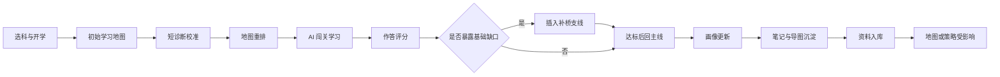

# AI主导学习生命周期的自进化自学智能体平台测试验证与预期效果

> 文档层级：作品主文档  
> 文档目的：定义比赛版验证口径、测试矩阵、现场降级、预期效果和证据要求  
> 当前状态：验证框架已按比赛版主闭环收口，真实账号、真实站点和 ADP 发布状态待最终部署后填入评测手册  
> 核心结论：验收重点不是“页面能不能打开”，而是学生是否真的被带进一张会诊断、会补桥、会沉淀、会受新资料影响的学习地图  
> 谁该看这页：测试同学、答辩主讲人、前端开发、后端开发、ADP 配置同学、项目接手人  
> 建议阅读顺序：先看“测试总原则”，再跑“最小验收链路”，最后对照“专项测试”和“预期效果”

## 1. 测试总原则

这套作品的测试不能只停留在按钮点击和页面跳转。  
它要证明一件事：

`AI 确实在组织学习过程，而不是只在页面里回答问题。`

### 1.1 三层测试结论

| 结论层级 | 人话解释 | 通过标准 |
| --- | --- | --- |
| `页面可用` | 页面能打开，按钮能点 | 只能说明前端没有明显断 |
| `链路可走` | 学生能从选科走到学习、反馈、笔记 | 说明 MVP 主线基本成立 |
| `智能体有效` | 地图会因诊断、作答、资料变化而调整 | 说明作品核心竞争力成立 |

最终验收必须达到第三层，不能只报“页面可用”。

### 1.2 不能算通过的情况

- 只展示静态地图，但诊断和作答不会影响它。
- 只展示聊天流，但没有关卡目标、通过条件和地图推进。
- 只上传资料，但没有知识资产包、演化记录或影响范围。
- 只在口播里说“会补桥”，屏幕上没有补桥节点和回主线条件。
- 只说“用到了 ADP”，但没有说明 ADP 负责什么、Python 和 PostgreSQL 负责什么。

## 2. 最小验收链路

比赛版唯一主验收链固定为：

`选高数 -> 开始学习 -> 初始地图 -> 短诊断 -> 地图重排 -> AI闯关 -> 作答评分 -> 触发补桥 -> 回主线 -> 画像更新 -> 生成思维导图/笔记 -> 新资料入库 -> 地图或策略受影响`

### 2.1 验收流程图



### 2.2 最小验收表

| 编号 | 步骤 | 操作 | 通过标准 | 证据 |
| --- | --- | --- | --- | --- |
| `E2E-01` | 选科开学 | 选择 `高等数学` 并点击开始学习 | 创建学习启动会话，进入地图页 | 页面录屏、会话对象 |
| `E2E-02` | 初始地图 | 查看当前学习地图 | 有阶段、节点、当前任务和下一步 | 地图截图、`LearningMap` |
| `E2E-03` | 短诊断 | 完成 3 到 5 道题 | 输出诊断结果 | 诊断结果截图 |
| `E2E-04` | 地图重排 | 对比诊断前后地图 | 地图顺序、节点状态或推荐任务变化 | 重规划事件 |
| `E2E-05` | 闯关学习 | 进入当前关卡并提交作答 | 有讲解、作答、评分、反馈 | 关卡录屏、`CheckpointAttempt` |
| `E2E-06` | 补桥触发 | 提交预设薄弱答案 | 出现补桥支线和原因说明 | 补桥节点、`RerouteEvent` |
| `E2E-07` | 回主线 | 完成补桥或使用样例补桥结果 | 回到主线节点，看到下一步 | 地图变化截图 |
| `E2E-08` | 成长沉淀 | 打开笔记复习与成长页 | 有笔记、导图、画像变化中的至少两类 | `NoteBundle`、画像快照 |
| `E2E-09` | 资料入库 | 上传高数资料包或打开已完成样例 | 有识别状态、知识资产包和演化记录 | `KnowledgeAssetBundle` |
| `E2E-10` | 影响验证 | 回到地图或策略页 | 能看到资料影响范围或策略变化 | 影响域记录、策略快照 |

## 3. 角色化测试矩阵

| 角色 | 主要测试目标 | 重点页面 | 必测问题 |
| --- | --- | --- | --- |
| 学生 | 是否能被 AI 带进学习并持续推进 | 选科、地图、闯关、笔记成长 | 我现在在哪、下一步去哪、为什么这样学 |
| 平台管理者 | 新资料是否能进入知识治理流程 | 资料注入、知识演化、系统自治 | 新资料有没有状态、版本、影响和回滚边界 |
| 评委 | 作品差异点是否清楚 | 全部核心页 | 它是不是比普通 AI 问答更系统 |
| 前端开发 | 页面状态是否完整 | 六个核心页面 | 加载、空、错、权限、降级是否可见 |
| 后端开发 | 真状态是否落库 | API、数据库、后台证据 | 地图、画像、笔记、知识版本是否有对象承接 |
| ADP 配置同学 | 智能体工作流是否对齐产品闭环 | ADP 应用、Agent、知识库 | Agent 是否按职责编排，流式和检索是否稳定 |
| 测试同学 | 现场演示是否可控 | 评测手册、视频脚本 | 是否有固定数据、固定答案和备用素材 |

## 4. 比赛要求覆盖矩阵

| 比赛要求 | 对应文档 / 页面 | 验收方式 | 证据 |
| --- | --- | --- | --- |
| 应用场景与目标用户 | `01`、`02` | 检查学生自学主线是否清晰 | PRD、用户流程、演示录屏 |
| 功能设计与整体架构 | `01`、`03`、`04` | 检查页面、模块和数据是否闭环 | 页面地图、架构图 |
| 关键技术路线与算法 | `04`、`05` | 检查地图生成、重规划、画像、笔记、入库策略 | 算法规则表、对象状态 |
| API 与接口集成 | `06` | 检查对象和接口分组是否完整 | 接口清单、模拟响应 |
| 数据来源与知识库建设 | `05`、后台页 | 检查资料注入、资产包和演化记录 | 资料包、演化记录 |
| 前端展示与演示完整度 | `03`、`08`、`09`、`10` | 检查首页和核心链路是否可演示 | 视频脚本、评测手册 |
| 工程可接手性 | `04`、`11` | 检查 ADP、Python、PostgreSQL 边界 | 开发技术文档 |

## 5. 六个核心页面验收

| 页面 | 必测状态 | 通过标准 | 常见失败 |
| --- | --- | --- | --- |
| 选科与开学页 | 未选科、已选单科、已选多科、可续学 | 1 次点击进入 AI 学习地图 | 入口像营销页，学生不知道怎么开始 |
| AI学习地图页 | 初始地图、诊断后重排、补桥中、阶段解锁 | 当前节点、下一步和原因都清楚 | 地图只是静态装饰 |
| AI闯关学习页 | 讲解中、等待作答、评分完成、通过、补桥 | 能完成讲解、作答、反馈和推进 | 做成无限聊天框 |
| 笔记复习与成长页 | 单关总结、阶段总结、待复习、画像变化 | 至少有导图或笔记，并能看到成长变化 | 学完没有可回看资产 |
| 资料注入与知识库演化后台 | 待上传、识别中、候选中、入库完成、影响生效 | 新资料有资产包、版本和影响范围 | 只有“上传成功” |
| 系统自治与策略分析后台 | 正常运行、策略更新、告警、回滚 | 有 Agent 状态、策略快照、日志和异常记录 | 后台只是空日志列表 |

## 6. 专项测试

### 6.1 地图实时演化专项

| 测试点 | 操作 | 通过标准 |
| --- | --- | --- |
| 初始地图生成 | 开始学习后进入地图 | 地图包含阶段、主线、当前节点和推荐下一步 |
| 诊断影响路线 | 完成短诊断 | 至少一个节点顺序、状态或推荐任务变化 |
| 学习中重规划 | 在关卡中提交薄弱答案 | 出现补桥、复习或降难建议 |
| 回主线条件 | 完成补桥 | 能看到回主线条件被满足 |
| 解释可见 | 展开重规划说明 | 能看到触发原因、目标和影响范围 |

### 6.2 闯关学习专项

| 测试点 | 操作 | 通过标准 |
| --- | --- | --- |
| 关卡目标 | 打开当前关卡 | 页面显示目标、通过条件和当前知识点 |
| AI 讲解 | 启动讲解 | 讲解围绕当前关卡，不跑题 |
| 作答评分 | 提交正确和错误答案 | 评分结果稳定，错因解释清楚 |
| 正反馈 | 通过当前关卡 | 能看到成长、解锁或下一步 |
| 降级输出 | 模型超时或流式异常 | 有缓存讲解或备用反馈，不让页面死掉 |

### 6.3 画像与笔记专项

| 测试点 | 操作 | 通过标准 |
| --- | --- | --- |
| 画像更新 | 完成一次作答或关卡 | 掌握度、薄弱点或错误模式发生变化 |
| 单关笔记 | 完成当前关卡 | 生成摘要或结构化笔记 |
| 思维导图 | 完成一轮学习 | 有知识关系图或导图资源 |
| 复习计划 | 完成阶段学习 | 有下一轮复习建议 |
| 资产回看 | 刷新页面或重新登录 | 仍能看到历史笔记和画像摘要 |

### 6.4 资料入库与知识演化专项

| 测试点 | 操作 | 通过标准 |
| --- | --- | --- |
| 原始资料上传 | 上传高数讲义或题单 | 产生入库任务 |
| 解析状态 | 查看任务状态 | 有识别中、候选中、入库完成等状态 |
| 知识资产包 | 查看解析结果 | 能看到知识点、题目或声明 |
| 校验与冲突 | 查看校验报告 | 高风险或冲突不会直接进入主教学区 |
| 发布与影响 | 查看发布记录 | 能看到影响章节、节点或策略 |
| 回滚边界 | 触发或查看回滚记录 | 能说明错误知识如何退回 |

### 6.5 ADP 集成专项

| 测试点 | 操作 | 通过标准 |
| --- | --- | --- |
| 应用发布状态 | 打开 ADP 控制台 | 应用已发布或有明确待发布状态 |
| Agent 分工 | 查看工作流 | Starter、Diagnosis、Planner、Tutor、Evaluator 等职责清楚 |
| 知识库检索 | 发起学习任务 | 命中相关知识片段，不乱引用 |
| 流式输出 | 调用学习会话 | 输出可流式展示，前端可消费 |
| 安全边界 | 检查文档和脚本 | 不泄露账号、密钥、Token |

涉及 ADP 控制台时，必须由人工先登录。  
AI 或测试同学只在登录态下做配置核查和录屏，不绕过验证码或二次验证。

## 7. API 与数据证据验证

| 演示能力 | 核心接口 | 核心对象 | 必须能证明什么 |
| --- | --- | --- | --- |
| 选科开学 | `/startup/session` | `LearningSession` | 学习链路有明确开始 |
| 地图生成 | `/maps/{subjectId}/initial` | `LearningMap` | 地图不是前端假图 |
| 短诊断 | `/diagnostics/{subjectId}/submit` | 诊断结果、重规划事件 | 诊断能影响后续路线 |
| 闯关学习 | `/learning/sessions/{sessionId}/stream` | `CheckpointAttempt` | AI 讲解和作答有上下文 |
| 评分反馈 | `/learning/sessions/{sessionId}/feedback` | `FeedbackEvent` | 反馈能推动成长和地图 |
| 画像更新 | `/profiles/{studentId}` | `LearnerProfileSnapshot` | 学习状态被系统记住 |
| 笔记沉淀 | `/notes/{studentId}` | `NoteBundle` | 学完有复习资产 |
| 资料入库 | `/ingestion/upload` | `KnowledgeAssetBundle` | 新资料能变成知识资产 |
| 发布回滚 | `/knowledge/releases`、`/knowledge/rollbacks` | `KnowledgeRelease`、`KnowledgeRollback` | 知识治理有边界 |

## 8. 自动化与人工验证分工

| 类型 | 适合自动化吗 | 说明 |
| --- | --- | --- |
| 前端构建 | 是 | `npm run build` 必须通过 |
| 文档站构建 | 是 | 当前项目用同一构建链输出文档展示站 |
| 链接与路由 | 是 | 可以用浏览器 smoke 检查主入口 |
| 接口对象结构 | 是 | 可以用契约测试或模拟响应检查 |
| ADP 控制台配置 | 半自动 | 需要人工先登录，之后可由 AI 接浏览器核查 |
| 教育价值判断 | 人工为主 | 要看评委是否能听懂和看懂 |
| 视频节奏 | 人工为主 | 需要结合口播、剪辑和画面停留判断 |

### 8.1 当前本地自动验证命令

```powershell
npm run build
```

通过含义：

- TypeScript 编译通过
- Vite 生产构建通过
- 文档展示站生成脚本通过

不代表：

- ADP 已真实发布
- 后端 API 已真实联调
- 演示账号已准备
- 现场网络一定稳定

## 9. 现场降级验证

| 风险 | 降级方案 | 赛前必须准备 |
| --- | --- | --- |
| 模型响应慢 | 使用缓存讲解片段 | 缓存讲解截图或录屏 |
| 地图重排失败 | 使用同一诊断结果下的备用地图 | 诊断前后对比截图 |
| 补桥不触发 | 使用预设薄弱答案 | 一条能稳定触发补桥的答案 |
| 笔记生成慢 | 使用已生成样例笔记 | 结构化笔记和导图样例 |
| 资料解析耗时 | 展示已完成演化记录 | 资料包、资产包、演化记录截图 |
| ADP 会话失效 | 暂停控制台操作，切本地展示站 | 本地展示站和关键截图 |
| 网络不稳定 | 播放备用视频 | `60-90s` 备用视频 |

## 10. 预期效果

### 10.1 对学生的效果

| 目标 | 预期效果 | 可观察证据 |
| --- | --- | --- |
| 降低启动门槛 | 不再先写长问题，直接进入学习路线 | 选科后进入地图 |
| 保持学习方向 | 始终知道当前任务和下一步 | 地图当前节点和推荐任务 |
| 接住卡点 | 基础缺口出现时能补桥 | 补桥支线和原因说明 |
| 留下复习资产 | 学完后有导图、笔记、复习计划 | 笔记成长页 |
| 建立成长感 | 每次通关都有正反馈 | 画像变化、节点解锁 |

### 10.2 对平台管理者的效果

| 目标 | 预期效果 | 可观察证据 |
| --- | --- | --- |
| 降低资料接入成本 | 新资料能进入识别、切分、入库流程 | 入库任务状态 |
| 提高知识可信度 | 冲突和低质量资料不会直接污染主线 | 校验报告、候选区 |
| 保留演化轨迹 | 每次知识变化可追踪 | 演化记录、发布记录 |
| 支持回滚 | 错误知识可退回 | 回滚记录 |
| 提高平台可解释性 | Agent 行为、策略变化可回看 | 策略快照、审计日志 |

### 10.3 对评委的效果

| 评委问题 | 作品应该给出的答案 |
| --- | --- |
| 这是不是普通聊天机器人 | 不是，核心是地图、关卡、补桥和成长沉淀 |
| AI 到底做了什么 | 组织学习、校准起点、判题反馈、重规划路线 |
| 学完留下了什么 | 思维导图、结构化笔记、画像和复习计划 |
| 新资料进来有什么用 | 能形成知识资产包并影响后续地图和策略 |
| 系统是否可信 | 有校验、候选区、发布、回滚和审计 |

## 11. 通过 / 部分通过 / 不通过判定

| 结论 | 判定标准 |
| --- | --- |
| `通过` | 主闭环完整，至少一次诊断影响地图，至少一次补桥可见，至少一种复习资产可见，资料演化有证据 |
| `部分通过` | 学生主线可走，但后台演化、补桥或画像证据不完整 |
| `不通过` | 只能打开页面，无法证明 AI 组织学习、地图演化和知识进化 |

## 12. 赛前质量门禁

| 门禁 | 必须满足什么 |
| --- | --- |
| 主链门禁 | `选科 -> 地图 -> 诊断 -> 闯关 -> 补桥 -> 笔记` 可演示 |
| 后台门禁 | 资料入库、知识演化、策略分析至少能展示样例 |
| 证据门禁 | 每个核心能力都有截图、录屏或对象记录 |
| 降级门禁 | 每个高风险点都有备用素材 |
| 安全门禁 | 不泄露账号、密钥、Token、控制台私密信息 |
| 口径门禁 | PRD、页面设计、架构、视频脚本、评测手册说法一致 |
| 教育门禁 | 讲清楚学生学习问题，不把作品讲成单纯技术堆叠 |

