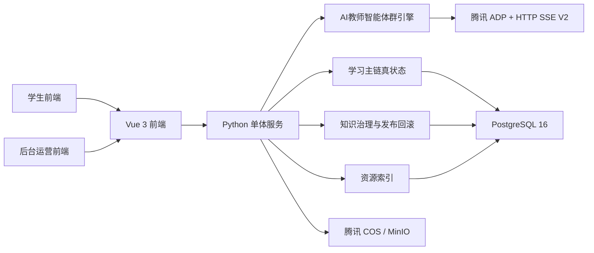
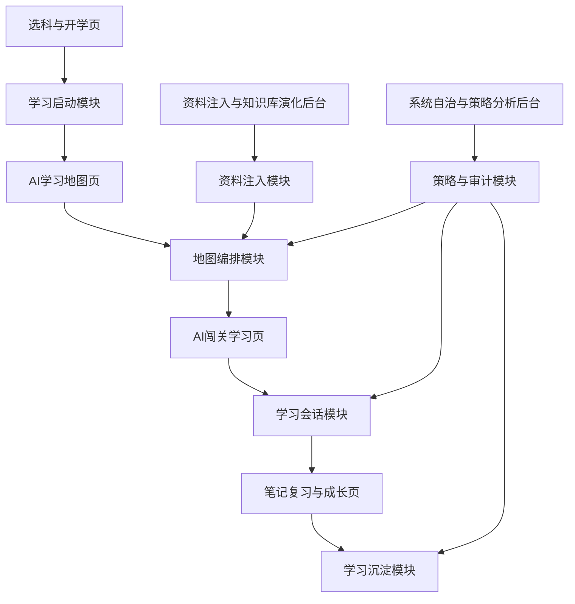
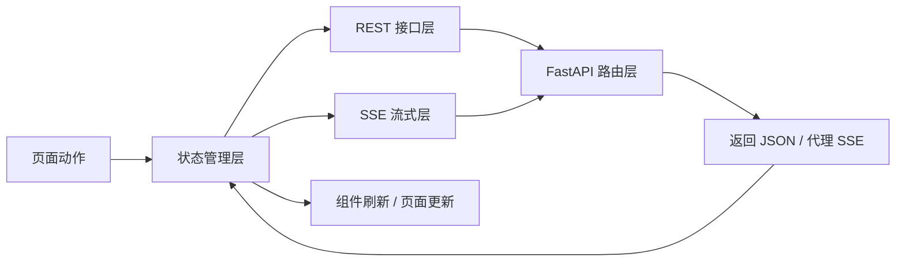
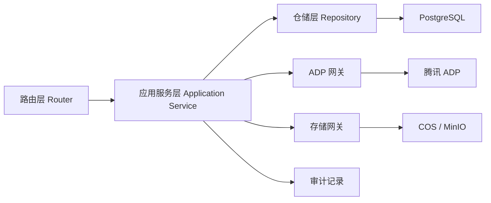
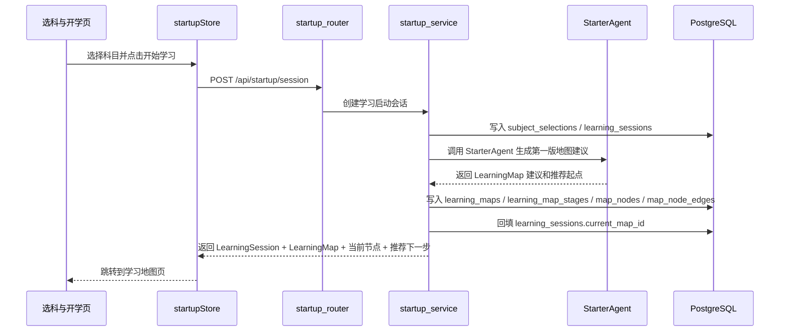
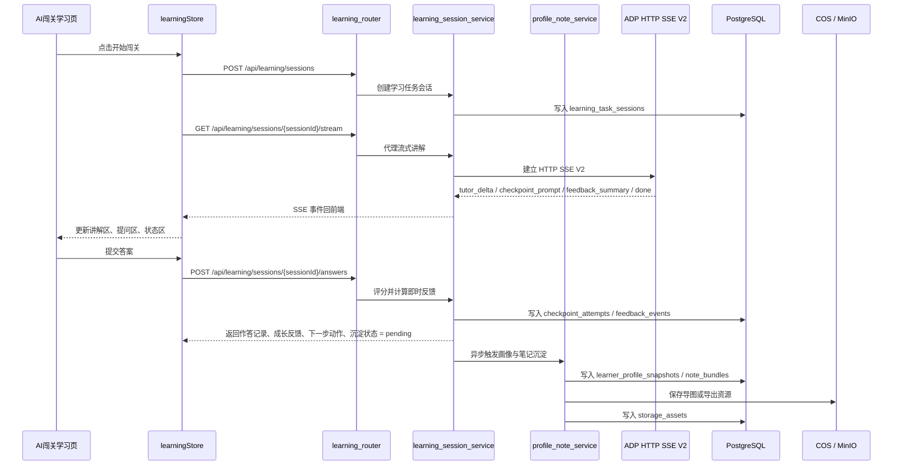

# AI主导学习生命周期的自进化自学智能体平台总体架构与技术选型

## 1. 比赛版系统分层

### 1.1 分层解释

| 层级 | 组成 | 负责什么 | 不负责什么 |
| --- | --- | --- | --- |
| 展示层 | 学生页 + 后台页 | 展示学习主线、后台证据和演示路径 | 不直接保存真状态，不直接承担智能体编排 |
| 应用层 | Python 单体服务 | 承接接口、会话、地图、作答、知识治理、审计与回滚 | 不替代智能体做推理，不做底层模型训练 |
| 智能体层 | AI教师智能体群引擎 | 负责诊断、重规划、讲解、评分、抽取、总结和策略建议 | 不直接保存业务真状态 |
| 数据层 | PostgreSQL 16 | 保存学习主链、画像快照、笔记索引、知识治理、策略快照和审计日志 | 不负责大文件存储 |
| 资源层 | COS / MinIO | 保存原始资料、导图、导出笔记、图片、音频等资源文件 | 不负责结构化业务查询 |
| 接入层 | 腾讯 ADP + HTTP SSE V2 | 承接多 Agent 工作流和流式输出 | 不负责最终业务状态落地 |

## 2. 页面到模块到数据的映射

这部分直接回答“页面怎么落成系统模块、模块最后写到哪些真状态对象里”。

| 页面 | 应用层模块 | 智能体能力 | 关键数据对象 | 主要验收点 |
| --- | --- | --- | --- | --- |
| 选科与开学页 | 学习启动模块 | `StarterAgent` | `SubjectSelection`、`LearningSession`、`LearningMap` | 一次启动就拿到会话和第一版地图 |
| AI学习地图页 | 地图编排模块 | `DiagnosisAgent`、`MapPlannerAgent` | `LearningMap`、`MapNode`、`DiagnosticResult`、`RerouteEvent` | 地图能生成、能校准、能重规划 |
| AI闯关学习页 | 学习会话模块 | `TutorAgent`、`EvaluatorAgent` | `LearningTask`、`learning_task_sessions`、`CheckpointAttempt`、`FeedbackEvent` | 能跑通讲解、作答、反馈、推进 |
| 笔记复习与成长页 | 学习沉淀模块 | `ProfileAgent`、`NoteSynthAgent` | `LearnerProfileSnapshot`、`NoteBundle`、`storage_assets` | 能看到成长变化和复习资产 |
| 资料注入与知识库演化后台 | 资料注入模块 | `IngestionAgent` | `IngestionTask`、`KnowledgePatch`、`KnowledgeCandidate`、`ValidationReport`、`KnowledgeRelease`、`KnowledgeRollback` | 新资料能进入候选、发布或回滚 |
| 系统自治与策略分析后台 | 策略与审计模块 | `StrategyAgent` | `StrategySnapshot`、`agent_status_snapshots`、`AuditEvent` | 能解释系统为什么这样调整 |

### 2.1 页面主线和后台亮点怎么接起来

这张图要表达三件事：

- 学生前台证明平台会组织学习，而不是只给聊天框。
- 后台页面证明平台为什么会变、变了以后怎么追踪。
- 后台变化必须回到地图和学习主线上，不然就只是管理台，不是教学平台。

## 3. 核心数据对象

| 数据对象 | 中文解释 | 作用 |
| --- | --- | --- |
| `SubjectSelection` | 选科记录 | 记录学生本轮学习以什么科目和优先模式启动 |
| `LearningSession` | 学习启动会话 | 记录一次正式学习链路是怎么开始的 |
| `LearningMap` | 学习地图 | 表示当前主线、支线、阶段和推荐路径 |
| `DiagnosticResult` | 短诊断结果 | 记录基础判断、起点偏差和校准结论 |
| `RerouteEvent` | 重规划事件 | 记录补桥、降难、回主线和知识变更带来的路线调整 |
| `LearningTask` | 学习任务 | 表示某个地图节点下拆出的具体闯关任务 |
| `CheckpointAttempt` | 闯关作答记录 | 记录学生在某个任务里的作答和结果 |
| `FeedbackEvent` | 成长反馈事件 | 记录一次评分、通关、补桥、挑战等反馈 |
| `LearnerProfileSnapshot` | 学习画像快照 | 记录学生能力和风险信号的阶段性结果 |
| `NoteBundle` | 笔记资产包 | 包含结构化笔记、思维导图、错题回顾和复习计划 |
| `IngestionTask` | 资料入库任务 | 记录一份资料从上传到候选、发布或失败的处理过程 |
| `KnowledgePatch` | 知识补丁 | 记录新资料抽取出的结构化知识声明和证据摘要 |
| `KnowledgeCandidate` | 候选知识 | 记录等待审核或待发布的候选知识对象 |
| `ValidationReport` | 校验报告 | 记录候选知识的可信度、检查项和门禁结论 |
| `KnowledgeRelease` | 知识发布 | 记录正式进入主教学区的知识版本和作用范围 |
| `KnowledgeRollback` | 知识回滚 | 记录错误知识的回滚动作、目标版本和影响范围 |
| `StrategySnapshot` | 策略快照 | 记录系统当时的关键策略状态 |
| `AuditEvent` | 审计事件 | 记录异常、重规划、回滚和关键系统行为 |

## 4. 前端具体架构设计

### 4.1 前端技术选型

| 类别 | 选型 | 选择原因 |
| --- | --- | --- |
| 前端框架 | `Vue 3 + TypeScript + Vite` | 交互复杂度和迭代效率平衡更好，适合比赛期快速联调 |
| 路由 | `Vue Router` | 便于区分学生页主线和后台页演示入口 |
| 状态管理 | `Pinia` | 适合管理地图状态、会话状态、画像状态和后台状态 |
| UI 组件 | `Naive UI` | 后台表格、状态块和配置面板承载能力强 |
| 样式 | `Tailwind CSS` | 便于快速拉齐地图、卡片和状态视觉层次 |
| 动效 | `VueUse Motion` | 适合节点解锁、成长反馈和页面切换动画 |
| 图表 | `ECharts` | 适合成长曲线、策略变化和影响域展示 |

### 4.2 前端分层结构

| 层 | 固定组成 | 负责什么 |
| --- | --- | --- |
| 页面层 | 选科与开学页、AI学习地图页、AI闯关学习页、笔记复习与成长页、资料注入后台、系统自治后台 | 承接页面动作、展示状态、驱动页面跳转 |
| 共享组件层 | 地图节点卡、阶段卡、反馈卡、状态条、候选预览卡、审计日志卡 | 复用视觉单元，不直接请求接口 |
| 状态管理层 | `startupStore`、`mapStore`、`learningStore`、`growthStore`、`ingestionStore`、`opsStore` | 保存页面状态、请求结果、流式事件和错误状态 |
| 接口与流式层 | `startupApi`、`mapApi`、`learningApi`、`growthApi`、`ingestionApi`、`opsApi`、`useLearningStream` | 发 REST、订阅 SSE、管理重连和事件分发 |
| 路由守卫层 | `Vue Router` 守卫、角色入口校验、恢复上次学习入口 | 控制页面进入顺序、角色权限和续学跳转 |

前端这里的重点不是“组件很多”，而是动作统一先进状态层，状态层再去调用接口或接收流式结果，页面只负责展示，不自己拼复杂链路状态。

### 4.3 前端页面到状态到接口的承接表

| 页面 | 主要状态 | 主要接口 / 流式 | 回写状态 | 页面最终展示 |
| --- | --- | --- | --- | --- |
| 选科与开学页 | `startupStore` | `GET /api/startup/subjects`、`GET /api/startup/resume`、`POST /api/startup/session` | 可选科目、最近学习入口、学习启动会话、第一版学习地图 | 推荐科目、最近学习入口、当前节点、推荐下一步 |
| AI学习地图页 | `mapStore` | `POST /api/diagnostics/{subjectId}/submit` | 学习地图、地图节点、短诊断结果、重规划事件 | 当前地图、推荐节点、补桥原因、下一步 |
| AI闯关学习页 | `learningStore` | `GET /api/learning/tasks/{taskId}`、`POST /api/learning/sessions`、`GET /api/learning/sessions/{sessionId}/stream`、`POST /api/learning/sessions/{sessionId}/answers` | 学习任务会话、SSE 事件、作答记录、成长反馈、沉淀状态 | 讲解区、作答区、即时反馈、推进动作 |
| 笔记复习与成长页 | `growthStore` | `GET /api/learning/sessions/{sessionId}/feedback` | 学习画像快照、笔记资产包、资源索引、沉淀状态 | 成长曲线、结构化笔记、导图、复习计划 |
| 资料注入与知识库演化后台 | `ingestionStore` | `POST /api/ingestion/upload`、`GET /api/ingestion/tasks`、`GET /api/knowledge/candidates`、`POST /api/knowledge/releases`、`GET /api/knowledge/releases/{releaseId}` | 入库任务、知识补丁、候选知识、校验报告、发布结果 | 入库状态、候选列表、发布结果、影响说明 |
| 系统自治与策略分析后台 | `opsStore` | `GET /api/ops/healthz` | 策略快照、Agent 状态快照、审计事件 | 健康状态、Agent 状态、异常和审计流 |

### 4.4 前端数据流转图

这条前端流转表达的是：页面动作先进状态管理层，状态管理层再去调接口或接收流式结果，页面只展示，不自己拼长链路状态。

## 5. 后端具体架构设计

### 5.1 后端技术选型

| 类别 | 选型 | 选择原因 |
| --- | --- | --- |
| 语言 | `Python 3.12` | 更贴近 ADP 生态，适合快速联调和编排胶水层开发 |
| Web 框架 | `FastAPI` | API、SSE、调试体验和比赛阶段交付速度更平衡 |
| 数据访问 | `SQLAlchemy + Alembic` | 数据对象演化频繁时更容易迁移和维护 |
| 数据库 | `PostgreSQL 16` | 能同时承接地图、画像、知识发布回滚和审计真状态 |
| 文件存储 | `腾讯 COS` | 比赛线上优先；本地演示可兼容 `MinIO` |
| 前后端协议 | `REST + SSE` | 动作提交和流式展示拆开更稳，便于重连与状态恢复 |
| ADP 接入协议 | `HTTP SSE V2` | 用于承接 ADP 的流式讲解、提示和完成事件 |

### 5.2 后端模块分层

| 层 | 固定组成 | 负责什么 |
| --- | --- | --- |
| 路由层 | `startup_router`、`diagnostics_router`、`learning_router`、`ingestion_router`、`knowledge_router`、`ops_router` | 接收请求、鉴权、参数校验、返回统一响应 |
| 应用服务层 | 各业务服务 | 编排业务流程、调用 ADP、决定落库顺序、处理回滚和审计 |
| 仓储层 | 各对象仓储 | 读写 `learning_sessions`、`learning_maps`、`reroute_events`、`knowledge_releases` 等真状态表 |
| 外部适配层 | `adp_gateway`、`storage_gateway`、`audit_service` | 对接 ADP、对象存储和审计写入，不把第三方细节泄漏到业务层 |
| 数据层 | PostgreSQL 与对象存储 | 保存结构化真状态和文件资源 |

### 5.3 路由分组

| 路由分组 | 主要路径 | 负责什么 |
| --- | --- | --- |
| 学习启动路由 `startup_router` | `/api/startup/subjects`、`/api/startup/resume`、`/api/startup/session` | 科目选择、最近学习入口、启动正式学习链路 |
| 诊断路由 `diagnostics_router` | `/api/diagnostics/{subjectId}/submit` | 提交短诊断并触发地图校准 |
| 学习路由 `learning_router` | `/api/learning/tasks/{taskId}`、`/api/learning/sessions`、`/api/learning/sessions/{sessionId}/stream`、`/api/learning/sessions/{sessionId}/answers`、`/api/learning/sessions/{sessionId}/feedback` | 闯关学习、SSE 讲解、作答反馈、成长沉淀查询 |
| 入库路由 `ingestion_router` | `/api/ingestion/upload`、`/api/ingestion/tasks` | 资料上传、入库任务创建、任务查询和状态推进 |
| 知识治理路由 `knowledge_router` | `/api/knowledge/candidates`、`/api/knowledge/releases`、`/api/knowledge/releases/{releaseId}` | 候选知识查询、发布、发布结果查询和回滚承接 |
| 运维路由 `ops_router` | `/api/ops/healthz` | 系统健康、Agent 状态、后台自治与审计查询 |

当前比赛版不单独保留没有具体路径的 `growth_router`，成长页读取统一挂在学习路由的会话反馈查询接口下。

### 5.4 服务分组

| 服务 | 负责什么 | 主要承接页面 |
| --- | --- | --- |
| 学习启动服务 `startup_service` | 创建学习启动会话，生成并返回第一版学习地图 | 选科与开学页 |
| 地图编排服务 `map_service` | 生成学习地图，更新地图节点和推荐顺序 | AI学习地图页 |
| 短诊断服务 `diagnostic_service` | 处理短诊断，输出短诊断结果 | AI学习地图页 |
| 学习会话服务 `learning_session_service` | 创建学习任务会话、代理 SSE、保存作答和即时反馈 | AI闯关学习页 |
| 画像与笔记服务 `profile_note_service` | 异步生成画像、笔记、导图与复习计划 | 笔记复习与成长页 |
| 资料入库服务 `ingestion_service` | 上传资料、推进入库状态、生成知识补丁和候选知识 | 资料注入与知识库演化后台 |
| 发布回滚服务 `knowledge_release_service` | 审核候选知识、执行发布或回滚、触发影响域重算 | 资料注入与知识库演化后台 |
| 策略服务 `strategy_service` | 生成策略快照，按影响域重算后续地图推荐 | 系统自治与策略分析后台 |
| 审计服务 `audit_service` | 统一写审计事件和异常说明 | 全局后台链路 |
| 资源索引服务 `storage_asset_service` | 保存 `storage_assets` 索引和签名访问地址 | 成长页、资料注入后台 |

### 5.5 外部依赖与落库承接

| 服务 | 外部依赖 | 主要落库表 | 返回给前端什么 |
| --- | --- | --- | --- |
| `startup_service` | `adp_gateway` | `subject_selections`、`learning_sessions`、`learning_maps`、`learning_map_stages`、`map_nodes`、`map_node_edges` | 学习启动会话、第一版学习地图、当前节点、推荐下一步 |
| `map_service` | `adp_gateway` | `learning_maps`、`learning_map_stages`、`map_nodes`、`map_node_edges` | 地图结构、推荐节点、重规划说明 |
| `diagnostic_service` | `adp_gateway` | `diagnostic_results`、`reroute_events` | 诊断结果、调整原因、下一步 |
| `learning_session_service` | `adp_gateway`、`audit_service` | `learning_task_sessions`、`checkpoint_attempts`、`feedback_events` | SSE 事件、评分结果、下一步动作、沉淀状态 |
| `profile_note_service` | `adp_gateway`、`storage_gateway` | `learner_profile_snapshots`、`note_bundles`、`storage_assets` | 画像快照、笔记资产、导图资源、复习计划 |
| `ingestion_service` | `storage_gateway`、`adp_gateway` | `ingestion_sources`、`ingestion_tasks`、`knowledge_patches`、`evidence_bundles`、`knowledge_candidates` | 入库状态、候选知识、证据摘要 |
| `knowledge_release_service` | `strategy_service`、`map_service`、`audit_service` | `validation_reports`、`knowledge_releases`、`knowledge_rollbacks`、`strategy_snapshots`、必要时新增 `learning_maps` 版本 | 发布结果、回滚结果、影响范围、地图版本变化 |
| `strategy_service` | `adp_gateway` | `strategy_snapshots`、`audit_events` | 策略快照、影响说明 |
| `storage_asset_service` | `storage_gateway` | `storage_assets` | 资源索引、导图地址、导出资源地址 |

## 6. 智能体群职责承接

比赛版固定至少包含这些 Agent 能力：

| Agent | 角色职责 | 主要产出对象 | 由哪个后端服务承接 | 最终落哪些对象 | 对应哪个产品问题 |
| --- | --- | --- | --- | --- | --- |
| `StarterAgent` | 根据选科和历史情况给出起图建议 | `LearningMap` | `startup_service` | `learning_sessions`、`learning_maps`、`map_nodes` | 解决“不知道从哪开始学” |
| `DiagnosisAgent` | 执行短诊断并校准起点 | `DiagnosticResult` | `diagnostic_service` | `diagnostic_results` | 解决“统一路径不适配个人状态” |
| `MapPlannerAgent` | 在学习中持续重规划地图 | `RerouteEvent` | `map_service`、`diagnostic_service` | `reroute_events`、`learning_maps`、`map_nodes` | 解决“卡住后没人接住” |
| `TutorAgent` | 承接流式讲解、追问和示例生成 | `learning_task_sessions` | `learning_session_service` | `learning_task_sessions` | 解决“只给答案、不组织学习” |
| `EvaluatorAgent` | 评分、判题、输出成长反馈 | `CheckpointAttempt`、`FeedbackEvent` | `learning_session_service` | `checkpoint_attempts`、`feedback_events` | 解决“只有对错，没有学习反馈” |
| `ProfileAgent` | 更新学习画像和风险信号 | `LearnerProfileSnapshot` | `profile_note_service` | `learner_profile_snapshots` | 解决“学习变化无法被系统记住” |
| `NoteSynthAgent` | 生成思维导图和结构化笔记 | `NoteBundle`、`storage_assets` | `profile_note_service`、`storage_asset_service` | `note_bundles`、`storage_assets` | 解决“学完没沉淀、没复习资产” |
| `IngestionAgent` | 处理资料识别、结构化和候选生成 | `IngestionTask`、`KnowledgePatch` | `ingestion_service` | `ingestion_sources`、`ingestion_tasks`、`knowledge_patches`、`knowledge_candidates` | 解决“新资料进不来系统” |
| `StrategyAgent` | 汇总日志、生成快照和影响说明 | `StrategySnapshot`、`AuditEvent` | `strategy_service`、`audit_service` | `strategy_snapshots`、`audit_events` | 解决“AI 行为不可解释、不可审计” |

## 7. 数据流与状态流

### 7.1 学习启动与地图生成流

这条流的重点是：`POST /api/startup/session` 一次完成“创建学习启动会话 + 返回第一版学习地图”，前端不再额外调用单独的初始地图接口。

### 7.2 短诊断与重规划流

| 动作 | 服务 | 外部依赖 | 落库 | 返回 |
| --- | --- | --- | --- | --- |
| 地图页提交短诊断 | `diagnostics_router` | 无 | 无 | 进入短诊断服务 |
| 读取当前地图和画像摘要 | `diagnostic_service` + `map_service` | `Repository` | 读取 `learning_maps`、`map_nodes`、`learner_profile_snapshots` | 当前上下文 |
| 调用 `DiagnosisAgent` | `diagnostic_service` | `adp_gateway` | `diagnostic_results` | 薄弱点、起点判断 |
| 调用 `MapPlannerAgent` | `map_service` | `adp_gateway` | `reroute_events`、更新 `learning_maps`、`map_nodes` | 调整原因、推荐下一步 |
| 返回重规划结果 | `diagnostics_router` | 无 | 如有异常写 `audit_events` | 短诊断结果、重规划事件、更新后的地图 |

### 7.3 闯关学习与成长沉淀流

这条流的重点是：`POST /api/learning/sessions/{sessionId}/answers` 先返回即时反馈，画像和笔记异步沉淀，成长页再通过查询接口拉取结果。

### 7.4 资料入库与发布回滚流

| 动作 | 服务 | 外部依赖 | 落库 | 返回 |
| --- | --- | --- | --- | --- |
| 后台上传资料 | `ingestion_router` -> `ingestion_service` | `storage_gateway` | `ingestion_sources`、`ingestion_tasks`、`storage_assets` | 上传成功、状态 = `uploaded` |
| 执行解析和声明抽取 | `ingestion_service` | `IngestionAgent` / `adp_gateway` | `knowledge_patches`、`evidence_bundles`、`knowledge_candidates` | 候选知识、证据摘要 |
| 生成校验报告 | `knowledge_release_service` | `Repository` + 校验逻辑 | `validation_reports` | 门禁结论 |
| 发布候选知识 | `knowledge_router` -> `knowledge_release_service` | `strategy_service`、`map_service` | `knowledge_releases`，必要时 `knowledge_rollbacks` | 发布结果、回滚结果 |
| 重算影响域并反写地图 | `strategy_service` + `map_service` | `StrategyAgent` | `strategy_snapshots`、`audit_events`、新增 `learning_maps.version_no + 1` | 影响范围、新地图版本、推荐变化 |
| 切换受影响会话 | `map_service` | `Repository` | 回填 `learning_sessions.current_map_id`，新版本写入 `based_on_release_id` | 后续学习切到新版本 |

知识发布对地图的影响口径固定为：只对受影响会话做局部重算，生成新地图版本，不直接覆盖旧版本；旧版本保留给审计和回滚。

## 8. 单机部署与可用性口径

当前这版性能指标不会触发主架构改造。  
比赛版仍采用“前端 + FastAPI 单体后端 + PostgreSQL + COS / MinIO + ADP + REST / SSE”这条主路线，不引入 Redis、消息队列、微服务拆分等更重的基础设施。原因很简单：这次追求的是演示主链稳定、首屏快、流式讲解不断、后台治理可回看，而不是高并发生产承载。

| 能力 | 方案 | 为什么够用 |
| --- | --- | --- |
| 反向代理 | `Caddy / Nginx` | 够支撑单机演示和基本 HTTPS / 路由转发 |
| 进程守护 | `systemd` | 足够支撑服务常驻与自动重启 |
| 健康检查 | `/api/ops/healthz` + 关键依赖自检 | 便于比赛前快速确认系统状态 |
| 优雅重启 | FastAPI 服务优雅关闭与重启 | 降低演示前更新带来的风险 |
| 数据恢复 | PostgreSQL 定时备份与恢复脚本 | 够支撑比赛版回退与数据恢复 |
| 降级输出 | ADP 或流式异常时回退到缓存结果或静态反馈 | 保证现场不至于直接断演示 |

### 8.1 异常与降级流

| 异常场景 | 前端表现 | 后端处理 | 是否落审计 |
| --- | --- | --- | --- |
| ADP 流式超时 | 讲解区停止追加，显示“已切换稳定结果” | 中止当前流、返回缓存讲解或静态反馈 | 是，写 `audit_events` |
| 数据库不可用 | 页面提示“当前无法保存学习进度” | 阻止继续推进主链，返回可恢复错误码 | 是，写 `audit_events` |
| 对象存储上传失败 | 导图或资料附件显示上传失败 | 保留主业务状态，重试资源上传或回退到文本版结果 | 是，写 `audit_events` |
| 发布冲突或触发回滚 | 后台显示“发布被拦截”或“已回滚到稳定版本” | 写 `validation_reports`、`knowledge_rollbacks`、`strategy_snapshots` | 是，写 `audit_events` |

### 8.2 性能承接设计

| 性能要求 | 当前架构怎么承接 | 为什么不用改主架构 |
| --- | --- | --- |
| 首屏 3 秒内看到关键入口 | 不做营销首页；启动接口一体返回学习启动会话和第一版学习地图；前端状态层直接消费结果 | 当前瓶颈主要在接口编排，不在服务拆分 |
| 轻量读接口 1 秒内返回 | `subjects`、`resume`、`healthz` 保持轻量读，不做复杂聚合，不串长链推理 | 读接口量小、逻辑轻，单体后端足够 |
| 启动和诊断在几秒内可返回 | `POST /api/startup/session` 直接承接起会话和首图；短诊断只做当前地图相关校准，不做无关扩展查询 | 通过收敛动作边界就能控时延，不需要额外中间件 |
| SSE 首条事件 2 秒内收到 | 后端统一代理 SSE，优先把首条讲解增量推出去，前端只负责展示和重连 | 当前主链是一条学生演示流，代理式 SSE 更稳更简单 |
| `/answers` 3 秒内返回即时反馈 | `/answers` 只做作答评分和即时反馈；画像、笔记、导图走异步沉淀链 | 关键是把长耗时步骤拆出去，不是重构架构 |
| `/feedback` 10 秒内查到沉淀结果 | 画像与笔记由 `profile_note_service` 异步沉淀，成长页通过查询接口读取最终状态 | 异步沉淀已经满足比赛演示诉求，没必要上队列系统 |
| 上传后快速看到任务状态 | 上传先落 `ingestion_tasks`，解析和抽取后推进入库状态链 | 先写任务状态、后做重活，单体也能撑住 |
| 发布后不能拖垮学习主链 | 只对受影响会话做局部影响域重算，生成新地图版本，不做全量地图重建 | 局部重算比全量重建更符合单机比赛版 |

只有当目标升级成校内试用级或高并发生产级时，才需要进一步考虑：

- 任务队列和异步 Worker
- 缓存层
- 读写分离
- 静态资源 CDN
- 更细的服务拆分
