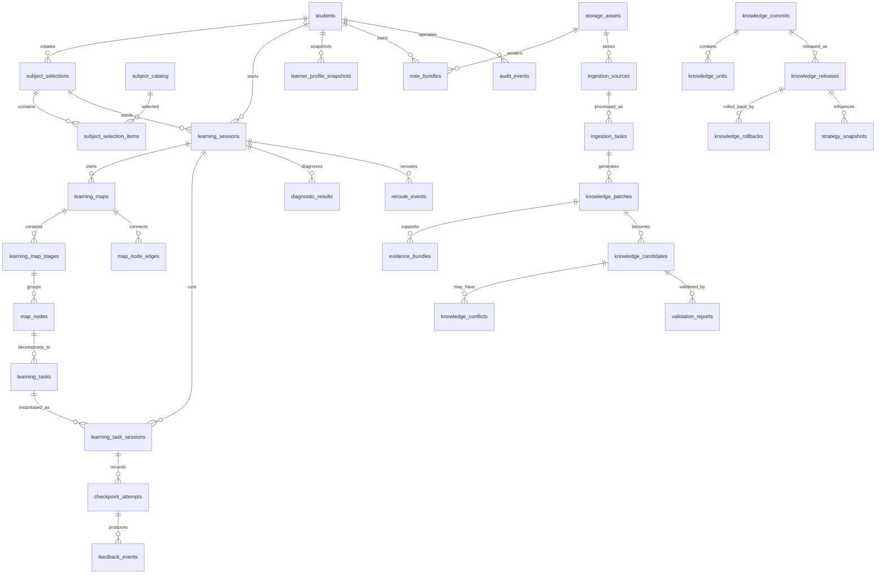

# 比赛版 PostgreSQL 数据库设计

> 文档目的：把比赛版核心对象落成可建表的 `PostgreSQL 16` 数据库设计，直接服务后续 `FastAPI + SQLAlchemy + Alembic` 落地  
> 当前状态：本文件是数据库设计基线，不代表当前仓库已经实现这些表；真正开发应按这里的对象名、字段口径、状态边界和索引建议推进  
> 核心结论：学习地图、节点状态、画像快照、笔记索引、知识版本、回滚与审计都落在 `PostgreSQL`；原始资料、录音、图片、导图和导出物只保存资源索引，不直接塞进业务表正文  
> 谁该看这页：后端开发、数据库设计、ADP 接入同学、测试同学、答辩主讲人  
> 建议阅读顺序：先看“数据库边界”和“核心对象映射”，再看 `ER` 图，最后看分组表设计、枚举、索引与查询闭环

## 1. 文档目的与数据库边界

本页解决的问题不是“系统里大概有哪些表”，而是明确：

- 哪些对象必须成为 `PostgreSQL` 真状态，而不是只停留在 `ADP` 上下文里。
- 哪些字段需要强约束、可查询、可追踪，哪些灵活结构适合放 `JSONB`。
- 后端后续如果开始正式建表，应该先建哪些核心表、怎么连、如何避免和前面的 PRD、算法、API 文档冲突。

固定边界如下：

- `PostgreSQL`：保存学习主链、地图、节点、画像、笔记索引、知识版本、发布回滚、策略快照、审计事件。
- 对象存储：保存原始资料、导图、导出笔记、图片、音频、附件文件。
- `ADP`：负责推理、讲解、判题、抽取和建议，不负责最终业务真状态。
- 前端：只消费结构化对象，不直接承担状态拼装和知识版本治理。

## 2. 设计约定

| 约定项 | 统一规则 | 说明 |
| --- | --- | --- |
| 表名风格 | `snake_case` 复数表名 | 例如 `learning_sessions`、`knowledge_releases` |
| 主键风格 | `varchar(64)` | 直接对齐现有接口与文档中的业务 ID 风格 |
| 时间字段 | `timestamptz` | 统一保存带时区时间，默认使用 `now()` |
| 说明文本 | `text` | 适合解释、摘要、错误原因、学生提示语 |
| 分数/置信度 | `numeric(5,2)` | 统一用于诊断分、作答分、置信度 |
| 布尔字段 | `boolean` | 配合 `default true/false` 使用 |
| 状态字段 | `varchar(32)` 或 `varchar(64)` + `CHECK` | 状态不写死在代码里，数据库也保留显式约束 |
| 灵活结构 | `jsonb` | 用于 `claims[]`、`actions[]`、`structuredNotes[]`、`activePolicies[]` 等 |
| 数组默认值 | `'[]'::jsonb` | 所有列表型 `jsonb` 默认空数组 |
| 对象默认值 | `'{}'::jsonb` | 所有对象型 `jsonb` 默认空对象 |
| 排序字段 | `integer` | 用于阶段顺序、节点顺序、列表排序 |
| 外键策略 | 重要主链表尽量显式 `FK` | 多态资源索引和审计目标用 `owner_type + owner_id` / `target_type + target_id` |

### 2.1 哪些内容适合放 JSONB

采用“核心关系表 + 扩展 `JSONB`”的混合建模：

- 关系表负责：会话、地图、节点、任务、作答、画像快照、知识补丁、校验报告、发布、回滚、审计。
- `JSONB` 负责：AI 生成的灵活结构、列表、变更明细、动态策略、知识片段作用域、提示词上下文快照。
- 不允许用一个大 `JSONB` 替代整条学习主链或整个知识治理流程。

## 3. 核心对象到表映射

| 核心对象 | 主要落库表 | 说明 |
| --- | --- | --- |
| `SubjectSelection` | `subject_selections`、`subject_selection_items` | 记录学生当次选科和优先模式 |
| `LearningSession` | `learning_sessions` | 记录一次正式学习链路的入口会话 |
| `LearningMap` | `learning_maps`、`learning_map_stages`、`map_nodes`、`map_node_edges` | 记录地图版本、阶段、节点和路径 |
| `DiagnosticResult` | `diagnostic_results` | 记录短诊断得分、薄弱基础和校准决策 |
| `RerouteEvent` | `reroute_events` | 记录每次补桥、降难、回主线等重规划事件 |
| `LearningTask` | `learning_tasks`、`learning_task_sessions` | 记录具体闯关任务和任务级会话 |
| `CheckpointAttempt` | `checkpoint_attempts` | 记录学生作答、得分、时长和错误模式 |
| `FeedbackEvent` | `feedback_events` | 记录通关反馈、能力变化和解锁动作 |
| `LearnerProfileSnapshot` | `learner_profile_snapshots` | 记录画像快照和风险信号 |
| `NoteBundle` | `note_bundles`、`storage_assets` | 记录结构化笔记和导图资源索引 |
| `IngestionTask` | `ingestion_sources`、`ingestion_tasks` | 记录资料来源和入库任务进度 |
| `KnowledgePatch` | `knowledge_patches`、`evidence_bundles` | 记录知识补丁和支撑证据 |
| `KnowledgeCandidate` | `knowledge_candidates`、`knowledge_conflicts` | 记录候选知识与冲突信息 |
| `ValidationReport` | `validation_reports` | 记录可信度、校验项与门禁结论 |
| `KnowledgeRelease` | `knowledge_commits`、`knowledge_units`、`knowledge_releases` | 记录正式发布版本和生效范围 |
| `KnowledgeRollback` | `knowledge_rollbacks` | 记录错误知识回滚与影响范围 |
| `StrategySnapshot` | `strategy_snapshots` | 记录发布或重规划后的策略状态 |
| `AuditEvent` | `audit_events` | 记录关键学习、知识、系统动作的审计证据 |

## 4. 核心 ER 图

## 5. 基础身份与选科

### 5.1 `students`

用途：承接学生、平台管理者、评委演示账号等平台内身份主体，并为 `VisitorId` 映射提供稳定主表。

| 字段名 | PostgreSQL 类型 | 必填 | 默认值 | 中文意思 | 约束/备注 |
| --- | --- | --- | --- | --- | --- |
| `student_id` | `varchar(64)` | 是 | 无 | 平台内用户主键编号 | 主键 |
| `visitor_id` | `varchar(64)` | 是 | 无 | 映射到 ADP 的稳定访客标识 | 唯一约束；不直接暴露真实隐私 |
| `display_name` | `varchar(64)` | 是 | 无 | 页面显示名称 | 学生名、管理员名或演示账号名 |
| `role` | `varchar(32)` | 是 | `'student'` | 账号角色 | `CHECK (role in ('student','admin','judge'))` |
| `demo_tag` | `varchar(64)` | 否 | `NULL` | 演示标签 | 用于标记比赛演示账号批次 |
| `status` | `varchar(32)` | 是 | `'active'` | 账号状态 | `CHECK (status in ('active','disabled','demo_only'))` |
| `created_at` | `timestamptz` | 是 | `now()` | 创建时间 | 建议索引 |
| `updated_at` | `timestamptz` | 是 | `now()` | 最近更新时间 | 由应用层更新 |

### 5.2 `subject_catalog`

用途：保存系统支持的学科目录，比赛版至少包含高等数学。

| 字段名 | PostgreSQL 类型 | 必填 | 默认值 | 中文意思 | 约束/备注 |
| --- | --- | --- | --- | --- | --- |
| `subject_id` | `varchar(64)` | 是 | 无 | 学科主键编号 | 主键 |
| `subject_code` | `varchar(64)` | 是 | 无 | 学科编码 | 唯一约束，如 `math` |
| `subject_name` | `varchar(64)` | 是 | 无 | 学科中文名称 | 如“高等数学” |
| `description` | `text` | 否 | `NULL` | 学科说明 | 用于后台维护和展示 |
| `sort_order` | `integer` | 是 | `0` | 展示排序 | 越小越靠前 |
| `is_active` | `boolean` | 是 | `true` | 是否启用 | 禁用后不再出现在选科页 |
| `created_at` | `timestamptz` | 是 | `now()` | 创建时间 |  |
| `updated_at` | `timestamptz` | 是 | `now()` | 最近更新时间 |  |

### 5.3 `subject_selections`

用途：记录一次选科动作本身，是 `LearningSession` 的前置记录。

| 字段名 | PostgreSQL 类型 | 必填 | 默认值 | 中文意思 | 约束/备注 |
| --- | --- | --- | --- | --- | --- |
| `selection_id` | `varchar(64)` | 是 | 无 | 选科记录主键编号 | 主键 |
| `student_id` | `varchar(64)` | 是 | 无 | 发起选科的用户编号 | `FK -> students.student_id` |
| `priority_mode` | `varchar(32)` | 是 | `'single_subject'` | 选科优先模式 | `CHECK (priority_mode in ('single_subject','multi_subject','review_first','exam_sprint'))` |
| `recommended_subject_id` | `varchar(64)` | 否 | `NULL` | 系统推荐主学科编号 | `FK -> subject_catalog.subject_id` |
| `selection_source` | `varchar(32)` | 是 | `'manual'` | 选科来源 | `CHECK (selection_source in ('manual','resume','system_default'))` |
| `created_at` | `timestamptz` | 是 | `now()` | 选科时间 | 建议索引 |

### 5.4 `subject_selection_items`

用途：承接一次选科中的多科明细，避免把 `subjects[]` 直接硬塞进单表。

| 字段名 | PostgreSQL 类型 | 必填 | 默认值 | 中文意思 | 约束/备注 |
| --- | --- | --- | --- | --- | --- |
| `item_id` | `varchar(64)` | 是 | 无 | 选科明细主键编号 | 主键 |
| `selection_id` | `varchar(64)` | 是 | 无 | 所属选科记录编号 | `FK -> subject_selections.selection_id` |
| `subject_id` | `varchar(64)` | 是 | 无 | 被选中的学科编号 | `FK -> subject_catalog.subject_id` |
| `sort_order` | `integer` | 是 | `0` | 学科顺序 | 多科时的先后顺序 |
| `is_active` | `boolean` | 是 | `true` | 是否仍然有效 | 取消选科时可软失效 |

## 6. 学习主链与地图编排

### 6.1 `learning_sessions`

用途：记录一条正式学习主链的入口会话，并承接 `ConversationId` 的后端映射。

| 字段名 | PostgreSQL 类型 | 必填 | 默认值 | 中文意思 | 约束/备注 |
| --- | --- | --- | --- | --- | --- |
| `session_id` | `varchar(64)` | 是 | 无 | 学习启动会话主键编号 | 主键 |
| `student_id` | `varchar(64)` | 是 | 无 | 当前学习用户编号 | `FK -> students.student_id` |
| `selection_id` | `varchar(64)` | 是 | 无 | 本次会话来自哪次选科 | `FK -> subject_selections.selection_id` |
| `active_subject_id` | `varchar(64)` | 是 | 无 | 当前主学科编号 | `FK -> subject_catalog.subject_id` |
| `visitor_id` | `varchar(64)` | 是 | 无 | 对应 ADP 的访客标识 | 与 `students.visitor_id` 一致，便于快速映射 |
| `adp_root_conversation_id` | `varchar(64)` | 否 | `NULL` | ADP 根会话编号 | 对应 `ConversationId` |
| `status` | `varchar(32)` | 是 | `'started'` | 学习会话状态 | `CHECK (status in ('started','map_ready','in_learning','completed','interrupted','cancelled'))` |
| `current_map_id` | `varchar(64)` | 否 | `NULL` | 当前生效地图编号 | 地图生成后回填；建议延迟 FK |
| `started_at` | `timestamptz` | 是 | `now()` | 学习开始时间 |  |
| `ended_at` | `timestamptz` | 否 | `NULL` | 学习结束时间 | 完成或中断时回填 |
| `created_at` | `timestamptz` | 是 | `now()` | 记录创建时间 |  |
| `updated_at` | `timestamptz` | 是 | `now()` | 最近更新时间 |  |

### 6.2 `learning_maps`

用途：记录某次学习会话在某个时刻的地图版本，是 `LearningMap` 的主表。

| 字段名 | PostgreSQL 类型 | 必填 | 默认值 | 中文意思 | 约束/备注 |
| --- | --- | --- | --- | --- | --- |
| `map_id` | `varchar(64)` | 是 | 无 | 学习地图主键编号 | 主键 |
| `session_id` | `varchar(64)` | 是 | 无 | 所属学习会话编号 | `FK -> learning_sessions.session_id` |
| `student_id` | `varchar(64)` | 是 | 无 | 当前地图所属用户编号 | `FK -> students.student_id` |
| `subject_id` | `varchar(64)` | 是 | 无 | 当前地图所属学科编号 | `FK -> subject_catalog.subject_id` |
| `version_no` | `integer` | 是 | `1` | 地图版本号 | 同一会话内递增 |
| `source_type` | `varchar(32)` | 是 | `'starter'` | 地图来源类型 | `CHECK (source_type in ('starter','diagnostic','reroute','release_impact','manual'))` |
| `based_on_profile_id` | `varchar(64)` | 否 | `NULL` | 地图参考的画像快照编号 | `FK -> learner_profile_snapshots.profile_id` |
| `based_on_release_id` | `varchar(64)` | 否 | `NULL` | 地图参考的知识发布编号 | `FK -> knowledge_releases.release_id` |
| `current_node_id` | `varchar(64)` | 否 | `NULL` | 当前节点编号 | 节点生成后回填 |
| `recommended_next_node_id` | `varchar(64)` | 否 | `NULL` | 推荐下一节点编号 | 节点生成后回填 |
| `explain_text` | `text` | 否 | `NULL` | 地图解释文本 | 说明为什么从这里开始 |
| `status` | `varchar(32)` | 是 | `'active'` | 地图状态 | `CHECK (status in ('draft','active','superseded','archived'))` |
| `created_at` | `timestamptz` | 是 | `now()` | 地图创建时间 |  |
| `updated_at` | `timestamptz` | 是 | `now()` | 地图更新时间 |  |

### 6.3 `learning_map_stages`

用途：把地图拆成阶段层级，支持阶段 Boss、阶段解锁和阶段级展示。

| 字段名 | PostgreSQL 类型 | 必填 | 默认值 | 中文意思 | 约束/备注 |
| --- | --- | --- | --- | --- | --- |
| `stage_id` | `varchar(64)` | 是 | 无 | 阶段主键编号 | 主键 |
| `map_id` | `varchar(64)` | 是 | 无 | 所属地图编号 | `FK -> learning_maps.map_id` |
| `stage_code` | `varchar(64)` | 是 | 无 | 阶段编码 | 如 `stage_00` |
| `stage_title` | `varchar(128)` | 是 | 无 | 阶段标题 | 如“预备补桥” |
| `stage_order` | `integer` | 是 | `0` | 阶段顺序 | 越小越靠前 |
| `stage_status` | `varchar(32)` | 是 | `'locked'` | 阶段状态 | `CHECK (stage_status in ('locked','available','current','passed'))` |
| `boss_node_id` | `varchar(64)` | 否 | `NULL` | 阶段 Boss 节点编号 | 节点生成后回填 |
| `is_unlocked` | `boolean` | 是 | `false` | 是否已解锁 | 前端展示用 |
| `created_at` | `timestamptz` | 是 | `now()` | 创建时间 |  |
| `updated_at` | `timestamptz` | 是 | `now()` | 更新时间 |  |

### 6.4 `map_nodes`

用途：承接主线、补桥、复习、挑战、Boss、奖励等实际学习节点。

| 字段名 | PostgreSQL 类型 | 必填 | 默认值 | 中文意思 | 约束/备注 |
| --- | --- | --- | --- | --- | --- |
| `node_id` | `varchar(64)` | 是 | 无 | 地图节点主键编号 | 主键 |
| `map_id` | `varchar(64)` | 是 | 无 | 所属地图编号 | `FK -> learning_maps.map_id` |
| `stage_id` | `varchar(64)` | 是 | 无 | 所属阶段编号 | `FK -> learning_map_stages.stage_id` |
| `node_code` | `varchar(64)` | 是 | 无 | 节点编码 | 便于章节级稳定引用 |
| `node_type` | `varchar(32)` | 是 | 无 | 节点类型 | `CHECK (node_type in ('main','bridge','review','challenge','boss','reward'))` |
| `title` | `varchar(128)` | 是 | 无 | 节点标题 | 如“函数直觉入门” |
| `description` | `text` | 否 | `NULL` | 节点说明 | 用于前端解释和后台维护 |
| `status` | `varchar(32)` | 是 | `'locked'` | 节点状态 | `CHECK (status in ('locked','available','current','in_progress','passed','bridge_required','review_due','skipped'))` |
| `difficulty_level` | `integer` | 是 | `1` | 节点难度等级 | 建议范围 1-5 |
| `goal_text` | `text` | 否 | `NULL` | 节点目标描述 | 告诉学生本节点要学会什么 |
| `pass_criteria_jsonb` | `jsonb` | 是 | `'{}'::jsonb` | 通过条件结构 | 如正确率、解释要求、补桥阈值 |
| `return_to_node_id` | `varchar(64)` | 否 | `NULL` | 回主线节点编号 | 补桥或复习节点专用 |
| `knowledge_scope_jsonb` | `jsonb` | 是 | `'[]'::jsonb` | 关联知识范围 | 记录章节、知识点、题型范围 |
| `bridge_reason` | `text` | 否 | `NULL` | 补桥原因说明 | 仅补桥节点需要 |
| `sort_order` | `integer` | 是 | `0` | 节点顺序 | 同阶段内排序 |
| `estimated_minutes` | `integer` | 否 | `NULL` | 预计学习时长 | 单位分钟 |
| `created_at` | `timestamptz` | 是 | `now()` | 创建时间 |  |
| `updated_at` | `timestamptz` | 是 | `now()` | 更新时间 |  |

### 6.5 `map_node_edges`

用途：显式保存节点之间的主线、支线、回接关系，避免只靠顺序字段隐式推断。

| 字段名 | PostgreSQL 类型 | 必填 | 默认值 | 中文意思 | 约束/备注 |
| --- | --- | --- | --- | --- | --- |
| `edge_id` | `varchar(64)` | 是 | 无 | 节点连线主键编号 | 主键 |
| `map_id` | `varchar(64)` | 是 | 无 | 所属地图编号 | `FK -> learning_maps.map_id` |
| `from_node_id` | `varchar(64)` | 是 | 无 | 起始节点编号 | `FK -> map_nodes.node_id` |
| `to_node_id` | `varchar(64)` | 是 | 无 | 目标节点编号 | `FK -> map_nodes.node_id` |
| `edge_type` | `varchar(32)` | 是 | `'main'` | 连线类型 | `CHECK (edge_type in ('main','branch','return','review','unlock'))` |
| `condition_text` | `text` | 否 | `NULL` | 连线触发条件说明 | 如“补桥正确率达到 80%” |
| `trigger_event_id` | `varchar(64)` | 否 | `NULL` | 触发该连线的重规划事件编号 | `FK -> reroute_events.event_id` |
| `sort_order` | `integer` | 是 | `0` | 连线排序 | 同节点的多条连线排序 |
| `created_at` | `timestamptz` | 是 | `now()` | 创建时间 |  |

### 6.6 `learning_tasks`

用途：把一个地图节点拆成可执行的学习任务，供 `TutorAgent` 和 `EvaluatorAgent` 使用。

| 字段名 | PostgreSQL 类型 | 必填 | 默认值 | 中文意思 | 约束/备注 |
| --- | --- | --- | --- | --- | --- |
| `task_id` | `varchar(64)` | 是 | 无 | 学习任务主键编号 | 主键 |
| `node_id` | `varchar(64)` | 是 | 无 | 所属节点编号 | `FK -> map_nodes.node_id` |
| `task_type` | `varchar(32)` | 是 | `'practice'` | 任务类型 | `CHECK (task_type in ('diagnostic','explanation','practice','review','challenge','boss'))` |
| `goal` | `text` | 是 | 无 | 任务目标 | 告诉系统和学生此任务要完成什么 |
| `pass_criteria_jsonb` | `jsonb` | 是 | `'{}'::jsonb` | 任务通过条件结构 | 可与节点级条件不同 |
| `difficulty_level` | `integer` | 是 | `1` | 任务难度等级 | 建议范围 1-5 |
| `prompt_template_jsonb` | `jsonb` | 否 | `'{}'::jsonb` | 任务提示模板结构 | 存放讲解模板、追问模板等 |
| `knowledge_scope_jsonb` | `jsonb` | 是 | `'[]'::jsonb` | 任务使用的知识范围 | 对应章节、例题、误区卡 |
| `created_at` | `timestamptz` | 是 | `now()` | 创建时间 |  |
| `updated_at` | `timestamptz` | 是 | `now()` | 更新时间 |  |

### 6.7 `learning_task_sessions`

用途：记录一次具体闯关任务的运行态会话，是流式讲解和作答的直接承载对象。

| 字段名 | PostgreSQL 类型 | 必填 | 默认值 | 中文意思 | 约束/备注 |
| --- | --- | --- | --- | --- | --- |
| `task_session_id` | `varchar(64)` | 是 | 无 | 任务会话主键编号 | 主键 |
| `session_id` | `varchar(64)` | 是 | 无 | 所属学习启动会话编号 | `FK -> learning_sessions.session_id` |
| `task_id` | `varchar(64)` | 是 | 无 | 当前执行任务编号 | `FK -> learning_tasks.task_id` |
| `student_id` | `varchar(64)` | 是 | 无 | 当前任务所属学生编号 | `FK -> students.student_id` |
| `node_id` | `varchar(64)` | 是 | 无 | 当前任务对应节点编号 | `FK -> map_nodes.node_id` |
| `adp_conversation_id` | `varchar(64)` | 否 | `NULL` | ADP 任务级会话编号 | 建议索引 |
| `status` | `varchar(32)` | 是 | `'pending'` | 任务会话状态 | `CHECK (status in ('pending','streaming','waiting_answer','evaluating','completed','aborted'))` |
| `recent_turns_jsonb` | `jsonb` | 是 | `'[]'::jsonb` | 最近交互摘要 | 仅保存必要轮次，不存全量对话 |
| `started_at` | `timestamptz` | 是 | `now()` | 任务开始时间 |  |
| `ended_at` | `timestamptz` | 否 | `NULL` | 任务结束时间 |  |
| `created_at` | `timestamptz` | 是 | `now()` | 创建时间 |  |
| `updated_at` | `timestamptz` | 是 | `now()` | 更新时间 |  |

### 6.8 `diagnostic_results`

用途：保存短诊断结果，支撑地图校准和起点解释。

| 字段名 | PostgreSQL 类型 | 必填 | 默认值 | 中文意思 | 约束/备注 |
| --- | --- | --- | --- | --- | --- |
| `diagnostic_id` | `varchar(64)` | 是 | 无 | 短诊断结果主键编号 | 主键 |
| `session_id` | `varchar(64)` | 是 | 无 | 所属学习会话编号 | `FK -> learning_sessions.session_id` |
| `student_id` | `varchar(64)` | 是 | 无 | 诊断对应学生编号 | `FK -> students.student_id` |
| `subject_id` | `varchar(64)` | 是 | 无 | 诊断对应学科编号 | `FK -> subject_catalog.subject_id` |
| `score` | `numeric(5,2)` | 否 | `NULL` | 诊断得分 | 建议 `CHECK (score >= 0 and score <= 100)` |
| `weak_foundations_jsonb` | `jsonb` | 是 | `'[]'::jsonb` | 薄弱基础列表 | 存概念缺口、先修缺口等 |
| `decision` | `varchar(32)` | 是 | 无 | 诊断决策 | `CHECK (decision in ('enter_main','insert_bridge','lower_start','skip_mastered','unlock_challenge'))` |
| `recommended_start_node_id` | `varchar(64)` | 否 | `NULL` | 推荐起始节点编号 | `FK -> map_nodes.node_id` |
| `raw_answers_jsonb` | `jsonb` | 是 | `'[]'::jsonb` | 原始诊断答案结构 | 保存题目、答案、解释摘要 |
| `explanation_text` | `text` | 否 | `NULL` | 诊断解释文本 | 面向学生或后台说明 |
| `created_at` | `timestamptz` | 是 | `now()` | 创建时间 |  |

### 6.9 `reroute_events`

用途：保存所有影响学习路线的重规划事件，是补桥、复习、回主线、跳节点的审计来源。

| 字段名 | PostgreSQL 类型 | 必填 | 默认值 | 中文意思 | 约束/备注 |
| --- | --- | --- | --- | --- | --- |
| `event_id` | `varchar(64)` | 是 | 无 | 重规划事件主键编号 | 主键 |
| `session_id` | `varchar(64)` | 是 | 无 | 所属学习会话编号 | `FK -> learning_sessions.session_id` |
| `student_id` | `varchar(64)` | 是 | 无 | 受影响学生编号 | `FK -> students.student_id` |
| `subject_id` | `varchar(64)` | 是 | 无 | 受影响学科编号 | `FK -> subject_catalog.subject_id` |
| `map_id` | `varchar(64)` | 是 | 无 | 事件发生时的地图编号 | `FK -> learning_maps.map_id` |
| `trigger_type` | `varchar(32)` | 是 | 无 | 触发类型 | `CHECK (trigger_type in ('continuous_error','weak_foundation','stuck_too_long','forgetting','pace_fatigue','mastered_ahead','knowledge_release'))` |
| `trigger_evidence` | `text` | 是 | 无 | 触发证据说明 | 如“连续 2 次混淆极限与函数值” |
| `actions_jsonb` | `jsonb` | 是 | `'[]'::jsonb` | 调整动作列表 | 如插入补桥、降低难度、回主线 |
| `return_condition` | `text` | 否 | `NULL` | 回主线条件说明 | 仅补桥或复习链路需要 |
| `student_message` | `text` | 否 | `NULL` | 给学生看的解释文案 | 页面直接展示 |
| `affected_node_ids_jsonb` | `jsonb` | 是 | `'[]'::jsonb` | 受影响节点列表 | 记录被插入、跳过、回接的节点 |
| `created_at` | `timestamptz` | 是 | `now()` | 创建时间 | 建议索引 |

### 6.10 `checkpoint_attempts`

用途：记录学生在一次任务会话中的具体作答行为和结果，是评分、画像、复习和补桥判断的核心事实表。

| 字段名 | PostgreSQL 类型 | 必填 | 默认值 | 中文意思 | 约束/备注 |
| --- | --- | --- | --- | --- | --- |
| `attempt_id` | `varchar(64)` | 是 | 无 | 作答记录主键编号 | 主键 |
| `task_session_id` | `varchar(64)` | 是 | 无 | 所属任务会话编号 | `FK -> learning_task_sessions.task_session_id` |
| `task_id` | `varchar(64)` | 是 | 无 | 所属任务编号 | `FK -> learning_tasks.task_id` |
| `student_id` | `varchar(64)` | 是 | 无 | 作答学生编号 | `FK -> students.student_id` |
| `answer_text` | `text` | 否 | `NULL` | 学生文本答案 | 简答题或解释题使用 |
| `answer_payload_jsonb` | `jsonb` | 是 | `'{}'::jsonb` | 学生答案结构载荷 | 支持公式、图片、选项、语音转写摘要 |
| `score` | `numeric(5,2)` | 否 | `NULL` | 本次作答得分 | 建议 `CHECK (score >= 0 and score <= 100)` |
| `passed` | `boolean` | 是 | `false` | 是否通过本题/本任务 | 直接支撑地图推进 |
| `error_pattern` | `text` | 否 | `NULL` | 错误模式说明 | 如“把函数值当极限” |
| `hint_count` | `integer` | 是 | `0` | 提示使用次数 | 节奏风险判断依据 |
| `duration_seconds` | `integer` | 否 | `NULL` | 本次作答耗时秒数 | 长时间卡住判断依据 |
| `created_at` | `timestamptz` | 是 | `now()` | 作答时间 | 建议索引 |

### 6.11 `feedback_events`

用途：把评分结果和成长反馈沉淀成事件对象，供成长页、地图页和后台日志复用。

| 字段名 | PostgreSQL 类型 | 必填 | 默认值 | 中文意思 | 约束/备注 |
| --- | --- | --- | --- | --- | --- |
| `feedback_id` | `varchar(64)` | 是 | 无 | 成长反馈事件主键编号 | 主键 |
| `attempt_id` | `varchar(64)` | 是 | 无 | 来源作答记录编号 | `FK -> checkpoint_attempts.attempt_id` |
| `task_session_id` | `varchar(64)` | 是 | 无 | 来源任务会话编号 | `FK -> learning_task_sessions.task_session_id` |
| `student_id` | `varchar(64)` | 是 | 无 | 反馈所属学生编号 | `FK -> students.student_id` |
| `subject_id` | `varchar(64)` | 是 | 无 | 反馈所属学科编号 | `FK -> subject_catalog.subject_id` |
| `passed` | `boolean` | 是 | `false` | 是否达标 | 与地图推进直接相关 |
| `mastery_delta_jsonb` | `jsonb` | 是 | `'{}'::jsonb` | 掌握度变化结构 | 记录各知识点分值变化 |
| `ability_delta_jsonb` | `jsonb` | 是 | `'[]'::jsonb` | 能力变化列表 | 如表达、速度、稳定性变化 |
| `unlocks_jsonb` | `jsonb` | 是 | `'[]'::jsonb` | 解锁结果列表 | 如新节点、挑战、奖励 |
| `reroute_event_id` | `varchar(64)` | 否 | `NULL` | 关联重规划事件编号 | `FK -> reroute_events.event_id` |
| `summary_text` | `text` | 否 | `NULL` | 给学生看的反馈摘要 | 可直接用于反馈卡 |
| `created_at` | `timestamptz` | 是 | `now()` | 反馈生成时间 | 建议索引 |

## 7. 画像、笔记与资源索引

### 7.1 `learner_profile_snapshots`

用途：保存画像快照而不是只保存一份覆盖值，保证画像变化可回看、可审计、可用于地图重算。

| 字段名 | PostgreSQL 类型 | 必填 | 默认值 | 中文意思 | 约束/备注 |
| --- | --- | --- | --- | --- | --- |
| `profile_id` | `varchar(64)` | 是 | 无 | 画像快照主键编号 | 主键 |
| `student_id` | `varchar(64)` | 是 | 无 | 画像所属学生编号 | `FK -> students.student_id` |
| `subject_id` | `varchar(64)` | 是 | 无 | 画像所属学科编号 | `FK -> subject_catalog.subject_id` |
| `source_attempt_id` | `varchar(64)` | 否 | `NULL` | 触发本次画像更新的作答编号 | `FK -> checkpoint_attempts.attempt_id` |
| `source_diagnostic_id` | `varchar(64)` | 否 | `NULL` | 触发本次画像更新的诊断编号 | `FK -> diagnostic_results.diagnostic_id` |
| `mastery_jsonb` | `jsonb` | 是 | `'{}'::jsonb` | 掌握度对象 | 记录知识点或章节掌握度 |
| `weak_foundations_jsonb` | `jsonb` | 是 | `'[]'::jsonb` | 薄弱基础列表 | 记录需补桥概念 |
| `error_patterns_jsonb` | `jsonb` | 是 | `'[]'::jsonb` | 错误模式列表 | 记录典型错误方式 |
| `pace_preference` | `varchar(32)` | 否 | `NULL` | 学习节奏偏好 | 如 `slow_steady`、`fast_push` |
| `frustration_risk` | `varchar(16)` | 是 | `'low'` | 挫败风险等级 | `CHECK (frustration_risk in ('low','medium','high'))` |
| `completed_nodes_jsonb` | `jsonb` | 是 | `'[]'::jsonb` | 已完成节点列表 | 画像层的完成摘要 |
| `review_due_nodes_jsonb` | `jsonb` | 是 | `'[]'::jsonb` | 待复习节点列表 | 遗忘和复习策略依据 |
| `snapshot_reason` | `text` | 否 | `NULL` | 快照生成原因 | 如“单关通关后更新” |
| `created_at` | `timestamptz` | 是 | `now()` | 快照创建时间 | 重要查询字段 |

### 7.2 `note_bundles`

用途：保存结构化笔记包索引，承接单关、一轮、阶段三级沉淀结果。

| 字段名 | PostgreSQL 类型 | 必填 | 默认值 | 中文意思 | 约束/备注 |
| --- | --- | --- | --- | --- | --- |
| `note_pack_id` | `varchar(64)` | 是 | 无 | 笔记资产包主键编号 | 主键 |
| `student_id` | `varchar(64)` | 是 | 无 | 笔记所属学生编号 | `FK -> students.student_id` |
| `subject_id` | `varchar(64)` | 是 | 无 | 笔记所属学科编号 | `FK -> subject_catalog.subject_id` |
| `source_session_id` | `varchar(64)` | 否 | `NULL` | 来源学习会话编号 | `FK -> learning_sessions.session_id` |
| `source_stage_id` | `varchar(64)` | 否 | `NULL` | 来源阶段编号 | `FK -> learning_map_stages.stage_id` |
| `bundle_type` | `varchar(32)` | 是 | `'checkpoint'` | 笔记包类型 | `CHECK (bundle_type in ('checkpoint','round','stage'))` |
| `summary_text` | `text` | 否 | `NULL` | 笔记摘要说明 | 用于列表页快速预览 |
| `mind_map_asset_id` | `varchar(64)` | 否 | `NULL` | 思维导图资源编号 | `FK -> storage_assets.asset_id` |
| `structured_notes_jsonb` | `jsonb` | 是 | `'[]'::jsonb` | 结构化笔记内容 | 分节存学习内容、误区、建议 |
| `review_plan_jsonb` | `jsonb` | 是 | `'[]'::jsonb` | 复习计划内容 | 保存任务列表和时间建议 |
| `created_at` | `timestamptz` | 是 | `now()` | 笔记生成时间 | 建议索引 |

### 7.3 `storage_assets`

用途：统一保存对象存储中的文件资源索引，业务表只引用 `asset_id`。

| 字段名 | PostgreSQL 类型 | 必填 | 默认值 | 中文意思 | 约束/备注 |
| --- | --- | --- | --- | --- | --- |
| `asset_id` | `varchar(64)` | 是 | 无 | 资源索引主键编号 | 主键 |
| `asset_type` | `varchar(32)` | 是 | 无 | 资源类型 | `CHECK (asset_type in ('raw_material','audio','image','mindmap','export','attachment'))` |
| `business_domain` | `varchar(32)` | 是 | 无 | 资源所属业务域 | `CHECK (business_domain in ('learning','note','knowledge','ops'))` |
| `owner_type` | `varchar(32)` | 是 | 无 | 所属对象类型 | 如 `note_bundle`、`ingestion_source` |
| `owner_id` | `varchar(64)` | 是 | 无 | 所属对象编号 | 多态引用，不做单一 FK |
| `storage_provider` | `varchar(32)` | 是 | 无 | 存储服务商 | `CHECK (storage_provider in ('cos','minio'))` |
| `bucket_name` | `varchar(128)` | 是 | 无 | 存储桶名称 |  |
| `object_key` | `varchar(255)` | 是 | 无 | 对象键路径 | 对象存储内真实路径 |
| `original_filename` | `varchar(255)` | 否 | `NULL` | 原始文件名 | 展示与下载使用 |
| `mime_type` | `varchar(128)` | 否 | `NULL` | 文件 MIME 类型 | 如 `application/pdf` |
| `size_bytes` | `bigint` | 否 | `NULL` | 文件大小字节数 | 用于上传校验 |
| `checksum` | `varchar(128)` | 否 | `NULL` | 文件校验和 | 去重和完整性校验 |
| `access_level` | `varchar(32)` | 是 | `'private'` | 访问级别 | `CHECK (access_level in ('private','signed','public'))` |
| `created_at` | `timestamptz` | 是 | `now()` | 资源索引创建时间 |  |

## 8. 资料入库与知识治理

### 8.1 `ingestion_sources`

用途：记录原始资料来源和基础元信息，是知识治理链路的源头表。

| 字段名 | PostgreSQL 类型 | 必填 | 默认值 | 中文意思 | 约束/备注 |
| --- | --- | --- | --- | --- | --- |
| `source_id` | `varchar(64)` | 是 | 无 | 资料来源主键编号 | 主键 |
| `subject_id` | `varchar(64)` | 是 | 无 | 所属学科编号 | `FK -> subject_catalog.subject_id` |
| `uploader_id` | `varchar(64)` | 是 | 无 | 上传人编号 | `FK -> students.student_id` |
| `source_type` | `varchar(32)` | 是 | 无 | 资料来源类型 | `CHECK (source_type in ('pdf','ppt','image','audio','question_set','annotation','other'))` |
| `source_grade` | `varchar(8)` | 是 | `'C'` | 来源等级 | `CHECK (source_grade in ('A','B','C'))` |
| `asset_id` | `varchar(64)` | 是 | 无 | 原始文件资源编号 | `FK -> storage_assets.asset_id` |
| `raw_zone` | `varchar(32)` | 是 | `'raw'` | 原始资料所在知识区 | `CHECK (raw_zone in ('raw','candidate','main','archive'))` |
| `title` | `varchar(255)` | 是 | 无 | 资料标题 | 后台候选列表展示用 |
| `description` | `text` | 否 | `NULL` | 资料描述 | 来源说明、备注等 |
| `created_at` | `timestamptz` | 是 | `now()` | 资料登记时间 | 建议索引 |

### 8.2 `ingestion_tasks`

用途：记录一次资料解析与入库任务的状态机进展。

| 字段名 | PostgreSQL 类型 | 必填 | 默认值 | 中文意思 | 约束/备注 |
| --- | --- | --- | --- | --- | --- |
| `task_id` | `varchar(64)` | 是 | 无 | 入库任务主键编号 | 主键 |
| `source_id` | `varchar(64)` | 是 | 无 | 对应资料来源编号 | `FK -> ingestion_sources.source_id` |
| `status` | `varchar(32)` | 是 | `'uploaded'` | 入库状态 | `CHECK (status in ('uploaded','parsing','extracted','validating','candidate','released','archived','failed'))` |
| `progress` | `integer` | 是 | `0` | 入库进度百分比 | 建议 `CHECK (progress >= 0 and progress <= 100)` |
| `error_message` | `text` | 否 | `NULL` | 失败原因说明 | 解析失败、OCR 失败等 |
| `started_at` | `timestamptz` | 否 | `NULL` | 任务开始时间 |  |
| `finished_at` | `timestamptz` | 否 | `NULL` | 任务结束时间 | 完成、归档或失败时回填 |
| `created_at` | `timestamptz` | 是 | `now()` | 任务创建时间 | 建议索引 |
| `updated_at` | `timestamptz` | 是 | `now()` | 最近更新时间 |  |

### 8.3 `knowledge_patches`

用途：记录一次资料抽取得到的知识补丁，是候选知识和发布判断的直接输入。

| 字段名 | PostgreSQL 类型 | 必填 | 默认值 | 中文意思 | 约束/备注 |
| --- | --- | --- | --- | --- | --- |
| `patch_id` | `varchar(64)` | 是 | 无 | 知识补丁主键编号 | 主键 |
| `task_id` | `varchar(64)` | 是 | 无 | 来源入库任务编号 | `FK -> ingestion_tasks.task_id` |
| `source_id` | `varchar(64)` | 是 | 无 | 来源资料编号 | `FK -> ingestion_sources.source_id` |
| `source_grade` | `varchar(8)` | 是 | 无 | 来源等级 | 复制来源等级，便于治理 |
| `claims_jsonb` | `jsonb` | 是 | `'[]'::jsonb` | 知识声明列表 | 记录概念、公式、例题、答案等 |
| `affected_scopes_jsonb` | `jsonb` | 是 | `'[]'::jsonb` | 受影响范围列表 | 记录章节、节点、题型范围 |
| `patch_summary` | `text` | 否 | `NULL` | 补丁摘要说明 | 后台快速预览用 |
| `created_at` | `timestamptz` | 是 | `now()` | 补丁生成时间 | 建议索引 |

### 8.4 `evidence_bundles`

用途：保存支撑知识补丁可信度的证据集合，避免校验结论无来源。

| 字段名 | PostgreSQL 类型 | 必填 | 默认值 | 中文意思 | 约束/备注 |
| --- | --- | --- | --- | --- | --- |
| `evidence_id` | `varchar(64)` | 是 | 无 | 证据包主键编号 | 主键 |
| `patch_id` | `varchar(64)` | 是 | 无 | 所属知识补丁编号 | `FK -> knowledge_patches.patch_id` |
| `sources_jsonb` | `jsonb` | 是 | `'[]'::jsonb` | 证据来源列表 | 可包含页码、段落、截图位置 |
| `cross_checks_jsonb` | `jsonb` | 是 | `'[]'::jsonb` | 交叉校验结果列表 | 记录多来源比对结果 |
| `notes_jsonb` | `jsonb` | 是 | `'[]'::jsonb` | 校验备注列表 | 记录人工或模型补充说明 |
| `created_at` | `timestamptz` | 是 | `now()` | 证据包创建时间 |  |

### 8.5 `knowledge_candidates`

用途：承接进入候选区的待发布知识条目，是候选审核和发布动作的直接对象。

| 字段名 | PostgreSQL 类型 | 必填 | 默认值 | 中文意思 | 约束/备注 |
| --- | --- | --- | --- | --- | --- |
| `candidate_id` | `varchar(64)` | 是 | 无 | 候选知识主键编号 | 主键 |
| `patch_id` | `varchar(64)` | 是 | 无 | 来源知识补丁编号 | `FK -> knowledge_patches.patch_id` |
| `subject_id` | `varchar(64)` | 是 | 无 | 所属学科编号 | `FK -> subject_catalog.subject_id` |
| `confidence_score` | `numeric(5,2)` | 否 | `NULL` | 候选置信度分数 | 建议 `CHECK (confidence_score >= 0 and confidence_score <= 100)` |
| `candidate_status` | `varchar(32)` | 是 | `'candidate'` | 候选状态 | `CHECK (candidate_status in ('candidate','validated','released','rejected','archived'))` |
| `candidate_zone` | `varchar(32)` | 是 | `'candidate'` | 候选所在知识区 | `CHECK (candidate_zone in ('candidate','main','archive'))` |
| `created_at` | `timestamptz` | 是 | `now()` | 候选创建时间 | 建议索引 |
| `updated_at` | `timestamptz` | 是 | `now()` | 候选更新时间 |  |

### 8.6 `knowledge_conflicts`

用途：记录新旧知识冲突，确保发布决策有结构化依据。

| 字段名 | PostgreSQL 类型 | 必填 | 默认值 | 中文意思 | 约束/备注 |
| --- | --- | --- | --- | --- | --- |
| `conflict_id` | `varchar(64)` | 是 | 无 | 冲突记录主键编号 | 主键 |
| `candidate_id` | `varchar(64)` | 是 | 无 | 对应候选知识编号 | `FK -> knowledge_candidates.candidate_id` |
| `conflict_level` | `varchar(16)` | 是 | 无 | 冲突等级 | `CHECK (conflict_level in ('hard','soft','scope','quality'))` |
| `conflict_type` | `varchar(32)` | 是 | 无 | 冲突类别 | 如公式冲突、范围冲突、解析冲突 |
| `summary` | `text` | 是 | 无 | 冲突摘要说明 | 后台列表直接展示 |
| `conflict_detail_jsonb` | `jsonb` | 是 | `'{}'::jsonb` | 冲突详情结构 | 保存新旧差异、证据、处理建议 |
| `created_at` | `timestamptz` | 是 | `now()` | 冲突记录时间 |  |

### 8.7 `validation_reports`

用途：保存校验报告和门禁结论，是发布与回滚可追溯的关键对象。

| 字段名 | PostgreSQL 类型 | 必填 | 默认值 | 中文意思 | 约束/备注 |
| --- | --- | --- | --- | --- | --- |
| `report_id` | `varchar(64)` | 是 | 无 | 校验报告主键编号 | 主键 |
| `patch_id` | `varchar(64)` | 是 | 无 | 来源知识补丁编号 | `FK -> knowledge_patches.patch_id` |
| `candidate_id` | `varchar(64)` | 否 | `NULL` | 对应候选知识编号 | `FK -> knowledge_candidates.candidate_id` |
| `confidence_score` | `numeric(5,2)` | 否 | `NULL` | 校验置信度分数 | 建议 `CHECK (confidence_score >= 0 and confidence_score <= 100)` |
| `checks_jsonb` | `jsonb` | 是 | `'[]'::jsonb` | 校验项列表 | 记录来源可信度、结构完整度、一致性等 |
| `decision` | `varchar(32)` | 是 | 无 | 门禁结论 | `CHECK (decision in ('auto_release','manual_review','reject'))` |
| `validator_type` | `varchar(32)` | 是 | `'ai'` | 校验方式 | `CHECK (validator_type in ('ai','manual','mixed'))` |
| `validated_at` | `timestamptz` | 否 | `NULL` | 校验完成时间 |  |
| `created_at` | `timestamptz` | 是 | `now()` | 报告创建时间 | 建议索引 |

### 8.8 `knowledge_commits`

用途：保存合并后的知识版本节点，形成类似 Git commit 的知识版本链。

| 字段名 | PostgreSQL 类型 | 必填 | 默认值 | 中文意思 | 约束/备注 |
| --- | --- | --- | --- | --- | --- |
| `commit_id` | `varchar(64)` | 是 | 无 | 知识提交版本主键编号 | 主键 |
| `base_commit_id` | `varchar(64)` | 否 | `NULL` | 基础版本编号 | 自关联，用于版本链追踪 |
| `subject_id` | `varchar(64)` | 是 | 无 | 所属学科编号 | `FK -> subject_catalog.subject_id` |
| `summary` | `text` | 否 | `NULL` | 版本摘要说明 | 说明本次新增或替换内容 |
| `merged_at` | `timestamptz` | 否 | `NULL` | 合并完成时间 | 正式入主干时回填 |
| `created_at` | `timestamptz` | 是 | `now()` | 版本记录创建时间 | 建议索引 |

### 8.9 `knowledge_units`

用途：保存主教学区或候选区内的最小知识单元，是后续检索、讲解和题目引用的基础。

| 字段名 | PostgreSQL 类型 | 必填 | 默认值 | 中文意思 | 约束/备注 |
| --- | --- | --- | --- | --- | --- |
| `unit_id` | `varchar(64)` | 是 | 无 | 知识单元主键编号 | 主键 |
| `subject_id` | `varchar(64)` | 是 | 无 | 所属学科编号 | `FK -> subject_catalog.subject_id` |
| `chapter_code` | `varchar(64)` | 是 | 无 | 章节编码 | 用于章节级检索和映射 |
| `knowledge_type` | `varchar(32)` | 是 | 无 | 知识单元类型 | `CHECK (knowledge_type in ('concept','example','exercise','misconception','answer','method'))` |
| `title` | `varchar(255)` | 是 | 无 | 知识单元标题 | 如“极限与函数值的区别” |
| `content_jsonb` | `jsonb` | 是 | `'{}'::jsonb` | 知识单元内容 | 存正文、公式、步骤、标签等 |
| `source_patch_id` | `varchar(64)` | 否 | `NULL` | 来源知识补丁编号 | `FK -> knowledge_patches.patch_id` |
| `commit_id` | `varchar(64)` | 否 | `NULL` | 来源知识提交版本编号 | `FK -> knowledge_commits.commit_id` |
| `publish_channel` | `varchar(32)` | 是 | `'candidate'` | 所在知识通道 | `CHECK (publish_channel in ('raw','candidate','main','archive'))` |
| `status` | `varchar(32)` | 是 | `'active'` | 知识单元状态 | `CHECK (status in ('active','replaced','rolled_back','archived'))` |
| `version_no` | `integer` | 是 | `1` | 知识单元版本号 | 同一知识单元递增 |
| `created_at` | `timestamptz` | 是 | `now()` | 创建时间 |  |
| `updated_at` | `timestamptz` | 是 | `now()` | 更新时间 |  |

### 8.10 `knowledge_releases`

用途：保存正式发布动作和影响范围，是“主教学区生效”的直接证据表。

| 字段名 | PostgreSQL 类型 | 必填 | 默认值 | 中文意思 | 约束/备注 |
| --- | --- | --- | --- | --- | --- |
| `release_id` | `varchar(64)` | 是 | 无 | 知识发布主键编号 | 主键 |
| `commit_id` | `varchar(64)` | 是 | 无 | 对应知识提交版本编号 | `FK -> knowledge_commits.commit_id` |
| `subject_id` | `varchar(64)` | 是 | 无 | 所属学科编号 | `FK -> subject_catalog.subject_id` |
| `affected_scopes_jsonb` | `jsonb` | 是 | `'[]'::jsonb` | 受影响范围列表 | 记录章节、节点、任务、学生范围 |
| `released_at` | `timestamptz` | 是 | `now()` | 发布时间 | 建议索引 |
| `operator_id` | `varchar(64)` | 是 | 无 | 发布操作者编号 | `FK -> students.student_id`，通常为管理员 |
| `release_note` | `text` | 否 | `NULL` | 发布说明 | 说明发布原因和范围 |
| `created_at` | `timestamptz` | 是 | `now()` | 记录创建时间 |  |

### 8.11 `knowledge_rollbacks`

用途：保存知识回滚动作和原因，确保错误知识可追溯退回。

| 字段名 | PostgreSQL 类型 | 必填 | 默认值 | 中文意思 | 约束/备注 |
| --- | --- | --- | --- | --- | --- |
| `rollback_id` | `varchar(64)` | 是 | 无 | 知识回滚主键编号 | 主键 |
| `release_id` | `varchar(64)` | 是 | 无 | 被回滚的发布编号 | `FK -> knowledge_releases.release_id` |
| `target_commit_id` | `varchar(64)` | 是 | 无 | 回滚目标版本编号 | `FK -> knowledge_commits.commit_id` |
| `reason` | `text` | 是 | 无 | 回滚原因 | 必须可读、可审计 |
| `affected_scopes_jsonb` | `jsonb` | 是 | `'[]'::jsonb` | 回滚影响范围 | 记录回滚影响的章节、节点和学生 |
| `rolled_back_at` | `timestamptz` | 是 | `now()` | 回滚执行时间 |  |
| `operator_id` | `varchar(64)` | 是 | 无 | 回滚操作者编号 | `FK -> students.student_id` |
| `created_at` | `timestamptz` | 是 | `now()` | 记录创建时间 |  |

## 9. 策略、运行状态与审计

### 9.1 `strategy_snapshots`

用途：记录某次知识发布、地图调整或系统重算后的策略状态，用于解释“平台为什么这么改”。

| 字段名 | PostgreSQL 类型 | 必填 | 默认值 | 中文意思 | 约束/备注 |
| --- | --- | --- | --- | --- | --- |
| `snapshot_id` | `varchar(64)` | 是 | 无 | 策略快照主键编号 | 主键 |
| `subject_id` | `varchar(64)` | 是 | 无 | 所属学科编号 | `FK -> subject_catalog.subject_id` |
| `based_on_release_id` | `varchar(64)` | 否 | `NULL` | 参考知识发布编号 | `FK -> knowledge_releases.release_id` |
| `summary` | `text` | 否 | `NULL` | 策略摘要说明 | 用于后台快照卡片 |
| `active_policies_jsonb` | `jsonb` | 是 | `'[]'::jsonb` | 当前激活策略列表 | 如补桥策略、复习策略、发布策略 |
| `risk_signals_jsonb` | `jsonb` | 是 | `'[]'::jsonb` | 风险信号列表 | 如高风险节点、低可信知识、异常运行态 |
| `affected_scopes_jsonb` | `jsonb` | 是 | `'[]'::jsonb` | 受影响范围列表 | 记录章节、节点、队列范围 |
| `created_at` | `timestamptz` | 是 | `now()` | 快照创建时间 | 建议索引 |

### 9.2 `agent_status_snapshots`

用途：保存后台 Agent 协同状态快照，供系统自治后台读取。

| 字段名 | PostgreSQL 类型 | 必填 | 默认值 | 中文意思 | 约束/备注 |
| --- | --- | --- | --- | --- | --- |
| `status_snapshot_id` | `varchar(64)` | 是 | 无 | Agent 状态快照主键编号 | 主键 |
| `agent_name` | `varchar(64)` | 是 | 无 | Agent 名称 | 如 `TutorAgent`、`StrategyAgent` |
| `agent_role` | `varchar(64)` | 是 | 无 | Agent 职责角色 | 如讲解、判题、策略、入库 |
| `runtime_status` | `varchar(32)` | 是 | `'idle'` | 运行状态 | `CHECK (runtime_status in ('idle','running','degraded','error','offline'))` |
| `current_workflow` | `varchar(64)` | 否 | `NULL` | 当前工作流名称 | 如 `student_main_flow` |
| `queue_depth` | `integer` | 是 | `0` | 当前队列深度 | 表示待处理任务数 |
| `last_heartbeat_at` | `timestamptz` | 否 | `NULL` | 最近心跳时间 | 健康检查使用 |
| `last_error_code` | `varchar(64)` | 否 | `NULL` | 最近错误代码 | 如 `ADP_TIMEOUT` |
| `last_error_message` | `text` | 否 | `NULL` | 最近错误说明 | 便于后台排查 |
| `snapshot_at` | `timestamptz` | 是 | `now()` | 状态快照采集时间 | 建议索引 |

### 9.3 `audit_events`

用途：统一记录学习、知识治理、系统运行中的关键动作，保证重规划、发布、回滚和异常都可审计。

| 字段名 | PostgreSQL 类型 | 必填 | 默认值 | 中文意思 | 约束/备注 |
| --- | --- | --- | --- | --- | --- |
| `audit_id` | `varchar(64)` | 是 | 无 | 审计事件主键编号 | 主键 |
| `event_type` | `varchar(64)` | 是 | 无 | 审计事件类型 | 如 `session_created`、`reroute_applied`、`release_published` |
| `event_domain` | `varchar(32)` | 是 | 无 | 审计事件领域 | `CHECK (event_domain in ('learning','knowledge','ops','auth','storage'))` |
| `operator_id` | `varchar(64)` | 否 | `NULL` | 发起操作的人或系统账号编号 | `FK -> students.student_id`，系统事件可为空 |
| `student_id` | `varchar(64)` | 否 | `NULL` | 受影响学生编号 | `FK -> students.student_id` |
| `subject_id` | `varchar(64)` | 否 | `NULL` | 受影响学科编号 | `FK -> subject_catalog.subject_id` |
| `target_type` | `varchar(64)` | 是 | 无 | 目标对象类型 | 如 `learning_session`、`knowledge_release` |
| `target_id` | `varchar(64)` | 是 | 无 | 目标对象编号 | 多态引用，不做单一 FK |
| `result_status` | `varchar(32)` | 是 | `'success'` | 执行结果状态 | `CHECK (result_status in ('success','partial','failed','reverted'))` |
| `reason` | `text` | 否 | `NULL` | 原因说明 | 尤其用于失败、回滚、重规划解释 |
| `payload_jsonb` | `jsonb` | 是 | `'{}'::jsonb` | 审计载荷内容 | 存放上下文摘要、影响范围、错误详情 |
| `created_at` | `timestamptz` | 是 | `now()` | 审计事件时间 | 建议索引 |

## 10. 枚举与状态字典

### 10.1 角色与账号状态

| 字段 | 可选值 | 中文意思 | 使用表 |
| --- | --- | --- | --- |
| `role` | `student` | 学生账号 | `students` |
| `role` | `admin` | 平台管理者账号 | `students` |
| `role` | `judge` | 评委或只读演示账号 | `students` |
| `status` | `active` | 正常可用 | `students` |
| `status` | `disabled` | 已禁用 | `students` |
| `status` | `demo_only` | 仅演示可用 | `students` |

### 10.2 地图节点与阶段状态

| 字段 | 可选值 | 中文意思 | 使用表 |
| --- | --- | --- | --- |
| `stage_status` | `locked` | 阶段未解锁 | `learning_map_stages` |
| `stage_status` | `available` | 阶段已可进入 | `learning_map_stages` |
| `stage_status` | `current` | 当前阶段 | `learning_map_stages` |
| `stage_status` | `passed` | 阶段已通过 | `learning_map_stages` |
| `node_type` | `main` | 主线关卡 | `map_nodes` |
| `node_type` | `bridge` | 补桥关卡 | `map_nodes` |
| `node_type` | `review` | 复习节点 | `map_nodes` |
| `node_type` | `challenge` | 挑战节点 | `map_nodes` |
| `node_type` | `boss` | 阶段 Boss | `map_nodes` |
| `node_type` | `reward` | 奖励节点 | `map_nodes` |
| `status` | `locked` | 未解锁 | `map_nodes` |
| `status` | `available` | 可学习 | `map_nodes` |
| `status` | `current` | 当前推荐节点 | `map_nodes` |
| `status` | `in_progress` | 学习中 | `map_nodes` |
| `status` | `passed` | 已通过 | `map_nodes` |
| `status` | `bridge_required` | 需要补桥 | `map_nodes` |
| `status` | `review_due` | 待复习 | `map_nodes` |
| `status` | `skipped` | 已跳过 | `map_nodes` |

### 10.3 学习会话与任务会话状态

| 字段 | 可选值 | 中文意思 | 使用表 |
| --- | --- | --- | --- |
| `status` | `started` | 会话已创建 | `learning_sessions` |
| `status` | `map_ready` | 地图已准备完成 | `learning_sessions` |
| `status` | `in_learning` | 正在学习中 | `learning_sessions` |
| `status` | `completed` | 学习完成 | `learning_sessions` |
| `status` | `interrupted` | 学习中断 | `learning_sessions` |
| `status` | `cancelled` | 会话取消 | `learning_sessions` |
| `status` | `draft` | 地图草稿 | `learning_maps` |
| `status` | `active` | 当前生效地图 | `learning_maps` |
| `status` | `superseded` | 已被新版本替代 | `learning_maps` |
| `status` | `archived` | 已归档地图 | `learning_maps` |
| `status` | `pending` | 任务待开始 | `learning_task_sessions` |
| `status` | `streaming` | 正在流式讲解 | `learning_task_sessions` |
| `status` | `waiting_answer` | 等待学生作答 | `learning_task_sessions` |
| `status` | `evaluating` | 正在评分 | `learning_task_sessions` |
| `status` | `completed` | 任务已完成 | `learning_task_sessions` |
| `status` | `aborted` | 任务已中止 | `learning_task_sessions` |

### 10.4 入库、候选、发布与回滚状态

| 字段 | 可选值 | 中文意思 | 使用表 |
| --- | --- | --- | --- |
| `status` | `uploaded` | 已上传原始资料 | `ingestion_tasks` |
| `status` | `parsing` | 解析中 | `ingestion_tasks` |
| `status` | `extracted` | 已抽取知识声明 | `ingestion_tasks` |
| `status` | `validating` | 校验中 | `ingestion_tasks` |
| `status` | `candidate` | 已进入候选区 | `ingestion_tasks` |
| `status` | `released` | 已正式发布 | `ingestion_tasks` |
| `status` | `archived` | 已归档隔离 | `ingestion_tasks` |
| `status` | `failed` | 处理失败 | `ingestion_tasks` |
| `candidate_status` | `candidate` | 等待审核 | `knowledge_candidates` |
| `candidate_status` | `validated` | 已通过校验 | `knowledge_candidates` |
| `candidate_status` | `released` | 已正式发布 | `knowledge_candidates` |
| `candidate_status` | `rejected` | 已拒绝发布 | `knowledge_candidates` |
| `candidate_status` | `archived` | 已归档 | `knowledge_candidates` |
| `candidate_zone` | `candidate` | 候选知识区 | `knowledge_candidates` |
| `candidate_zone` | `main` | 主教学区 | `knowledge_candidates` |
| `candidate_zone` | `archive` | 归档区 | `knowledge_candidates` |
| `decision` | `auto_release` | 可自动发布 | `validation_reports` |
| `decision` | `manual_review` | 需要人工复核 | `validation_reports` |
| `decision` | `reject` | 拒绝发布 | `validation_reports` |
| `publish_channel` | `raw` | 原始资料区 | `knowledge_units` |
| `publish_channel` | `candidate` | 候选知识区 | `knowledge_units` |
| `publish_channel` | `main` | 主教学区 | `knowledge_units` |
| `publish_channel` | `archive` | 归档区 | `knowledge_units` |
| `status` | `active` | 当前有效知识单元 | `knowledge_units` |
| `status` | `replaced` | 已被新版本替换 | `knowledge_units` |
| `status` | `rolled_back` | 已被回滚 | `knowledge_units` |
| `status` | `archived` | 已归档 | `knowledge_units` |

### 10.5 冲突、资源、审计与运行状态

| 字段 | 可选值 | 中文意思 | 使用表 |
| --- | --- | --- | --- |
| `conflict_level` | `hard` | 硬冲突，禁止自动发布 | `knowledge_conflicts` |
| `conflict_level` | `soft` | 软冲突，可候选待审 | `knowledge_conflicts` |
| `conflict_level` | `scope` | 范围冲突 | `knowledge_conflicts` |
| `conflict_level` | `quality` | 质量冲突 | `knowledge_conflicts` |
| `access_level` | `private` | 仅后端内网或服务可访问 | `storage_assets` |
| `access_level` | `signed` | 需签名链接访问 | `storage_assets` |
| `access_level` | `public` | 可公开访问 | `storage_assets` |
| `runtime_status` | `idle` | 空闲 | `agent_status_snapshots` |
| `runtime_status` | `running` | 正常运行中 | `agent_status_snapshots` |
| `runtime_status` | `degraded` | 降级运行 | `agent_status_snapshots` |
| `runtime_status` | `error` | 错误状态 | `agent_status_snapshots` |
| `runtime_status` | `offline` | 离线不可用 | `agent_status_snapshots` |
| `event_domain` | `learning` | 学习主链事件 | `audit_events` |
| `event_domain` | `knowledge` | 知识治理事件 | `audit_events` |
| `event_domain` | `ops` | 系统自治与运维事件 | `audit_events` |
| `event_domain` | `auth` | 账号权限事件 | `audit_events` |
| `event_domain` | `storage` | 文件存储事件 | `audit_events` |
| `result_status` | `success` | 执行成功 | `audit_events` |
| `result_status` | `partial` | 部分成功 | `audit_events` |
| `result_status` | `failed` | 执行失败 | `audit_events` |
| `result_status` | `reverted` | 已被回滚 | `audit_events` |

## 11. 索引与约束建议

### 11.1 唯一约束

| 对象 | 约束 | 作用 |
| --- | --- | --- |
| `students` | `UNIQUE (visitor_id)` | 保证 ADP 访客映射唯一 |
| `subject_catalog` | `UNIQUE (subject_code)` | 保证学科编码唯一 |
| `subject_selection_items` | `UNIQUE (selection_id, subject_id)` | 避免同一次选科重复选同一学科 |
| `learning_maps` | `UNIQUE (session_id, version_no)` | 保证同一学习会话的地图版本号唯一 |
| `learning_map_stages` | `UNIQUE (map_id, stage_code)` | 保证同一地图阶段编码唯一 |
| `map_nodes` | `UNIQUE (map_id, node_code)` | 保证同一地图节点编码唯一 |
| `knowledge_units` | `UNIQUE (commit_id, unit_id)` | 保证同一版本内知识单元稳定 |

### 11.2 推荐组合索引

| 表 | 推荐索引 | 用途 |
| --- | --- | --- |
| `learning_maps` | `(student_id, subject_id, version_no desc)` | 快速查当前学生最新地图 |
| `map_nodes` | `(map_id, stage_id, sort_order)` | 按阶段渲染地图节点 |
| `learning_task_sessions` | `(session_id, status, created_at desc)` | 查询某次学习会话下的当前任务状态 |
| `checkpoint_attempts` | `(task_session_id, created_at desc)` | 查询某个任务最近作答记录 |
| `learner_profile_snapshots` | `(student_id, subject_id, created_at desc)` | 查询画像历史与最新画像 |
| `note_bundles` | `(student_id, subject_id, created_at desc)` | 查询某学生的笔记资产包 |
| `ingestion_tasks` | `(status, created_at desc)` | 查询后台入库任务面板 |
| `knowledge_candidates` | `(subject_id, candidate_status, confidence_score desc)` | 查询候选知识列表和排序 |
| `knowledge_releases` | `(subject_id, released_at desc)` | 查询知识发布历史 |
| `audit_events` | `(event_domain, created_at desc)` | 查询后台审计事件流 |

### 11.3 推荐 GIN 索引

| 表 | 字段 | 用途 |
| --- | --- | --- |
| `learner_profile_snapshots` | `mastery_jsonb` | 支持按知识点掌握度检索 |
| `knowledge_patches` | `claims_jsonb` | 支持按知识声明内容检索 |
| `validation_reports` | `checks_jsonb` | 支持按校验项、风险项检索 |
| `note_bundles` | `structured_notes_jsonb` | 支持按笔记内容做结构查询 |
| `strategy_snapshots` | `active_policies_jsonb` | 支持按策略名称或策略开关查询 |

### 11.4 关键实现备注

- `learning_sessions.current_map_id`、`learning_maps.current_node_id`、`learning_map_stages.boss_node_id` 都是“先建主记录、后回填引用”的字段，建议使用可空字段 + 延迟回填。
- `storage_assets.owner_type + owner_id`、`audit_events.target_type + target_id` 是多态引用，不建议强行绑定单一外键。
- `JSONB` 字段要通过应用层或数据库约束保证基本结构，不建议完全无 schema。

## 12. 查询闭环对应关系

| 业务场景 | 主要查询表 | 说明 |
| --- | --- | --- |
| 选科开学 | `students`、`subject_catalog`、`subject_selections`、`subject_selection_items`、`learning_sessions` | 查账号、学科、选科历史和当前学习入口 |
| 地图查询 | `learning_maps`、`learning_map_stages`、`map_nodes`、`map_node_edges` | 渲染当前地图、阶段和推荐下一步 |
| 短诊断校准 | `diagnostic_results`、`reroute_events`、`learning_maps`、`map_nodes` | 查诊断结果、地图重排和补桥建议 |
| 闯关学习 | `learning_tasks`、`learning_task_sessions`、`checkpoint_attempts`、`feedback_events` | 查当前任务、流式状态、作答评分和反馈 |
| 画像成长 | `learner_profile_snapshots`、`note_bundles`、`storage_assets` | 查画像历史、结构化笔记和导图资源 |
| 资料入库 | `ingestion_sources`、`ingestion_tasks`、`knowledge_patches`、`evidence_bundles` | 查上传来源、入库进度、知识补丁和证据 |
| 候选审核与发布 | `knowledge_candidates`、`knowledge_conflicts`、`validation_reports`、`knowledge_commits`、`knowledge_releases` | 查候选知识、冲突、校验报告和发布结果 |
| 回滚与版本治理 | `knowledge_releases`、`knowledge_rollbacks`、`knowledge_units` | 查当前主教学区版本、回滚原因和回退目标 |
| 系统自治后台 | `strategy_snapshots`、`agent_status_snapshots`、`audit_events` | 查策略快照、Agent 状态和异常审计 |

## 13. 这份设计如何对应前面文档

| 上游文档里的说法 | 数据库层如何承接 |
| --- | --- |
| `LearningMap`、`MapNode` 不能只存在于 ADP 记忆 | 由 `learning_maps`、`learning_map_stages`、`map_nodes`、`map_node_edges` 承接 |
| `RerouteEvent` 必须是结构化事件 | 由 `reroute_events` 承接，并可关联 `map_node_edges`、`feedback_events` |
| `CheckpointAttempt`、`FeedbackEvent` 要支撑画像和补桥 | 由 `checkpoint_attempts`、`feedback_events`、`learner_profile_snapshots` 串起来 |
| `NoteBundle` 要支撑笔记与导图 | 由 `note_bundles` + `storage_assets` 承接 |
| 入库必须经过 `candidate -> validating -> released/rollback` | 由 `ingestion_tasks`、`knowledge_candidates`、`validation_reports`、`knowledge_releases`、`knowledge_rollbacks` 串起来 |
| 后台必须可追踪、可解释、可审计 | 由 `strategy_snapshots`、`agent_status_snapshots`、`audit_events` 承接 |

## 14. 最小落地优先级

如果后续要按最小闭环先建表，建议优先顺序如下：

1. `students`、`subject_catalog`、`subject_selections`、`subject_selection_items`
2. `learning_sessions`、`learning_maps`、`learning_map_stages`、`map_nodes`、`map_node_edges`
3. `learning_tasks`、`learning_task_sessions`、`checkpoint_attempts`、`feedback_events`
4. `learner_profile_snapshots`、`note_bundles`、`storage_assets`
5. `ingestion_sources`、`ingestion_tasks`、`knowledge_patches`、`validation_reports`
6. `knowledge_candidates`、`knowledge_conflicts`、`knowledge_commits`、`knowledge_units`、`knowledge_releases`、`knowledge_rollbacks`
7. `strategy_snapshots`、`agent_status_snapshots`、`audit_events`

这样可以先跑通学生主链，再补知识治理和后台自治。
