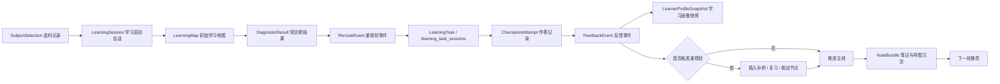

# AI主导学习生命周期的自进化自学智能体平台算法设计

## 1. 算法不是玄学：本项目到底算什么

这里的“算法”不是深度学习训练，也不是重新训练底层大模型。  
比赛版算法更像一套“学习决策规则 + 智能体编排策略 + 学习状态更新逻辑”。

人话解释：

| 名称 | 人话解释 | 当前是否需要训练模型 |
| --- | --- | --- |
| 学习地图生成 | 把一门课拆成学生能走的路线 | 不需要 |
| 短诊断校准 | 用几道题判断学生该从哪里开始 | 不需要 |
| 地图重规划 | 学生卡住时调整路线 | 不需要 |
| 学习画像更新 | 记录学生哪里强、哪里弱、容易怎么错 | 不需要 |
| 笔记与导图生成 | 把学习过程整理成复习资产 | 不需要 |
| 多科调度 | 控制多门课怎么排，不让学生混乱切换 | 不需要 |
| ADP 多智能体编排 | 让不同 Agent 分工完成讲解、评分、总结 | 不需要训练，但要配置工作流 |

所以答辩时不要把它讲成“我们训练了一个模型”。  
更准确的讲法是：我们把学习流程拆成可计算、可记录、可回看的规则和对象，再让 ADP 智能体群参与推理与生成。

## 2. 设计目标

- 让学生一开始就有地图，而不是面对空白聊天框。
- 让地图在学习中持续演化，而不是只在开局排一次课。
- 让系统在卡点出现时马上补桥，而不是把学生扔回全书。
- 让每轮学习都沉淀为可复习资产。
- 让每次调整都有证据，能被后台解释和答辩复盘。
- 让多科并行时仍然有主次，不把学生带进混乱切换。

## 3. 学习主算法链

这条链路的验证重点是：每一步都应该有明确输入、输出和可回看证据。

## 4. 核心算法模块

| 模块 | 输入 | 输出 | 作用 | 证据 |
| --- | --- | --- | --- | --- |
| AI学习地图生成 | 学科目录、`main` 教学区知识资产、历史画像 | `LearningMap` | 生成初始主线和阶段结构 | 地图对象、节点列表 |
| 短诊断校准 | 初始地图、诊断题、学生回答 | `DiagnosticResult`、`RerouteEvent` | 校准学生起点和第一版顺序 | 诊断结果、地图重排记录 |
| 地图重规划策略 | 画像、作答、卡点信号、遗忘信号 | `RerouteEvent` | 学习中持续调整地图 | 重规划事件 |
| 兴趣保持与正反馈策略 | 通关结果、停滞时长、节奏信号 | `FeedbackEvent` | 保持学生兴趣和推进感 | 成长反馈卡 |
| 学习画像更新 | 作答记录、地图推进、复习结果 | `LearnerProfileSnapshot` | 描述当前状态和风险 | 画像快照 |
| 笔记汇总策略 | 讲解结果、错题、关键点 | `NoteBundle` | 形成复习资产 | 笔记、导图、复习计划 |
| 多科调度策略 | 多科地图、全局画像、复习任务 | 今日学习队列 | 让多科并行不混乱 | 学习队列 |

## 5. 学习地图生成规则

### 5.1 输入

| 输入 | 来源 | 说明 |
| --- | --- | --- |
| 学科目录 | 知识库主干 | 章节、知识点、先修关系 |
| 知识资产 | `main` 教学区 | 讲义、例题、题目、误区卡 |
| 历史画像 | `LearnerProfileSnapshot` | 薄弱点、节奏偏好、已掌握节点 |
| 当前目标 | 用户选择 / 系统推荐 | 单科、多科、复习或冲刺模式 |

### 5.2 输出

| 输出字段 | 中文含义 | 示例 |
| --- | --- | --- |
| `mapId` | 地图编号 | `map_math_001` |
| `subjectId` | 学科编号 | `math` |
| `stages[]` | 阶段列表 | 预备补桥、函数极限连续、导数与微分 |
| `nodes[]` | 节点列表 | 主线、补桥、复习、Boss |
| `currentNodeId` | 当前节点 | `node_limit_intro` |
| `recommendedNextNodeId` | 推荐下一步 | `node_limit_diagnostic` |
| `explain` | 地图解释 | 为什么先从这个节点开始 |

### 5.3 规则

| 规则 | 说明 |
| --- | --- |
| 先有默认主线 | 没画像时也要能给出可走路线 |
| 画像只做校准 | 画像不能替代学科结构 |
| 节点要有类型 | 主线、补桥、复习、挑战、Boss、奖励必须区分 |
| 起点要能解释 | 不能只说“系统推荐”，要说明为什么 |
| 地图可局部更新 | 后续变化只改受影响区域，不全量重建 |

页面上怎么体现：地图页至少要看到当前主线、推荐下一步、阶段结构和“为什么这样排”。

## 6. 短诊断校准规则

短诊断不是正式考试，它是为了快速判断学生适合从哪里开始。

### 6.1 诊断题设计

| 题型 | 目的 | 数量建议 |
| --- | --- | --- |
| 基础概念题 | 判断是否需要预备补桥 | 1-2 |
| 核心技能题 | 判断能否进入当前章节 | 1-2 |
| 易错识别题 | 捕捉错误模式 | 1 |
| 迁移理解题 | 判断是否适合挑战 | 0-1 |

### 6.2 判定输出

| 判定 | 触发条件 | 动作 |
| --- | --- | --- |
| `直接进入主线` | 基础题和核心题均达标 | 从推荐主线节点开始 |
| `插入预备补桥` | 基础概念薄弱 | 先插入预备补桥节点 |
| `降低起点` | 核心技能不稳 | 从更早的章节或例题开始 |
| `跳过已掌握` | 题目稳定正确且解释清楚 | 跳过入门节点 |
| `进入挑战` | 高准确且表达清楚 | 解锁挑战或 Boss 节点 |

### 6.3 必须输出解释

每次诊断后都要生成：

- 学生当前起点
- 主要薄弱点
- 地图做了什么调整
- 为什么这样调整
- 下一步应该先做什么

页面上怎么体现：不能只返回“通过/未通过”，要在地图页直接展示起点变化和调整原因。

## 7. 地图重规划策略

### 7.1 触发条件

| 触发类型 | 触发信号 | 推荐动作 |
| --- | --- | --- |
| 连续错误 | 同类题连续错 2 次以上 | 插入补桥节点 |
| 基础缺口 | 错因落在先修概念 | 回到预备补桥 |
| 长时间卡住 | 停留超过阈值或多次求提示 | 降低难度或换例题 |
| 遗忘回落 | 曾掌握节点近期错误 | 插入复习节点 |
| 节奏疲劳 | 频繁跳过、长时间无操作 | 给更短任务或正反馈 |
| 超前掌握 | 多题稳定正确 | 跳过低价值节点或进入挑战 |

### 7.2 可执行动作

| 动作 | 含义 | 屏幕上怎么展示 |
| --- | --- | --- |
| `insert_bridge` | 插入补桥节点 | 地图出现支线和回主线入口 |
| `insert_review` | 插入复习节点 | 当前阶段增加复习提醒 |
| `lower_difficulty` | 降低难度 | 当前关卡换更基础例题 |
| `skip_node` | 跳过已掌握节点 | 节点标记为已掌握并推进 |
| `unlock_challenge` | 解锁挑战 | 出现挑战或 Boss 节点 |
| `return_to_main` | 回到主线 | 支线达标后连接原主线 |

### 7.3 重规划事件字段

| 字段 | 中文含义 | 示例 |
| --- | --- | --- |
| `eventId` | 事件编号 | `reroute_20260411_001` |
| `triggerType` | 触发类型 | `weak_foundation` |
| `triggerEvidence` | 触发证据 | 连续 2 次混淆极限与函数值 |
| `actions[]` | 调整动作 | 插入补桥节点 |
| `returnCondition` | 回主线条件 | 补桥题正确率达到 80% |
| `studentMessage` | 给学生看的解释 | 先补函数图像直觉，再回到极限 |

页面上怎么体现：补桥必须解释成“被接住”，不是“被惩罚”。

## 8. 学习画像更新

学习画像不是标签墙，它是下一次地图规划的依据。

### 8.1 画像字段

| 字段 | 中文含义 | 更新来源 |
| --- | --- | --- |
| `mastery` | 掌握度 | 作答、通关、复习 |
| `weakFoundations[]` | 薄弱基础 | 错因分析、诊断 |
| `errorPatterns[]` | 错误模式 | 判题反馈 |
| `pacePreference` | 学习节奏偏好 | 停留时长、提示次数 |
| `frustrationRisk` | 挫败风险 | 连续错误、长时间卡住 |
| `completedNodes[]` | 已完成节点 | 地图推进 |
| `reviewDueNodes[]` | 待复习节点 | 遗忘策略 |

### 8.2 更新规则

| 情况 | 更新动作 |
| --- | --- |
| 正确且解释清楚 | 提升掌握度，减少复习压力 |
| 正确但解释不清 | 小幅提升，保留复习提醒 |
| 错误且错因明确 | 记录错误模式，触发补桥判断 |
| 多次求提示 | 记录节奏压力，降低下一题难度 |
| 补桥通过 | 标记基础缺口已修补，回主线 |

页面上怎么体现：成长页至少能看见掌握度变化、薄弱点变化和待复习节点变化。

## 9. 笔记与导图生成

### 9.1 生成时机

| 时机 | 产物 |
| --- | --- |
| 单关结束 | 本关摘要、关键公式、错因 |
| 一轮学习结束 | 结构化笔记、错题回顾 |
| 阶段结束 | 思维导图、复习计划 |

### 9.2 笔记结构

| 模块 | 内容 |
| --- | --- |
| 学了什么 | 本轮知识点和目标 |
| 怎么理解 | 用人话解释关键概念 |
| 错在哪里 | 错误模式和误区 |
| 下次怎么复习 | 复习任务和题目建议 |
| 和地图关系 | 对应地图节点和阶段 |

页面上怎么体现：不能只给下载按钮，必须能直接看到结构化笔记、导图和复习计划。

## 10. 多科调度策略

比赛演示优先高数，但系统设计支持多科。

| 规则 | 说明 |
| --- | --- |
| 单科地图独立 | 每门课都有自己的地图和画像 |
| 全局队列统一 | 平台生成今日学习队列 |
| 高风险优先 | 待复习和薄弱点优先于新内容 |
| 防止频繁切换 | 同一时段只推进一个当前主关卡 |
| 跨科提醒谨慎 | 只在复习、考试计划或基础迁移时提示 |

## 11. 算法验收重点

| 检查项 | 通过标准 |
| --- | --- |
| 地图生成 | 无画像也能生成第一版地图 |
| 诊断校准 | 诊断后至少能说明是否调整路线 |
| 补桥触发 | 预设薄弱答案能稳定触发补桥 |
| 回主线 | 补桥有明确回接条件 |
| 画像更新 | 作答后能看到画像变化 |
| 笔记沉淀 | 学完至少生成结构化笔记或导图 |
