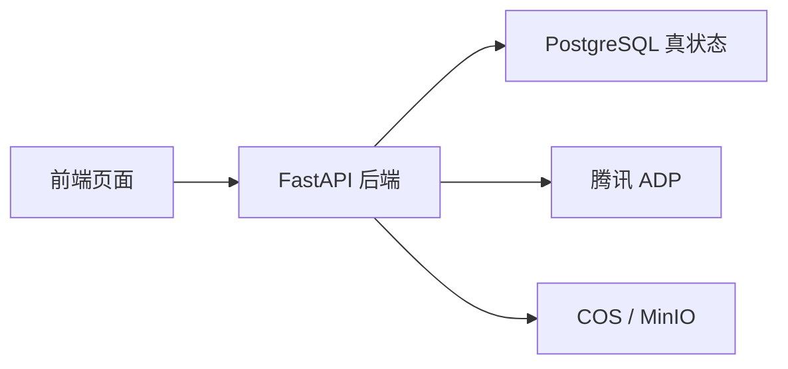

# 比赛版 API 文档

这份文档只保留比赛版真正需要的主链接口，写法以中文为主，英文只保留在路径、对象名和字段名里。

## 1. 接口总览



| 方向 | 负责什么 | 不做什么 |
| --- | --- | --- |
| 前端 -> 后端 | 页面动作、状态读取、流式展示 | 不直接调用 ADP |
| 后端 -> 数据库 | 保存学习主链、画像、知识治理、审计真状态 | 不保存大文件正文 |
| 后端 -> ADP | 调用讲解、诊断、抽取、策略相关智能体 | 不把业务真状态留在 ADP |
| 后端 -> 对象存储 | 上传原始资料、导图、导出资源 | 不负责结构化查询 |

## 2. 通用约定

| 项目 | 约定 |
| --- | --- |
| 基础协议 | `HTTPS + JSON` |
| 流式协议 | 前端收 `SSE`，后端对 ADP 用 `HTTP SSE V2` |
| 时间格式 | `ISO-8601` |
| 跟踪编号 | `X-Trace-Id` |
| 幂等键 | `Idempotency-Key` |

### 2.1 成功响应

```json
{
  "success": true,
  "traceId": "trace_20260414_001",
  "data": {},
  "message": "ok"
}
```

### 2.2 失败响应

```json
{
  "success": false,
  "traceId": "trace_20260414_001",
  "error": {
    "code": "LEARNING_STREAM_TIMEOUT",
    "message": "流式讲解超时，已切换到稳定结果",
    "recoverable": true,
    "suggestion": "可以继续当前节点，也可以稍后重试"
  }
}
```

### 2.3 错误码分组

| 前缀 | 含义 | 示例 |
| --- | --- | --- |
| `STARTUP_` | 启动会话相关错误 | `STARTUP_SUBJECT_NOT_FOUND` |
| `MAP_` | 地图生成与重规划错误 | `MAP_REROUTE_FAILED` |
| `LEARNING_` | 闯关学习错误 | `LEARNING_STREAM_TIMEOUT` |
| `PROFILE_` | 画像沉淀错误 | `PROFILE_GENERATION_FAILED` |
| `NOTE_` | 笔记与导图错误 | `NOTE_GENERATION_PENDING` |
| `KNOWLEDGE_` | 知识治理错误 | `KNOWLEDGE_CONFLICT_BLOCKED` |
| `OPS_` | 运维与审计错误 | `OPS_HEALTHCHECK_FAILED` |

## 3. 核心对象口径

| 中文名 | 对象名 | 用途 |
| --- | --- | --- |
| 学习启动会话 | `LearningSession` | 记录一次正式学习链路的开始 |
| 学习地图 | `LearningMap` | 记录当前主线、支线、阶段和推荐路径 |
| 地图节点 | `MapNode` | 记录地图中的具体学习节点 |
| 短诊断结果 | `DiagnosticResult` | 记录短诊断判断和起点校准 |
| 重规划事件 | `RerouteEvent` | 记录补桥、回主线、降难等路线调整 |
| 学习任务 | `LearningTask` | 记录某个节点下的具体闯关任务 |
| 闯关作答记录 | `CheckpointAttempt` | 记录学生一次作答和评分结果 |
| 成长反馈事件 | `FeedbackEvent` | 记录一次即时反馈和推进结果 |
| 学习画像快照 | `LearnerProfileSnapshot` | 记录当前掌握度、薄弱点和风险信号 |
| 笔记资产包 | `NoteBundle` | 记录结构化笔记、导图和复习计划 |
| 资料入库任务 | `IngestionTask` | 记录一份资料的入库处理状态 |
| 知识补丁 | `KnowledgePatch` | 记录抽取出的结构化知识声明 |
| 候选知识 | `KnowledgeCandidate` | 记录等待审核的候选知识 |
| 校验报告 | `ValidationReport` | 记录可信度判断和门禁结论 |
| 知识发布 | `KnowledgeRelease` | 记录正式发布结果和影响范围 |
| 知识回滚 | `KnowledgeRollback` | 记录回滚原因、目标版本和影响范围 |
| 策略快照 | `StrategySnapshot` | 记录发布或重规划后的策略状态 |

## 4. 关键状态口径

### 4.1 学习任务会话状态

| 状态 | 中文含义 |
| --- | --- |
| `pending` | 待开始 |
| `streaming` | 正在流式讲解 |
| `waiting_answer` | 等待学生作答 |
| `evaluating` | 正在评分 |
| `completed` | 已完成 |
| `aborted` | 已中止 |

### 4.2 沉淀状态

| 状态 | 中文含义 |
| --- | --- |
| `pending` | 已触发，后台处理中 |
| `ready` | 画像和笔记已生成 |
| `failed` | 沉淀失败，需要重试 |

### 4.3 知识入库状态

| 状态 | 中文含义 |
| --- | --- |
| `uploaded` | 已上传 |
| `parsing` | 解析中 |
| `extracted` | 已抽取知识声明 |
| `validating` | 校验中 |
| `candidate` | 进入候选区 |
| `released` | 已发布 |
| `archived` | 已归档 |
| `failed` | 失败 |

## 5. 学习启动与地图接口

### 5.1 `GET /api/startup/subjects`

| 项目 | 内容 |
| --- | --- |
| 用途 | 查询当前可选科目 |
| 关键返回 | 科目列表、推荐科目、推荐理由 |

响应示例：

```json
{
  "success": true,
  "data": {
    "subjects": [
      {
        "subjectId": "math",
        "subjectName": "高等数学",
        "recommended": true,
        "reason": "比赛版默认演示主科目"
      }
    ]
  }
}
```

### 5.2 `GET /api/startup/resume`

| 项目 | 内容 |
| --- | --- |
| 用途 | 查询最近学习入口 |
| 关键返回 | 最近会话、最近地图、当前节点、推荐下一步 |

### 5.3 `POST /api/startup/session`

这条接口一体完成“创建学习启动会话 + 返回第一版学习地图”，不再要求前端额外调用单独的初始地图接口。

请求示例：

```json
{
  "studentId": "demo_student_001",
  "selectedSubjects": ["math"],
  "priorityMode": "single_subject"
}
```

响应示例：

```json
{
  "success": true,
  "data": {
    "selection": {
      "selectionId": "selection_001",
      "studentId": "demo_student_001",
      "subjects": ["math"],
      "priorityMode": "single_subject"
    },
    "session": {
      "sessionId": "learn_sess_001",
      "activeSubjectId": "math",
      "status": "started"
    },
    "learningMap": {
      "mapId": "map_math_001",
      "subjectId": "math",
      "currentNodeId": "node_pre_bridge_001",
      "recommendedNextNodeId": "node_limit_diag_001",
      "explain": "先补函数图像直觉，再进入极限短诊断",
      "stages": []
    }
  }
}
```

## 6. 诊断与地图重规划接口

### 6.1 `POST /api/diagnostics/{subjectId}/submit`

| 项目 | 内容 |
| --- | --- |
| 用途 | 提交短诊断答案并触发地图校准 |
| 关键返回 | `DiagnosticResult`、`RerouteEvent`、更新后的 `LearningMap` |

请求示例：

```json
{
  "sessionId": "learn_sess_001",
  "answers": [
    {
      "questionId": "diag_limit_001",
      "answer": "函数值和极限值总是一样"
    }
  ]
}
```

响应示例：

```json
{
  "success": true,
  "data": {
    "diagnosticResult": {
      "diagnosticId": "diag_001",
      "score": 58,
      "decision": "insert_bridge",
      "weakFoundations": ["函数图像直觉"]
    },
    "rerouteEvent": {
      "eventId": "reroute_001",
      "triggerType": "weak_foundation",
      "studentMessage": "先补函数图像直觉，再回到极限"
    },
    "learningMap": {
      "mapId": "map_math_001",
      "currentNodeId": "node_bridge_graph_001",
      "recommendedNextNodeId": "node_bridge_graph_001"
    }
  }
}
```

## 7. 闯关学习与异步沉淀接口

### 7.1 `GET /api/learning/tasks/{taskId}`

| 项目 | 内容 |
| --- | --- |
| 用途 | 查询当前闯关任务详情 |
| 关键返回 | `LearningTask`、目标、通过条件、难度 |

### 7.2 `POST /api/learning/sessions`

| 项目 | 内容 |
| --- | --- |
| 用途 | 创建学习任务会话 |
| 关键返回 | `taskSessionId`、当前状态、关联任务编号 |

### 7.3 `GET /api/learning/sessions/{sessionId}/stream`

| 项目 | 内容 |
| --- | --- |
| 用途 | 由后端代理 ADP，向前端输出 SSE |
| 事件类型 | `tutor_delta`、`checkpoint_prompt`、`feedback_summary`、`reroute_event`、`done` |

事件示例：

```text
event: tutor_delta
data: {"text":"先看函数图像的变化趋势"}
```

### 7.4 `POST /api/learning/sessions/{sessionId}/answers`

这条接口只保证返回即时反馈，不同步返回完整画像、笔记和导图。

请求示例：

```json
{
  "taskId": "task_limit_001",
  "answerText": "我觉得极限就是函数值",
  "answerPayload": {
    "stepByStep": []
  }
}
```

响应示例：

```json
{
  "success": true,
  "data": {
    "attempt": {
      "attemptId": "attempt_001",
      "score": 62,
      "passed": false,
      "errorPattern": "混淆函数值与极限值"
    },
    "feedbackEvent": {
      "feedbackId": "feedback_001",
      "passed": false,
      "summaryText": "方向对了一半，但关键概念仍混淆"
    },
    "nextAction": {
      "actionType": "insert_bridge",
      "targetNodeId": "node_bridge_graph_001"
    },
    "settlementStatus": {
      "profile": "pending",
      "notes": "pending"
    }
  }
}
```

### 7.5 `GET /api/learning/sessions/{sessionId}/feedback`

这条接口是会话沉淀查询接口，用来读取异步生成的画像和笔记结果。

响应示例：

```json
{
  "success": true,
  "data": {
    "settlementStatus": "ready",
    "profileSnapshot": {
      "profileId": "profile_001",
      "frustrationRisk": 0.42,
      "weakFoundations": ["函数图像直觉"]
    },
    "noteBundle": {
      "notePackId": "note_pack_001",
      "structuredNotes": [],
      "reviewPlan": []
    },
    "assets": [
      {
        "assetId": "asset_mindmap_001",
        "assetType": "mind_map"
      }
    ]
  }
}
```

## 8. 资料入库与知识治理接口

### 8.1 `POST /api/ingestion/upload`

| 项目 | 内容 |
| --- | --- |
| 用途 | 上传资料并创建资料入库任务 |
| 关键返回 | `IngestionTask`、当前状态、资料来源编号 |

### 8.2 `GET /api/ingestion/tasks`

| 项目 | 内容 |
| --- | --- |
| 用途 | 查询入库任务列表和进度 |
| 关键返回 | 任务状态、进度、错误信息、资料标题 |

### 8.3 `GET /api/knowledge/candidates`

| 项目 | 内容 |
| --- | --- |
| 用途 | 查询候选知识和待审核列表 |
| 关键返回 | 候选知识、可信度、冲突摘要、校验结论 |

### 8.4 `POST /api/knowledge/releases`

当前比赛版用这条接口统一承接“发布”与“回滚”两类动作。

请求示例：

```json
{
  "action": "release",
  "candidateId": "candidate_001",
  "operatorId": "admin_demo"
}
```

回滚请求示例：

```json
{
  "action": "rollback",
  "releaseId": "release_001",
  "reason": "发现知识声明和教材口径冲突",
  "operatorId": "admin_demo"
}
```

返回重点：

- 发布时返回 `KnowledgeRelease`
- 回滚时返回 `KnowledgeRollback`
- 两种动作都会返回 `StrategySnapshot`
- 如影响学习主链，还会返回受影响会话的新地图版本摘要

### 8.5 `GET /api/knowledge/releases/{releaseId}`

| 项目 | 内容 |
| --- | --- |
| 用途 | 查询发布结果、影响域和地图版本变化 |
| 关键返回 | 发布结果、回滚信息、策略快照、受影响地图版本 |

## 9. 系统自治接口

### 9.1 `GET /api/ops/healthz`

| 项目 | 内容 |
| --- | --- |
| 用途 | 查询系统健康状态 |
| 关键返回 | API 状态、数据库状态、ADP 状态、对象存储状态 |

## 10. 前端页面到接口映射

| 页面 | 读取接口 | 写入接口 |
| --- | --- | --- |
| 选科与开学页 | `GET /api/startup/subjects`、`GET /api/startup/resume` | `POST /api/startup/session` |
| AI学习地图页 | 当前地图来自启动返回或会话恢复 | `POST /api/diagnostics/{subjectId}/submit` |
| AI闯关学习页 | `GET /api/learning/tasks/{taskId}`、`GET /api/learning/sessions/{sessionId}/stream` | `POST /api/learning/sessions`、`POST /api/learning/sessions/{sessionId}/answers` |
| 笔记复习与成长页 | `GET /api/learning/sessions/{sessionId}/feedback` | 无 |
| 资料注入后台 | `GET /api/ingestion/tasks`、`GET /api/knowledge/candidates`、`GET /api/knowledge/releases/{releaseId}` | `POST /api/ingestion/upload`、`POST /api/knowledge/releases` |
| 系统自治后台 | `GET /api/ops/healthz` | 无 |

## 11. 验收口径

- 启动后一次拿到学习启动会话和第一版学习地图。
- 短诊断后能看到短诊断结果、重规划事件和地图变化。
- 作答后先拿到即时反馈，画像和笔记通过查询接口异步可见。
- 知识发布后能看到影响域、新地图版本和必要时的回滚结果。

## 12. 接口性能约定

当前性能口径采用“比赛演示优先”，这里写的是用户可感知的接口表现，不是高并发生产指标。

| 接口 | 性能约定 | 说明 |
| --- | --- | --- |
| `GET /api/startup/subjects` | 正常情况下 1 秒内返回 | 只返回可选科目和推荐理由，不做复杂聚合 |
| `GET /api/startup/resume` | 正常情况下 1 秒内返回 | 只返回最近学习入口和必要状态 |
| `POST /api/startup/session` | 5 秒内返回 | 必须一次返回学习启动会话和第一版学习地图 |
| `POST /api/diagnostics/{subjectId}/submit` | 4 秒内返回 | 必须返回短诊断结果、重规划事件和更新后的地图 |
| `GET /api/learning/sessions/{sessionId}/stream` | 2 秒内收到首条 SSE 事件 | 这里的目标是首条事件时间，不是整段教学完成时间 |
| `POST /api/learning/sessions/{sessionId}/answers` | 3 秒内返回即时反馈 | 返回的是即时反馈，不等于完整沉淀已完成 |
| `GET /api/learning/sessions/{sessionId}/feedback` | 10 秒内查到 `ready` 或明确的 `failed` | 这条接口负责查询异步沉淀结果 |
| `GET /api/ingestion/tasks` | 2 秒内返回 | 上传后 3 秒内应能在任务列表看到新任务 |
| `GET /api/ops/healthz` | 正常情况下 1 秒内返回 | 用于启动前检查和日常巡检 |
