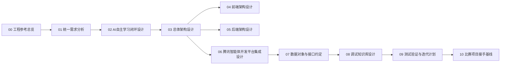
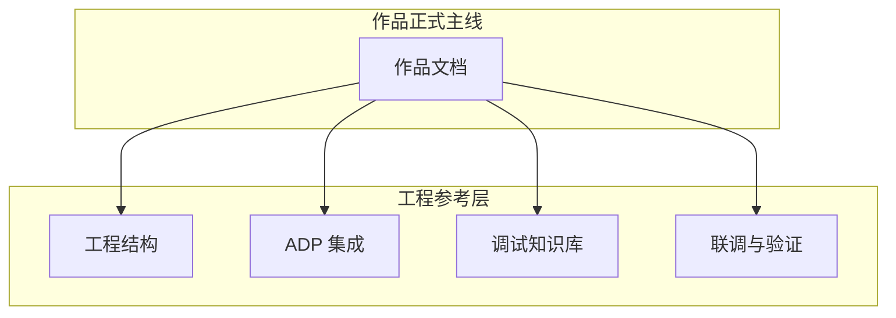

# 工程参考总览

本目录不再是作品主线，而是 `AI主导学习生命周期的自进化自学智能体平台` 的工程参考层。

## 站点定位

| 项目 | 说明 |
| --- | --- |
| 当前角色 | 工程参考层 |
| 站点目标 | 为平台集成、工程结构、联调验证和调试资料提供补充说明 |
| 正式主线 | `doc/作品文档` |
| 主要读者 | 开发者、联调人员、实现维护者 |
| 非目标 | 不再独立承担产品定义、答辩叙事和作品主阅读路径 |

## 先记住一件事

如果你是第一次进入项目，先回 [../作品文档/00-作品总览与阅读地图.md](../作品文档/00-作品总览与阅读地图.md)。

这里只有两种用途：

- 补充看实现细节
- 对照看工程落地

## 文档阅读地图

## 文档结构表

| 文档 | 主要回答的问题 | 当前作用 |
| --- | --- | --- |
| [00-开发总览](./00-开发总览.md) | 这组工程参考文档怎么读 | 阅读顺序、范围边界、使用方式 |
| [01-统一需求分析](./01-统一需求分析.md) | 工程侧如何理解产品目标 | 实现约束参考 |
| [02-AI自主学习闭环设计](./02-AI自主学习闭环设计.md) | 学生如何被 AI 持续引导学习 | 闭环实现补充 |
| [03-总体架构设计](./03-总体架构设计.md) | 前后端、平台、知识治理如何协同 | 实现架构参考 |
| [04-前端架构设计](./04-前端架构设计.md) | 界面如何承载学习流程与调试入口 | 前端结构参考 |
| [05-后端架构设计](./05-后端架构设计.md) | 服务如何承接主状态与任务编排 | 后端结构参考 |
| [06-腾讯智能体开发平台集成设计](./06-腾讯智能体开发平台集成设计.md) | 腾讯平台怎么选型和接入 | ADP 集成决策版 |
| [07-数据对象与接口约定](./07-数据对象与接口约定.md) | 中文对象与接口字段如何统一 | 工程对象参考 |
| [08-调试知识库设计](./08-调试知识库设计.md) | 高数调试资料如何服务开发 | 联调与回归参考 |
| [09-测试验证与迭代计划](./09-测试验证与迭代计划.md) | 如何验收和持续迭代 | 工程测试参考 |
| [10-比赛项目接手基线](./10-比赛项目接手基线.md) | 第一次接手这个比赛仓应先知道什么 | 项目状态、协作前置、下一步入口 |

## 当前范围边界

## 固定约束

| 约束 | 内容 |
| --- | --- |
| 入口约束 | 作品文档是唯一正式主线 |
| 实现约束 | 当前比赛版技术路线固定为 `ADP + Python + PostgreSQL` |
| 记忆约束 | 长期记忆只存画像摘要，不存业务真状态 |
| 知识治理约束 | 原始资料不直接进入主教学知识区 |
| 搜索约束 | 这里只作为工程参考，不再承担作品默认阅读顺序 |

## 读完后你应该带走什么

- 这组文档是工程参考，不再与作品文档争入口。
- 真正讲作品是什么、怎么展示、怎么答辩的地方，已经固定回到 `doc/作品文档`。
- 这里保留的价值是：把实现细节讲清，把工程约束讲清，把联调路径讲清。
- 如果你要正式接手工程落地，下一站先读 [10-比赛项目接手基线](./10-比赛项目接手基线.md)。
