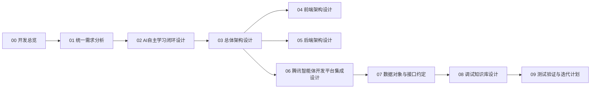
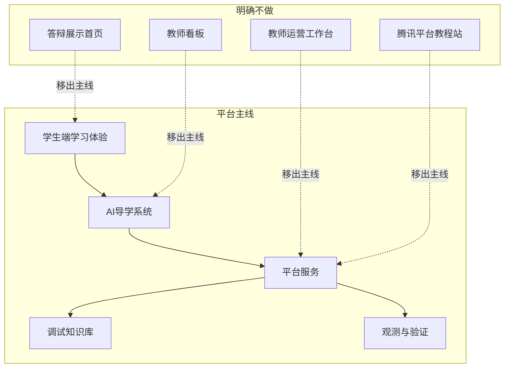
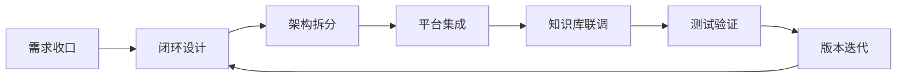

# 开发总览

本目录是当前唯一的活跃主线文档集，只服务于 `AI 自主引导学生学习平台` 的设计、实现、联调与验证。

## 站点定位

| 项目 | 说明 |
| --- | --- |
| 站点目标 | 为前端、后端、智能体平台接入、知识库调试和测试验证提供统一开发文档 |
| 主体角色 | 学生、AI导学系统、平台服务、开发运维人员 |
| 统一口径 | 不再拆分“平台需求”和“子引擎需求”，所有设计只描述一套平台 |
| 非目标 | 教师侧产品、教师看板、公开展示型首页、答辩叙事、平台教程站 |
| 调试约束 | 高等数学知识库只用于调试、回归和检索联调，不代表正式产品范围 |

## 文档阅读地图

## 文档结构表

| 文档 | 主要回答的问题 | 主要输出 |
| --- | --- | --- |
| [00-开发总览](./00-开发总览.md) | 这套文档站为什么存在，应该怎么读 | 阅读顺序、范围边界、术语口径 |
| [01-统一需求分析](./01-统一需求分析.md) | 平台解决谁的问题，成功标准是什么 | 目标、范围、非范围、指标 |
| [02-AI自主学习闭环设计](./02-AI自主学习闭环设计.md) | 学生如何被 AI 持续引导学习 | 闭环流程、风险回补、计划机制 |
| [03-总体架构设计](./03-总体架构设计.md) | 前后端、平台、知识检索如何协同 | 总体架构、模块边界、数据流 |
| [04-前端架构设计](./04-前端架构设计.md) | 界面如何承载学习流程与调试入口 | 路由、页面流、前端状态 |
| [05-后端架构设计](./05-后端架构设计.md) | 服务如何拆分，如何做风险与计划 | 服务职责、调用链、降级方案 |
| [06-腾讯智能体开发平台集成设计](./06-腾讯智能体开发平台集成设计.md) | 腾讯平台怎么选型和接入 | 多智能体编排、记忆、发布、接入 |
| [07-数据对象与接口约定](./07-数据对象与接口约定.md) | 中文对象与接口字段如何统一 | 对象模型、状态、事件、映射表 |
| [08-调试知识库设计](./08-调试知识库设计.md) | 高数调试知识库如何服务开发 | 标签、检索边界、回归策略 |
| [09-测试验证与迭代计划](./09-测试验证与迭代计划.md) | 如何验收和持续迭代 | 测试矩阵、验收项、版本节奏 |

## 开发范围边界图

## 统一术语

| 术语 | 统一写法 | 说明 |
| --- | --- | --- |
| 智能体 | 智能体 | 正文统一不使用 `agent` 作为主称呼 |
| 多智能体模式 | 多智能体模式 | 外部平台术语，可在括注中写 `Multi-Agent` |
| 工作流编排 | 工作流编排 | 当前正式协同方式 |
| 风险判定 | 风险判定 | 用于难度控制、回补与计划生成 |
| 学习计划 | 学习计划 | AI 根据风险与目标生成的行动安排 |
| 长期记忆 | 长期记忆 | 基于稳定学生标识的跨会话记忆 |
| 调试知识库 | 调试知识库 | 高等数学调试语料与回归样例集合 |

## 开发执行流程

## 当前固定约束

| 约束 | 内容 |
| --- | --- |
| 角色约束 | 只保留学生、AI导学系统、平台服务、开发运维人员 |
| 文档约束 | 主文档全中文，字段名与对象名全中文 |
| 实现约束 | 导学、诊断、讲解、测评、规划都作为平台内部能力存在 |
| 腾讯平台约束 | 正式方案固定为 `多智能体模式 + 工作流编排` |
| 搜索约束 | 主搜索只覆盖活跃开发文档和调试知识库 |
| 归档约束 | 历史资料默认不参与主线导航与默认搜索 |

## 非目标清单

| 非目标 | 原因 |
| --- | --- |
| 教师业务流程设计 | 当前平台主张是 AI 自主引导，不以教师运营为核心 |
| 独立高数产品叙事 | 高数只承担调试和回归任务 |
| 腾讯平台新手教学文档 | 只保留实现所需的集成设计和官方链接 |
| 平台与子引擎双 PRD | 会造成设计重复、实现边界模糊 |

