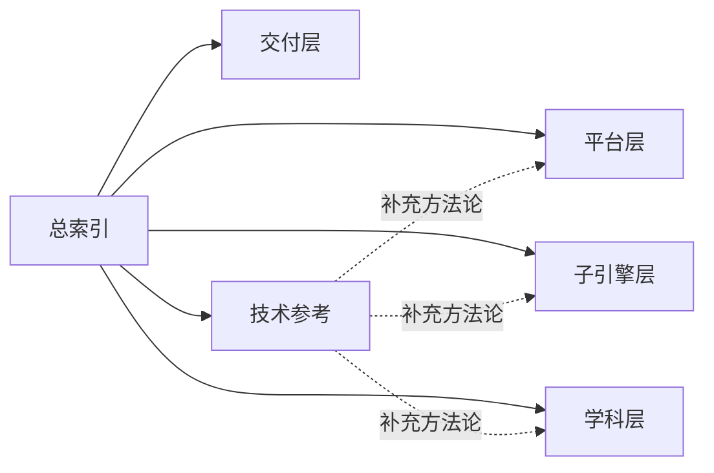
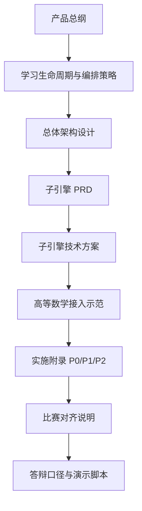

# AI主导学习平台文档总索引

> 文档层级：总入口  
> 文档目的：提供平台主线、子引擎主线、学科示范主线和技术参考入口的统一导航  
> 核心结论：主文档负责解释平台是什么、怎么运行、怎么扩展；技术参考负责解释方法论，不替代平台主线说明  
> 目标读者：新成员、答辩准备者、产品/研发协作者  
> 上游文档：无  
> 下游文档：平台层、子引擎层、学科层、交付层全部现行主文档，以及根目录技术参考文档  
> 适用范围：`doc/智能体文档/` 当前主目录与公开阅读入口  

## 与其他文档的边界

本文只负责回答“先看什么、主线在哪、每份文档分别负责什么”。  
本文不替代平台总纲、平台需求、子引擎 PRD、学科示范或技术参考本身。  

## 一句话先记住

> 如果你要理解平台本体，先看平台层和子引擎层；如果你要理解这一套文档为什么这样组织，再看 `CLAW_CODE_ANALYSIS_REPORT.md`。

## 1. 先读哪 4 份

如果你第一次进入这个项目，建议先读下面 4 份：

1. [平台层/AI主导学习平台-产品总纲.md](./平台层/AI主导学习平台-产品总纲.md)
2. [平台层/AI主导学习平台-学习生命周期与编排策略.md](./平台层/AI主导学习平台-学习生命周期与编排策略.md)
3. [平台层/AI主导学习平台-总体架构设计.md](./平台层/AI主导学习平台-总体架构设计.md)
4. [学科层/高等数学-平台接入示范.md](./学科层/高等数学-平台接入示范.md)

读完这 4 份，你应该能说清楚：

- 项目是 `AI主导学习平台`，不是单个高数 AI 教师作品
- `AI教师子引擎` 是平台内部的教学执行层
- `高等数学` 是第一门完整示范学科，不是整个平台的全部内容
- 平台主线围绕 `建档 -> 目录树 -> 当前任务卡 -> 子引擎闭环 -> 双层笔记 -> 阶段复习`

## 2. 主文档怎么分层

### 图 1：主文档阅读结构

### 2.1 平台层

平台层回答“平台是什么、怎么组织学习、怎么扩学科”。

- [平台层/AI主导学习平台-产品总纲.md](./平台层/AI主导学习平台-产品总纲.md)
- [平台层/AI主导学习平台-平台需求与验收.md](./平台层/AI主导学习平台-平台需求与验收.md)
- [平台层/AI主导学习平台-学习生命周期与编排策略.md](./平台层/AI主导学习平台-学习生命周期与编排策略.md)
- [平台层/AI主导学习平台-总体架构设计.md](./平台层/AI主导学习平台-总体架构设计.md)
- [平台层/AI主导学习平台-学科大类与接入规范.md](./平台层/AI主导学习平台-学科大类与接入规范.md)

### 2.2 子引擎层

子引擎层回答“AI教师子引擎怎么诊断、讲解、练习、测评、复盘，以及如何与平台协作”。

- [子引擎层/AI教师子引擎-PRD.md](./子引擎层/AI教师子引擎-PRD.md)
- [子引擎层/AI教师子引擎-教学策略设计.md](./子引擎层/AI教师子引擎-教学策略设计.md)
- [子引擎层/AI教师子引擎-技术方案.md](./子引擎层/AI教师子引擎-技术方案.md)
- [子引擎层/实施附录/01-P0-Multi-Agent学生主闭环-架构设计.md](./子引擎层/实施附录/01-P0-Multi-Agent学生主闭环-架构设计.md)
- [子引擎层/实施附录/02-P1-可视化与教师运营-架构设计.md](./子引擎层/实施附录/02-P1-可视化与教师运营-架构设计.md)
- [子引擎层/实施附录/03-P2-外部接入与产品后端-架构设计.md](./子引擎层/实施附录/03-P2-外部接入与产品后端-架构设计.md)

### 2.3 学科层

学科层回答“某一门课怎么按平台统一接口接入”。

- [学科层/高等数学-平台接入示范.md](./学科层/高等数学-平台接入示范.md)
- [学科层/高等数学-ADP配置手册.md](./学科层/高等数学-ADP配置手册.md)
- [学科层/学科接入模板.md](./学科层/学科接入模板.md)

### 2.4 交付层

交付层回答“怎么对齐比赛、怎么讲给评委、怎么演示”。

- [交付层/比赛对齐说明.md](./交付层/比赛对齐说明.md)
- [交付层/答辩口径与演示脚本.md](./交付层/答辩口径与演示脚本.md)

### 2.5 技术参考

技术参考不是平台主线文档，只负责补充“为什么这样组织文档、哪些方法论被吸收进来了”。

- [../../CLAW_CODE_ANALYSIS_REPORT.md](../../CLAW_CODE_ANALYSIS_REPORT.md)

## 3. 推荐阅读路径

### 图 2：从主线理解到实施落地的阅读路径

### 3.1 3 分钟理解项目

1. 产品总纲
2. 平台需求与验收
3. 高等数学-平台接入示范

### 3.2 研发/配置落地

1. 总体架构设计
2. 学习生命周期与编排策略
3. AI教师子引擎-PRD
4. AI教师子引擎-技术方案
5. 高等数学-ADP配置手册
6. `P0 / P1 / P2` 实施附录

### 3.3 答辩准备

1. 产品总纲
2. 学科大类与接入规范
3. 比赛对齐说明
4. 答辩口径与演示脚本

### 3.4 技术思想参考

1. `CLAW_CODE_ANALYSIS_REPORT.md`
2. 总体架构设计
3. 学习生命周期与编排策略
4. 学科接入模板

## 4. 当前固定口径

- 平台统一学习结构为：`学科大类 -> 学科 -> 阶段 -> 模块 -> 课节 -> 状态`
- 平台先解决“学习如何被持续组织与推进”
- 子引擎再解决“这一节具体怎么教、怎么练、怎么评”
- 学科层负责“这一门课接入时要交什么接口和策略资产”
- 技术参考只补充方法论，不替代平台主线文档

## 5. 这套主文档统一采用的骨架词

为了把 Claw 的方法真正落实到平台文档，而不是只留在技术参考里，现行主文档统一采用下面 5 个骨架词。  
本索引只负责告诉你“正式定义去哪里看”，不在这里重新下定义。

| 术语 | 先去哪里看正式定义 | 继续看哪些承接文档 |
| --- | --- | --- |
| `平台动作面` | 总体架构设计 | 产品总纲、高等数学接入示范、交付层两篇 |
| `子引擎能力面` | 总体架构设计 | 子引擎 PRD、子引擎教学策略设计、高等数学接入示范 |
| `会话与过程记录` | 学习生命周期与编排策略 | 子引擎技术方案、P0 实施附录、高等数学接入示范 |
| `轻量路由与启动装配` | 学习生命周期与编排策略 | 总体架构设计、P0 实施附录、高等数学 ADP 配置手册 |
| `权限边界与占位结构` | 学科大类与接入规范 | 平台需求与验收、P1/P2 实施附录、学科接入模板 |

技术参考文档负责解释这些词从哪里来；平台主文档负责把这些词讲成平台本体的一部分。

## 读完后你应该带走什么

- 主文档负责解释平台本体，技术参考负责解释方法来源。
- 平台层、子引擎层、学科层、交付层已经各自分工，不应该再互相代替。
- 真正的主阅读路径，应该从平台层进入，而不是从配置手册或归档稿进入。

## 下一篇建议阅读

1. [AI主导学习平台-产品总纲.md](./平台层/AI主导学习平台-产品总纲.md)
2. [AI主导学习平台-学习生命周期与编排策略.md](./平台层/AI主导学习平台-学习生命周期与编排策略.md)
3. [AI主导学习平台-总体架构设计.md](./平台层/AI主导学习平台-总体架构设计.md)

## 本文不负责什么

- 不定义平台 FR/NFR/AC
- 不定义 AI教师子引擎内部工作流
- 不定义高等数学以外学科的具体内容
- 不代替答辩稿或演示脚本
