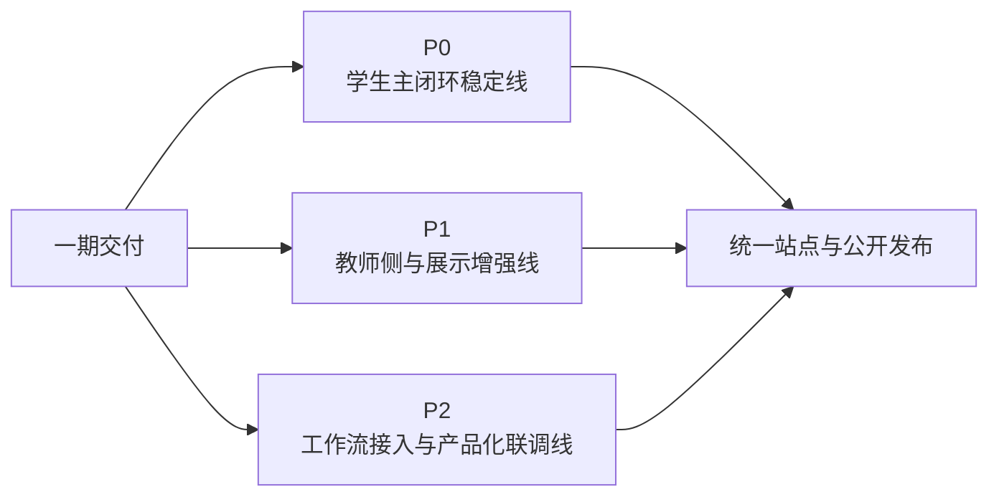

# AI主导学习平台文档总索引

> 文档层级：总入口  
> 文档目的：给出平台现行真源、一期四个核心入口、三条并行工作线与推荐阅读顺序  
> 核心结论：当前对外与对内的统一入口，不再围绕“比赛讲述顺序”组织，而是围绕“一期交付怎么并行成立、谁负责什么、文档真源在哪里”组织  
> 目标读者：新成员、研发协作者、答辩准备者、公开读者  
> 上游文档：无  
> 下游文档：平台层、子引擎层、学科层、交付层全部现行主文档  
> 适用范围：`doc/智能体文档/` 当前主目录与公开阅读入口

## 与其他文档的边界

本文只负责回答 4 个问题：

1. 现在哪些文档是固定真源
2. 一期交付优先看哪 4 个入口
3. `P0 / P1 / P2` 在这一轮里代表什么
4. 平台层、子引擎层、学科层、交付层分别承担什么

本文不替代平台总纲、统一对象契约、知识库结构契约或具体提示词全文。

## 一句话先记住

> 当前站点首页固定收口为四个核心入口，服务同一期交付：团队分工、知识库规范、工作流联调手册、提示词模板；`P0 / P1 / P2` 继续保留，但改为同一期内并行推进的三条工作线。

## 1. 首页固定的 4 个核心入口

当前首页第一屏固定收口为下面 4 张核心卡：

1. [平台层/AI主导学习平台-一期总览与团队分工.md](./平台层/AI主导学习平台-一期总览与团队分工.md)
2. [学科层/高等数学-知识库接入与落库方案.md](./学科层/高等数学-知识库接入与落库方案.md)
3. [子引擎层/AI教师子引擎-Agent工作流联调与验收手册.md](./子引擎层/AI教师子引擎-Agent工作流联调与验收手册.md)
4. [学科层/高等数学-Agent提示词模板与分层教学规范.md](./学科层/高等数学-Agent提示词模板与分层教学规范.md)

这 4 个入口的作用分别是：

- 一期总览与团队分工：解释这轮到底怎么做、谁负责什么
- 知识库规范：解释教材、试卷、讲义怎样电子化并落成可检索资产
- 工作流联调手册：解释多 Agent 如何路由、如何透传变量、如何验收
- 提示词模板：解释 Agent 如何根据学生状态稳定回答

## 2. 一期交付的三条并行工作线

| 工作线 | 正式定位 | 当前主结论 |
| --- | --- | --- |
| `P0` | 学生主闭环稳定线 | 一期内必须稳定跑通学生学习链路 |
| `P1` | 教师侧与展示增强线 | 一期内同步补齐教师侧观察与学生结果展示 |
| `P2` | 工作流接入与产品化联调线 | 一期内同步完成多 Agent 联调、变量透传与发布收口 |

### 图 1：一期并行工作线

统一说明：

> 一期交付是打包完成，不代表三条线没有依赖；它表示三条线在同一轮开发中闭环，而不是分成三个互相等待的独立学期。

## 3. 先读哪 5 份

如果你第一次进入这个项目，固定先读下面 5 份：

1. [平台层/AI主导学习平台-一期总览与团队分工.md](./平台层/AI主导学习平台-一期总览与团队分工.md)
2. [平台层/AI主导学习平台-角色主线与阶段地图.md](./平台层/AI主导学习平台-角色主线与阶段地图.md)
3. [学科层/高等数学-知识库接入与落库方案.md](./学科层/高等数学-知识库接入与落库方案.md)
4. [子引擎层/AI教师子引擎-Agent工作流联调与验收手册.md](./子引擎层/AI教师子引擎-Agent工作流联调与验收手册.md)
5. [学科层/高等数学-Agent提示词模板与分层教学规范.md](./学科层/高等数学-Agent提示词模板与分层教学规范.md)

读完这 5 份，应该能回答：

- 一期的公开交付到底是什么
- 三个开发成员如何配合
- 知识库为什么必须先做结构化落库
- Agent 为什么不能没有统一提示词模板

## 4. 文档怎么分层

### 4.1 平台层

平台层负责平台本体真源，优先回答：

- 平台是什么
- 角色和主线怎么定义
- 一期怎么并行推进
- 对象和接口怎么统一

- [平台层/AI主导学习平台-一期总览与团队分工.md](./平台层/AI主导学习平台-一期总览与团队分工.md)
- [平台层/AI主导学习平台-角色主线与阶段地图.md](./平台层/AI主导学习平台-角色主线与阶段地图.md)
- [平台层/AI主导学习平台-统一对象与接口契约.md](./平台层/AI主导学习平台-统一对象与接口契约.md)
- [平台层/AI主导学习平台-知识库结构与契约.md](./平台层/AI主导学习平台-知识库结构与契约.md)
- [平台层/AI主导学习平台-产品总纲.md](./平台层/AI主导学习平台-产品总纲.md)
- [平台层/AI主导学习平台-学习生命周期与编排策略.md](./平台层/AI主导学习平台-学习生命周期与编排策略.md)
- [平台层/AI主导学习平台-总体架构设计.md](./平台层/AI主导学习平台-总体架构设计.md)
- [平台层/AI主导学习平台-平台需求与验收.md](./平台层/AI主导学习平台-平台需求与验收.md)
- [平台层/AI主导学习平台-学科大类与接入规范.md](./平台层/AI主导学习平台-学科大类与接入规范.md)

### 4.2 子引擎层

子引擎层负责回答“AI教师子引擎如何把学生教学执行线、教师支持线和工作流联调线接住”。

- [子引擎层/AI教师子引擎-PRD.md](./子引擎层/AI教师子引擎-PRD.md)
- [子引擎层/AI教师子引擎-教学策略设计.md](./子引擎层/AI教师子引擎-教学策略设计.md)
- [子引擎层/AI教师子引擎-技术方案.md](./子引擎层/AI教师子引擎-技术方案.md)
- [子引擎层/AI教师子引擎-Agent工作流联调与验收手册.md](./子引擎层/AI教师子引擎-Agent工作流联调与验收手册.md)
- [子引擎层/实施附录/01-P0-Multi-Agent学生主闭环-架构设计.md](./子引擎层/实施附录/01-P0-Multi-Agent学生主闭环-架构设计.md)
- [子引擎层/实施附录/02-P1-可视化与教师运营-架构设计.md](./子引擎层/实施附录/02-P1-可视化与教师运营-架构设计.md)
- [子引擎层/实施附录/03-P2-外部接入与产品后端-架构设计.md](./子引擎层/实施附录/03-P2-外部接入与产品后端-架构设计.md)

### 4.3 学科层

学科层负责回答“高等数学这门示范学科怎样按统一对象、知识库规范和提示词规范挂进来”。

- [学科层/高等数学-平台接入示范.md](./学科层/高等数学-平台接入示范.md)
- [学科层/高等数学-知识库接入与落库方案.md](./学科层/高等数学-知识库接入与落库方案.md)
- [学科层/高等数学-Agent提示词模板与分层教学规范.md](./学科层/高等数学-Agent提示词模板与分层教学规范.md)
- [学科层/高等数学-ADP配置手册.md](./学科层/高等数学-ADP配置手册.md)
- [学科层/学科接入模板.md](./学科层/学科接入模板.md)

### 4.4 交付层

交付层仍然保留，但继续作为下游翻译层，只负责比赛叙事、答辩口径和演示收口。

- [交付层/比赛对齐说明.md](./交付层/比赛对齐说明.md)
- [交付层/答辩口径与演示脚本.md](./交付层/答辩口径与演示脚本.md)

### 4.5 技术参考

技术参考继续只补充方法论来源，不重定义平台主线。

- [../../CLAW_CODE_ANALYSIS_REPORT.md](../../CLAW_CODE_ANALYSIS_REPORT.md)

## 5. 哪些是真源，哪些只承接

| 类别 | 文档 | 当前职责 |
| --- | --- | --- |
| 一期交付真源 | [AI主导学习平台-一期总览与团队分工.md](./平台层/AI主导学习平台-一期总览与团队分工.md) | 定义三条并行工作线、三人分工与最终发布动作 |
| 角色与阶段真源 | [AI主导学习平台-角色主线与阶段地图.md](./平台层/AI主导学习平台-角色主线与阶段地图.md) | 定义正式角色、5 条主线与 `P0 / P1 / P2` 的能力定位 |
| 对象与字段真源 | [AI主导学习平台-统一对象与接口契约.md](./平台层/AI主导学习平台-统一对象与接口契约.md) | 定义学习对象、子引擎回流、教师运营摘要、接入字段 |
| 知识库结构真源 | [高等数学-知识库接入与落库方案.md](./学科层/高等数学-知识库接入与落库方案.md) | 定义高数资料电子化、拆卡、标签和验收规范 |
| 提示词与教学规范真源 | [高等数学-Agent提示词模板与分层教学规范.md](./学科层/高等数学-Agent提示词模板与分层教学规范.md) | 定义统一状态槽位与四类回答模板 |
| 工作流联调真源 | [AI教师子引擎-Agent工作流联调与验收手册.md](./子引擎层/AI教师子引擎-Agent工作流联调与验收手册.md) | 定义 Agent 职责边界、变量透传、检索绑定与回归样例 |

## 6. 推荐阅读路径

### 6.1 理解一期交付

1. [平台层/AI主导学习平台-一期总览与团队分工.md](./平台层/AI主导学习平台-一期总览与团队分工.md)
2. [平台层/AI主导学习平台-角色主线与阶段地图.md](./平台层/AI主导学习平台-角色主线与阶段地图.md)

### 6.2 做知识库

1. [学科层/高等数学-知识库接入与落库方案.md](./学科层/高等数学-知识库接入与落库方案.md)
2. [平台层/AI主导学习平台-知识库结构与契约.md](./平台层/AI主导学习平台-知识库结构与契约.md)

### 6.3 做 Agent 与工作流

1. [学科层/高等数学-Agent提示词模板与分层教学规范.md](./学科层/高等数学-Agent提示词模板与分层教学规范.md)
2. [子引擎层/AI教师子引擎-Agent工作流联调与验收手册.md](./子引擎层/AI教师子引擎-Agent工作流联调与验收手册.md)
3. `ops/adp-prompts/highmath-v1/` 提示词文件

### 6.4 做对外演示与发布

1. [交付层/答辩口径与演示脚本.md](./交付层/答辩口径与演示脚本.md)
2. 首页四张核心卡
3. `master` 分支与 GitHub Pages

## 7. 当前固定口径

- 项目是 `AI主导学习平台`，不是单一学科问答页。
- 高等数学是第一门完整示范学科，不是平台本体。
- `P0 / P1 / P2` 在这一轮里是并行工作线，不是必须串行等待的开发阶段。
- 首页四张核心卡优先承担执行与公开说明职责，不再主打推荐资料卡。
- 最终对外交付必须落到 GitHub 仓库与 GitHub Pages。

## 读完后你应该带走什么

- 先按一期四个核心入口理解项目，而不是从零散资料开始翻。
- `P0 / P1 / P2` 继续保留，但口径已经切成“一期并行”。
- 平台层、子引擎层、学科层和交付层已经各自回到清晰边界。

## 下一篇建议阅读

1. [AI主导学习平台-一期总览与团队分工.md](./平台层/AI主导学习平台-一期总览与团队分工.md)
2. [AI主导学习平台-角色主线与阶段地图.md](./平台层/AI主导学习平台-角色主线与阶段地图.md)
3. [高等数学-知识库接入与落库方案.md](./学科层/高等数学-知识库接入与落库方案.md)
4. [高等数学-Agent提示词模板与分层教学规范.md](./学科层/高等数学-Agent提示词模板与分层教学规范.md)

## 本文不负责什么

- 不定义对象字段细节
- 不展开具体 Agent 提示词全文
- 不代替比赛答辩稿
- 不替代实际发布操作日志
