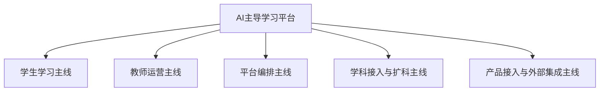
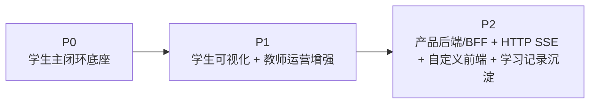

# AI主导学习平台文档总索引

> 文档层级：总入口  
> 文档目的：给出平台现行真源、角色主线、阶段地图与阅读入口  
> 核心结论：现行主文档不再围绕“比赛作品怎么讲”组织，而是围绕“谁在走哪条主线、平台分阶段怎么成立、对象契约在哪里”组织  
> 目标读者：新成员、产品/研发协作者、答辩准备者、公开读者  
> 上游文档：无  
> 下游文档：平台层、子引擎层、学科层、交付层全部现行主文档  
> 适用范围：`doc/智能体文档/` 当前主目录与公开阅读入口

## 与其他文档的边界

本文只负责回答 4 个问题：

1. 平台现行真源有哪些
2. 应该先按什么主线理解平台
3. `P0 / P1 / P2` 分别代表什么
4. 哪些文档负责定义，哪些文档只负责承接与翻译

本文不替代平台总纲、角色主线图、统一对象契约、知识库结构契约、子引擎 PRD 或学科示范本身。

## 一句话先记住

> 这一轮文档重构的目标，不是压缩平台能力，而是把 `角色主线`、`阶段主线`、`统一对象契约` 讲清楚，让平台层、子引擎层、学科层、交付层都回到同一套真源上。

## 1. 平台当前固定的 5 条主线

本项目当前第一屏固定按下面 5 条主线理解：

1. 学生学习主线
2. 教师运营主线
3. 平台编排主线
4. 学科接入与扩科主线
5. 产品接入与外部集成主线

### 图 1：5 条主线总览

## 2. 阶段地图

平台现行阶段地图固定为：

| 阶段 | 正式定位 | 主结论 |
| --- | --- | --- |
| `P0` | 学生主闭环底座 | 先把学生持续推进链路跑通，稳定承接学习会话、任务卡、子引擎回流和双层笔记 |
| `P1` | 学生可视化 + 教师运营增强 | 在不破坏 `P0` 的前提下补齐学生可视化结果、教师风险识别和干预入口 |
| `P2` | 产品后端/BFF + `HTTP SSE` + 自定义前端 + 学习记录沉淀 | 把平台和子引擎安全接进真实前端/后端系统，并形成稳定的业务沉淀与接入接口 |

### 图 2：阶段地图

## 3. 先读哪 5 份

如果你第一次进入这个项目，固定先读下面 5 份：

1. [平台层/AI主导学习平台-角色主线与阶段地图.md](./平台层/AI主导学习平台-角色主线与阶段地图.md)
2. [平台层/AI主导学习平台-统一对象与接口契约.md](./平台层/AI主导学习平台-统一对象与接口契约.md)
3. [平台层/AI主导学习平台-产品总纲.md](./平台层/AI主导学习平台-产品总纲.md)
4. [平台层/AI主导学习平台-总体架构设计.md](./平台层/AI主导学习平台-总体架构设计.md)
5. [学科层/高等数学-平台接入示范.md](./学科层/高等数学-平台接入示范.md)

读完这 5 份，应该能回答：

- 平台有哪些正式角色，谁走哪条主线
- `P0 / P1 / P2` 分别成立什么能力，又不替代什么
- 平台当前的统一对象有哪些，字段契约在哪里
- 高等数学为什么只是第一门完整示范学科，而不是平台本体

## 4. 文档怎么分层

### 4.1 平台层

平台层负责平台本体真源，优先回答“平台是什么、按什么角色运转、按什么对象协作、按什么阶段成立”。

- [平台层/AI主导学习平台-角色主线与阶段地图.md](./平台层/AI主导学习平台-角色主线与阶段地图.md)
- [平台层/AI主导学习平台-统一对象与接口契约.md](./平台层/AI主导学习平台-统一对象与接口契约.md)
- [平台层/AI主导学习平台-知识库结构与契约.md](./平台层/AI主导学习平台-知识库结构与契约.md)
- [平台层/AI主导学习平台-产品总纲.md](./平台层/AI主导学习平台-产品总纲.md)
- [平台层/AI主导学习平台-学习生命周期与编排策略.md](./平台层/AI主导学习平台-学习生命周期与编排策略.md)
- [平台层/AI主导学习平台-总体架构设计.md](./平台层/AI主导学习平台-总体架构设计.md)
- [平台层/AI主导学习平台-平台需求与验收.md](./平台层/AI主导学习平台-平台需求与验收.md)
- [平台层/AI主导学习平台-学科大类与接入规范.md](./平台层/AI主导学习平台-学科大类与接入规范.md)

### 4.2 子引擎层

子引擎层负责回答“AI教师子引擎如何同时承接学生教学执行线和教师运营支持线”。

- [子引擎层/AI教师子引擎-PRD.md](./子引擎层/AI教师子引擎-PRD.md)
- [子引擎层/AI教师子引擎-教学策略设计.md](./子引擎层/AI教师子引擎-教学策略设计.md)
- [子引擎层/AI教师子引擎-技术方案.md](./子引擎层/AI教师子引擎-技术方案.md)
- [子引擎层/实施附录/01-P0-Multi-Agent学生主闭环-架构设计.md](./子引擎层/实施附录/01-P0-Multi-Agent学生主闭环-架构设计.md)
- [子引擎层/实施附录/02-P1-可视化与教师运营-架构设计.md](./子引擎层/实施附录/02-P1-可视化与教师运营-架构设计.md)
- [子引擎层/实施附录/03-P2-外部接入与产品后端-架构设计.md](./子引擎层/实施附录/03-P2-外部接入与产品后端-架构设计.md)

### 4.3 学科层

学科层负责回答“某门学科怎样按平台统一对象与统一接口挂进来”。

- [学科层/高等数学-平台接入示范.md](./学科层/高等数学-平台接入示范.md)
- [学科层/高等数学-知识库接入与落库方案.md](./学科层/高等数学-知识库接入与落库方案.md)
- [学科层/高等数学-ADP配置手册.md](./学科层/高等数学-ADP配置手册.md)
- [学科层/学科接入模板.md](./学科层/学科接入模板.md)

### 4.4 交付层

交付层降为下游翻译层，只负责比赛叙事、答辩口径与演示翻译，不承担平台本体定义职责。

- [交付层/比赛对齐说明.md](./交付层/比赛对齐说明.md)
- [交付层/答辩口径与演示脚本.md](./交付层/答辩口径与演示脚本.md)

### 4.5 技术参考

技术参考只补充方法论来源，不重定义平台主线。

- [../../CLAW_CODE_ANALYSIS_REPORT.md](../../CLAW_CODE_ANALYSIS_REPORT.md)

## 5. 哪些是真源，哪些只承接

| 类别 | 文档 | 当前职责 |
| --- | --- | --- |
| 角色与阶段真源 | [AI主导学习平台-角色主线与阶段地图.md](./平台层/AI主导学习平台-角色主线与阶段地图.md) | 定义正式角色、5 条主线、`P0 / P1 / P2` 角色分工 |
| 对象与字段真源 | [AI主导学习平台-统一对象与接口契约.md](./平台层/AI主导学习平台-统一对象与接口契约.md) | 定义学习对象、子引擎回流、教师运营摘要、接入字段 |
| 知识库结构真源 | [AI主导学习平台-知识库结构与契约.md](./平台层/AI主导学习平台-知识库结构与契约.md) | 定义知识库三层结构、文档类型、元数据字段、检索边界 |
| 平台架构真源 | [AI主导学习平台-总体架构设计.md](./平台层/AI主导学习平台-总体架构设计.md) | 定义按层 + 按角色 + 按阶段的总体架构与能力面 |
| 平台编排真源 | [AI主导学习平台-学习生命周期与编排策略.md](./平台层/AI主导学习平台-学习生命周期与编排策略.md) | 定义编排原则、流程、介入点与回流路径 |
| 平台需求真源 | [AI主导学习平台-平台需求与验收.md](./平台层/AI主导学习平台-平台需求与验收.md) | 定义需求、验收与角色向通过标准 |
| 子引擎承接 | 子引擎层全部现行主文档 | 承接角色、阶段、对象契约，不自行另立平台真源 |
| 学科承接 | 学科层全部现行主文档 | 用示范学科和模板承接统一对象与扩科能力 |
| 交付翻译 | 交付层全部现行主文档 | 引用真源做演示翻译，不重定义平台本体 |

## 6. 推荐阅读路径

### 6.1 理解平台本体

1. [平台层/AI主导学习平台-角色主线与阶段地图.md](./平台层/AI主导学习平台-角色主线与阶段地图.md)
2. [平台层/AI主导学习平台-统一对象与接口契约.md](./平台层/AI主导学习平台-统一对象与接口契约.md)
3. [平台层/AI主导学习平台-知识库结构与契约.md](./平台层/AI主导学习平台-知识库结构与契约.md)
4. [平台层/AI主导学习平台-产品总纲.md](./平台层/AI主导学习平台-产品总纲.md)
5. [平台层/AI主导学习平台-总体架构设计.md](./平台层/AI主导学习平台-总体架构设计.md)

### 6.2 研发与接入落地

1. [平台层/AI主导学习平台-学习生命周期与编排策略.md](./平台层/AI主导学习平台-学习生命周期与编排策略.md)
2. [子引擎层/AI教师子引擎-PRD.md](./子引擎层/AI教师子引擎-PRD.md)
3. [子引擎层/AI教师子引擎-技术方案.md](./子引擎层/AI教师子引擎-技术方案.md)
4. [学科层/高等数学-ADP配置手册.md](./学科层/高等数学-ADP配置手册.md)
5. `P0 / P1 / P2` 三篇实施附录

### 6.3 扩科与学科接入

1. [平台层/AI主导学习平台-学科大类与接入规范.md](./平台层/AI主导学习平台-学科大类与接入规范.md)
2. [学科层/学科接入模板.md](./学科层/学科接入模板.md)
3. [学科层/高等数学-平台接入示范.md](./学科层/高等数学-平台接入示范.md)
4. [学科层/高等数学-知识库接入与落库方案.md](./学科层/高等数学-知识库接入与落库方案.md)

### 6.4 比赛演示与答辩

1. [交付层/比赛对齐说明.md](./交付层/比赛对齐说明.md)
2. [交付层/答辩口径与演示脚本.md](./交付层/答辩口径与演示脚本.md)

## 7. 当前固定口径

- 项目是 `AI主导学习平台`，不是单个学科作品。
- 高等数学是第一门完整示范学科，不是平台角色入口。
- 学科接入与扩科属于平台能力主线，不再单列“学科设计者”正式角色。
- `P1 / P2` 是正式竞争力路线，不是附属增强备注。
- 研发真源在平台层、子引擎层、学科层；交付层只做演示翻译。

## 读完后你应该带走什么

- 先按角色主线理解平台，再按阶段地图理解平台怎么成立。
- 所有对象字段、接入字段、回流结果，统一回到对象契约文档。
- 交付层不再承担平台本体解释职责。

## 下一篇建议阅读

1. [AI主导学习平台-角色主线与阶段地图.md](./平台层/AI主导学习平台-角色主线与阶段地图.md)
2. [AI主导学习平台-统一对象与接口契约.md](./平台层/AI主导学习平台-统一对象与接口契约.md)
3. [AI主导学习平台-产品总纲.md](./平台层/AI主导学习平台-产品总纲.md)

## 本文不负责什么

- 不定义对象字段细节
- 不定义子引擎内部工作流
- 不替代学科示范或配置手册
- 不代替比赛答辩稿
