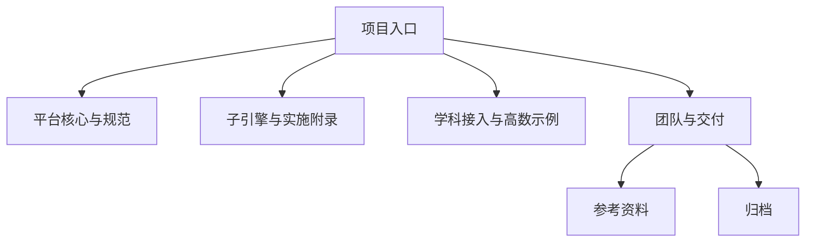

# AI主导学习平台文档总索引

> 文档层级：总入口
> 文档目的：按站点最终分类，把 33 篇现行文档和次级参考入口一次说明清楚
> 核心结论：现行文档不再是一串平铺文件，而是按项目入口、平台真源、实现主线、学科示范、团队交付和次级参考层分组
> 目标读者：新成员、开发者、项目负责人、评委答辩准备者
> 推荐下一步：如果你还没建立阅读路径，先回到 [00-项目阅读地图.md](./00-项目阅读地图.md)

## 与其他文档的边界

一句人话：这篇是总目录，不是总说明。

本文只做分类和索引，不承担平台定义、技术说明、学科落地或比赛口径的正文解释。

## 一句话先记住

一句人话：当你已经知道自己要找哪组内容时，这篇会比首页更快；当你还不知道找哪组时，先回阅读地图。

> 首页负责分流，这篇负责列清单，真源正文负责把事情讲明白。

## 1. 总索引长什么样

一句人话：整站现在固定分成五组主入口，再加参考资料和归档。

| 类别 | 当前文档数 | 说明 |
| --- | --- | --- |
| 项目入口 | 2 | 负责建立阅读路径 |
| 平台核心与规范 | 10 | 平台定位、架构、对象、知识库和扩科真源 |
| 子引擎与实施附录 | 8 | 子引擎设计、联调与 P0-P2 附录 |
| 学科接入与高数示例 | 6 | 高数示范、落库、提示词和配置 |
| 团队与交付 | 7 | 团队分工、交付收口、答辩脚本 |
| 参考资料 | 多份 | 比赛 PDF、腾讯平台资料、代码分析报告 |
| 归档 | 7 | 历史版本，对照用 |

## 2. 项目入口

一句人话：还不知道从哪里开始时，就从这两篇进。

1. [00-项目阅读地图.md](./00-项目阅读地图.md)
2. [00-文档总索引.md](./00-文档总索引.md)

## 3. 平台核心与规范

一句人话：平台定位、架构和规则都在这里，不要去别的层里找正式定义。

1. [平台总纲与架构.md](./平台层/平台总纲与架构.md)
2. [AI主导学习平台-产品总纲.md](./平台层/AI主导学习平台-产品总纲.md)
3. [AI主导学习平台-总体架构设计.md](./平台层/AI主导学习平台-总体架构设计.md)
4. [AI主导学习平台-平台需求与验收.md](./平台层/AI主导学习平台-平台需求与验收.md)
5. [AI主导学习平台-统一对象与接口契约.md](./平台层/AI主导学习平台-统一对象与接口契约.md)
6. [AI主导学习平台-知识库结构与契约.md](./平台层/AI主导学习平台-知识库结构与契约.md)
7. [AI主导学习平台-知识库建设与提示词规范.md](./平台层/AI主导学习平台-知识库建设与提示词规范.md)
8. [AI主导学习平台-学习生命周期与编排策略.md](./平台层/AI主导学习平台-学习生命周期与编排策略.md)
9. [AI主导学习平台-学科大类与接入规范.md](./平台层/AI主导学习平台-学科大类与接入规范.md)
10. [AI主导学习平台-角色主线与阶段地图.md](./平台层/AI主导学习平台-角色主线与阶段地图.md)

## 4. 子引擎与实施附录

一句人话：要做实现和联调，就从这组连着看，不要只看一篇技术方案。

1. [AI教师智能体群引擎总览与设计.md](./子引擎层/AI教师智能体群引擎总览与设计.md)
2. [AI教师智能体群引擎-PRD.md](./子引擎层/AI教师智能体群引擎-PRD.md)
3. [AI教师智能体群引擎-技术方案.md](./子引擎层/AI教师智能体群引擎-技术方案.md)
4. [AI教师智能体群引擎-教学策略设计.md](./子引擎层/AI教师智能体群引擎-教学策略设计.md)
5. [AI教师智能体群引擎-Agent工作流联调与验收手册.md](./子引擎层/AI教师智能体群引擎-Agent工作流联调与验收手册.md)
6. [01-P0-Multi-Agent学生主闭环-架构设计.md](./子引擎层/实施附录/01-P0-Multi-Agent学生主闭环-架构设计.md)
7. [02-P1-可视化与教师运营-架构设计.md](./子引擎层/实施附录/02-P1-可视化与教师运营-架构设计.md)
8. [03-P2-外部接入与产品后端-架构设计.md](./子引擎层/实施附录/03-P2-外部接入与产品后端-架构设计.md)

## 5. 学科接入与高数示例

一句人话：这组不是讲平台定义，而是讲高数为什么能证明平台成立，以及高数怎么接进去。

1. [高等数学接入与知识库总览.md](./学科层/高等数学接入与知识库总览.md)
2. [高等数学-平台接入示范.md](./学科层/高等数学-平台接入示范.md)
3. [高等数学-知识库接入与落库方案.md](./学科层/高等数学-知识库接入与落库方案.md)
4. [高等数学-智能体提示词模板与分层教学规范.md](./学科层/高等数学-Agent提示词模板与分层教学规范.md)
5. [高等数学-智能体开发平台配置手册（ADP）](./学科层/高等数学-ADP配置手册.md)
6. [学科接入模板.md](./学科层/学科接入模板.md)

## 6. 团队与交付

一句人话：这组负责把分工、彩排、答辩和上线收在一起。

1. [比赛交付与答辩手册.md](./交付层/比赛交付与答辩手册.md)
2. [AI主导学习平台-团队协作与分工.md](./平台层/AI主导学习平台-团队协作与分工.md)
3. [项目负责人-职责与执行手册.md](./平台层/团队协作与分工/项目负责人-职责与执行手册.md)
4. [OCR与资料电子化负责人-职责与执行手册.md](./平台层/团队协作与分工/OCR与资料电子化负责人-职责与执行手册.md)
5. [工作流与联调负责人-职责与执行手册.md](./平台层/团队协作与分工/工作流与联调负责人-职责与执行手册.md)
6. [比赛对齐说明.md](./交付层/比赛对齐说明.md)
7. [答辩口径与演示脚本.md](./交付层/答辩口径与演示脚本.md)

## 7. 参考资料与归档怎么用

一句人话：这些材料很重要，但不应该抢走主阅读路径。

| 分类 | 主要内容 | 什么时候看 |
| --- | --- | --- |
| 参考资料 | 赛题 PDF、腾讯平台资料、代码分析报告 | 临场查要求、补平台能力背景 |
| 归档 | 2026-03-31 两轮旧版重构前文档 | 需要对照旧方案时 |

## 读完后你应该带走什么

- 这篇能让你快速知道文档在哪一组，但不会代替任何真源正文。
- 现行文档的主阅读路径只看五大类，不要一上来就翻参考资料和归档。
- 如果你找的是字段、职责、规则，请回到对应真源页。

## 本文不负责什么

- 不解释平台为什么成立
- 不解释智能体怎样协作
- 不解释高数如何落库
- 不解释比赛现场怎样答辩

