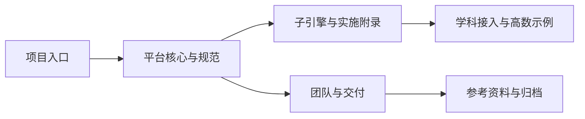

# 项目阅读地图

> 文档层级：总入口
> 文档目的：告诉你整套站点应该从哪里开始读，以及不同角色该走哪条阅读路线
> 核心结论：首页负责分类收口，导读页负责找路，平台真源、子引擎实现、学科示范和比赛收口各自保留独立正文
> 目标读者：新成员、开发者、项目负责人、答辩准备者
> 推荐下一步：第一次进入先读 [平台总纲与架构.md](./平台层/平台总纲与架构.md)，要直接收口展示就读 [比赛交付与答辩手册.md](./交付层/比赛交付与答辩手册.md)

## 与其他文档的边界

一句人话：这篇只负责帮你找路，不替代任何真源正文。

本文只回答三件事：

- 站点现在分成哪几组
- 不同读者该先看哪几篇
- 看完导读后下一步跳到哪里

平台定位、对象字段、智能体职责、知识库规范、比赛口径都分别回到各自真源文档定义。

## 一句话先记住

一句人话：先确认自己属于哪种阅读任务，再进对应的真源正文，会比从目录里盲翻快得多。

> 这套站点最稳定的阅读顺序是：先看项目入口，再看平台真源，再看实现主线，最后按需要进入高数示范或比赛收口。

## 1. 这套站点现在怎么分

一句人话：你现在看到的不是一堆散文档，而是五组职责清楚的入口。

| 分组 | 这一组解决什么 | 先看哪篇 |
| --- | --- | --- |
| 项目入口 | 帮你建立阅读路径和全局分组感 | [00-文档总索引.md](./00-文档总索引.md) |
| 平台核心与规范 | 定义平台定位、架构、对象契约和知识库规则 | [平台总纲与架构.md](./平台层/平台总纲与架构.md) |
| 子引擎与实施附录 | 说明学习地图、实时重规划、闯关教学和验收怎么实现 | [AI教师智能体群引擎总览与设计.md](./子引擎层/AI教师智能体群引擎总览与设计.md) |
| 学科接入与高数示例 | 说明高数为什么能证明平台成立，以及怎么落库接入 | [高等数学接入与知识库总览.md](./学科层/高等数学接入与知识库总览.md) |
| 团队与交付 | 收口分工、答辩顺序、比赛材料和发布路径 | [比赛交付与答辩手册.md](./交付层/比赛交付与答辩手册.md) |

## 2. 不同读者该走哪条路线

一句人话：别让所有人走同一条路，开发者、评委和新成员关心的起点根本不同。

### 2.1 新成员路线

1. [00-文档总索引.md](./00-文档总索引.md)
2. [平台总纲与架构.md](./平台层/平台总纲与架构.md)
3. [AI教师智能体群引擎总览与设计.md](./子引擎层/AI教师智能体群引擎总览与设计.md)
4. [高等数学接入与知识库总览.md](./学科层/高等数学接入与知识库总览.md)

### 2.2 开发者路线

1. [AI主导学习平台-产品总纲.md](./平台层/AI主导学习平台-产品总纲.md)
2. [AI主导学习平台-统一对象与接口契约.md](./平台层/AI主导学习平台-统一对象与接口契约.md)
3. [AI教师智能体群引擎-技术方案.md](./子引擎层/AI教师智能体群引擎-技术方案.md)
4. [高等数学-平台接入示范.md](./学科层/高等数学-平台接入示范.md)

### 2.3 答辩路线

1. [比赛交付与答辩手册.md](./交付层/比赛交付与答辩手册.md)
2. [比赛对齐说明.md](./交付层/比赛对齐说明.md)
3. [答辩口径与演示脚本.md](./交付层/答辩口径与演示脚本.md)
4. [高等数学接入与知识库总览.md](./学科层/高等数学接入与知识库总览.md)

## 3. 进入正文前，先抓哪几个真源

一句人话：导读看完以后，不要继续在导读层打转，直接进真源。

| 如果你现在要做的事 | 直接跳去哪里 | 为什么 |
| --- | --- | --- |
| 定平台口径 | [AI主导学习平台-产品总纲.md](./平台层/AI主导学习平台-产品总纲.md) | 平台定义只在这里和总体架构里讲清 |
| 对齐对象字段 | [AI主导学习平台-统一对象与接口契约.md](./平台层/AI主导学习平台-统一对象与接口契约.md) | 字段口径只认这一篇 |
| 设计智能体协作 | [AI教师智能体群引擎-技术方案.md](./子引擎层/AI教师智能体群引擎-技术方案.md) | 智能体职责和地图重规划真源在这里 |
| 做联调与回归 | [AI教师智能体群引擎-智能体工作流联调与验收手册.md](./子引擎层/AI教师智能体群引擎-Agent工作流联调与验收手册.md) | 变量透传和验收标准都在这里 |
| 做高数落库 | [高等数学-知识库接入与落库方案.md](./学科层/高等数学-知识库接入与落库方案.md) | 知识资产、批次和标签规则都在这里 |
| 准备答辩 | [答辩口径与演示脚本.md](./交付层/答辩口径与演示脚本.md) | 现场说法和演示顺序直接在这里拿 |

## 4. 这轮重构后，最应该避免什么

一句人话：最浪费时间的读法，是在导读页里找技术细节，或者在真源页里反复看背景口号。

- 不要把导读页当成技术主文档。
- 不要在非真源文档里重新定义对象字段。
- 不要让高等数学示例替代平台主线。
- 不要把团队与交付文档写成制度说明，而忽略比赛执行顺序。

## 读完后你应该带走什么

- 站点入口已经固定成五大类，不需要再靠猜目录找文档。
- 导读页负责导航，真源页负责定义，交付页负责翻译给评委听。
- 如果你要真正开始干活，读完这篇后应该立刻跳去对应真源。

## 本文不负责什么

- 不代替平台、子引擎、学科和交付层正文
- 不定义对象字段和智能体职责
- 不代替知识库资产正文
- 不代替最终答辩稿

