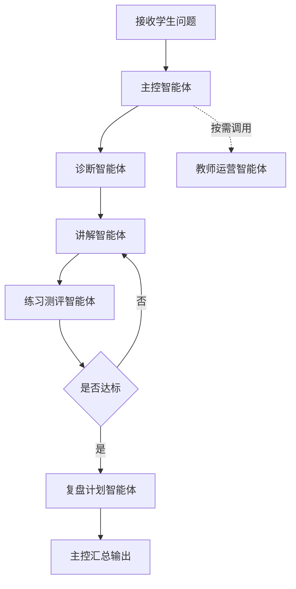

# ADP 平台配置总册（高等数学 AI 教师版）

> 版本：v1.0  
> 文档属性：平台配置总册  
> 适用范围：腾讯云 ADP 多智能体高等数学 AI 教师项目

---

## 1. 一页结论

这份总册只做一件事：

`把你现在这套高等数学 AI 教师方案，整理成可以直接照着腾讯 ADP 控制台配置的中文手册。`

当前定版：

- 科目：`高等数学`
- 第一阶段重点章节：`极限`
- 平台：`ADP 应用开发 + Multi-Agent + 工作流编排`
- 数据库：`PostgreSQL`
- 向量策略：`P0/P1 不引 pgvector 主链路，P2 可选`
- 协议：`HTTP SSE`
- 模型：
  - 主控：`Tencent HY 2.0 Think`
  - 诊断：`DeepSeek-R1-0528`
  - 讲解：`Tencent HY 2.0 Instruct`
  - 练习测评：`DeepSeek-V3.2`
  - 复盘：`DeepSeek-R1-0528`
  - 教师运营：`DeepSeek-R1-0528`

---

## 2. 平台总配置表

| 配置项 | 定版 |
| --- | --- |
| 应用名 | `AI教师-高等数学伴学` |
| 模式 | `Multi-Agent` |
| 协同方式 | `工作流编排` |
| 默认访问方式 | `官方发布链接` |
| 接入协议 | `HTTP SSE` |
| 数据库 | `PostgreSQL` |
| 向量能力 | `P0/P1 不引 pgvector 主链路，P2 可选` |
| 知识主线 | `ADP 自带知识库 + 标签检索 + 变量边界` |
| 扩展方式 | `插件/API 优先，自定义 Skill 仅 P2 评估` |

---

## 3. 应用级配置

| 项 | 配置 |
| --- | --- |
| 应用名 | `AI教师-高数极限伴学` |
| 应用简介 | `面向高等数学极限章节的诊断-讲解-练习-测评-复盘智能体` |
| 模式 | `Multi-Agent` |
| 协同方式 | `工作流编排` |
| 默认输出风格 | `教师式、分层、步骤清晰、尽量不用空泛鼓励语` |
| 面向对象 | `学生主用，教师运营侧辅助` |

说明：

- 当前不要把应用做成“通用聊天机器人”
- 应用首页与欢迎语都要体现 `高等数学` 和 `AI 教师`
- 第一版只聚焦 `极限`，不要一开始全章节铺开

---

## 4. 模型绑定总表

| 中文角色名 | 英文 Agent ID | 推荐模型 | 为什么选它 | 输入 | 输出 |
| --- | --- | --- | --- | --- | --- |
| 主控智能体 | `TeacherOrchestrator` | `Tencent HY 2.0 Think` | 适合调度、汇总、总回复收口 | 学生问题、上下文、变量、子智能体结果 | 调度决策、最终回复 |
| 诊断智能体 | `DiagnosisAgent` | `DeepSeek-R1-0528` | 适合判断卡点、学习阶段、难度 | 问题、课程标签、作答历史、记忆摘要 | 学习阶段、卡点、建议路径 |
| 讲解智能体 | `ExplanationAgent` | `Tencent HY 2.0 Instruct` | 适合中文讲解、分层表述、例题拆解 | 诊断结果、知识库片段、知识点关系 | 分层讲解、步骤说明、例子、易错点 |
| 练习测评智能体 | `PracticeEvalAgent` | `DeepSeek-V3.2` | 适合判题、评分、达标判断 | 讲解结果、题库、学生作答 | 练习题、评分、达标判断 |
| 复盘计划智能体 | `ReviewPlanAgent` | `DeepSeek-R1-0528` | 适合错因归因和计划生成 | 错题、评分、知识点标签、历史记录 | 错因归因、复盘结论、学习计划 |
| 教师运营智能体 | `TeacherOpsAgent` | `DeepSeek-R1-0528` | 适合班级趋势分析和风险识别 | 班级聚合数据、多轮学习记录、教师策略 | 趋势、高频错因、风险学生、干预建议 |
| 后续探索模型 | - | `Kimi 2.5` | 只适合长上下文/长文探索 | 长文资料、长链条上下文 | `P2` 评估，不进主链路 |

---

## 5. Agent 配置策略

### 5.1 主控智能体

| 项 | 配置 |
| --- | --- |
| 中文名 | 主控智能体 |
| 英文 ID | `TeacherOrchestrator` |
| 角色目标 | 判断当前任务类型，调度后续智能体，并输出最终面向学生的回复 |
| 输入字段 | 学生问题、上下文、`visitor_biz_id`、`course_id`、`chapter_id`、子智能体结果 |
| 输出结构 | 任务类型、调度决策、最终回复 |

策略：

- 不直接做长篇讲解
- 优先决定“先诊断还是直接进入其他环节”
- 最终输出统一由主控收口

### 5.2 诊断智能体

| 项 | 配置 |
| --- | --- |
| 中文名 | 诊断智能体 |
| 英文 ID | `DiagnosisAgent` |
| 角色目标 | 判断学生问题卡在概念、步骤还是计算 |
| 输入字段 | 问题、课程标签、作答历史、记忆摘要 |
| 输出结构 | 学习阶段、知识点卡点、优先路径 |

策略：

- 先判断“不会的是概念、步骤还是计算”
- 输出学习阶段与知识点卡点
- 不直接长篇讲解

### 5.3 讲解智能体

| 项 | 配置 |
| --- | --- |
| 中文名 | 讲解智能体 |
| 英文 ID | `ExplanationAgent` |
| 角色目标 | 做分层讲解和步骤拆解 |
| 输入字段 | 诊断结果、知识库片段、知识点关系 |
| 输出结构 | 分层讲解、步骤说明、例题、易错点 |

策略：

- 固定结构：`定义 -> 直觉 -> 步骤 -> 例题 -> 易错点`
- 优先贴高等数学知识库
- 一次不要讲太满

### 5.4 练习测评智能体

| 项 | 配置 |
| --- | --- |
| 中文名 | 练习测评智能体 |
| 英文 ID | `PracticeEvalAgent` |
| 角色目标 | 出题、判题、给出达标判断 |
| 输入字段 | 讲解结果、题库、学生作答 |
| 输出结构 | 练习题、评分、是否达标、错因提示 |

策略：

- 题量固定 `1~3` 题
- 难度递进
- 输出评分、达标状态、下一步建议

### 5.5 复盘计划智能体

| 项 | 配置 |
| --- | --- |
| 中文名 | 复盘计划智能体 |
| 英文 ID | `ReviewPlanAgent` |
| 角色目标 | 归纳错因并生成下一轮学习计划 |
| 输入字段 | 错题、评分、知识点标签、历史记录 |
| 输出结构 | 错因归因、复盘结论、学习计划 |

策略：

- 错因固定归类为：`概念不清 / 步骤遗漏 / 计算错误 / 审题错误`
- 输出下一轮计划
- 复盘结论优先进入长期记忆

### 5.6 教师运营智能体

| 项 | 配置 |
| --- | --- |
| 中文名 | 教师运营智能体 |
| 英文 ID | `TeacherOpsAgent` |
| 角色目标 | 聚合班级趋势、识别风险学生、生成干预建议 |
| 输入字段 | 班级聚合数据、多轮学习记录、教师策略 |
| 输出结构 | 趋势、高频错因、风险学生、干预建议 |

策略：

- 只服务教师侧
- 不直接参与学生主回复
- 输出共性薄弱点与干预建议

---

## 6. 工作流编排顺序

这张图想说明什么：

- 学生主链路固定为：`主控 -> 诊断 -> 讲解 -> 练习测评 -> 复盘计划`
- 教师运营智能体是旁路
- 条件判断只放在练习测评之后

| 中文节点 | 英文实现映射 |
| --- | --- |
| 主控智能体 | `TeacherOrchestrator` |
| 诊断智能体 | `DiagnosisAgent` |
| 讲解智能体 | `ExplanationAgent` |
| 练习测评智能体 | `PracticeEvalAgent` |
| 复盘计划智能体 | `ReviewPlanAgent` |
| 教师运营智能体 | `TeacherOpsAgent` |

---

## 7. RAG 配置策略

| 项 | 配置 |
| --- | --- |
| 知识主线 | `ADP 自带知识库能力` |
| 知识源 | 高等数学教材、课堂讲义、课程 PPT、题库、典型错题 |
| 检索边界 | `course_id -> chapter_id -> role` |
| 当前向量策略 | 不自建 `pgvector` 主链路 |
| `pgvector` 定位 | `P2` 可选增强 |

说明：

- 主线使用 ADP 自带知识库能力
- 不自建 `pgvector` 主链路
- 检索未命中时要明确提示“需补充资料/切换章节”

---

## 8. 高等数学专属策略

| 项 | 配置 |
| --- | --- |
| 科目 | `高等数学` |
| 当前主线章节 | `极限` |
| 后续章节 | `导数`、`积分` |
| 讲解重点 | 概念清晰、步骤拆解、例题和易错点 |
| 诊断重点 | 概念缺失 / 步骤链断裂 / 计算能力问题 |
| 练习重点 | 基础定义识别 -> 直接计算 -> 变式应用 |

说明：

- 第一期只重点做 `极限`
- 讲解要优先概念，不要上来只给公式
- 复盘要告诉学生“下次复习哪个点、做多少题、要不要回看课堂资料”

---

## 9. 变量与记忆配置

| 类型 | 必配项 |
| --- | --- |
| 终端字段 | `visitor_biz_id`、`course_id`、`class_id`、`chapter_id`、`role` |
| 应用变量 | `APP.Diagnosis`、`APP.Explanation`、`APP.Score`、`APP.ReviewPlan` |
| 长期记忆 | 只记录持续学习相关内容 |

说明：

- `visitor_biz_id` 是长期记忆命中的前提
- `course_id/chapter_id/role` 决定检索边界
- 不记录无用闲聊，复盘结论优先进入长期记忆

---

## 10. 插件/API 策略

| 场景 | 处理方式 |
| --- | --- |
| 平台现成能力够 | 直接用 ADP |
| 外部结构化能力 | 插件/API |
| 高复用专有能力 | `P2` 再评估自定义 Skill |

说明：

- 当前主线优先插件/API
- 不用 Skills 做主链路
- 自定义 Skill 不进 `P0/P1`

---

## 11. 发布与接入配置

| 项 | 配置 |
| --- | --- |
| 默认访问方式 | `官方发布链接` |
| 接入协议 | `HTTP SSE` |
| 数据库 | `PostgreSQL` |
| 向量能力 | `pgvector` 仅 `P2` 可选 |
| 后端职责 | `AppKey` 托管、变量透传、学习记录沉淀、教师聚合输出 |

说明：

- `P0` 先用官方发布链接
- `P2` 再接自定义前端与 BFF
- `PostgreSQL` 承接业务数据与运营数据

---

## 12. 验收清单

| 验收项 | 通过标准 |
| --- | --- |
| 应用配置 | 已创建 `Multi-Agent` 应用，并切到 `工作流编排` |
| 模型绑定 | 6 个智能体模型已按总册绑定 |
| 主链路 | 能跑通 `诊断 -> 讲解 -> 练习测评 -> 复盘计划` |
| RAG | 知识库命中高等数学资料，且不串课 |
| 变量 | `visitor_biz_id`、`course_id`、`chapter_id` 等字段已传入 |
| 高数策略 | 当前章节 `极限` 的讲解、诊断、练习、复盘已可演示 |
| 发布 | 评委可通过官方发布入口访问 |

---

## 官方依据

- 《应用设置概述》  
  https://cloud.tencent.com/document/product/1759/104206
- 《模型介绍》  
  https://cloud.tencent.com/document/product/1759/112876
- 《什么是 Multi-Agent？》  
  https://cloud.tencent.com/document/product/1759/118325
- 《工作流编排》  
  https://cloud.tencent.com/document/product/1759/122556
- 《Agent 节点》  
  https://cloud.tencent.com/document/product/1759/122554
- 《知识处理模型设置》  
  https://cloud.tencent.com/document/product/1759/127312
- 《知识检索相关设置》  
  https://cloud.tencent.com/document/product/1759/112704
- 《长期记忆说明》  
  https://cloud.tencent.com/document/product/1759/122458
- 《数据库》  
  https://cloud.tencent.com/document/product/1759/119291
- 《对话端接口文档（HTTP SSE）》  
  https://cloud.tencent.com/document/product/1759/105561
