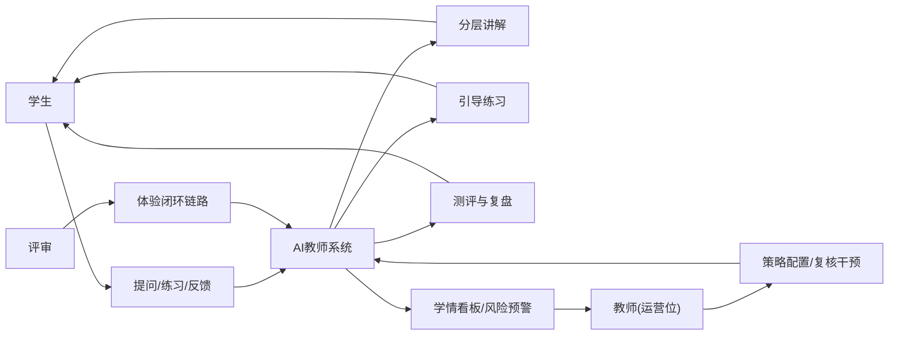
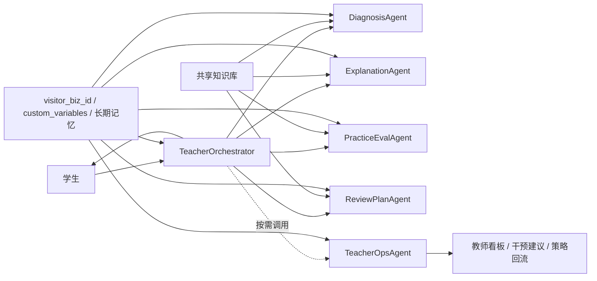
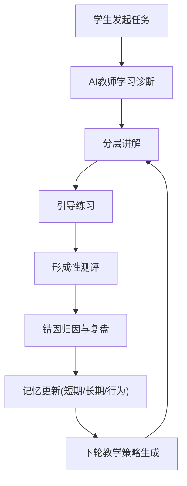
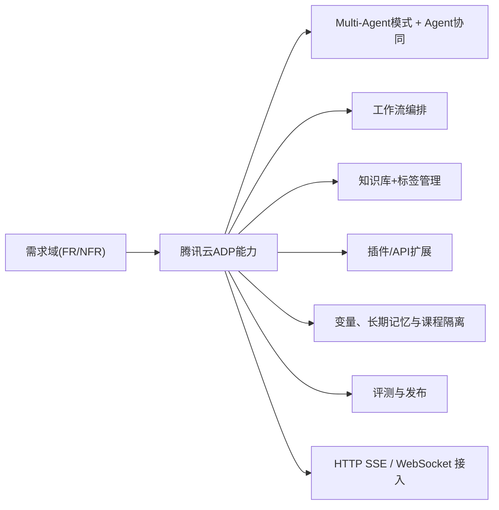
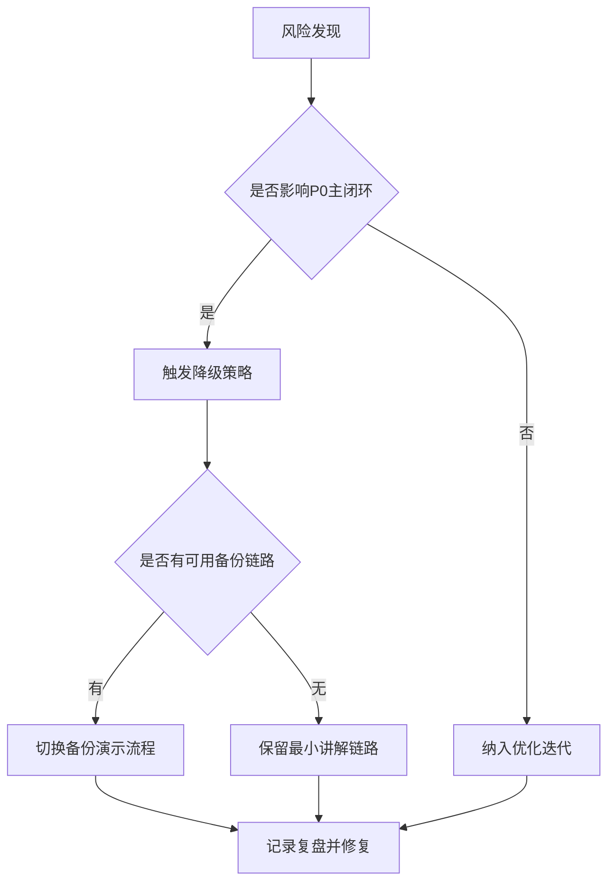
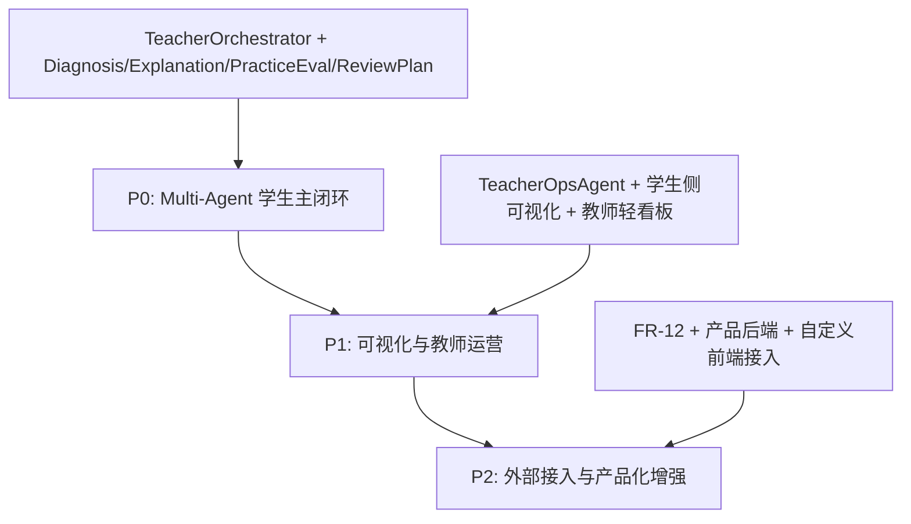
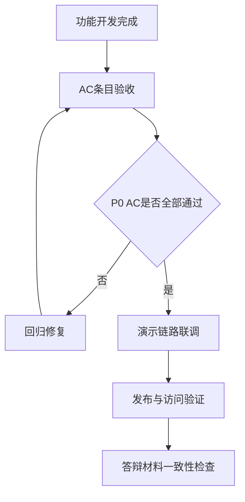

# 课堂知识重构与自适应伴学智能体需求分析（AI教师版）

> 版本：v1.1  
> 文档属性：研发规格版（可执行 + 可答辩）  
> 平台约束：腾讯云智能体开发平台（Tencent Cloud ADP）  
> 核心定位：AI充当教师，学生为主用户，教师为运营与干预角色

## 目录（TOC）

1. 文档导航与约定
2. 业务目标与约束
3. 角色与场景
4. 功能需求（FR）
5. 非功能需求（NFR）
6. 平台能力映射
7. 风险与应对
8. MVP 路线
9. 验收标准
10. 结论

---

## 1. 文档导航与约定

### 1.1 阅读导航

- 研发实现优先：第 4、5、6、9 章。
- 答辩叙事优先：第 2、3、8、10 章。
- 项目推进优先：先定 `P0`，再补 `P1/P2`。

### 1.2 编制依据

- `比赛资料/比赛.txt`
- `比赛资料/2026年广东省大学生计算机设计大赛教育智能体应用创新赛指南 .pdf`
- `腾讯平台使用文档/产品文档.pdf`
- `腾讯平台使用文档/快速入门.pdf`
- `腾讯平台使用文档/操作指南.pdf`
- `腾讯平台使用文档/应用接口文档.pdf`
- `腾讯平台使用文档/常见问题.pdf`
- 腾讯云 ADP 官方文档与公告（见第 10 章）

### 1.3 需求文档约定接口（Public Interfaces / Conventions）

| 约定项 | 规范 |
| --- | --- |
| 图表规范 | 仅使用 `mermaid flowchart`；系统/映射图 `LR`，流程图 `TD` |
| 术语白名单 | `AI教师`、`Agent`、`RAG`、`短期记忆`、`长期记忆`、`行为记忆`、`P0/P1/P2` |
| 编号规则 | 功能需求：`FR-xx`；非功能需求：`NFR-xx`；验收项：`AC-xx`；场景：`SCN-xx` |
| 需求条目模板 | `目标`、`输入`、`处理`、`输出`、`异常`、`验收` |
| 追踪矩阵规则 | 每个 `P0` 需求必须至少映射 1 个 `AC` 和 1 个演示落点 |

> 下一步建议：将术语和编号规则同步到团队评审模板，减少后续歧义。

---

## 2. 业务目标与约束

### 2.1 背景与问题

高校学习场景中，课堂语音、课件、讲义、拍题、错题反馈长期割裂，学生复盘高度依赖人工整理。项目改造方向为“AI教师主导学习闭环”，通过持续诊断和教学编排，降低学生学习摩擦，提高掌握效率。

### 2.2 总体目标

构建基于腾讯云 ADP 的 AI 教师系统，形成固定闭环：  
`诊断 -> 讲解 -> 练习 -> 测评 -> 复盘 -> 记忆更新 -> 下轮教学`  
其中闭环主线统一为：`讲解-练习-测评-复盘`。

### 2.3 强约束条款

#### 2.3.1 比赛与平台约束

- 必须基于腾讯云智能体开发平台开发与发布。
- 必须体现教育场景，不得退化为通用聊天工具。
- 必须覆盖知识库、工作流、插件/API、多模态能力。
- 必须提供可访问体验入口。

#### 2.3.2 实施约束

- 一期平台主线固定为 `Multi-Agent + 工作流编排`。
- `Standard` 仅作为风险兜底与比赛保底路线，不作为一期主线。
- 前端可视化与产品后端仅进入 `P1/P2` 增强层，不进入 `P0` 必交付清单。
- 不新增原始业务边界外功能，只重构目标与路径。

> 下一步建议：在开发排期前冻结 `P0` 范围，先保证闭环通路可演示。

---

## 3. 角色与场景

### 3.1 角色边界

| 角色 | 定位 | 主要职责 |
| --- | --- | --- |
| 学生 | 主用户 | 发起学习任务、完成练习、提交反馈 |
| AI教师 | 核心执行者 | 学习诊断、分层讲解、出题测评、复盘规划、记忆更新 |
| 教师 | 运营与干预角色 | 配置策略、复核学情、制定教学干预 |
| 评审/体验者 | 验证角色 | 体验闭环链路并验证教育价值 |

### 3.2 场景定义

- `SCN-01` 课堂资料建模：上传课堂资料并生成学习基座。
- `SCN-02` AI教师即时讲解：学生拍题/提问后获得分层讲解。
- `SCN-03` 练习与测评闭环：AI教师引导训练、测评并归因错因。
- `SCN-04` 复盘与运营干预：学生获得计划，教师查看运营看板并干预。

### 3.3 角色价值链图（图 1）

#### 触发条件

- 学生发起课后学习任务。
- 教师进行策略调整或学情复核。

#### 输入输出

- 输入：学生问题、课堂资料、历史学习记录、教师策略。
- 输出：学习结果、学情洞察、干预建议。

#### 失败兜底

- 角色识别失败时默认学生链路并提示角色切换。
- 教师运营模块异常时不影响学生主学习链路。

### 3.4 Agent 架构约束（图 1-1）

- 学生主链路固定为：`TeacherOrchestrator -> DiagnosisAgent -> ExplanationAgent -> PracticeEvalAgent -> ReviewPlanAgent`。
- `TeacherOrchestrator` 是唯一直接面向学生的总调度与结果收口入口。
- `TeacherOpsAgent` 作为教师运营 Agent，可被主控在任意阶段按需调用，但不替代学生主链路节点。
- `TeacherOpsAgent` 职责限定为：班级趋势聚合、风险识别、干预建议、看板数据沉淀、策略回流。
- 知识库继续作为共享底座，不单独拆成 Agent。

> 下一步建议：优先设计 `SCN-02` 和 `SCN-03` 的端到端演示脚本。

---

## 4. 功能需求（FR）

### 4.1 学习闭环图（图 2）

#### 触发条件

- 学生提问、提交错题、发起复习请求。

#### 输入输出

- 输入：多模态问题、知识库内容、历史表现、教师策略。
- 输出：讲解结果、练习题、测评结果、复盘建议、记忆更新。

#### 失败兜底

- 低置信回答降级为“保守讲解 + 引导澄清”模式。
- 检索命中不足时回退基础知识包并提示补充资料。

### 4.2 功能需求清单（FR-01 至 FR-12）

#### FR-01 AI教师画像与教学策略（P0）

- 目标：定义 AI 教师教学风格、难度分层与反馈语气。
- 输入：课程规则、教师配置、学生年级信息。
- 处理：策略模板加载、角色提示词绑定、风格路由。
- 输出：可执行教学策略档案。
- 异常：策略冲突、配置缺失。
- 验收：`AC-01`。

#### FR-02 多模态学习内容理解（P0）

- 目标：支持文本、图片、语音、文档输入并结构化理解。
- 输入：提问文本、拍题截图、语音问题、课堂资料。
- 处理：OCR/ASR/文档解析、内容标准化、标签化。
- 输出：可检索学习语料与上下文片段。
- 异常：解析失败、格式不支持、时延过高。
- 验收：`AC-02`、`AC-03`。

#### FR-03 学习诊断（P0）

- 目标：识别学生当前水平、薄弱点和优先学习路径。
- 输入：当前问题、历史答题记录、记忆摘要。
- 处理：能力判定、知识点映射、优先级排序。
- 输出：诊断结论与讲解入口。
- 异常：样本不足、判定波动。
- 验收：`AC-04`。

#### FR-04 分层讲解（P0）

- 目标：按基础/进阶层次输出步骤化讲解。
- 输入：诊断结论、检索片段、知识点关系。
- 处理：分层解释、关键步骤展开、来源关联。
- 输出：可执行讲解结果。
- 异常：回答偏题、解释不一致。
- 验收：`AC-05`、`AC-06`。

#### FR-05 引导练习（P0）

- 目标：围绕讲解内容生成针对性训练题。
- 输入：讲解结果、薄弱点、历史错题。
- 处理：题目生成、难度控制、提示引导。
- 输出：训练任务集。
- 异常：题目难度偏差、题型重复。
- 验收：`AC-07`。

#### FR-06 形成性测评（P0）

- 目标：通过短测验证学生即时掌握情况。
- 输入：练习作答、作答过程数据。
- 处理：自动评分、要点比对、掌握度打分。
- 输出：测评结果与掌握标签。
- 异常：评分不稳定、解析错误。
- 验收：`AC-08`。

#### FR-07 错因归因（P0）

- 目标：识别错误类型并给出纠偏建议。
- 输入：测评错题、作答轨迹、知识点标签。
- 处理：错因分类、原因解释、纠偏动作推荐。
- 输出：错因报告与纠偏建议。
- 异常：错因分类冲突。
- 验收：`AC-09`。

#### FR-08 个性化学习计划（P0）

- 目标：生成下一轮学习计划并进入持续复盘。
- 输入：诊断结果、测评结果、错因报告。
- 处理：目标拆解、任务排程、节奏建议。
- 输出：个性化学习计划卡片。
- 异常：计划过载、周期不合理。
- 验收：`AC-10`。

#### FR-09 教师运营看板（P1）

- 目标：为教师提供班级趋势、风险学生、干预入口与轻量可视化看板。
- 输入：班级学习数据、聚合指标、TeacherOpsAgent 输出、教师策略。
- 处理：统计聚合、阈值告警、TeacherOpsAgent 分析、策略回流、可视化整理。
- 输出：运营看板、风险标签与干预建议。
- 异常：聚合数据延迟、统计口径偏差。
- 验收：`AC-11`。

#### FR-10 标签检索控制（P1）

- 目标：基于 `custom_variables` 与标签实现检索范围控制。
- 输入：`course_id/class_id/chapter_id/role` 等变量。
- 处理：标签映射、检索过滤、权限边界控制。
- 输出：角色化、课程化检索结果。
- 异常：标签缺失、越权检索。
- 验收：`AC-12`。

#### FR-11 评测体系（P1）

- 目标：建立回归评测与对比评测机制。
- 输入：评测集、基线版本、候选版本。
- 处理：指标对比、差异定位、版本结论。
- 输出：评测报告与优化建议。
- 异常：样本偏差、结果不可复现。
- 验收：`AC-13`。

#### FR-12 发布接入（P2）

- 目标：支持平台发布、自定义接入与产品后端能力预留。
- 输入：发布配置、`AppKey`、接口参数、渠道配置、前后端接入需求。
- 处理：平台发布、`HTTP SSE` 默认接入、产品后端代理、回归检查。
- 输出：ADP 官方访问入口、接入说明、协议与字段约定。
- 异常：发布失败、接口不稳定、代理异常。
- 验收：`AC-14`。

> 下一步建议：优先实现 `FR-01` 到 `FR-08`，保证 AI 教师闭环可连续运行。

### 4.3 产品化增强边界

| 阶段 | 能力边界 | 默认策略 |
| --- | --- | --- |
| `P0` | Multi-Agent 学生主闭环 | 默认使用 ADP 官方发布链接对外访问 |
| `P1` | 学生侧可视化 + 教师侧轻看板 | 增加课堂知识重构结果、分层讲解卡、练习评分、错因归因、学习计划卡、班级趋势与风险学生 |
| `P2` | 产品后端 + 自定义前端接入 | 增加 `AppKey` 托管、`visitor_biz_id` 绑定、`custom_variables` 透传、学习记录沉淀、教师看板聚合、发布接入代理 |

- 自定义接入默认协议为 `HTTP SSE`，`WebSocket` 保留为增强选项。
- 上下文字段固定为：`visitor_biz_id`、`course_id`、`class_id`、`chapter_id`、`role`。
- `Redis / MQ` 不是 v1 必选项，不作为架构前置条件。

---

## 5. 非功能需求（NFR）

### 5.1 非功能需求清单（NFR-01 至 NFR-08）

| 编号 | 类别 | 需求描述 | 验证口径 |
| --- | --- | --- | --- |
| NFR-01 | 可用性 | 核心闭环在演示场景连续可用 | 关键流程无中断 |
| NFR-02 | 响应性 | 常规学习任务可在可接受时延内返回 | 长任务有处理中状态 |
| NFR-03 | 教学可信 | 回答需可关联知识来源或命中知识点 | 抽检结果可追溯 |
| NFR-04 | 可解释性 | 诊断、测评、复盘具备解释说明 | 结果页具备解释字段 |
| NFR-05 | 安全性 | 学生数据与检索权限受控 | 角色边界与数据边界可配置 |
| NFR-06 | 可观测性 | 链路日志可定位异常节点 | 关键节点日志可追踪 |
| NFR-07 | 可维护性 | 提示词、知识库、流程可持续优化 | 变更不破坏主链路 |
| NFR-08 | 可扩展性 | 支持 P1/P2 增量扩展 | 新能力接入不重写主闭环 |

> 下一步建议：将 `NFR-03` 和 `NFR-06` 纳入每次版本发版门禁。

---

## 6. 平台能力映射

### 6.1 平台能力映射图（图 3）

#### 触发条件

- 需求评审、方案评审、发布评审阶段。

#### 输入输出

- 输入：FR/NFR、平台能力清单、实现范围。
- 输出：能力映射结果与缺口清单。

#### 失败兜底

- 若 Multi-Agent 稳定性不足，回退到 `Standard` 保底路线。
- 若教师运营或产品化增强不可用，保留学生主闭环与官方发布入口。
- 若插件不可用，采用 API 方式替代。

### 6.2 追踪矩阵（FR -> SCN -> 流程 -> 平台 -> AC -> 演示）

| FR | SCN | 工作流节点 | 平台能力点 | AC | 演示步骤 |
| --- | --- | --- | --- | --- | --- |
| FR-01 | SCN-01 | `TeacherOrchestrator` 策略加载 | Multi-Agent 应用配置/提示词 | AC-01 | 第 1 步 |
| FR-02 | SCN-01/02 | 多模态解析 + 知识入库 | 文档解析/OCR/ASR | AC-02, AC-03 | 第 1-2 步 |
| FR-03 | SCN-02 | `DiagnosisAgent` | Agent 节点 + 知识检索 | AC-04 | 第 2 步 |
| FR-04 | SCN-02 | `ExplanationAgent` | RAG + Agent 节点 | AC-05, AC-06 | 第 3 步 |
| FR-05 | SCN-03 | `PracticeEvalAgent` 出题 | 工作流大模型节点 | AC-07 | 第 4 步 |
| FR-06 | SCN-03 | `PracticeEvalAgent` 判题 | 条件节点 + 评分逻辑 | AC-08 | 第 4 步 |
| FR-07 | SCN-03 | `ReviewPlanAgent` 错因归因 | Agent 节点 + 标签提取 | AC-09 | 第 5 步 |
| FR-08 | SCN-04 | `ReviewPlanAgent` 学习计划 | 总结节点 + 记忆写回 | AC-10 | 第 5 步 |
| FR-09 | SCN-04 | `TeacherOpsAgent` 看板聚合 | 分析能力/API + 可视化看板 | AC-11 | 扩展演示 |
| FR-10 | SCN-02/04 | `TeacherOrchestrator` + 标签控制 | `custom_variables` + 标签映射 | AC-12 | 扩展演示 |
| FR-11 | 全场景 | 回归评测 | 基准评测/对比评测 | AC-13 | 评测页 |
| FR-12 | 全场景 | 发布接入代理 | 发布/HTTP SSE/体验链接 | AC-14 | 发布页 |

> 下一步建议：先验证 `FR-01~FR-08` 的 AC 覆盖率为 100% 再进入联调。

---

## 7. 风险与应对

### 7.1 风险决策图（图 4）

#### 触发条件

- 解析失败、检索失效、输出不稳定、发布异常。

#### 输入输出

- 输入：风险类型、影响范围、当前版本状态。
- 输出：降级动作、恢复路径、复盘项。

#### 失败兜底

- 无法降级时保留最小可答疑路径并中止扩展功能展示。
- 关键风险必须沉淀到问题清单并绑定责任模块。

### 7.2 风险清单

| 风险 | 表现 | 应对 |
| --- | --- | --- |
| 多模态解析波动 | OCR/ASR 误差导致讲解偏差 | 提前清洗样本，关键资料模板化 |
| 检索召回不足 | 回答泛化或不贴课程 | 强化标签检索和低置信降级 |
| 闭环过长导致延迟 | 演示体验断续 | 拆分异步步骤，提供状态反馈 |
| 运营策略干预过重 | AI教师风格不稳定 | 固化策略优先级，限制覆盖范围 |
| 发布接入异常 | 链接不可用或接口中断 | 提前预发布，准备备用体验入口 |

> 下一步建议：赛前按风险表做一次“故障注入式演练”。

---

## 8. MVP 路线

### 8.1 MVP 路线图（图 5）

#### 触发条件

- 进入版本规划与阶段排期时。

#### 输入输出

- 输入：FR 优先级、时间窗口、人力配置。
- 输出：阶段交付包、门禁规则、退出标准。

#### 失败兜底

- `P0` 不闭环不得进入 `P1`。
- `P1` 评测不稳定不得进入 `P2`。

### 8.2 阶段交付门禁

| 阶段 | 交付内容 | 出口标准 |
| --- | --- | --- |
| P0 | FR-01~FR-08 + Multi-Agent 主链路 | 完整跑通“诊断-讲解-练习-测评-复盘” |
| P1 | FR-09~FR-11 + 学生侧可视化 + 教师轻看板 | 教师运营、评测体系与可视化演示可复现 |
| P2 | FR-12 + 产品后端 + 自定义前端接入 | 发布接入稳定，产品化增强能力可演示 |

> 下一步建议：将阶段门禁写入迭代看板，避免功能越界。

---

## 9. 验收标准

### 9.1 验收流程图（图 6）

#### 触发条件

- 版本提测、赛前联调、发布前检查。

#### 输入输出

- 输入：AC 清单、测试记录、演示脚本。
- 输出：验收结论、问题单、发布结论。

#### 失败兜底

- AC 未通过时禁止发布。
- 发布异常时回退到平台内可访问稳定版本。

### 9.2 AC 清单（AC-01 至 AC-14）

| AC | 对应 FR | 验收描述 |
| --- | --- | --- |
| AC-01 | FR-01 | AI教师策略可配置并可生效 |
| AC-02 | FR-02 | 支持文本/图片/语音/文档输入 |
| AC-03 | FR-02 | 解析结果可进入知识检索链路 |
| AC-04 | FR-03 | 可输出学习诊断结论与优先路径 |
| AC-05 | FR-04 | 可输出分层讲解（基础/进阶） |
| AC-06 | FR-04 | 讲解结果可关联知识点或来源 |
| AC-07 | FR-05 | 可生成引导练习并控制难度 |
| AC-08 | FR-06 | 可完成形成性测评并给出掌握度 |
| AC-09 | FR-07 | 可输出错因归因与纠偏建议 |
| AC-10 | FR-08 | 可生成个性化学习计划并进入下一轮任务 |
| AC-11 | FR-09 | 教师运营看板可查看班级趋势、风险标签与干预入口 |
| AC-12 | FR-10 | 支持 custom_variables 标签检索范围控制 |
| AC-13 | FR-11 | 评测体系支持基准与对比评测 |
| AC-14 | FR-12 | 提供可访问发布版本、`HTTP SSE` 接入说明与产品后端约定 |

### 9.3 比赛验收口径

- 方案与实现均基于腾讯云 ADP。
- 体现知识库、工作流、插件/API、多模态能力。
- `P0` 演示链路完整且可通过 ADP 官方发布链接访问。
- `P1` 可增加学生侧可视化与教师轻看板演示。
- `P2` 可增加 `HTTP SSE` 接入说明与产品后端演示。

> 下一步建议：将 AC-01 至 AC-10 作为答辩现场主验收脚本。

---

## 10. 结论

本需求版本将系统主角明确切换为 `AI教师`，并以学生为主用户形成稳定学习闭环。该方案在不超出原始赛道边界的前提下，强化了可执行性、可追踪性和可验收性，可直接驱动研发与答辩材料联动。

核心落地原则：

1. 闭环优先：固定执行 `诊断 -> 讲解 -> 练习 -> 测评 -> 复盘 -> 记忆更新 -> 下轮教学`。
2. 平台优先：一期以 ADP `Multi-Agent + 工作流编排` 为主线，`Standard` 仅作保底。
3. 产品化分层：`P0` 先跑主闭环，`P1` 再补可视化与教师运营，`P2` 再接产品后端。
4. 验收优先：每个 P0 功能均有 AC 对应和演示落点。

### 官方参考链接

- ADP 产品总览：[https://www.tencentcloud.com/document/product/1254/69956](https://www.tencentcloud.com/document/product/1254/69956)
- 对话接口与 `custom_variables`：[https://www.tencentcloud.com/document/product/1254/69978](https://www.tencentcloud.com/document/product/1254/69978)
- 工作流节点能力：[https://www.tencentcloud.com/document/product/1254/72506](https://www.tencentcloud.com/document/product/1254/72506)
- 应用分析能力：[https://www.tencentcloud.com/document/product/1254/72572](https://www.tencentcloud.com/document/product/1254/72572)
- 计费公告（2026-03-06 后订阅）：[https://www.tencentcloud.com/announce/detail/100971](https://www.tencentcloud.com/announce/detail/100971)

> 下一步建议：基于本稿同步更新答辩 PPT，确保“需求-架构-演示-验收”一一对齐。
