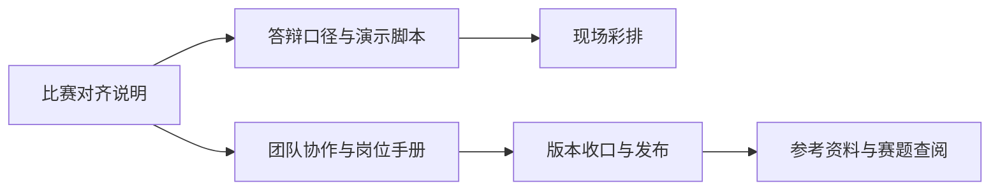

# 比赛交付与答辩手册

> 文档层级：交付导读
> 文档目的：说明比赛交付这一组文档怎么读，以及答辩、团队交接、资料查阅和发布该走什么顺序
> 核心结论：交付层负责把平台真源翻译成比赛执行路径；它不再定义平台本体，但必须负责把分工、演示顺序、资料入口和上线动作收好
> 目标读者：项目负责人、答辩主讲人、协作成员、评委
> 推荐下一步：准备答辩先读 [比赛对齐说明.md](./比赛对齐说明.md)，准备彩排就读 [答辩口径与演示脚本.md](./答辩口径与演示脚本.md)

## 与其他文档的边界

一句人话：这篇负责“怎么收口”，不负责“平台怎么定义”。

交付层固定承担四类工作：

- 比赛作品定义和叙事对齐
- 团队分工与交接
- 演示顺序与答辩口径
- 参考资料查阅与上线发布

平台主张、对象契约、智能体职责和高数落地细节，仍分别回到平台层、子引擎层和学科层真源文档。

## 一句话先记住

一句人话：比赛交付层的任务不是把技术讲满，而是把正确的人、正确的页面和正确的说法按顺序串起来。

> 先统一作品定义和演示顺序，再回到平台真源补细节，才是最稳的答辩准备方式。

## 1. 这组文档解决什么

一句人话：这组文档把“比赛怎么讲、团队怎么分工、资料去哪里找、怎么发布”一次收清楚。

| 当前任务 | 直接跳去哪里 |
| --- | --- |
| 定义作品该怎么讲 | [比赛对齐说明.md](./比赛对齐说明.md) |
| 准备 5 到 10 分钟答辩 | [答辩口径与演示脚本.md](./答辩口径与演示脚本.md) |
| 安排团队分工和交接 | [AI主导学习平台-团队协作与分工.md](../平台层/AI主导学习平台-团队协作与分工.md) |
| 明确项目负责人、资料负责人、联调负责人职责 | 三篇岗位手册 |
| 临场查赛题和平台资料 | 本页第 4 节 |

## 2. 准备答辩时先看哪几篇

一句人话：答辩时先收口说法，再决定演示顺序，最后回去补细节。

1. [比赛对齐说明.md](./比赛对齐说明.md)
2. [答辩口径与演示脚本.md](./答辩口径与演示脚本.md)
3. [平台总纲与架构.md](../平台层/平台总纲与架构.md)
4. [AI教师子引擎总览与设计.md](../子引擎层/AI教师子引擎总览与设计.md)
5. [高等数学接入与知识库总览.md](../学科层/高等数学接入与知识库总览.md)

## 3. 收口团队协作时先看哪几篇

一句人话：想把版本收住，必须把谁负责页面、谁负责资料、谁负责联调说清楚。

| 角色 | 直接跳去哪里 | 交付重点 |
| --- | --- | --- |
| 项目负责人 | [项目负责人-职责与执行手册.md](../平台层/团队协作与分工/项目负责人-职责与执行手册.md) | 页面收口、演示顺序、版本发布 |
| OCR 与资料电子化负责人 | [OCR与资料电子化负责人-职责与执行手册.md](../平台层/团队协作与分工/OCR与资料电子化负责人-职责与执行手册.md) | 资料台账、OCR、拆卡、来源记录 |
| 工作流与联调负责人 | [工作流与联调负责人-职责与执行手册.md](../平台层/团队协作与分工/工作流与联调负责人-职责与执行手册.md) | 场景跑通、回归样例、失败记录 |

## 4. 临场查资料时去哪里

一句人话：赛题和平台资料要集中放一处，临场才不会到处翻目录。

- `doc/比赛资料/2026年广东省大学生计算机设计大赛-教育智能体应用创新赛.pdf`
- `doc/比赛资料/2026年广东省大学生计算机设计大赛教育智能体应用创新赛指南 .pdf`
- `doc/比赛资料/比赛.txt`
- `doc/腾讯平台使用文档/腾讯云ADP-Multi-Agent版AI教师智能体从0到1新手闭环指南.md`
- `doc/腾讯平台使用文档/快速入门.pdf`
- `doc/腾讯平台使用文档/产品文档.pdf`
- `doc/腾讯平台使用文档/常见问题.pdf`
- `doc/腾讯平台使用文档/应用接口文档.pdf`
- [CLAW_CODE_ANALYSIS_REPORT.md](../../CLAW_CODE_ANALYSIS_REPORT.md)

## 5. 推荐演示顺序

一句人话：最稳的演示顺序是先讲平台，再讲实现，再讲高数证明，最后讲团队与发布。

1. 首页说明 5 个主入口
2. [平台总纲与架构.md](../平台层/平台总纲与架构.md)
3. [AI教师子引擎总览与设计.md](../子引擎层/AI教师子引擎总览与设计.md)
4. [高等数学接入与知识库总览.md](../学科层/高等数学接入与知识库总览.md)
5. 高数知识库导航层或课堂重构 / 教师运营资产作为落地证明
6. 最后说明分工、版本收口和 GitHub Pages 发布

## 读完后你应该带走什么

- 交付层不再定义平台本体，但它必须负责把比赛执行链收清楚。
- 答辩、团队协作、资料查阅和发布不能分开准备。
- 临场最稳的做法，是把平台真源、高数示范和团队收口串成同一条讲述路线。

## 本文不负责什么

- 不代替比赛对齐说明和答辩脚本正文
- 不定义平台对象和智能体职责
- 不代替高数落库与接入文档
- 不代替首页和阅读页实现细节
