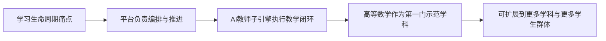
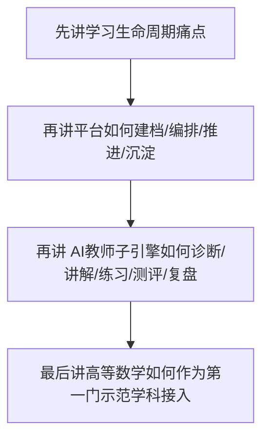

# 比赛对齐说明

> 文档层级：交付层  
> 文档目的：把平台方案和比赛评审最关心的价值点对齐，避免现场叙事退回成“单点 AI 教师作品”  
> 核心结论：比赛最容易买账的，不是“会不会答题”，而是平台是否真正承担了学习生命周期的组织、推进与沉淀  
> 目标读者：答辩准备者、项目负责人、展示者  
> 上游文档：[AI主导学习平台-产品总纲.md](../平台层/AI主导学习平台-产品总纲.md)、[AI主导学习平台-平台需求与验收.md](../平台层/AI主导学习平台-平台需求与验收.md)、[高等数学-平台接入示范.md](../学科层/高等数学-平台接入示范.md)  
> 下游文档：[答辩口径与演示脚本.md](./答辩口径与演示脚本.md)  
> 适用范围：比赛叙事、作品包装、评审沟通  

## 与其他文档的边界

本文只做比赛视角的叙事对齐。  
本文不重新定义平台能力，也不替代平台层和子引擎层真源文档。  

## 一句话先记住

> 比赛现场最稳的说法是：我们做的是 AI主导学习平台，高等数学只是第一门完整示范学科，AI教师子引擎只是平台内部的教学执行层。

## 1. 当前作品该怎么定义

推荐统一定义为：

> 面向可扩学科的 AI主导学习平台，以 AI教师子引擎承接学科教学闭环，并以高等数学作为第一门完整示范学科。

### 图 1：比赛叙事应该怎么落

这个定义比“高等数学 AI 教师”更强，因为它同时解释了：

- 为什么作品有平台价值
- 为什么能覆盖更广人群
- 为什么不止是一门课的 demo

## 2. 评委最容易买账的 4 个点

| 评审关注点 | 你应该怎么说 |
| --- | --- |
| 是否只是聊天页 | 不是，平台会先建档、排目录、推任务，而不是等学生先会提问 |
| 是否只留对话记录 | 不是，平台会沉淀课节笔记和个人总复习本 |
| 是否只有一门课 | 不是，高等数学只是第一门示范学科 |
| 是否能持续扩展 | 能，平台已经把目录树、任务卡、阶段复习和学科接入模板固定下来 |

## 3. 建议避免的说法

- 不要把项目介绍成“高等数学 AI 教师”
- 不要把单一应试人群当成全项目唯一目标人群
- 不要把“拍题答疑”说成整个作品的核心
- 不要把 ADP 配置手册当成产品总纲

## 4. 推荐叙事顺序

### 图 2：比赛叙事顺序

建议现场固定按下面顺序讲：

1. 先说高校学习的真实痛点是“学习生命周期断裂”
2. 再说平台如何承担建档、编排、推进、沉淀与复习
3. 再说 AI教师子引擎如何负责诊断、讲解、练习、测评、复盘
4. 最后说高等数学如何作为第一门示范学科接入平台

## 5. 和技术参考的关系

`CLAW_CODE_ANALYSIS_REPORT.md` 只负责解释“这一套文档为什么这样组织”，不直接拿来对评委讲。  
如果答辩现场需要方法论补充，可以把它当成技术储备，而不是主叙事主角。

## 6. 怎么把骨架词讲成人话

一句人话

> 这些词不是为了显得专业，而是为了让你在现场能稳定讲清“平台负责什么、子引擎负责什么、学科示范负责什么”。  

| 骨架词 | 评委能听懂的说法 | 现场怎么用一句话解释 |
| --- | --- | --- |
| 平台动作面 | 平台那部分持续组织学习的公共能力 | 平台负责建档、排目录、推任务、沉淀笔记和安排复习 |
| 子引擎能力面 | AI 教师真正执行教学的能力层 | 子引擎负责诊断、讲解、练习、测评和复盘 |
| 会话与过程记录 | 学生每轮学习都会留下可追踪的过程链 | 我们不是只留聊天记录，而是会保留推进日志和课节记录 |
| 轻量路由与启动装配 | 学生一进来平台就帮他装好上下文并安排下一步 | 平台先判断你现在该学什么，再把上下文交给子引擎 |
| 权限边界与占位结构 | 哪些东西平台先固定，哪些东西为后续扩展留槽位 | 平台先把公共机制钉住，新学科只是往固定槽位里补内容 |

## 读完后你应该带走什么

- 最稳的比赛定义是“AI主导学习平台”，不是“高数 AI 教师”。
- 主叙事必须围绕学习生命周期，而不是围绕某个 Agent 或某个模型。
- 高等数学负责证明平台成立，但不能替代平台本体。

## 下一篇建议阅读

1. [答辩口径与演示脚本.md](./答辩口径与演示脚本.md)
2. [AI主导学习平台-产品总纲.md](../平台层/AI主导学习平台-产品总纲.md)
3. [高等数学-平台接入示范.md](../学科层/高等数学-平台接入示范.md)

## 本文不负责什么

- 不给出详细演示脚本
- 不定义平台 FR/NFR/AC
- 不定义 AI教师子引擎内部实现
- 不代替学科示范文档
