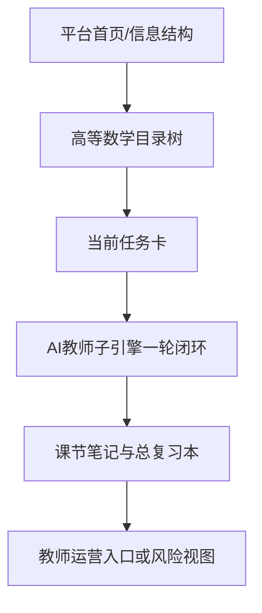
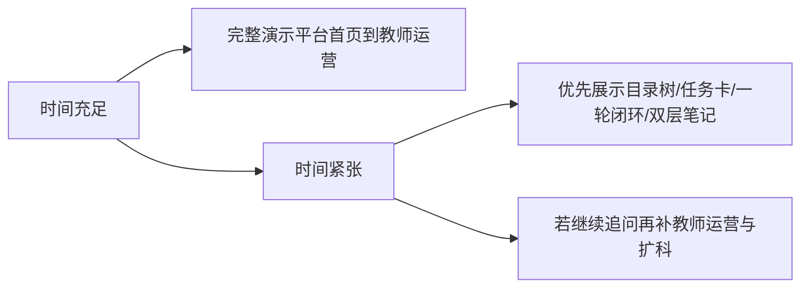

# 答辩口径与演示脚本

> 文档层级：交付层  
> 文档目的：给出 5-10 分钟答辩场景下可复述、可执行、可切换的标准口径与演示顺序  
> 核心结论：答辩最重要的不是把配置细节讲满，而是让评委清楚看见“平台如何组织学习”“AI教师子引擎如何执行教学”“高等数学如何验证平台成立”  
> 目标读者：主讲人、演示同学、答辩准备者  
> 上游文档：[比赛对齐说明.md](./比赛对齐说明.md)、[AI主导学习平台-产品总纲.md](../平台层/AI主导学习平台-产品总纲.md)、[高等数学-平台接入示范.md](../学科层/高等数学-平台接入示范.md)  
> 下游文档：现场答辩稿、展示提词  
> 适用范围：5-10 分钟演示与答辩场景  

## 与其他文档的边界

本文只提供答辩口径和演示顺序。  
本文不替代平台总纲、平台需求、学科示范和技术参考本身。  

## 一句话先记住

> 现场先让评委看见平台如何组织学习，再让评委看见 AI教师子引擎如何执行教学，最后再让评委看见高等数学如何验证这套平台成立。

## 1. 开场 30 秒

建议开场直接说：

> 我们做的不是单点 AI 教师，而是一个 AI主导学习平台。  
> 平台负责管理学习全生命周期，AI教师子引擎负责学科教学闭环执行。  
> 这次我们用高等数学作为第一门完整示范学科来验证平台能力。  

## 2. 三句话讲清作品

1. 学生不用先会提问，平台会先建档、排目录、推任务。
2. 学完每一节后，平台会自动生成课节笔记并更新个人总复习本。
3. 高等数学只是第一门示范学科，平台未来可以按学科大类继续扩展。

## 3. 建议演示顺序

### 图 1：标准演示链路

建议固定按下面顺序演示：

1. 展示平台首页或平台信息结构：看到学科大类、学科、当前阶段、当前任务卡
2. 展示高等数学目录树：说明当前在数学大类下的第一门示范学科
3. 演示一轮学习推进：当前任务 -> AI教师子引擎讲解/练习/测评 -> 是否回补
4. 展示课节笔记与个人总复习本：证明平台不是只留聊天记录
5. 展示教师运营入口或风险视图：说明平台支持后续干预与扩展

## 4. 评委追问时的标准回答

### 如果被问“为什么不是普通 AI 教师”

回答：

> 因为普通 AI 教师通常停留在单轮问答，我们这里的平台负责的是持续学习编排、学习资产沉淀和跨学科扩展，AI教师只是其中的执行子引擎。

### 如果被问“为什么先做高等数学”

回答：

> 因为高等数学既能展示概念补桥，又能展示图像化讲解、步骤化训练和阶段推进，非常适合作为第一门完整示范学科。

### 如果被问“平台扩展性体现在哪”

回答：

> 平台已经把公共机制固定为建档、目录树、任务卡、自动推进、双层笔记和阶段复习；新增学科时只需要补学科目录、补桥逻辑、专属策略和模板资产。

## 5. 现场切换策略

### 图 2：答辩现场切换策略

- 如果时间只有 `5` 分钟，优先讲清：目录树、当前任务卡、一轮闭环、双层笔记。
- 如果时间有 `8-10` 分钟，再展示教师运营入口和扩科学科口径。
- 如果评委问到“为什么这样组织文档”，可以提一句平台有单独的技术参考，但不要把技术参考当主演示材料。

## 6. 收尾口径

建议最后一句收在：

> 我们想证明的不是 AI 能不能讲一道题，而是 AI 能不能持续管理学习生命周期，并把这种能力扩展到更多学科与更多学生群体。

## 读完后你应该带走什么

- 演示顺序必须先平台、后子引擎、再学科示范。
- 你不是在展示某个 Agent，而是在展示一套平台机制。
- 技术参考只做补充，不是答辩主稿。

## 下一篇建议阅读

1. [比赛对齐说明.md](./比赛对齐说明.md)
2. [AI主导学习平台-产品总纲.md](../平台层/AI主导学习平台-产品总纲.md)
3. [高等数学-平台接入示范.md](../学科层/高等数学-平台接入示范.md)

## 本文不负责什么

- 不提供完整 PPT 文案
- 不定义平台结构和需求
- 不定义子引擎技术实现
- 不代替学科示范材料
