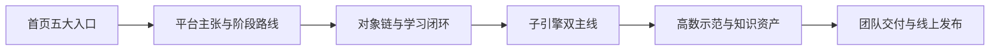

# 答辩口径与演示脚本

> 文档层级：交付层
> 文档目的：给出 5 到 10 分钟答辩场景下可直接复述的讲法、演示顺序和追问回答骨架
> 核心结论：答辩要先让评委看懂平台主线，再看对象链和高数示范，最后再补团队收口与发布结果
> 目标读者：主讲人、演示同学、答辩准备者
> 推荐下一步：正式彩排前先对照 [比赛对齐说明.md](./比赛对齐说明.md)

## 与其他文档的边界

一句人话：这篇负责你现场怎么讲，不负责重新定义平台结构。

平台主张、对象字段、智能体职责和高数落地细节，都以上游真源文档为准；这篇只把它们翻译成现场更好讲的顺序。

## 一句话先记住

一句人话：最稳的讲法不是讲满，而是让评委在几分钟内看见“平台成立、实现可信、示范落地、团队能交付”。

> 现场先讲平台是什么，再讲对象链和双主线，接着讲高等数学如何证明平台成立，最后讲团队怎么把版本收口并上线。

## 1. 现场演示顺序

一句人话：先总后分，再回到落地证明，会比一上来点高数页面更稳。

| 顺序 | 页面或文档 | 你要讲清什么 |
| --- | --- | --- |
| 1 | 首页 `/` | 这不是零散文档站，而是按五大类收口的项目入口 |
| 2 | [平台总纲与架构.md](../平台层/平台总纲与架构.md) | 平台层、子引擎层、学科层、交付层怎样分工 |
| 3 | [AI主导学习平台-统一对象与接口契约.md](../平台层/AI主导学习平台-统一对象与接口契约.md) | 学习档案、学习会话、当前任务卡、回流结果如何形成对象链 |
| 4 | [AI教师子引擎总览与设计.md](../子引擎层/AI教师子引擎总览与设计.md) | 学生教学执行线和教师运营支持线怎样协作 |
| 5 | [高等数学接入与知识库总览.md](../学科层/高等数学接入与知识库总览.md) | 为什么用高数证明平台成立，以及知识资产如何落地 |
| 6 | [比赛交付与答辩手册.md](./比赛交付与答辩手册.md) | 团队怎样收口、彩排和发布 |

## 2. 开场 30 秒怎么说

一句人话：开场先把作品定义钉住，不要一开始就落进某一页细节。

建议开场直接说：

> 我们做的不是单点 AI 教师，而是一套 AI 主导学习平台。
> 平台负责管理学习全生命周期，AI教师子引擎负责学生教学执行线和教师运营支持线。
> 这次我们用高等数学作为第一门完整示范学科，来证明平台能持续组织学习、沉淀学习结果，并支持后续扩科和产品接入。

## 3. 三句话讲清作品

一句人话：这三句话是整场答辩的骨架，不要换来换去。

1. 学生不用先会提问，平台会先建档、排目录、推任务。
2. 每一轮学习结束后，平台会沉淀课节笔记、个人总复习本和教师运营摘要。
3. 高等数学只是第一门完整示范学科，平台未来可以按模板扩到更多学科，并接进自己的前后端系统。

## 4. 评委追问时怎么答

一句人话：追问时先回到平台定义，再补实现和示范，不要被带成“某个页面怎么配”。

| 追问 | 标准回答 |
| --- | --- |
| 为什么不是普通 AI 教师 | 因为普通 AI 教师往往停留在单轮问答，我们这里的平台负责持续学习编排、学习资产沉淀、教师运营支持和扩科接入。 |
| 为什么先做高等数学 | 因为高等数学既能展示概念补桥，也能展示图像化讲解、步骤化训练、教师风险识别和模板化扩科。 |
| 扩展性体现在哪 | 平台已经固定了角色主线、对象契约、知识库规则和学科接入模板；新增学科时重点是补学科目录、补桥逻辑和专属策略，而不是重做平台。 |
| 是否能接进真实产品 | 可以，`P2` 已保留 `BFF`、`HTTP SSE`、自定义前端、上下文透传和学习记录沉淀的正式路线。 |

## 5. 收尾口径

一句人话：最后一句要收在平台长期价值，而不是单页展示效果。

建议最后一句收在：

> 我们想证明的不是 AI 能不能讲一道题，而是 AI 能不能持续组织学习、支持教师干预，并把这种能力扩展到更多学科和更多产品接入场景。

## 6. 交付层当前固定定位

一句人话：答辩层是翻译层，不是定义层。

- 平台层、子引擎层、学科层是研发真源。
- 交付层只做答辩翻译和比赛执行说明，不再定义平台本体。
- 如果评委追问技术细节，优先回到上游真源文档。

## 读完后你应该带走什么

- 演示顺序必须先平台主线，再对象链，再学科示范，最后收在团队与发布。
- 教师主线和 `P2` 接入主线都应保留在现场口径里。
- 交付层已经降为下游翻译层，但它必须把现场顺序收稳。

## 本文不负责什么

- 不提供完整 PPT 全文
- 不定义平台结构和对象本体
- 不定义子引擎技术实现
- 不代替学科示范材料正文
