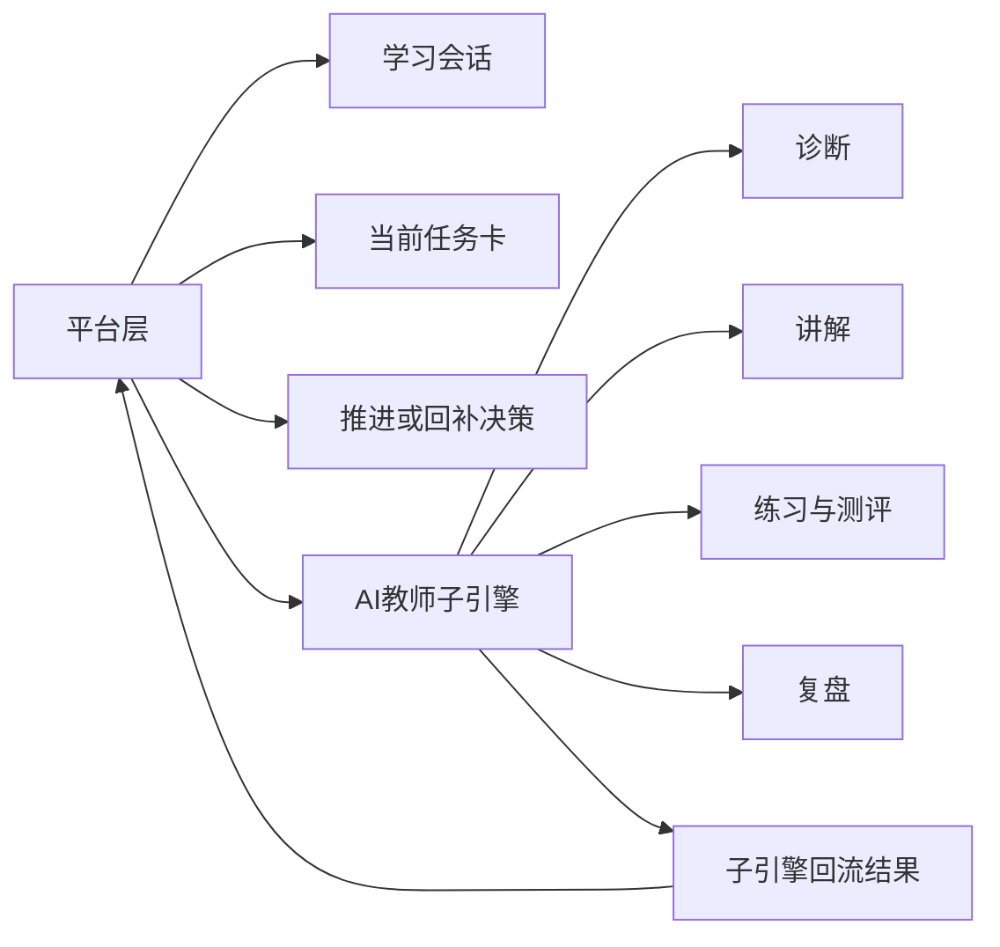
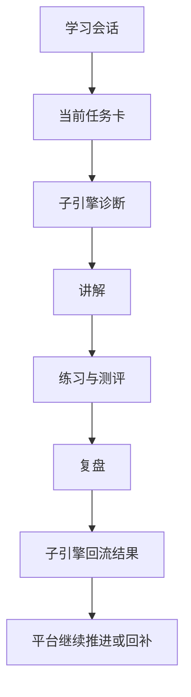

# AI教师子引擎-PRD

> 文档层级：子引擎层  
> 文档目的：定义 AI教师子引擎的功能范围、输入输出、结构化回流结果与验收边界  
> 核心结论：AI教师子引擎负责“把这一节真正教完”，但不替平台决定“学生整体该怎么学”；它必须围绕当前任务卡工作，并把结果结构化回流给平台  
> 目标读者：研发协作者、配置实施者、产品负责人、答辩准备者  
> 上游文档：[AI主导学习平台-产品总纲.md](../平台层/AI主导学习平台-产品总纲.md)、[AI主导学习平台-平台需求与验收.md](../平台层/AI主导学习平台-平台需求与验收.md)、[AI主导学习平台-学习生命周期与编排策略.md](../平台层/AI主导学习平台-学习生命周期与编排策略.md)  
> 下游文档：[AI教师子引擎-教学策略设计.md](./AI教师子引擎-教学策略设计.md)、[AI教师子引擎-技术方案.md](./AI教师子引擎-技术方案.md)、[01-P0-Multi-Agent学生主闭环-架构设计.md](./实施附录/01-P0-Multi-Agent学生主闭环-架构设计.md)  
> 适用范围：AI教师子引擎的通用能力定义  

## 与其他文档的边界

本文只定义 AI教师子引擎要做什么。  
平台目录树、学习会话、当前任务卡、双层笔记、学科大类与跨学科扩展由平台层负责。  

## 一句话先记住

> 子引擎是教学执行层，不是平台编排层；平台决定“学什么”，子引擎决定“这一节怎么教、学得怎样”。  

## 1. 一页结论

AI教师子引擎负责的是学科教学闭环执行，而不是平台总编排。  
它的固定主线是：

`诊断 -> 讲解 -> 练习 -> 测评 -> 复盘 -> 记忆更新`

平台通过当前任务卡把“这一轮该学什么”交给子引擎，子引擎再把“这一节怎么学、学得怎样”执行出来，并回流成平台能继续推进的结果。

### 图 1：平台与子引擎的职责边界

### 1.1 子引擎能力面

这里正式把 `子引擎能力面` 固定为子引擎主文档术语。  
它指 AI教师子引擎稳定提供给平台的一组教学执行能力，不包含平台编排、目录组织和扩科机制。

| 子引擎能力项 | 作用 | 不替代的平台动作项 |
| --- | --- | --- |
| 学习诊断 | 判断层级、卡点和优先路径 | 学习建档、目录树装配 |
| 分层讲解 | 输出与学生层级匹配的讲解结果 | 当前任务卡生成 |
| 练习与测评 | 组织题目、评分与达标判断 | 推进或回补决策 |
| 错因归因 | 给出错误类型和纠偏方向 | 阶段复习组织 |
| 复盘计划 | 输出本轮总结与下一步建议 | 总复习本维护 |
| 教师运营分析 | 聚合风险信号和干预建议 | 教师运营入口本身 |

## 2. 子引擎目标与约束

### 2.1 目标

- 判断学生当前卡点和学习层级
- 输出与层级匹配的讲解
- 组织练习与形成性测评
- 归因错因并生成下一轮复盘结果
- 将可沉淀结果回流给平台双层笔记

### 2.2 约束

- 必须基于腾讯云 ADP 落地
- 必须体现教育场景，不退化为通用聊天工具
- 必须能被平台的当前任务卡和学科上下文驱动
- 必须把结果沉淀成可供平台继续推进的结构化输出

## 3. 子引擎功能需求（FR-01 ~ FR-12）

| 编号 | 能力 | 阶段 | 关键输出 |
| --- | --- | --- | --- |
| `FR-01` | AI教师画像与教学策略 | `P0` | 教师风格、分层规则、统一术语 |
| `FR-02` | 多模态学习内容理解 | `P0` | 文本/图片/语音/文档的结构化输入 |
| `FR-03` | 学习诊断 | `P0` | 学习层级、当前卡点、优先路径 |
| `FR-04` | 分层讲解 | `P0` | 基础讲解 / 标准讲解 / 拓展讲解 |
| `FR-05` | 引导练习 | `P0` | 1-3 道匹配当前层级的练习 |
| `FR-06` | 形成性测评 | `P0` | 达标判断、评分、关键反馈 |
| `FR-07` | 错因归因 | `P0` | 错因分类、纠偏建议 |
| `FR-08` | 个性化学习计划 | `P0` | 下一轮复盘结果与学习计划 |
| `FR-09` | 教师运营看板输出 | `P1` | 风险学生、班级趋势、干预建议 |
| `FR-10` | 标签检索控制 | `P1` | 课程/章节/角色隔离检索 |
| `FR-11` | 评测体系 | `P1` | 回归评测、对比评测、版本报告 |
| `FR-12` | 发布接入支持 | `P2` | 自定义接入、外部系统接入与发布增强 |

## 4. 子引擎输入输出约定

### 4.1 核心输入

| 中文字段 | 说明 |
| --- | --- |
| 学习会话 | 学生当前这一轮学习上下文 |
| 当前任务卡 | 这一轮的目标、完成标准、回补条件 |
| 学科上下文 | 当前学科、阶段、模块、课节与知识资源 |
| 学生作答 | 本轮输入、过程回答、练习结果 |
| 历史记忆摘要 | 上一轮沉淀出的关键结果 |

### 4.2 核心输出

| 中文字段 | 说明 |
| --- | --- |
| 学习层级 | 当前学生的理解层级 |
| 当前卡点 | 本轮最关键的阻塞点 |
| 讲解结果 | 给学生的主要讲解结果 |
| 练习与测评结果 | 练习完成情况和达标判断 |
| 错因归因 | 错误类型和纠偏方向 |
| 复盘结果 | 本轮应沉淀到平台的总结 |
| 子引擎回流结果 | 平台继续推进所需的结构化结果 |

### 图 2：子引擎输入输出主链路

## 5. 结构化回流结果

一句人话

> 子引擎不能只给平台回一句“学生学得还行”，而是要回一份平台真的能继续用的结果。

建议子引擎回流结果至少解释清楚下面这些中文字段：

- 学习会话编号
- 当前任务卡编号
- 达标程度
- 下一步动作
- 需要写入课节笔记的增量
- 风险标记
- 本轮总结

代码键名可以继续保留英文，例如：

`sessionId`、`taskCardId`、`mastery`、`nextAction`、`notesDelta`、`riskFlags`、`summary`

## 6. 子引擎非功能要求

| 编号 | 要求 |
| --- | --- |
| `NFR-01` | 输出必须可解释，尤其是诊断、测评与错因归因 |
| `NFR-02` | 输出必须能被平台继续沉淀和推进 |
| `NFR-03` | 回答必须贴课程知识，不退化为通用闲聊 |
| `NFR-04` | 分层讲解与练习节奏必须稳定 |
| `NFR-05` | 教师运营分析不能阻塞学生主闭环 |

## 7. 推荐验收口径

- 学生进入某一节后，子引擎能完整跑通一轮教学闭环
- 不同层级学生拿到的讲解与练习有明显差异
- 测评结果能够影响下一轮计划或平台回补
- 输出结果足够结构化，能进入课节笔记和总复习本

## 读完后你应该带走什么

- 子引擎不是平台总编排者，而是平台的教学执行层。
- `子引擎能力面` 负责定义“这一节怎么教”，但不接管平台动作面。
- 当前任务卡和子引擎回流结果，是平台与子引擎最关键的连接点。
- 这份 PRD 要求子引擎输出结构化结果，而不是只输出自然语言。

## 下一篇建议阅读

1. [AI教师子引擎-教学策略设计.md](./AI教师子引擎-教学策略设计.md)
2. [AI教师子引擎-技术方案.md](./AI教师子引擎-技术方案.md)
3. [../平台层/AI主导学习平台-总体架构设计.md](../平台层/AI主导学习平台-总体架构设计.md)

## 本文不负责什么

- 不定义平台总结构和平台 FR/NFR/AC
- 不定义学科大类与接入规范
- 不代替高等数学或其他学科示范文档
- 不代替比赛答辩稿
