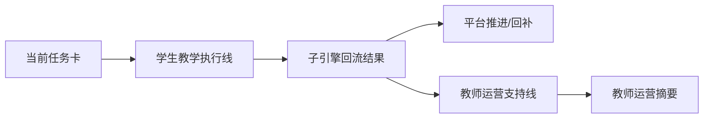

# AI教师子引擎-PRD

> 文档层级：子引擎层  
> 文档目的：定义 AI教师子引擎的能力范围、双主线职责、输入输出与验收边界  
> 核心结论：AI教师子引擎负责“把这一轮真正教完”，同时为教师主线输出风险与干预摘要；它不是平台编排层，但必须长期承接平台对象契约与阶段路线  
> 目标读者：研发协作者、配置实施者、产品负责人、答辩准备者  
> 上游真源：[AI主导学习平台-角色主线与阶段地图.md](../平台层/AI主导学习平台-角色主线与阶段地图.md)、[AI主导学习平台-统一对象与接口契约.md](../平台层/AI主导学习平台-统一对象与接口契约.md)、[AI主导学习平台-总体架构设计.md](../平台层/AI主导学习平台-总体架构设计.md)  
> 下游文档：[AI教师子引擎-教学策略设计.md](./AI教师子引擎-教学策略设计.md)、[AI教师子引擎-技术方案.md](./AI教师子引擎-技术方案.md)、[01-P0-Multi-Agent学生主闭环-架构设计.md](./实施附录/01-P0-Multi-Agent学生主闭环-架构设计.md)  
> 适用范围：AI教师子引擎通用能力、阶段职责、验收边界

## 与其他文档的边界

本文只定义 AI教师子引擎要做什么。  
平台角色分工、对象字段和平台编排边界，分别以角色主线文档、统一对象契约文档和总体架构文档为准。

## 一句话先记住

> 子引擎是教学执行层和教师运营支持层，不是平台编排层；平台决定“学什么、何时推进”，子引擎决定“这一轮怎么教、学得怎样、教师应该关注什么”。

## 1. 一页结论

AI教师子引擎现在固定承接两条能力线：

1. 学生教学执行线：`诊断 -> 讲解 -> 练习 -> 测评 -> 复盘`
2. 教师运营支持线：`风险识别 -> 趋势聚合 -> 干预建议`

其中：

- 学生教学执行线是 `P0` 起就必须成立的主链
- 教师运营支持线在 `P1` 起正式进入竞争力
- `TeacherOpsAgent` 是教师运营支持线的重要实现节点，但始终是增强旁路，不阻塞学生主闭环

### 图 1：双主线

## 2. 子引擎目标与约束

### 2.1 目标

- 承接平台下发的学习会话和当前任务卡
- 在单轮内稳定完成诊断、讲解、练习、测评、复盘
- 把本轮结果回流成平台可继续推进的结构化对象
- 为教师/运营者输出可聚合的风险、趋势和干预摘要

### 2.2 约束

- 必须服务平台编排，不自定义平台总结构
- 必须承接统一对象契约，不自定义另一套主对象
- `TeacherOpsAgent` 只能做增强旁路，不能阻塞学生主闭环
- `P2` 接口必须承接 `HTTP SSE`、`AppKey`、`BFF`、自定义前端等产品接入主线

## 3. 子引擎能力结构

### 3.1 学生教学执行线

| 能力 | 作用 | 关键输出 |
| --- | --- | --- |
| 学习诊断 | 判断层级、卡点、优先路径 | 学习层级、当前卡点 |
| 分层讲解 | 输出适配当前学生的讲解 | 讲解结果 |
| 引导练习 | 组织与当前目标匹配的练习 | 练习结果 |
| 形成性测评 | 判断是否达标、哪里没达标 | 达标程度 |
| 复盘与下一步建议 | 输出本轮总结与下一步动作 | 本轮总结、下一步动作 |

### 3.2 教师运营支持线

| 能力 | 作用 | 关键输出 |
| --- | --- | --- |
| 风险识别 | 识别停滞、反复回补、高频错因 | 风险标记 |
| 趋势聚合 | 聚合班级或群体层面的结果 | 趋势摘要 |
| 干预建议 | 给教师/运营者可执行动作 | 干预建议 |

## 4. 功能需求（FR）

| 编号 | 能力 | 所属主线 | 阶段 |
| --- | --- | --- | --- |
| `FR-01` | 承接学习会话与当前任务卡 | 学生教学执行线 | `P0` |
| `FR-02` | 学习诊断 | 学生教学执行线 | `P0` |
| `FR-03` | 分层讲解 | 学生教学执行线 | `P0` |
| `FR-04` | 练习与测评 | 学生教学执行线 | `P0` |
| `FR-05` | 复盘与下一步建议 | 学生教学执行线 | `P0` |
| `FR-06` | 结构化子引擎回流结果 | 学生教学执行线 | `P0` |
| `FR-07` | 教师运营支持线旁路输出 | 教师运营支持线 | `P1` |
| `FR-08` | 风险识别与趋势聚合 | 教师运营支持线 | `P1` |
| `FR-09` | 干预建议输出 | 教师运营支持线 | `P1` |
| `FR-10` | `HTTP SSE` 流式接口承接 | 产品接入主线承接 | `P2` |
| `FR-11` | `AppKey` / `BFF` / 自定义前端协同 | 产品接入主线承接 | `P2` |
| `FR-12` | 学习记录与教师聚合结果可沉淀 | 产品接入主线承接 | `P2` |

## 5. 核心输入输出

### 5.1 核心输入

字段正式定义统一见 [AI主导学习平台-统一对象与接口契约.md](../平台层/AI主导学习平台-统一对象与接口契约.md)。  
子引擎至少固定承接下面这些输入：

- 学习会话
- 当前任务卡
- 学科上下文
- 学生作答与历史摘要
- `visitor_biz_id`
- `custom_variables`
- `chapter_id`
- `role`

### 5.2 核心输出

- 子引擎回流结果
- 教师运营摘要

一句人话：

> 子引擎不能只输出一段“像老师的话”，而是要输出平台和教师主线都真正接得住的结构化结果。

## 6. 阶段职责

| 阶段 | 子引擎成立什么 | 不替代什么 |
| --- | --- | --- |
| `P0` | 学生教学执行线与结构化回流底座 | 不替代平台编排，不要求教师主线先完整成立 |
| `P1` | 教师运营支持线正式进入主文档与主能力 | 不替代学生主闭环，不把教师分析变成学生主答复 |
| `P2` | 面向接入方的流式输出、产品接口与学习记录沉淀协同 | 不替代 `BFF`、不重造 ADP |

## 7. 验收边界

子引擎通过标准至少包括：

- 能围绕当前任务卡完成一轮教学闭环
- 能输出平台可接住的子引擎回流结果
- 能输出教师可用的教师运营摘要
- `TeacherOpsAgent` 可增强，但不阻塞学生主闭环
- `P2` 接口文档中能明确承接 `HTTP SSE`、`AppKey`、`BFF`、自定义前端

## 读完后你应该带走什么

- 子引擎已经不是单线“学生答疑器”，而是双主线执行层。
- `TeacherOpsAgent` 进入正式竞争力，但不是正式平台角色。
- 子引擎始终要回到平台对象契约和阶段路线。

## 下一篇建议阅读

1. [AI教师子引擎-技术方案.md](./AI教师子引擎-技术方案.md)
2. [AI教师子引擎-教学策略设计.md](./AI教师子引擎-教学策略设计.md)
3. [../平台层/AI主导学习平台-统一对象与接口契约.md](../平台层/AI主导学习平台-统一对象与接口契约.md)

## 本文不负责什么

- 不定义平台对象字段本体
- 不定义平台编排与阶段地图
- 不展开某一学科的配置细节
- 不代替比赛答辩稿
