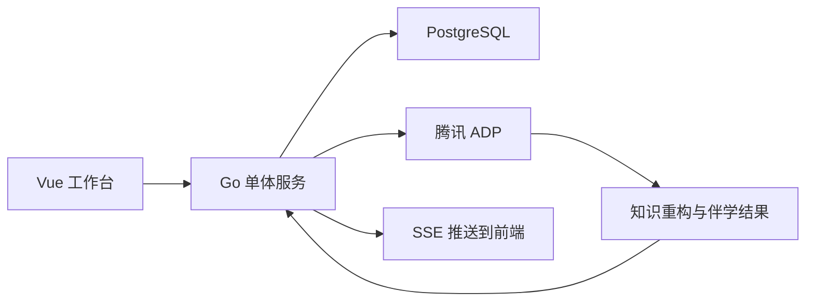

# AI教师子引擎-技术方案

> 文档层级：子引擎层  
> 文档目的：说明 AI教师子引擎的技术组成、算法映射、平台接入方式和单机部署约束  
> 核心结论：比赛版推荐用“腾讯 ADP + Multi-Agent + Go 单体平台 + REST/SSE 接口”承接知识重构与伴学主流程  
> 目标读者：架构师、后端开发、算法协作者、联调人员  
> 上游真源：[AI教师子引擎-PRD.md](./AI教师子引擎-PRD.md)、[AI主导学习平台-统一对象与接口契约.md](../平台层/AI主导学习平台-统一对象与接口契约.md)  
> 下游引用：[04-总体架构与技术选型.md](../../作品文档/04-总体架构与技术选型.md)、[06-接口与API说明.md](../../作品文档/06-接口与API说明.md)

## 与其他文档的边界

本文只说明技术实现路线和接口承接方式。  
页面交互细节不在本文定义，比赛叙事不在本文定义，对象字段首定义仍回到平台统一对象契约。

## 一句话先记住

> 技术方案的重点不是“堆模型”，而是让知识重构、伴学、评分、复练、教师洞察能在单机服务里稳定协同，并被前端工作台顺畅消费。

## 1. 正式技术路线

### 1.1 平台栈

- 前端：Vue 3 + TypeScript + Vite + Vue Router + Pinia + Naive UI + Tailwind CSS + VueUse Motion + ECharts
- 后端：Go 1.24 + Gin + pgx/sqlc + PostgreSQL 16
- AI 编排：腾讯 ADP
- 流式协议：HTTP SSE V2
- 文件存储：腾讯 COS，开发环境兼容 MinIO

### 1.2 推荐协作方式

- Go 单体服务负责编排请求、鉴权、对象持久化、SSE 转发
- ADP 负责子引擎智能流程和模型调度
- PostgreSQL 负责业务对象、学习记录和操作日志
- 前端工作台负责学生、教师、管理员三类可视化入口

## 2. 推荐 Agent 结构

| Agent | 职责 | 对应输出 |
| --- | --- | --- |
| `MaterialParseAgent` | 解析课堂资料、多模态内容标准化 | 结构化素材 |
| `KnowledgeMapAgent` | 抽取知识点、先修图谱、易错点 | 知识重构结果 |
| `TutorAgent` | 围绕任务卡进行讲解、追问、提示 | 会话流输出 |
| `AssessmentAgent` | 评分、掌握度估计、风险标记 | 掌握度快照 |
| `ErrorAnalystAgent` | 错因归类、变式生成、复习计划 | 错题画像 |
| `TeacherOpsAgent` | 班级聚合、风险排序、干预建议 | 教师洞察摘要 |

说明：

- `TeacherOpsAgent` 仍是增强旁路，不阻塞学生主学习流程
- Agent 数量允许后续调整，但输出对象不能脱离统一契约

## 3. 算法映射

| 算法能力 | 技术落点 | 用在什么地方 |
| --- | --- | --- |
| 多模态课堂知识重构 | 资料解析 + 知识图谱抽取 | 上传与重构页 |
| 先修图谱与任务路径规划 | 图结构关系 + 任务推荐 | 工作台首页、伴学页 |
| 掌握度/风险评分模型 | 作答评分 + 知识点加权 | 伴学页、教师洞察页 |
| 错题归因与变式生成 | 错因分类 + 生成式变式题 | 错题与复习页 |
| 间隔复习调度 | 时间窗与掌握度回落策略 | 错题与复习页 |
| 群体风险聚合 | 班级级别统计与热区分析 | 教师洞察页 |

## 4. 接口承接

### 4.1 REST

用于：

- 素材上传
- 重构结果查询
- 会话创建
- 作答提交
- 洞察查询
- 管理配置

### 4.2 SSE

用于：

- 学生伴学流式输出
- 长任务状态通知
- 前端实时更新任务状态和阶段提示

## 5. 平台协作流程

## 6. 单机高可用方案

当前正式口径：

- `Caddy` 或 `Nginx` 作为反向代理与静态分发入口
- `systemd` 负责 Go 服务守护
- 服务提供 `/healthz` 和 `/readyz` 检查
- 发布时采用优雅重启
- PostgreSQL 提供定时备份与恢复脚本
- ADP 调用失败时返回降级说明和可重试状态

## 7. 为什么当前不做微服务

原因固定如下：

- 比赛周期短，优先保证可交付与可维护
- 当前流量和业务复杂度不足以支撑微服务拆分收益
- 单体架构更利于 AI 全程开发和快速联调
- 通过对象契约、接口分组和模块化目录即可保留后续拆分空间

## 8. 代码与模块建议

后端推荐模块划分：

- `api/material`
- `api/reconstruction`
- `api/session`
- `api/chat`
- `api/submission`
- `api/insight`
- `api/admin`

前端推荐模块划分：

- `views/workbench`
- `views/materials`
- `views/session`
- `views/review`
- `views/insight`
- `views/admin`

## 读完后你应该带走什么

- 技术方案已经明确收敛到 Vue 3 前端、Go 单体后端、ADP 子引擎的单机架构。
- 算法优化已正式映射到页面与接口，不再是附注。
- 子引擎技术方案的关键是“可接、可看、可维护”，不是模型列表本身。

## 下一篇建议阅读

1. [06-接口与API说明.md](../../作品文档/06-接口与API说明.md)
2. [04-总体架构与技术选型.md](../../作品文档/04-总体架构与技术选型.md)
3. [05-算法与知识库设计.md](../../作品文档/05-算法与知识库设计.md)
