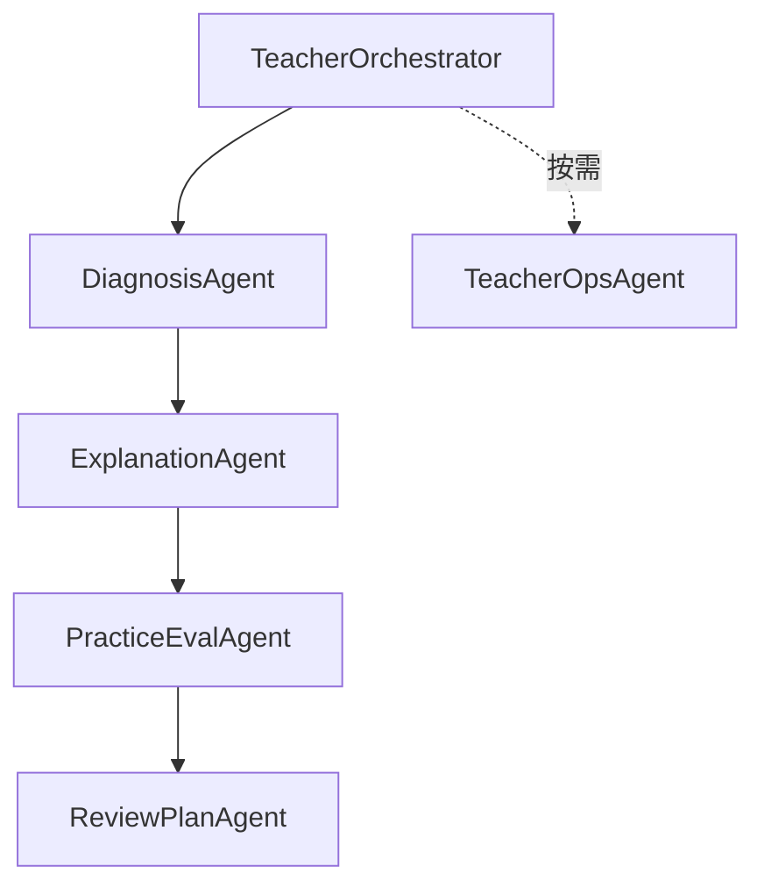

# AI教师子引擎-技术方案

> 文档层级：子引擎层  
> 文档目的：描述 AI教师子引擎的技术主线、模型绑定、工作流与系统边界  
> 核心结论：技术方案的重点不是模型列表，而是子引擎如何围绕平台当前任务卡工作，并把结构化结果稳定回流给平台  
> 目标读者：技术负责人、配置实施者、研发协作者  
> 上游真源：[AI教师子引擎-PRD.md](./AI教师子引擎-PRD.md)、[AI教师子引擎-教学策略设计.md](./AI教师子引擎-教学策略设计.md)  
> 下游引用：[01-P0-Multi-Agent学生主闭环-架构设计.md](./实施附录/01-P0-Multi-Agent学生主闭环-架构设计.md)、[高等数学-ADP配置手册.md](../学科层/高等数学-ADP配置手册.md)  
> 适用范围：AI教师子引擎的技术实现口径

## 与其他文档的边界

本文只定义子引擎技术方案，不定义平台总结构与学科大类。  
高等数学等具体学科的配置细节在学科层文档中展开。

## 一句话先记住

> 子引擎技术方案必须服务平台编排，不是自成一套孤立工作流。

## 1. 一页结论

子引擎技术主线固定为：

`ADP 应用开发 + Multi-Agent + 工作流编排`

当前定版：

- 模式：`1 主控 + 5 子 Agent`
- 协同：`工作流编排`
- 知识主线：`知识库 + 变量边界 + 长期记忆`
- 外部扩展：`插件/API 优先`
- 自定义 Skill：不进入当前主链路

### 1.1 子引擎能力面如何落到技术方案

这里正式把 `子引擎能力面` 写进技术方案。  
它的意思不是“多几个 Agent 名字”，而是把子引擎能稳定提供的教学能力，落实成可调用、可回流、可被平台接住的技术接口。

| 子引擎能力项 | 技术落点 |
| --- | --- |
| 学习诊断 | `DiagnosisAgent` 输出学习层级、当前卡点、优先路径 |
| 分层讲解 | `ExplanationAgent` 输出基础讲解、标准讲解、拓展讲解 |
| 练习与测评 | `PracticeEvalAgent` 输出练习结果、评分、达标判断 |
| 错因归因与复盘 | `ReviewPlanAgent` 输出错因归因、复盘结果、下一步动作 |
| 教师运营分析 | `TeacherOpsAgent` 输出风险学生、趋势、干预建议 |

## 2. Agent 结构

| Agent | 职责 | 推荐模型 |
| --- | --- | --- |
| `TeacherOrchestrator` | 调度、汇总、最终收口 | `Tencent HY 2.0 Think` |
| `DiagnosisAgent` | 分层、卡点、路径判断 | `DeepSeek-R1-0528` |
| `ExplanationAgent` | 中文讲解、步骤拆解 | `Tencent HY 2.0 Instruct` |
| `PracticeEvalAgent` | 出题、判题、达标判断 | `DeepSeek-V3.2` |
| `ReviewPlanAgent` | 错因归因、复盘、下一轮计划 | `DeepSeek-R1-0528` |
| `TeacherOpsAgent` | 风险识别、趋势分析、干预建议 | `DeepSeek-R1-0528` |

## 3. 工作流主线

约束：

- 学生主闭环固定走 `主控 -> 诊断 -> 讲解 -> 练习测评 -> 复盘`
- `TeacherOpsAgent` 只做增强旁路
- 子引擎输出必须能回流到平台双层笔记

## 4. 输入输出边界

### 4.1 核心输入

- 平台下发的学习会话
- 平台下发的当前任务卡
- 学科与章节上下文
- 学生当前问题与作答
- `visitor_biz_id`
- `custom_variables`
- 历史记忆摘要

### 4.2 核心输出

- 学习层级
- 当前卡点
- 讲解结果
- 达标判断
- 错因归因
- 复盘结果
- 教师运营摘要

### 4.3 子引擎回流结果

一句人话

> 技术实现里最关键的不是“能不能输出很多字”，而是“能不能输出平台真的接得住的结果”。

建议技术方案统一关注这些回流字段：

- 学习会话编号
- 当前任务卡编号
- 达标程度
- 下一步动作
- 笔记增量
- 风险标记
- 本轮总结

### 4.4 会话与过程记录接口

这里正式把 `会话与过程记录` 写进技术方案。  
子引擎技术实现不只要处理“这一轮回复什么”，还要处理“这一轮为什么这样推进、推进后给平台留下什么记录”。

| 中文字段 | 代码键名示意 | 用途 |
| --- | --- | --- |
| 学习会话编号 | `sessionId` | 把同一轮学习上下文固定下来 |
| 当前任务卡编号 | `taskCardId` | 让平台知道本轮围绕哪张任务卡执行 |
| 达标程度 | `mastery` | 让平台决定推进还是回补 |
| 下一步动作 | `nextAction` | 让平台知道下一轮进入哪个节点 |
| 笔记增量 | `notesDelta` | 让课节笔记和总复习本能继续沉淀 |
| 教师运营提示 | `teacherOpsHint` | 让教师运营入口能接住子引擎分析结果 |

## 5. 技术选型口径

| 维度 | 结论 |
| --- | --- |
| 平台 | `ADP 应用开发` |
| 智能体模式 | `Multi-Agent` |
| 协同方式 | `工作流编排` |
| 协议 | `HTTP SSE` 作为后续产品接入默认协议 |
| 数据库 | `PostgreSQL` |
| 向量策略 | `P0/P1` 不引 `pgvector` 主链路，`P2` 可选 |
| 扩展方式 | `插件/API` 优先，自定义 Skill 仅保留评估位 |

## 6. 与平台层的协作要求

- 平台负责当前任务与推进控制，子引擎不自定义平台总结构
- 子引擎返回达标状态和复盘结果，平台负责继续推进或回补
- 子引擎输出结构必须适配课节笔记和总复习本

## 读完后你应该带走什么

- 技术方案里最该盯住的是输入输出边界，而不是只盯模型。
- `子引擎能力面` 最终要落成稳定的输入输出接口，而不是停留在 Agent 名称列表。
- 当前任务卡和子引擎回流结果，是子引擎技术方案必须明确的两端。
- 后续 P1/P2 增强，都不应该破坏学生主闭环。

## 下一篇建议阅读

1. [AI教师子引擎-PRD.md](./AI教师子引擎-PRD.md)
2. [AI教师子引擎-教学策略设计.md](./AI教师子引擎-教学策略设计.md)
3. [../平台层/AI主导学习平台-总体架构设计.md](../平台层/AI主导学习平台-总体架构设计.md)

## 7. 本文不负责什么

- 不定义平台需求与学科大类
- 不定义高等数学具体配置明细
- 不代替实施附录和配置手册
- 不代替比赛答辩稿
