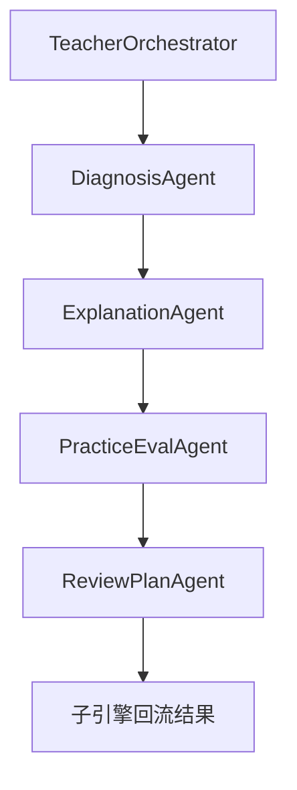
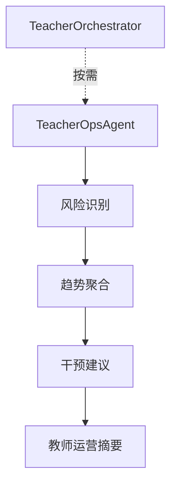
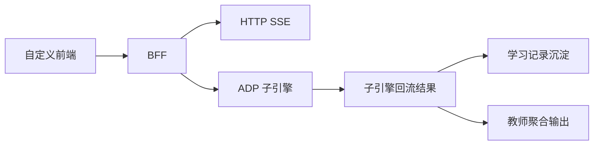

# AI教师子引擎-技术方案

> 文档层级：子引擎层  
> 文档目的：描述 AI教师子引擎的技术主线、运行视角、输入输出接口与接入协作方式  
> 核心结论：技术方案的重点不是模型列表，而是子引擎如何沿 `ADP + Multi-Agent + 工作流编排` 稳定承接平台对象、回流结构化结果，并在 `P2` 承接产品接入主线  
> 目标读者：技术负责人、配置实施者、研发协作者  
> 上游真源：[AI教师子引擎-PRD.md](./AI教师子引擎-PRD.md)、[AI主导学习平台-统一对象与接口契约.md](../平台层/AI主导学习平台-统一对象与接口契约.md)、[AI主导学习平台-总体架构设计.md](../平台层/AI主导学习平台-总体架构设计.md)  
> 下游引用：[01-P0-Multi-Agent学生主闭环-架构设计.md](./实施附录/01-P0-Multi-Agent学生主闭环-架构设计.md)、[高等数学-ADP配置手册.md](../学科层/高等数学-ADP配置手册.md)  
> 适用范围：AI教师子引擎技术落地、接口边界、产品接入承接

## 与其他文档的边界

本文只定义子引擎技术方案。  
对象字段正式定义回到统一对象契约文档；本文只负责给出技术映射与键名示意，不再拥有对象字段首定义权。

## 一句话先记住

> 子引擎技术方案必须服务平台编排和产品接入，不是自成一套孤立工作流。

## 1. 一页结论

子引擎技术主线固定为：

`ADP 应用开发 + Multi-Agent + 工作流编排`

当前定版口径：

- 模式：`1 主控 + 5 子 Agent`
- 协同：`工作流编排`
- 核心输入：平台对象 + 学科上下文 + 接入字段
- 核心输出：子引擎回流结果 + 教师运营摘要
- `P2` 接口主线：`HTTP SSE + AppKey + BFF + 自定义前端`

## 2. 两套运行视角

### 2.1 研发主线视角

研发主线视角关心的是“完整平台如何成立”：

- 平台如何锁定学习会话和当前任务卡
- 子引擎如何沿学生教学执行线完成单轮闭环
- 子引擎如何沿教师运营支持线回流摘要
- 平台如何根据结构化结果推进、回补和沉淀

### 2.2 产品接入视角

产品接入视角关心的是“P1 / P2 怎样完整接进真实产品”：

- 自定义前端如何接流式结果
- `BFF` 如何托管 `AppKey`
- `visitor_biz_id` 与 `custom_variables` 如何固定透传
- 学习记录与教师聚合如何沉淀

## 3. Agent 结构

| Agent | 职责 | 推荐模型 |
| --- | --- | --- |
| `TeacherOrchestrator` | 调度、汇总、统一收口 | `Tencent HY 2.0 Think` |
| `DiagnosisAgent` | 层级判断、卡点识别、路径判断 | `DeepSeek-R1-0528` |
| `ExplanationAgent` | 中文讲解、步骤拆解、分层解释 | `Tencent HY 2.0 Instruct` |
| `PracticeEvalAgent` | 出题、判题、达标判断 | `DeepSeek-V3.2` |
| `ReviewPlanAgent` | 错因归因、复盘结果、下一步建议 | `DeepSeek-R1-0528` |
| `TeacherOpsAgent` | 风险识别、趋势分析、干预建议 | `DeepSeek-R1-0528` |

## 4. 工作流主线

### 图 1：学生教学执行线

### 图 2：教师运营支持线

约束：

- 学生主闭环固定走执行线
- `TeacherOpsAgent` 只做旁路增强
- 输出必须回到平台对象链，不允许只留在本轮对话里

## 5. 输入输出边界

### 5.1 平台对象输入

对象正式定义统一见统一对象契约文档。  
子引擎固定承接：

- 学习会话
- 当前任务卡
- 学科上下文
- 历史摘要与学生作答

### 5.2 接入字段输入

- `visitor_biz_id`
- `custom_variables`
- `AppKey`
- `chapter_id`
- `role`

### 5.3 输出对象

- 子引擎回流结果
- 教师运营摘要

## 6. 技术映射示意

字段级正式定义不在本文。  
本文只保留技术实现里的键名示意：

| 中文字段 | 代码键名示意 | 用途 |
| --- | --- | --- |
| 学习会话编号 | `sessionId` | 固定当前轮次 |
| 当前任务卡编号 | `taskCardId` | 固定本轮目标 |
| 达标程度 | `mastery` | 判断推进还是回补 |
| 下一步动作 | `nextAction` | 告诉平台下一轮进哪里 |
| 笔记增量 | `notesDelta` | 更新课节笔记与个人总复习本 |
| 风险标记 | `riskFlag` | 决定是否进入教师主线 |
| 教师运营提示 | `teacherOpsHint` | 给教师侧聚合使用 |

## 7. P2 接口主线

`P2` 不是附属说明，而是正式技术主线的一部分。

| 接口项 | 技术口径 |
| --- | --- |
| `HTTP SSE` | 默认流式接入协议 |
| `AppKey` | 由后端托管，不直出前端 |
| `BFF` | 负责托管密钥、透传字段、代理请求、沉淀记录 |
| 自定义前端 | 负责承接学生/教师可视化结果 |
| 学习记录沉淀 | 负责承接诊断、评分、复盘、教师摘要等结构化结果 |

### 图 3：P2 接口承接

## 8. 与平台层的协作要求

- 平台负责决定学什么、何时推进、何时回补
- 子引擎负责把这一轮教完，并把结果结构化回流
- `P1` 教师主线和 `P2` 接入主线都不能破坏 `P0` 学生主闭环

## 读完后你应该带走什么

- 子引擎技术方案要同时服务研发主线和产品接入视角。
- 字段首定义已回到统一对象契约；本文只保留技术映射。
- `HTTP SSE / AppKey / BFF / 自定义前端` 已正式进入 `P2` 技术主线。

## 下一篇建议阅读

1. [AI教师子引擎-PRD.md](./AI教师子引擎-PRD.md)
2. [../平台层/AI主导学习平台-统一对象与接口契约.md](../平台层/AI主导学习平台-统一对象与接口契约.md)
3. [../学科层/高等数学-ADP配置手册.md](../学科层/高等数学-ADP配置手册.md)

## 本文不负责什么

- 不定义平台角色和对象本体
- 不定义某一学科的配置细节
- 不代替实施附录
- 不代替比赛答辩稿
