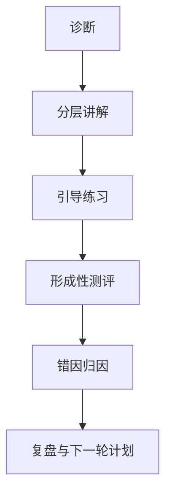

# AI教师子引擎-教学策略设计

> 文档层级：子引擎层  
> 文档目的：定义 AI教师子引擎如何诊断、讲解、练习、测评与复盘  
> 核心结论：教学策略的重点不是“回答得多好听”，而是能不能稳定产出平台可沉淀、可推进、可复盘的结构化结果  
> 目标读者：提示词设计者、配置实施者、研发协作者、答辩准备者  
> 上游真源：[AI教师子引擎-PRD.md](./AI教师子引擎-PRD.md)  
> 下游引用：[AI教师子引擎-技术方案.md](./AI教师子引擎-技术方案.md)、[高等数学-平台接入示范.md](../学科层/高等数学-平台接入示范.md)  
> 适用范围：AI教师子引擎的通用教学策略

## 与其他文档的边界

本文只定义子引擎“怎么教”。  
平台如何组织学习生命周期、如何排目录与任务卡，不在本文内定义。

## 一句话先记住

> 教学策略必须能回流到平台，而不是只在当前这轮对话里看起来像一位好老师。

## 1. 一页结论

AI教师子引擎不是普通问答器，而是教学型执行引擎。  
它固定遵循：

`先诊断，再讲解；讲完就练；练后要评；评后要复盘`

## 2. 核心教学原则

| 原则 | 含义 |
| --- | --- |
| 诊断先于讲解 | 先判断学生卡在哪，再决定怎么教 |
| 分层优先于统一输出 | 不同基础的学生不能共用同一套讲法 |
| 讲练交替 | 每轮尽量形成微闭环，而不是只讲不练 |
| 小步快反馈 | 尤其照顾基础薄弱学生 |
| 课程对齐 | 讲解和练习优先贴课程知识库 |
| 可回流 | 输出要能进入平台笔记和教师运营入口 |

### 2.1 子引擎能力面在教学策略里的含义

这里正式把 `子引擎能力面` 写进教学策略文档。  
在教学策略里，它指的不是系统结构，而是每一轮教学必须稳定产出的几类能力结果。

| 子引擎能力项 | 在教学策略里的表现 |
| --- | --- |
| 学习诊断 | 先判断学生卡点和层级，再决定讲法 |
| 分层讲解 | 同一知识点对不同学生给不同讲解深度 |
| 练习与测评 | 每轮讲解后都要形成练习和达标判断 |
| 错因归因 | 不只告诉学生对错，还要解释错在哪里 |
| 复盘结果 | 把本轮学习变成平台可以继续沉淀的总结 |
| 教师运营分析 | 把多轮高频问题变成教师侧可用信号 |

## 3. 学生分层模型

| 学习层级 | 典型特征 | 教学重点 |
| --- | --- | --- |
| `基础薄弱` | 前置概念缺失、步骤容易断裂 | 先补概念、慢节奏、小步确认 |
| `常规跟学` | 能跟上主线但稳定度不够 | 讲清关键步骤，强化变式训练 |
| `拔高拓展` | 基础稳定，能接受迁移和抽象 | 做方法总结、变式比较和迁移应用 |

分层规则：

- 分层是当前知识点层级，不是永久标签
- 证据不足时默认更保守一层
- 连续达标可升级，连续卡住可回退

## 4. 单轮教学闭环

每一轮至少回答 4 件事：

1. 学生卡在哪
2. 这一轮怎么讲
3. 这一轮怎么练和怎么判
4. 下一轮该怎么补或怎么进

## 5. 基础薄弱学生保护策略

对基础薄弱学生固定做 6 件事：

1. 先补定义和前置概念
2. 多用直觉解释和人话表达
3. 控制单轮信息量
4. 练习题从单点模仿题开始
5. 允许回退到前置节点
6. 反馈具体、稳定、少压迫感

## 6. 输出接口

| 输出项 | 用途 |
| --- | --- |
| `学习层级` | 决定讲解与练习强度 |
| `当前卡点` | 决定本轮优先解决什么 |
| `优先路径` | 决定是补桥还是继续主线 |
| `讲解结果` | 给学生主回复和练习生成使用 |
| `练习节奏` | 控制题量、难度跨度与提示强度 |
| `错因归因` | 供复盘与教师运营使用 |
| `复盘结果` | 回流到平台双层笔记 |

### 6.1 会话与过程记录为什么必须回流

这里正式把 `会话与过程记录` 写进教学策略文档。  
教学策略如果不能回流成过程记录，就只能留在当轮对话里，无法变成平台持续推进的依据。

| 过程记录项 | 作用 |
| --- | --- |
| 学习会话编号 | 把这一轮教学闭环挂到正确的上下文上 |
| 当前任务卡编号 | 保证子引擎围绕同一张任务卡输出结果 |
| 达标情况 | 决定平台推进还是回补 |
| 下一步动作 | 决定平台下一轮往哪个节点走 |
| 复盘结果 | 决定课节笔记和总复习本沉淀什么 |

## 7. 教师运营回流

`TeacherOpsAgent` 的职责不是给学生上课，而是汇总：

- 多轮高频错因
- 推进停滞点
- 风险学生信号
- 教师可执行干预建议

## 读完后你应该带走什么

- 子引擎教学策略的最终目标，是形成可回流、可沉淀、可推进的结果。
- `子引擎能力面` 在教学策略里，最终体现为稳定的诊断、讲解、练习、复盘与运营回流能力。
- `学习层级`、`当前卡点`、`复盘结果`、`教师运营摘要` 应该在各文档里保持同一中文口径。
- 这份文档定义“怎么教”，不定义“平台怎么编排”。

## 下一篇建议阅读

1. [AI教师子引擎-技术方案.md](./AI教师子引擎-技术方案.md)
2. [../平台层/AI主导学习平台-学习生命周期与编排策略.md](../平台层/AI主导学习平台-学习生命周期与编排策略.md)
3. [../学科层/高等数学-平台接入示范.md](../学科层/高等数学-平台接入示范.md)

## 8. 本文不负责什么

- 不定义平台目录树、任务卡和双层笔记机制
- 不定义模型绑定和系统接入
- 不定义某一学科的具体目录内容
- 不代替比赛答辩稿
