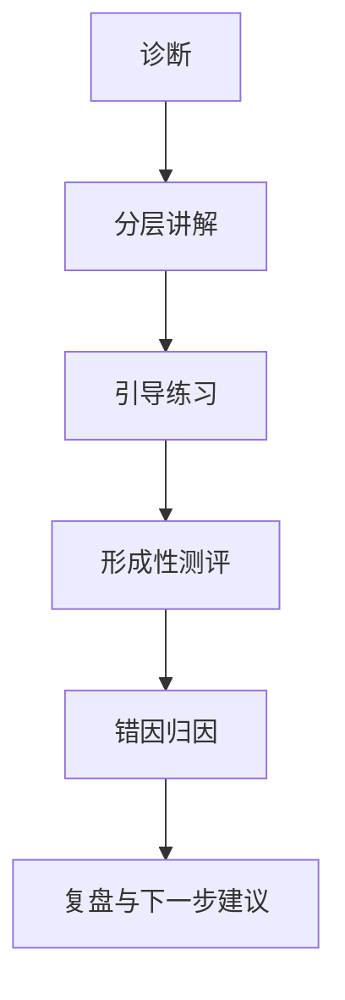

# AI教师子引擎-教学策略设计

> 文档层级：子引擎层  
> 文档目的：定义 AI教师子引擎如何沿学生教学执行线和教师运营支持线输出稳定策略  
> 核心结论：教学策略的重点不是“回答得像老师”，而是能不能稳定产出平台可推进、可沉淀、可供教师使用的结构化结果  
> 目标读者：提示词设计者、配置实施者、研发协作者、答辩准备者  
> 上游真源：[AI教师子引擎-PRD.md](./AI教师子引擎-PRD.md)、[AI主导学习平台-统一对象与接口契约.md](../平台层/AI主导学习平台-统一对象与接口契约.md)  
> 下游引用：[AI教师子引擎-技术方案.md](./AI教师子引擎-技术方案.md)、[高等数学-平台接入示范.md](../学科层/高等数学-平台接入示范.md)  
> 适用范围：子引擎通用教学策略与运营支持策略

## 与其他文档的边界

本文只定义子引擎“怎么教、怎么判断、怎么回流”。  
对象字段正式定义不在本文，统一见统一对象契约文档。

## 一句话先记住

> 教学策略必须能回流到平台和教师主线，而不是只在当前轮对话里看起来像一个会说话的老师。

## 1. 双主线策略

### 1.1 学生教学执行线

固定遵循：

`先诊断，再讲解；讲完就练；练后要评；评后要复盘`

### 1.2 教师运营支持线

固定遵循：

`先聚合，再识别；识别后给建议；建议只做旁路，不接管学生回复`

## 2. 核心策略原则

| 原则 | 含义 |
| --- | --- |
| 诊断先于讲解 | 先判断卡点和层级，再决定讲法 |
| 分层优先于统一输出 | 不同学生不能共用同一套讲解深度 |
| 讲练交替 | 每轮尽量形成微闭环 |
| 结果可回流 | 输出要能进入子引擎回流结果、课节笔记和教师运营摘要 |
| 教师支持不阻塞学生主线 | 运营支持永远是增强旁路 |

## 3. 学生分层模型

| 学习层级 | 典型特征 | 教学重点 |
| --- | --- | --- |
| `基础薄弱` | 前置概念缺失、步骤易断裂 | 补概念、慢节奏、小步确认 |
| `常规跟学` | 能跟上主线但稳定度不足 | 讲清关键步骤，强化变式训练 |
| `拔高拓展` | 基础稳定，可做迁移与抽象 | 方法总结、变式比较、迁移应用 |

## 4. 单轮教学闭环

每轮至少要回答：

1. 学生卡在哪
2. 这一轮怎么讲
3. 这一轮怎么练、怎么判
4. 下一轮该前进还是回补

## 5. 教师运营支持策略

`TeacherOpsAgent` 的职责不是给学生上课，而是汇总：

- 多轮高频错因
- 推进停滞点
- 风险学生信号
- 教师可执行干预建议

## 6. 输出策略

本文不重新定义字段，只规定策略必须产出下面这些对象方向：

- 子引擎回流结果必须足以驱动平台推进/回补
- 课节笔记增量必须足以支撑单节沉淀
- 教师运营摘要必须足以支撑教师主线入口

## 读完后你应该带走什么

- 子引擎策略现在服务两条主线，而不是只服务学生答疑。
- 结构化回流比“说得漂亮”更重要。
- 教师主线通过摘要与建议进入系统，而不是替代学生主闭环。

## 下一篇建议阅读

1. [AI教师子引擎-技术方案.md](./AI教师子引擎-技术方案.md)
2. [AI教师子引擎-PRD.md](./AI教师子引擎-PRD.md)
3. [../平台层/AI主导学习平台-统一对象与接口契约.md](../平台层/AI主导学习平台-统一对象与接口契约.md)

## 本文不负责什么

- 不定义平台对象本体
- 不定义模型绑定
- 不定义某一学科的具体目录
- 不代替比赛答辩稿
