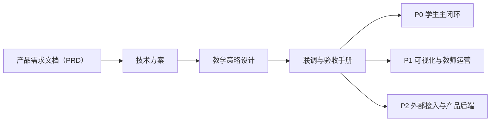

# AI教师子引擎总览与设计

> 文档层级：子引擎导读
> 文档目的：说明子引擎这一组文档分别负责什么，以及实现和联调时该按什么顺序进入正文
> 核心结论：子引擎导读页只负责导航；产品需求文档（PRD）、技术方案、教学策略、联调手册和实施附录继续各自承担正式定义
> 目标读者：工作流开发者、联调负责人、产品负责人、新成员
> 推荐下一步：先读 [AI教师子引擎-产品需求文档（PRD）](./AI教师子引擎-PRD.md)，再读 [AI教师子引擎-技术方案.md](./AI教师子引擎-技术方案.md)

## 与其他文档的边界

一句人话：这篇只回答子引擎这组文档怎么读，不重复讲实现细节。

子引擎正文分工固定如下：

- 目标、范围和验收边界：`AI教师子引擎-PRD`
- 智能体职责和技术边界：`AI教师子引擎-技术方案`
- 教学策略和分层逻辑：`AI教师子引擎-教学策略设计`
- 联调与回归：`AI教师子引擎-智能体工作流联调与验收手册`
- 阶段落地：`P0 / P1 / P2` 三篇实施附录

## 一句话先记住

一句人话：先搞清楚子引擎要交什么，再看它怎么实现、怎么联调、怎么接进平台。

> 子引擎层不是“几个智能体说明页”的合集，而是从目标、实现、联调到分阶段落地的完整开发链路。

## 1. 这组文档解决什么

一句人话：子引擎层负责把平台主线落成真正可运行的 AI 教学执行链。

| 你关心的问题 | 应该看哪篇 |
| --- | --- |
| 子引擎到底要完成什么 | [AI教师子引擎-产品需求文档（PRD）](./AI教师子引擎-PRD.md) |
| 智能体怎么分工、怎么协作 | [AI教师子引擎-技术方案.md](./AI教师子引擎-技术方案.md) |
| 分层教学和教师支持策略怎么设计 | [AI教师子引擎-教学策略设计.md](./AI教师子引擎-教学策略设计.md) |
| 变量透传、回归样例和通过标准怎么定 | [AI教师子引擎-智能体工作流联调与验收手册.md](./AI教师子引擎-Agent工作流联调与验收手册.md) |
| 各阶段怎么落地 | [01-P0-Multi-Agent学生主闭环-架构设计.md](./实施附录/01-P0-Multi-Agent学生主闭环-架构设计.md) 等三篇附录 |

## 2. 实现者推荐阅读顺序

一句人话：别直接跳到联调手册，先看目标和边界，否则后面每一步都容易漂。

1. [AI教师子引擎-产品需求文档（PRD）](./AI教师子引擎-PRD.md)
2. [AI教师子引擎-技术方案.md](./AI教师子引擎-技术方案.md)
3. [AI教师子引擎-教学策略设计.md](./AI教师子引擎-教学策略设计.md)
4. [AI教师子引擎-智能体工作流联调与验收手册.md](./AI教师子引擎-Agent工作流联调与验收手册.md)
5. [01-P0-Multi-Agent学生主闭环-架构设计.md](./实施附录/01-P0-Multi-Agent学生主闭环-架构设计.md)
6. [02-P1-可视化与教师运营-架构设计.md](./实施附录/02-P1-可视化与教师运营-架构设计.md)
7. [03-P2-外部接入与产品后端-架构设计.md](./实施附录/03-P2-外部接入与产品后端-架构设计.md)

## 3. 不同问题该跳哪篇

一句人话：把问题和文档一一对上，开发会轻很多。

| 当前问题 | 直接跳去哪里 | 原因 |
| --- | --- | --- |
| 这轮实现到底算不算达标 | [AI教师子引擎-产品需求文档（PRD）](./AI教师子引擎-PRD.md) | 目标和验收边界在这里 |
| 智能体怎么分工 | [AI教师子引擎-技术方案.md](./AI教师子引擎-技术方案.md) | 角色真源在这里 |
| 0 基础和提分型学生怎么分层 | [AI教师子引擎-教学策略设计.md](./AI教师子引擎-教学策略设计.md) | 策略只在这里讲清 |
| 透传哪些变量、怎么做回归 | [AI教师子引擎-智能体工作流联调与验收手册.md](./AI教师子引擎-Agent工作流联调与验收手册.md) | 联调规则只认这一篇 |
| P0、P1、P2 分别落什么能力 | 三篇实施附录 | 阶段落地只在附录拆开讲 |

## 4. 子引擎层和其他层怎么接

一句人话：子引擎不是独立系统，它必须沿平台对象、学科资产和产品接入边界稳定工作。

- 平台层提供对象契约、生命周期和接入边界。
- 学科层提供高数示范、知识资产和提示词样板。
- 交付层把子引擎能力翻译成可演示、可答辩的路径。

## 读完后你应该带走什么

- 子引擎层的阅读顺序应该是“目标 -> 边界 -> 联调 -> 分阶段落地”。
- 导读页只负责找路，不承担技术定义。
- 做实现和联调时，必须同时参考平台层和学科层的真源口径。

## 本文不负责什么

- 不代替产品需求文档（PRD）正文
- 不定义对象字段和知识库字段
- 不代替具体 ADP 页面配置
- 不代替比赛答辩口径
