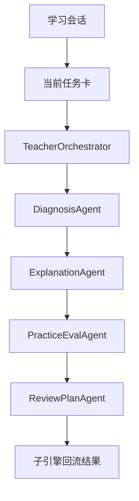

# P0 Multi-Agent 学生主闭环架构设计

> 文档层级：子引擎层实施附录  
> 文档目的：说明 `P0` 如何把学生主闭环底座稳定跑通  
> 核心结论：`P0` 的唯一目标是让学生主闭环成立，并把平台对象、接入字段、工作流和沉淀底座放到同一条主链上  
> 目标读者：技术负责人、配置实施者  
> 上游真源：[AI教师子引擎-PRD.md](../AI教师子引擎-PRD.md)、[AI教师子引擎-技术方案.md](../AI教师子引擎-技术方案.md)、[AI主导学习平台-统一对象与接口契约.md](../../平台层/AI主导学习平台-统一对象与接口契约.md)  
> 下游引用：无  
> 适用范围：`P0` 实施附录

## 1. 本阶段解决什么

`P0` 只解决一件事：

> 怎么让学生沿 `学习会话 -> 当前任务卡 -> 子引擎教学闭环 -> 子引擎回流结果 -> 双层笔记底座` 稳定走完一轮又一轮。

当前主线能力：

- `Multi-Agent`
- 工作流编排
- 知识库
- 长期记忆
- 学生主闭环底座

## 2. 本阶段不解决什么

- 不要求教师运营支持线完整成立
- 不把 `TeacherOpsAgent` 写进阻塞主链路
- 不引入产品后端 / `BFF`
- 不把自定义前端写成前置依赖
- 不要求学习记录沉淀体系完整产品化

## 3. 进入条件

- 已明确平台需要先证明学生主闭环成立
- 已具备 ADP 应用、多 Agent 与知识库配置基础
- 已具备最小接入字段：`visitor_biz_id`、`custom_variables`

## 4. 退出条件

- 学生能围绕当前任务卡完成至少一轮稳定闭环
- 子引擎能输出结构化回流结果
- 平台能根据回流结果决定推进还是回补
- 课节笔记与个人总复习本底座能接住本轮结果

## 5. 继承关系

### 5.1 继承了什么

- 继承平台正式角色与对象契约
- 继承学生主线优先、平台编排优先的总体口径

### 5.2 为下阶段留下什么接口

- 给 `P1` 留下学生结果展示接口
- 给 `P1` 留下 `TeacherOpsAgent` 旁路接口
- 给 `P2` 留下接入字段和流式输出接口

## 6. 主链路

## 7. 关键字段与接口

`P0` 至少要稳定承接：

- `visitor_biz_id`
- `custom_variables`
- 学习会话
- 当前任务卡
- 子引擎回流结果

一句人话：

> `P0` 不要求接入很花，但必须保证同一个学生不是每一轮都像第一次来。

## 8. 不会替代什么

- 不替代 `P1` 的教师运营增强
- 不替代 `P1` 的学生可视化结果
- 不替代 `P2` 的 `BFF`、`HTTP SSE`、自定义前端和学习记录沉淀

## 读完后你应该带走什么

- `P0` 是学生主闭环底座，不是全平台终态。
- `P0` 成立的关键是对象链和回流链成立。
- `TeacherOpsAgent` 在 `P0` 只保留接口预留。
