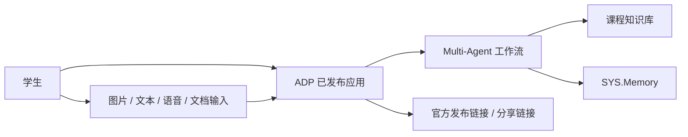
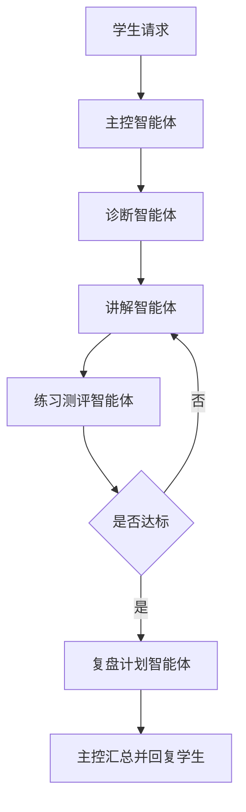
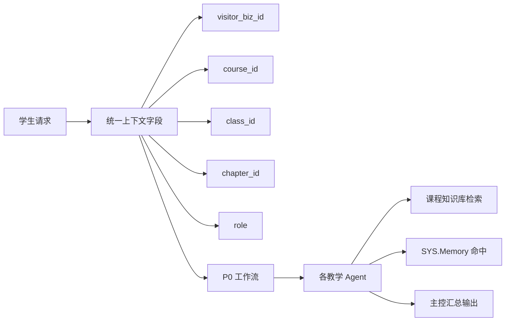
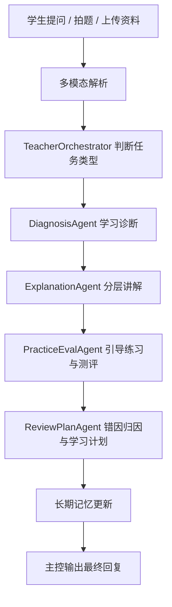
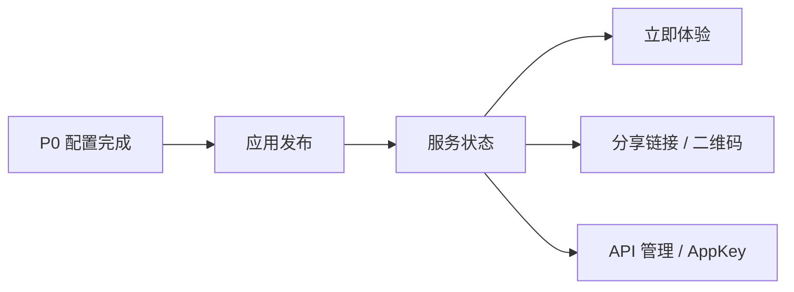

# P0 Multi-Agent 学生主闭环架构设计

> 文档层级：子引擎层实施附录  
> 文档目的：补充说明 `P0` 阶段如何先把 AI教师子引擎主闭环跑通  
> 核心结论：`P0` 只做一件事，就是把学生主闭环稳定跑通，并把平台字段、记忆、工作流和发布链路对齐到同一条主链路上  
> 目标读者：技术负责人、配置实施者  
> 上游真源：[AI教师子引擎-PRD.md](../AI教师子引擎-PRD.md)、[AI教师子引擎-技术方案.md](../AI教师子引擎-技术方案.md)  
> 下游引用：无  
> 适用范围：`P0` 实施附录  
> 主线能力：`Multi-Agent + 工作流编排 + 知识库 + 长期记忆 + 官方发布链接`

## 与其他文档的边界

本文是 `P0` 实施附录，只负责说明子引擎主闭环怎么落地。  
平台层总结构和学科接入规范不在本文内定义。

---

## 目录

1. 一页结论
2. P0 目标与范围边界
3. P0 系统上下文图
4. P0 Agent 编排图
5. P0 知识库、变量与记忆流转图
6. P0 运行流程图
7. P0 发布与访问图
8. P0 模型绑定
9. 组件职责表
10. 验收与演示建议
11. 官方依据

---

## 1. 一页结论

`P0` 只回答一个问题：

`怎么先把 AI 教师学生主闭环稳定跑通。`

这一阶段不追求大而全，只追求三件事：

- 学生提问后，系统能稳定完成 `诊断 -> 讲解 -> 练习 -> 测评 -> 复盘`。
- 回答基于课程资料，而不是通用闲聊。
- 发布后评委可以通过 ADP 官方入口实际体验。

P0 的架构关键词：

- `TeacherOrchestrator`
- `DiagnosisAgent`
- `ExplanationAgent`
- `PracticeEvalAgent`
- `ReviewPlanAgent`
- `知识库`
- `visitor_biz_id`
- `custom_variables`
- `SYS.Memory`

### 1.1 P0 对应的骨架词

`P0` 最重要的两条骨架词是 `轻量路由与启动装配` 和 `会话与过程记录`。  
前者保证学生请求能被快速装到同一条主闭环里，后者保证这一轮执行结果能继续被平台追踪和沉淀。

| 骨架词 | 在 P0 里的含义 |
| --- | --- |
| `轻量路由与启动装配` | 学生请求进入后，统一字段先装配，再进入主控、诊断、讲解、练习、复盘这条固定链路 |
| `会话与过程记录` | `visitor_biz_id`、课程边界字段、记忆更新和复盘结果一起保证同一学生能持续学习 |

---

## 2. P0 目标与范围边界

### 2.1 P0 要做什么

- 跑通学生侧主闭环。
- 建立课程知识对齐能力。
- 建立长期记忆和课程隔离能力。
- 提供可访问发布版本。

### 2.2 P0 不做什么

- 不把 `TeacherOpsAgent` 写进阻塞主链路。
- 不把教师轻看板当成一期前提。
- 不引入产品后端、Redis、MQ。
- 不要求自定义前端才能演示。

---

## 3. P0 系统上下文图（图 1）

这张图想说明什么：

- P0 的核心系统边界完全可以放在 ADP 内完成。
- 学生通过平台入口发起请求，不需要先自建前端。
- 知识库和长期记忆是主闭环的关键底座。

---

## 4. P0 Agent 编排图（图 2）

这张图想说明什么：

- `TeacherOrchestrator` 是调度入口，但真正的教学环节由子 Agent 分工完成。
- 主链路不是一问一答，而是一条可循环的教学流程。
- 如果学生没达标，允许返回讲解或继续练习。

### 4.1 为什么 P0 不让 `TeacherOpsAgent` 进主链路

- 因为 P0 的目标是先保证学生侧闭环稳定。
- 教师运营属于增强能力，应该在主闭环稳定后再叠加。
- 所以 P0 文档里只把 `TeacherOpsAgent` 视为后续阶段预留。

---

## 5. P0 知识库、变量与记忆流转图（图 3）

这张图想说明什么：

- P0 的连续学习能力依赖 `visitor_biz_id`。
- P0 的课程隔离能力依赖 `course_id / class_id / chapter_id / role`。
- 这些字段不会只在接口层用一次，而是会贯穿工作流、检索、记忆三处。

### 5.1 P0 固定字段约定

| 字段 | 用途 | 是否一期必须 |
| --- | --- | --- |
| `visitor_biz_id` | 终端学生唯一标识 | 是 |
| `course_id` | 课程边界控制 | 是 |
| `class_id` | 班级边界控制 | 建议 |
| `chapter_id` | 章节边界控制 | 建议 |
| `role` | 学生/教师角色识别 | 建议 |

这些技术字段进入平台主文档时，至少要能翻译回下面这些中文字段：

- `学习会话编号`
- `当前任务卡编号`
- `下一步动作`
- `推进日志摘要`

---

## 6. P0 运行流程图（图 4）

这张图想说明什么：

- P0 不是“先聊天再看情况”，而是固定教学闭环。
- 多模态解析只是入口，重点在后续的编排和教学输出。
- 最终输出不是单个 Agent 的原始结果，而是主控收束后的学生回复。

---

## 7. P0 发布与访问图（图 5）

这张图想说明什么：

- P0 默认访问方式就是 ADP 官方发布链接。
- 这条路最稳，也最适合比赛第一版。
- `AppKey` 在 P0 只需要“知道有”，不要求马上接自定义前端。

---

## 8. P0 模型绑定

| Agent | 推荐模型 | 输入 | 输出 |
| --- | --- | --- | --- |
| `TeacherOrchestrator` | `Tencent HY 2.0 Think` | 学生问题、上下文、变量、子 Agent 结果 | 调度决策、最终回复 |
| `DiagnosisAgent` | `DeepSeek-R1-0528` | 问题、课程标签、历史记录 | `学习层级`、`当前卡点`、`优先路径` |
| `ExplanationAgent` | `Tencent HY 2.0 Instruct` | 诊断结果、知识库片段 | `基础讲解`、`标准讲解`、`拓展讲解`、步骤、例子 |
| `PracticeEvalAgent` | `DeepSeek-V3.2` | 讲解结果、题库、学生作答 | 练习题、评分、达标判断 |
| `ReviewPlanAgent` | `DeepSeek-R1-0528` | 错题、评分、知识点标签 | 错因归因、学习计划 |

结论：

- `P0` 主链路固定用 `混元 + DeepSeek`
- 不引入 `TeacherOpsAgent`
- 不引入 `Kimi`

### 8.1 P0 高等数学 RAG 策略

| 项 | 配置 |
| --- | --- |
| 科目 | `高等数学` |
| 当前章节 | `极限` |
| 知识源 | 教材、讲义、PPT、题库、典型错题 |
| 标签边界 | `course_id=高等数学`、`chapter_id=极限`、`role=student` |
| 检索策略 | 先按课程，再按章节，再按角色 |

说明：

- 主线使用 ADP 自带知识库能力
- 不自建 `pgvector`
- 命中不足时提示补充资料或切换章节

---

## 9. 组件职责表

| 组件 | 输入 | 输出 | 关键约束 |
| --- | --- | --- | --- |
| `TeacherOrchestrator` | 学生问题、历史上下文、变量、长期记忆 | 最终教学回复、任务调度结果 | 唯一学生入口 |
| `DiagnosisAgent` | 当前问题、课程标签、记忆摘要 | `学习层级`、`当前卡点`、`优先路径` | 不直接面向学生 |
| `ExplanationAgent` | 诊断结果、检索片段 | `基础讲解`、`标准讲解`、`拓展讲解`、步骤说明、例子 | 回答要贴课程资料 |
| `PracticeEvalAgent` | 讲解结果、题库、学生作答 | 练习题、评分、达标判断 | 支持未达标回流 |
| `ReviewPlanAgent` | 错题、评分、知识点标签 | 错因归因、学习计划、复盘建议 | 输出进入记忆更新 |
| `知识库` | PPT、讲义、题库、FAQ | 检索片段 | 必须做课程标签隔离 |
| `SYS.Memory` | 多轮对话摘要 | 学生连续学习上下文 | 依赖 `visitor_biz_id` |

### 9.1 教学策略语义来源

- 本文档负责定义 `P0` 的运行链路、组件职责和架构边界。
- `学习层级`、`当前卡点`、`优先路径`、`基础讲解`、`标准讲解`、`拓展讲解`、`练习节奏` 等教学语义，统一以 [AI教师子引擎-教学策略设计.md](../AI教师子引擎-教学策略设计.md) 为准。
- 后续如调整分层标准、基础薄弱学生补偿策略或教师干预口径，应优先更新教学策略文档，再回看架构约束是否需要同步。

---

## 10. 验收与演示建议

### 10.1 P0 验收门禁

| 项 | 通过标准 |
| --- | --- |
| 主闭环 | 能完整跑通 `诊断 -> 讲解 -> 练习 -> 测评 -> 复盘` |
| 知识对齐 | 回答能命中课程资料 |
| 多模态 | 支持文本 / 图片 / 语音 / 文档输入 |
| 记忆连续 | 同一学生第二轮提问能延续上下文 |
| 发布可用 | 评委可通过官方发布入口访问 |

### 10.2 P0 对应 FR 范围

| 范围 | 对应内容 |
| --- | --- |
| `FR-01 ~ FR-08` | AI 教师策略、多模态理解、学习诊断、分层讲解、引导练习、形成性测评、错因归因、个性化学习计划 |

### 10.3 P0 演示建议

- 演示 1 门课、1 个章节、1 条端到端链路最稳。
- 展示顺序建议：拍题/提问 -> 诊断 -> 讲解 -> 练习 -> 判题 -> 复盘 -> 第二轮追问。
- 如果现场时间紧，就优先展示“主闭环 + 发布链接 + 记忆连续”。

---

## 读完后你应该带走什么

- `P0` 的唯一目标是把学生主闭环跑稳，不是同时做完全部产品化能力。
- `P0` 就是 `轻量路由与启动装配` 在第一阶段的真实落点。
- 这一阶段最关键的是平台字段、工作流、记忆和发布链路要彼此对齐。
- 只要 `P0` 没稳，后面的 `P1 / P2` 都只是叠加复杂度。

## 下一篇建议阅读

1. [AI教师子引擎-技术方案.md](../AI教师子引擎-技术方案.md)
2. [AI主导学习平台-总体架构设计.md](../../平台层/AI主导学习平台-总体架构设计.md)
3. [02-P1-可视化与教师运营-架构设计.md](./02-P1-可视化与教师运营-架构设计.md)

---

## 11. 官方依据

- 《什么是 Multi-Agent？》  
  https://cloud.tencent.com/document/product/1759/118325
- 《工作流编排》  
  https://cloud.tencent.com/document/product/1759/122556
- 《Agent 节点》  
  https://cloud.tencent.com/document/product/1759/122554
- 《知识检索相关设置》  
  https://cloud.tencent.com/document/product/1759/112704
- 《长期记忆说明》  
  https://cloud.tencent.com/document/product/1759/122458
- 《应用发布概述》  
  https://cloud.tencent.com/document/product/1759/104209
