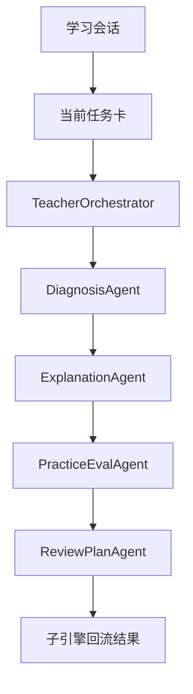

# P0 Multi-Agent 学生主闭环架构设计

> 文档层级：子引擎层实施附录  
> 文档目的：说明 `P0` 作为一期并行工作线之一，如何把学生主闭环底座稳定跑通  
> 核心结论：`P0` 的唯一目标仍然是让学生主闭环成立，但在当前项目里，它不再意味着“其他工作都要等它结束”，而是作为一期必须优先稳定的底座，与 `P1 / P2` 并行推进  
> 目标读者：技术负责人、配置实施者、联调负责人  
> 上游真源：[AI教师子引擎-PRD.md](../AI教师子引擎-PRD.md)、[AI教师子引擎-技术方案.md](../AI教师子引擎-技术方案.md)、[AI主导学习平台-团队协作与分工.md](../../平台层/AI主导学习平台-团队协作与分工.md)  
> 下游引用：`P1 / P2` 实施附录、工作流联调与验收手册  
> 适用范围：`P0` 实施附录

## 1. 本工作线解决什么

`P0` 只解决一件事：

> 怎么让学生沿 `学习会话 -> 当前任务卡 -> 子引擎教学闭环 -> 子引擎回流结果 -> 双层笔记底座` 稳定走完一轮又一轮。

当前主线能力：

- `Multi-Agent`
- 工作流编排
- 知识库检索
- 长期记忆底座
- 学生主闭环

## 2. 在一期里，`P0` 的定位是什么

`P0` 是一期必须先稳住的学生底座，但不是其他工作线的“总开关”。

统一口径：

- `P0` 优先保证学生闭环能演示、能解释、能复盘
- `P1` 可以同步准备教师摘要和学生展示口径
- `P2` 可以同步准备变量、检索绑定和发布链路

因此：

> `P0` 在一期里是优先底座，不是串行闸门。

## 3. 本工作线不解决什么

- 不要求教师运营支持线完整成立
- 不把 `TeacherOpsAgent` 写进阻塞主链路
- 不引入产品后端 / `BFF` 作为前置
- 不把自定义前端写成主链必要条件
- 不把学习记录沉淀体系一次性做成完整产品后台

## 4. 进入条件

- 已明确平台需要先证明学生主闭环成立
- 已具备 ADP 应用、多 Agent 与知识库配置基础
- 已具备最小接入字段：`visitor_biz_id`、`custom_variables`
- 已有至少一批可供检索的高数知识资产

## 5. 退出条件

- 学生能围绕当前任务卡完成至少一轮稳定闭环
- 子引擎能输出结构化回流结果
- 平台能根据回流结果决定推进还是回补
- 课节笔记与个人总复习本底座能接住本轮结果

## 6. 与其他工作线的交接关系

### 6.1 给 `P1` 留下什么

- 学生结果卡需要的原始回流结果
- 诊断、讲解、练习、复盘链路的可视化素材
- 旁路接入 `TeacherOpsAgent` 的接口位

### 6.2 给 `P2` 留下什么

- 稳定的输入输出字段
- 主链路可回归样例
- 可供 `HTTP SSE` 和产品接入方复用的结构化结果

## 7. 主链路

## 8. 关键字段与接口

`P0` 至少要稳定承接：

- `visitor_biz_id`
- `custom_variables`
- 学习会话
- 当前任务卡
- 子引擎回流结果
- `foundation_level`
- `current_goal`

一句人话：

> `P0` 不要求接入很花，但必须保证同一个学生不是每一轮都像第一次来。

## 9. 本工作线的验收重点

- 诊断结果能定位模块和卡点
- 讲解结果能匹配学生当前基础
- 练习结果能给出评分点或达标判断
- 复盘结果能给出明确下一步

## 读完后你应该带走什么

- `P0` 是一期里最优先稳定的学生底座。
- `P0` 成立的关键是对象链、回流链和知识库召回链一起成立。
- `P0` 稳住后，`P1 / P2` 才能有可靠的增强和接入抓手，但三条线仍然可以在同一期并行推进。
