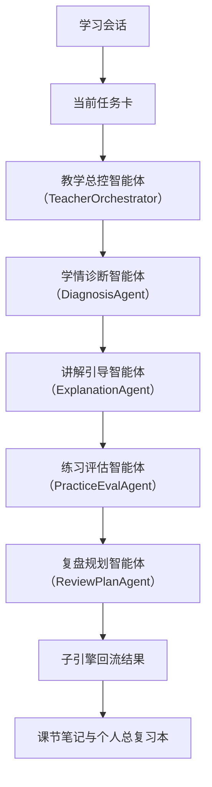

# P0 Multi-Agent 学生主闭环架构设计

> 文档层级：子引擎层实施附录
> 文档目的：说明 `P0` 这条实施线在当前版本中具体解决什么、如何进出、与其他工作线如何交接
> 核心结论：`P0` 是必须优先稳定的学生主闭环底座，但不再被当成其他工作线的串行闸门，而是和 `P1 / P2` 同期并行推进
> 目标读者：技术负责人、配置实施者、联调负责人
> 推荐下一步：继续读 [AI教师智能体群引擎-智能体工作流联调与验收手册.md](../AI教师智能体群引擎-Agent工作流联调与验收手册.md)

## 与其他文档的边界

一句人话：这篇只说明 `P0` 这条线怎么落，不重新定义平台对象和智能体职责。

## 一句话先记住

一句人话：`P0` 要证明的是学生能沿同一条学习链被持续推进，而不是每轮都像第一次来。

> `P0` 的重点是把学习会话、当前任务卡、教学闭环、回流结果和双层笔记底座稳定接起来。

## 1. 本工作线解决什么

一句人话：`P0` 只管把学生主闭环底座跑稳。

| `P0` 负责什么 | 说明 |
| --- | --- |
| 学习会话续接 | 让同一学生的学习上下文连续存在 |
| 当前任务卡锁定 | 让每轮知道学什么、为什么是现在 |
| 教学闭环执行 | 让诊断、讲解、练习、复盘形成固定链路 |
| 回流结果沉淀 | 让本轮学习结果可被平台接住 |
| 双层笔记底座 | 让课节笔记和个人总复习本能继续累积 |

## 2. 在当前版本里，`P0` 的定位是什么

一句人话：`P0` 是底座，但不是“别的都不能动”的串行门槛。

- `P0` 先保证学生主链能演示、能解释、能复盘。
- `P1` 可以同步准备教师摘要和学生结果展示。
- `P2` 可以同步准备变量透传、检索绑定和发布链路。

## 3. 本工作线不解决什么

一句人话：守住边界，`P0` 才不会被写成“什么都要做”的总包附录。

- 不要求教师运营支持线完整成立
- 不把 `TeacherOpsAgent` 写进阻塞主链路
- 不引入产品后端或 `BFF` 作为前置依赖
- 不把自定义前端写成主链必要条件

## 4. 进入条件与退出条件

一句人话：进入和退出条件越清楚，越不容易无限加任务。

| 条件类型 | 最低要求 |
| --- | --- |
| 进入条件 | 已明确需要先证明学生主闭环成立，且已有最小知识资产和接入字段 |
| 退出条件 | 学生能围绕当前任务卡稳定完成至少一轮闭环，且回流结果能被平台继续推进或回补 |

## 5. 与其他工作线怎么交接

一句人话：`P0` 的产出不是终点，而是 `P1 / P2` 的输入。

- 给 `P1`：学生结果卡、可视化素材、教师旁路的接口位。
- 给 `P2`：稳定的输入输出字段、主链路回归样例和可复用的结构化结果。

## 6. 主链路

一句人话：读这张图时只看一件事，学生能否沿固定对象链走完一轮。

## 7. 关键字段与接口

一句人话：`P0` 可以不花，但字段和对象不能飘。

| 关键项 | 作用 |
| --- | --- |
| 学习主体标识（`visitor_biz_id`） | 标识同一个学习主体 |
| 上下文变量集（`custom_variables`） | 承接课程、班级、模块和角色等业务上下文 |
| 学习会话 | 锁定当前轮次 |
| 当前任务卡 | 锁定本轮目标和达标标准 |
| 子引擎回流结果 | 给平台后续推进或回补提供依据 |
| 基础水平、当前目标等状态槽位 | 保证每轮讲解和练习不脱节 |

## 读完后你应该带走什么

- `P0` 是一期里最优先稳定的学生底座。
- `P0` 成立的关键是对象链、回流链和知识库召回链一起成立。
- `P0` 稳住后，`P1 / P2` 才能更稳地叠加增强和产品接入能力。

## 本文不负责什么

- 不定义平台对象字段真源
- 不代替子引擎技术方案正文
- 不代替教师运营和产品接入附录
- 不代替比赛答辩稿

