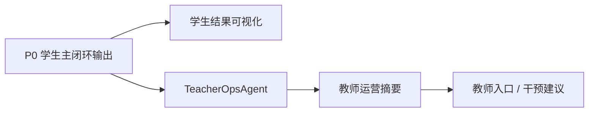

# P1 可视化与教师运营架构设计

> 文档层级：子引擎层实施附录  
> 文档目的：说明 `P1` 作为一期并行工作线之一，如何在不破坏 `P0` 的前提下叠加教师侧与展示增强  
> 核心结论：`P1` 的重点不是推翻 `P0`，而是在同一期内把教师主线和学生结果展示正式拉进公开交付口径，形成可讲、可演示、可联调的增强线  
> 目标读者：技术负责人、配置实施者、项目负责人  
> 上游真源：[AI教师子引擎-PRD.md](../AI教师子引擎-PRD.md)、[AI教师子引擎-技术方案.md](../AI教师子引擎-技术方案.md)、[AI主导学习平台-一期总览与团队分工.md](../../平台层/AI主导学习平台-一期总览与团队分工.md)  
> 下游引用：`P2` 实施附录、答辩演示、教师侧样板页面  
> 适用范围：`P1` 实施附录

## 1. 本工作线解决什么

`P1` 解决 2 件事：

1. 让学生看到更清晰的学习结果，而不是只有一段长文本
2. 让教师/运营者看到风险、趋势和干预入口

当前主线能力：

- 学生结果可视化
- 教师运营支持线
- `TeacherOpsAgent` 旁路

## 2. 在一期里，`P1` 的定位是什么

`P1` 是一期同步交付的教师侧与展示增强线。

它的任务不是“等以后再做”，而是要在本轮就把下面三件事说明白：

- 平台不只会单轮讲题，也能做教师侧观察
- 学生结果能结构化展示，而不是全靠长文本
- 教师主线的价值可以被公开演示

## 3. 本工作线不解决什么

- 不把产品后端 / `BFF` 写成前置依赖
- 不把 `TeacherOpsAgent` 变成学生主答复入口
- 不重写 `P0` 学生主闭环
- 不伪造真实班级统计或看板数据

## 4. 进入条件

- `P0` 学生主闭环底座已稳定
- 子引擎回流结果已能结构化输出
- 至少已有一批可复用的学习结果样例或知识资产

## 5. 退出条件

- 学生侧能看到结构化学习结果
- 教师侧能看到风险观察、潜在问题与补讲建议
- `TeacherOpsAgent` 能以旁路形式稳定输出摘要
- 教师侧口径与提示词规范保持一致

## 6. 与其他工作线的交接关系

### 6.1 依赖 `P0` 的什么

- 学生主闭环的稳定回流结果
- 模块、章节、错因等诊断信息
- 练习与复盘结果

### 6.2 给 `P2` 留下什么

- 学生可视化结果结构
- 教师运营摘要结构
- 更适合产品前端呈现的展示对象

## 7. 主链路

## 8. 关键增强点

- 学生侧：讲解卡、练习卡、评分卡、复盘卡
- 教师侧：风险学生、班级薄弱点、补讲建议
- 策略侧：`TeacherOpsAgent` 从当前对话和知识库中提炼可执行信号

## 9. 本工作线的验收重点

- 教师输出先说明“基于当前知识库与当前对话”
- 建议补讲点能落到模块和概念
- 不把单个学生表现硬说成班级全貌
- 首页和文档能清楚解释教师侧价值

## 读完后你应该带走什么

- `P1` 是一期同步交付的增强线，不是未来预留。
- `TeacherOpsAgent` 正式进入公开能力，但仍然是旁路，不反向替代学生主答复。
- `P1` 的产出既服务答辩展示，也为 `P2` 的产品化展示对象打基础。
