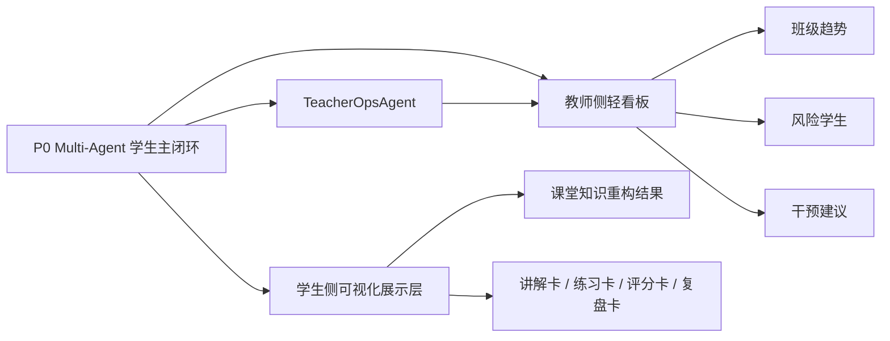
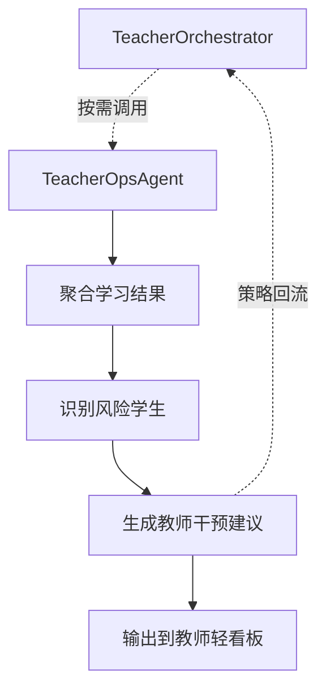
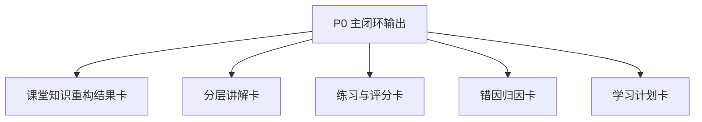
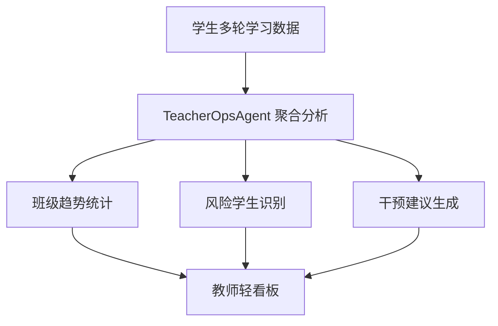
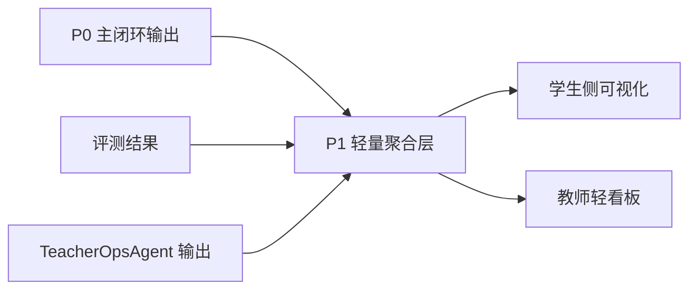
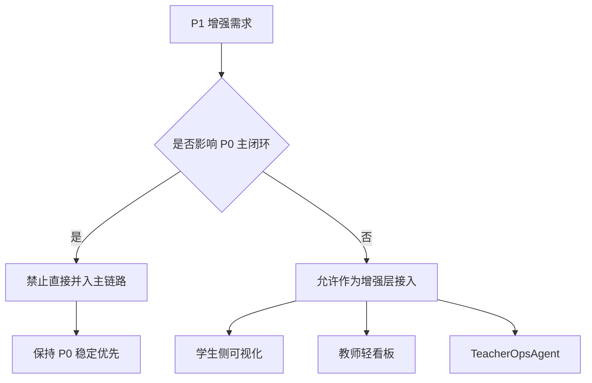

# P1 可视化与教师运营架构设计

> 文档层级：子引擎层实施附录  
> 文档目的：补充说明 `P1` 阶段如何叠加学生可视化与教师运营能力  
> 核心结论：`P1` 的重点不是推翻 `P0`，而是在不破坏学生主闭环的前提下补齐学生可视化和教师轻运营能力  
> 目标读者：技术负责人、配置实施者  
> 上游真源：[AI教师子引擎-PRD.md](../AI教师子引擎-PRD.md)、[AI教师子引擎-技术方案.md](../AI教师子引擎-技术方案.md)  
> 下游引用：无  
> 适用范围：`P1` 实施附录  
> 主线能力：`TeacherOpsAgent + 学生侧可视化 + 教师轻看板 + 评测增强`

## 与其他文档的边界

本文是 `P1` 实施附录，只说明增强层如何叠加。  
平台层目录树、任务卡、双层笔记等公共机制不在本文内定义。

---

## 目录

1. 一页结论
2. P1 增强目标与进入条件
3. P1 扩展架构图
4. `TeacherOpsAgent` 协同图
5. 学生侧可视化展示图
6. 教师轻看板流程图
7. P1 数据来源图
8. P1 风险边界
9. 验收与演示建议
10. 官方依据

---

## 1. 一页结论

`P1` 只回答一个问题：

`怎么让这套系统看起来更像一个真正的教育产品，而不是只有主链路。`

这一阶段不是推翻 `P0`，而是在 `P0` 的稳定底座上做两件增强：

- 学生侧：把 AI 教师输出做成更好理解的可视化结果。
- 教师侧：把多轮学习结果聚合成可干预的轻量看板。

P1 的关键原则：

- `P0` 主闭环继续作为唯一核心底座。
- `TeacherOpsAgent` 可以增强，但不能反过来阻塞学生主链路。
- 这一阶段仍然不引入重后端，不把 `Redis / MQ` 写成依赖。

---

## 2. P1 增强目标与进入条件

### 2.1 P1 要达成什么

- 学生能看到更清晰的学习结果，而不是只看到一段长文本。
- 教师能看到班级趋势、风险学生和干预建议。
- 评测和运营能力开始形成闭环。

### 2.2 P1 的进入条件

- `P0` 主闭环已稳定。
- `FR-01 ~ FR-08` 对应 AC 已基本可通过。
- 至少已有一批可复用的真实或模拟学习数据。

### 2.3 P1 不做什么

- 不把产品后端写成前置依赖。
- 不因为加看板而重写 P0 工作流。
- 不把 `TeacherOpsAgent` 变成学生主答复入口。

---

## 3. P1 扩展架构图（图 1）

这张图想说明什么：

- P1 不是再造一套系统，而是在 P0 之上叠加展示层和教师运营层。
- 学生侧和教师侧都建立在同一条主闭环输出之上。
- `TeacherOpsAgent` 是新增增强节点，不是新主线。

---

## 4. `TeacherOpsAgent` 协同图（图 2）

这张图想说明什么：

- `TeacherOpsAgent` 的输入不是“学生一句问题”，而是多轮学习结果和聚合信息。
- 它的职责偏运营和策略，不偏主教学讲解。
- 它可以把干预策略回流给主控，但不应该代替主控给学生回话。

### 4.1 `TeacherOpsAgent` 的边界

| 做什么 | 不做什么 |
| --- | --- |
| 聚合班级趋势 | 不代替 `DiagnosisAgent` 做单题诊断 |
| 识别风险学生 | 不直接面向学生输出主回复 |
| 生成教师建议 | 不阻塞学生主链路 |
| 回流策略给主控 | 不改写知识库底座 |

---

## 5. 学生侧可视化展示图（图 3）

这张图想说明什么：

- P1 学生侧的目标不是把聊天框做漂亮，而是把学习结果结构化地展示出来。
- 这几类卡片正好对应评委最容易理解的教育价值。
- 学生体验提升，本质上是“结果更清晰”，而不是“页面更炫”。

### 5.1 推荐展示内容

| 卡片 | 建议内容 |
| --- | --- |
| 课堂知识重构结果卡 | 本节重点、难点、知识结构 |
| 分层讲解卡 | 基础讲解、标准讲解、拓展讲解、易错点 |
| 练习与评分卡 | 题目、答案、评分、达标状态 |
| 错因归因卡 | 概念不清、步骤遗漏、计算错误、审题错误 |
| 学习计划卡 | 下一轮学习目标、复习建议、练习节奏 |

---

## 6. 教师轻看板流程图（图 4）

这张图想说明什么：

- P1 的看板不是“BI 平台”，而是轻量、可演示、可理解的教师运营入口。
- 老师最关心的不是海量数据，而是“哪里有风险、要不要干预、怎么干预”。
- 这一步是从“学生单次答疑”升级到“班级教学支持”的关键。

---

## 7. P1 数据来源图（图 5）

这张图想说明什么：

- P1 所有增强能力都来自已存在的输出，不要求先有重后端。
- 评测结果不仅用于调优，也可以成为教师侧运营输入。
- 轻量聚合是 P1 的关键做法，既能展示价值，又不引入过重工程负担。

### 7.1 P1 模型与数据来源

| 对象 | 模型/来源 | 输出 |
| --- | --- | --- |
| 学生主闭环 | 延续 `P0` 的 `混元 + DeepSeek` 组合 | 讲解、评分、复盘、计划 |
| `TeacherOpsAgent` | `DeepSeek-R1-0528` | 趋势、风险学生、干预建议 |
| 可视化层 | `P0` 主链路输出 + 评测结果 + `TeacherOpsAgent` 输出 | 学生结果页、教师轻看板 |

结论：

- `P1` 不新增主模型路线
- `TeacherOpsAgent` 单独使用 `DeepSeek-R1-0528`
- 这一阶段仍然不引入 `pgvector`

---

## 8. P1 的权限边界与占位结构（图 6）

这张图想说明什么：

- P1 的第一原则不是“功能越多越好”，而是“不能破坏 P0”。
- 只要一个增强能力会拖垮主链路，就不应该直接进主链。
- 所以 P1 的正确姿势是“叠加层”，不是“改底座”。

### 8.1 P1 风险与限制

这里正式把 `权限边界与占位结构` 写进 `P1` 文档。  
P1 的工作不是再造主系统，而是先把“哪些增强能力可以进、哪些必须后置”这条边界钉死。

| 风险 | 应对 |
| --- | --- |
| 看板逻辑过重 | 保持轻量聚合，先服务答辩和演示 |
| 可视化层反向绑死主链路 | 所有展示都依赖已存在输出，不反向影响主流程 |
| 想过早接重后端 | 坚持 P1 不引入 Redis/MQ |

| `P1` 已进入的占位结构 | 说明 |
| --- | --- |
| 学生侧可视化 | 允许作为增强展示层进入 |
| 教师轻看板 | 允许作为轻运营入口进入 |
| `TeacherOpsAgent` | 允许作为运营分析旁路进入 |
| 重后端 / 重中台 | 继续留在 `P2` 槽位，不提前进入 |

---

## 9. 验收与演示建议

### 9.1 P1 验收表

| 项 | 通过标准 |
| --- | --- |
| 学生可视化 | 至少能结构化展示讲解、评分、错因、学习计划 |
| 教师轻看板 | 能展示班级趋势、风险学生、干预建议 |
| `TeacherOpsAgent` | 能输出运营分析并回传策略建议 |
| 评测增强 | 可复用评测结果支持运营或展示 |
| 主链路稳定 | P1 增强不会破坏 P0 主闭环 |

### 9.2 P1 对应 FR 范围

| 范围 | 对应内容 |
| --- | --- |
| `FR-09 ~ FR-11` | 教师运营看板、标签检索控制、评测体系 |

### 9.3 P1 演示建议

- 对评委展示时，先跑一条学生主闭环，再切到教师轻看板。
- 演示顺序建议：
  - 学生问题
  - 讲解和练习
  - 评分和错因
  - 学习计划
  - 教师看板看到风险聚合
- 如果时间有限，优先展示“学生结构化结果 + 教师风险识别”。

---

## 读完后你应该带走什么

- `P1` 只是增强层，不应反过来拖慢学生主闭环。
- 学生可视化和教师运营要共享同一套结构化结果，而不是各做一套数据。
- `TeacherOpsAgent` 的边界必须始终清楚：它做运营增强，不直接替学生上课。

## 下一篇建议阅读

1. [AI教师子引擎-教学策略设计.md](../AI教师子引擎-教学策略设计.md)
2. [03-P2-外部接入与产品后端-架构设计.md](./03-P2-外部接入与产品后端-架构设计.md)
3. [AI主导学习平台-平台需求与验收.md](../../平台层/AI主导学习平台-平台需求与验收.md)

---

## 10. 官方依据

- 《应用评测》  
  https://cloud.tencent.com/document/product/1759/104208
- 《变量说明》  
  https://cloud.tencent.com/document/product/1759/122457
- 《长期记忆说明》  
  https://cloud.tencent.com/document/product/1759/122458
- 《知识检索相关设置》  
  https://cloud.tencent.com/document/product/1759/112704
- 《工作流编排》  
  https://cloud.tencent.com/document/product/1759/122556
- 《Agent 节点》  
  https://cloud.tencent.com/document/product/1759/122554
