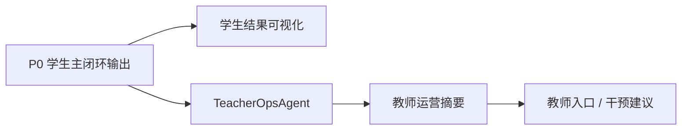

# P1 可视化与教师运营架构设计

> 文档层级：子引擎层实施附录  
> 文档目的：说明 `P1` 如何在不破坏 `P0` 的前提下叠加学生可视化与教师运营增强  
> 核心结论：`P1` 的重点不是推翻 `P0`，而是把教师主线正式接进现行主文档，并把学生结果展示做成平台竞争力的一部分  
> 目标读者：技术负责人、配置实施者  
> 上游真源：[AI教师子引擎-PRD.md](../AI教师子引擎-PRD.md)、[AI教师子引擎-技术方案.md](../AI教师子引擎-技术方案.md)  
> 下游引用：无  
> 适用范围：`P1` 实施附录

## 1. 本阶段解决什么

`P1` 解决 2 件事：

1. 让学生看到更清晰的学习结果，而不是只有一段长文本
2. 让教师/运营者看到风险、趋势和干预入口

当前主线能力：

- 学生可视化结果
- 教师运营支持线
- `TeacherOpsAgent` 旁路

## 2. 本阶段不解决什么

- 不把产品后端 / `BFF` 写成前置依赖
- 不把 `TeacherOpsAgent` 变成学生主答复入口
- 不重写 `P0` 学生主闭环

## 3. 进入条件

- `P0` 学生主闭环底座已稳定
- 子引擎回流结果已能稳定输出
- 至少已有一批可复用的学习结果数据

## 4. 退出条件

- 学生侧能看到结构化学习结果
- 教师侧能看到风险学生、趋势与干预建议
- `TeacherOpsAgent` 能以旁路形式稳定输出摘要

## 5. 继承关系

### 5.1 继承了什么

- 继承 `P0` 的对象主链和学生主闭环
- 继承平台主导、子引擎执行的边界

### 5.2 为下阶段留下什么接口

- 为 `P2` 留下教师聚合输出结构
- 为 `P2` 留下学生可视化结果结构
- 为 `P2` 留下可沉淀的教师运营摘要

## 6. 主链路

## 7. 关键增强点

- 学生侧：讲解卡、练习卡、评分卡、复盘卡
- 教师侧：风险学生、班级趋势、干预建议
- 策略侧：`TeacherOpsAgent` 从多轮结果里提炼可执行信号

## 8. 不会替代什么

- 不替代 `P0` 的学习会话和任务卡底座
- 不替代 `P2` 的产品接入与学习记录沉淀
- 不把教师主线反向改成学生主线

## 读完后你应该带走什么

- `P1` 是在 `P0` 上叠加教师与展示增强。
- `TeacherOpsAgent` 正式进入竞争力，但依然是旁路。
- `P1` 为 `P2` 的产品化聚合输出打基础。
