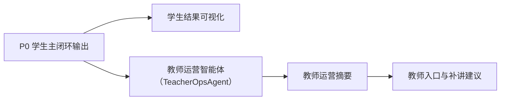

# P1 可视化与教师运营架构设计

> 文档层级：子引擎层实施附录
> 文档目的：说明 `P1` 这条实施线怎样在不破坏 `P0` 底座的前提下，把学生结果展示和教师运营支持正式叠加进当前版本
> 核心结论：`P1` 的重点不是推翻 `P0`，而是在同一期内把学生结果可视化和教师侧观察入口做成可讲、可演示、可联调的增强线
> 目标读者：技术负责人、配置实施者、项目负责人
> 推荐下一步：继续读 [答辩口径与演示脚本.md](../../交付层/答辩口径与演示脚本.md)

## 与其他文档的边界

一句人话：这篇只讲 `P1` 的增强目标，不重新定义 `P0` 主链和 `P2` 接入路线。

## 一句话先记住

一句人话：`P1` 的任务是让别人看见结果，而不是让主链重做一遍。

> `P1` 负责把学生结果展示和教师运营支持正式拉进公开能力，但它仍然建立在 `P0` 学生主闭环之上。

## 1. 本工作线解决什么

一句人话：`P1` 把“学生学完以后看见什么、教师能看见什么”这两件事补齐。

| `P1` 负责什么 | 说明 |
| --- | --- |
| 学生结果展示 | 让学生不只看到长文本，还能看到结构化学习结果 |
| 教师运营支持 | 让教师看到风险、趋势和补讲建议 |
| 教师旁路智能体 | 让教师运营智能体（TeacherOpsAgent）以旁路形式工作 |

## 2. 在当前版本里，`P1` 的定位是什么

一句人话：`P1` 是同步交付的增强线，不是以后再说的彩蛋。

- 它证明平台不只会单轮讲题，也能支持教师观察。
- 它让学生结果更适合展示和解释。
- 它为 `P2` 产品化展示对象打基础。

## 3. 本工作线不解决什么

一句人话：边界守住了，增强线才不会膨胀成另一套系统。

- 不把产品后端或 `BFF` 写成前置依赖
- 不让教师运营智能体反向接管学生主答复
- 不伪造真实班级统计或看板数据
- 不重写 `P0` 学生主闭环

## 4. 进入条件与退出条件

一句人话：`P1` 应该以 `P0` 已稳为前提，以“老师能看、学生能看”为退出标准。

| 条件类型 | 最低要求 |
| --- | --- |
| 进入条件 | `P0` 学生主闭环已稳定，且已有一批可复用的回流结果或知识资产 |
| 退出条件 | 学生侧可看到结构化结果，教师侧可看到风险摘要和补讲建议 |

## 5. 与其他工作线怎么交接

一句人话：`P1` 一头接 `P0`，一头把展示对象交给 `P2` 和交付层。

- 依赖 `P0`：诊断、讲解、练习和复盘后的结构化结果。
- 输出给 `P2`：学生结果展示对象和教师运营摘要结构。
- 输出给交付层：现场可演示的教师价值和学生结果页面。

## 6. 主链路

一句人话：这条线的重点是“展示”和“教师旁路”，不是重跑学生主链。

## 7. 关键增强点

一句人话：别把增强点写得很散，现场真正要展示的就这几类对象。

| 增强点 | 作用 |
| --- | --- |
| 讲解卡、练习卡、评分卡、复盘卡 | 帮学生看懂自己这轮学到了什么 |
| 风险观察与补讲建议 | 帮教师快速知道该盯哪里 |
| 教师侧数据边界说明 | 避免把当前样例误说成真实班级画像 |

## 读完后你应该带走什么

- `P1` 是一期同步交付的增强线，不是以后再说。
- 教师运营智能体（TeacherOpsAgent）是旁路增强，不替代学生主答复。
- `P1` 的价值既服务答辩展示，也为后续产品前端承接结果打基础。

## 本文不负责什么

- 不定义 `P0` 主闭环本体
- 不代替产品接入和后端设计
- 不代替对象字段真源
- 不代替比赛答辩稿
