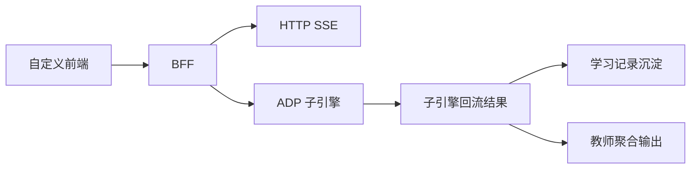

# P2 外部接入与产品后端架构设计

> 文档层级：子引擎层实施附录  
> 文档目的：说明 `P2` 如何把平台与子引擎安全接进真实前端/后端，并形成学习记录沉淀  
> 核心结论：`P2` 的目标不是重造平台，而是沿 `HTTP SSE + 产品后端/BFF + 自定义前端 + 学习记录沉淀` 这条正式主线完成产品接入  
> 目标读者：技术负责人、接入实施者  
> 上游真源：[AI教师子引擎-技术方案.md](../AI教师子引擎-技术方案.md)、[AI主导学习平台-统一对象与接口契约.md](../../平台层/AI主导学习平台-统一对象与接口契约.md)  
> 下游引用：无  
> 适用范围：`P2` 实施附录

## 1. 本阶段解决什么

`P2` 解决 3 件事：

1. 把平台和子引擎接进自己的前端或系统
2. 用产品后端 / `BFF` 承接密钥托管、上下文字段透传与请求代理
3. 把学习结果沉淀为后续可追踪、可聚合的数据

当前主线能力：

- `HTTP SSE`
- 产品后端 / `BFF`
- 自定义前端
- 学习记录沉淀

## 2. 本阶段不解决什么

- 不替代 ADP 内部 Agent 编排
- 不把后端做成一套独立 AI 平台
- 不把 `Redis / MQ / 微服务拆分` 强行写成 v1 依赖

## 3. 进入条件

- `P0` 学生主闭环稳定
- `P1` 的学生结果展示和教师运营摘要已有明确结构
- 已明确需要自定义前端或产品化接入，而不只是官方分享链接演示

## 4. 退出条件

- 可通过 `HTTP SSE` 接入子引擎流式结果
- `AppKey` 由后端托管
- `visitor_biz_id` 与 `custom_variables` 能稳定透传
- 学习结果能沉淀为记录并为教师聚合留接口

## 5. 继承关系

### 5.1 继承了什么

- 继承 `P0` 的学生主闭环底座
- 继承 `P1` 的学生可视化结果与教师运营摘要结构

### 5.2 为后续留下什么接口

- 为更多业务系统留下 `BFF` 接入层
- 为教师后台和产品看板留下沉淀与聚合接口
- 为未来更复杂协议保留扩展空间

## 6. 主链路

## 7. 关键字段与接口

`P2` 至少要稳定承接：

- `AppKey`
- `visitor_biz_id`
- `custom_variables`
- `chapter_id`
- `role`

一句人话：

> `P2` 最重要的不是“接上了没有”，而是“接上以后还是不是同一个学生、同一条学习链、同一份可沉淀结果”。

## 8. 不会替代什么

- 不替代 `P0` 学生主闭环底座
- 不替代 `P1` 教师与展示增强
- 不替代 ADP 的知识库与工作流编排

## 读完后你应该带走什么

- `P2` 是正式产品接入主线，不是附属增强。
- `BFF`、`HTTP SSE`、自定义前端和学习记录沉淀必须一起看。
- `P2` 追求的是安全接入和连续沉淀，不是架构炫技。
